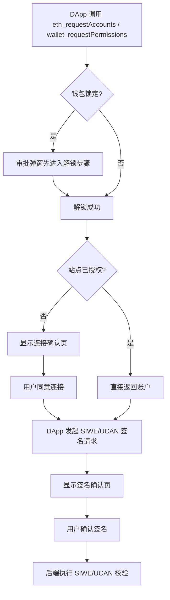

# DApp 接入手册

本文面向 DApp 开发者，说明 YeYing Wallet 的推荐接入顺序、用户可见审批行为，以及常见问题排查方式。

## 0. 阅读导航
- 当前文档：接入步骤与联调清单。
- 认证规范：`./SIWE协议说明.md`
- 授权规范：`./UCAN协议说明.md`
- 推荐顺序：先本手册，再 SIWE，再 UCAN。

## SDK 推荐（web3-bs）
- 推荐前端 SDK：`@yeying-community/web3-bs`
- 本地联调仓库（当前开发环境）：`/Users/liuxin2/Workspace/opensource/web3-bs`
- 适合 DApp 的核心能力：
  - Provider 发现与连接：`getProvider`、`requestAccounts`
  - SIWE 登录：`loginWithChallenge`、`authFetch`
  - UCAN 授权：`getUcanSession`、`createRootUcan`、`createInvocationUcan`
  - 多后端编排：`initDappSession`、`initWebDavStorage`
- 接入建议：优先使用 SDK 封装；仅在特殊场景下再直接调用底层 `provider.request`。

## 1. 适用范围
- 钱包：YeYing Wallet 浏览器扩展。
- 登录签名：`personal_sign`、`eth_sign`、`eth_signTypedData(_v4)`。
- 授权能力：`yeying_ucan_session`、`yeying_ucan_sign`。
- 典型场景：DApp 登录、SIWE + UCAN 组合授权、Router/WebDAV 访问。

## 2. 前置条件
- DApp 已接入 EIP-1193 Provider（支持 `provider.request`）。
- 后端已具备 SIWE 验签与 nonce 防重放机制。
- 后端已具备 UCAN 能力校验（`with/can/aud/exp/iss`）。

## 3. 快速开始（最小路径）
1. 连接账户：`getProvider` + `requestAccounts`。
2. 登录认证：`loginWithChallenge`（或手动构造 SIWE + `signMessage`）。
3. 申请 UCAN 会话：`getUcanSession`（钱包支持时会优先走钱包 UCAN RPC）。
4. 签发请求令牌：`createInvocationUcan`。
5. 访问后端资源：`authFetch`（JWT）或 `authUcanFetch`（UCAN）。
6. 后端完成 SIWE + UCAN 联合校验后建立会话与权限上下文。

## 4. 标准接入步骤
### 4.1 连接账户
- 调用 `eth_requestAccounts` 或 `wallet_requestPermissions`。
- 未授权站点会弹连接确认页。
- 已授权站点通常会直接返回账户地址。

### 4.2 发起 SIWE 登录签名
- 建议补齐 SIWE 关键字段：`domain`、`uri`、`chainId`、`nonce`、`issuedAt`。
- 推荐使用 `personal_sign`，参数顺序 `[message, address]`。
- 钱包审批页会提示域名一致性、时间窗口和能力声明风险。

### 4.3 申请 UCAN 能力
- 调用 `yeying_ucan_session` 获取或复用会话 DID。
- 调用 `yeying_ucan_sign` 对 signing input 签名。
- 站点未完成连接授权时，UCAN 接口会拒绝请求。

### 4.4 服务端校验与放行
- SIWE：验签、nonce 一次性、时间有效性、domain 绑定。
- UCAN：`with/can` 能力匹配、`aud` 目标匹配、`exp` 与 `iss` 校验。

## 5. 最小调用示例（SDK 方式，推荐）
```ts
import {
  getProvider,
  requestAccounts,
  loginWithChallenge,
  getUcanSession,
  createInvocationUcan,
  authUcanFetch,
} from "@yeying-community/web3-bs";

const provider = await getProvider({ preferYeYing: true, timeoutMs: 5000 });
if (!provider) throw new Error("No injected wallet provider");

const accounts = await requestAccounts({ provider });
const account = accounts[0];
if (!account) throw new Error("No account returned");

await loginWithChallenge({
  provider,
  address: account,
  baseUrl: "https://your-api.example.com/api/v1/public/auth",
  storeToken: true,
});

const session = await getUcanSession("default", provider);
const appId = "your-app-id";
const ucan = await createInvocationUcan({
  audience: "did:web:api.example.com",
  capabilities: [{ with: `app:all:${appId}`, can: "invoke" }],
  sessionId: "default",
  issuer: session,
});

const response = await authUcanFetch("https://api.example.com/v1/chat", {
  method: "POST",
  headers: { "Content-Type": "application/json" },
  body: JSON.stringify({ message: "hello" }),
}, {
  ucan,
});
```

说明：
- SDK 会优先尝试钱包提供的 `yeying_ucan_session` / `yeying_ucan_sign`。
- 若钱包不支持上述 UCAN RPC，SDK 会回退到本地 UCAN session 模式。

## 6. 用户可见审批流程
- 首次连接：显示连接确认页。
- 钱包锁定：先进入解锁步骤，再进入连接/签名。
- 连接后紧接签名：会尽量复用同一审批弹窗，减少多窗口打断。
- 已授权站点再次访问：通常不再显示连接确认，仅在需要时显示签名页。



## 7. 验收清单（联调完成标准）
- 连接授权成功，首次与复访行为符合预期。
- SIWE 签名可通过后端验签，nonce 不可重放。
- UCAN session 与 sign 接口返回正常，issuer 校验通过。
- Router/WebDAV 请求的 UCAN 能力与 audience 能被正确校验。
- 钱包锁定、超时、拒签场景下 DApp 能正确提示用户重试。

## 8. 常见问题排查
- 用户总是先看到解锁页
  - 钱包已锁定；所有签名能力请求都要求先解锁。
- 有时不弹连接页
  - 站点已授权，连接请求可直接返回账户。
- `yeying_ucan_session` 报未授权
  - 先执行连接授权，再调 UCAN 接口。
- 后端提示 `issuer mismatch` 或 `capability denied`
  - 对照 `iss`、`with/can`、`aud`、`exp` 做逐项核对。

## 9. 附录：钱包内部实现参考
- 解锁流程：`js/background/unlock-flow.js`
- 连接授权：`js/background/account-handler.js`（`handleEthRequestAccounts`）
- 请求路由：`js/background/request-router.js`
- 审批 UI：`html/approval.html` + `js/app/approval.js`
- UCAN 会话：`js/background/ucan.js`
- 相关 SDK 仓库：`/Users/liuxin2/Workspace/opensource/web3-bs`
