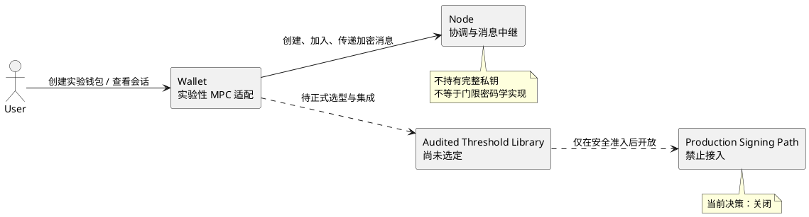

# MPC 生产化决策

> 决策状态：已接受
>
> 决策日期：2026-08-08
>
> 适用范围：Wallet、Node MPC Coordinator 及其业务接入方

## 1. 决策

当前 MPC 能力保持实验性，不用于承载或承诺生产资产安全。

Wallet 和 Node 可以继续提供设备身份、协调会话、参与者展示、端到端消息加密、审计和协议联调，但不得把这些能力描述为已经完成门限密钥生成或门限签名。MPC Wallet 在真实门限 Keygen 完成前不得生成可用账户，不得接收生产资产，也不得进入生产交易签名路径。

只有第 4 节全部准入条件满足并通过独立安全评审后，才能提出新的生产化决策。本决策不允许通过功能开关、免责声明或人工操作绕过。

## 2. 当前边界

当前允许：

- 创建实验性 MPC 钱包记录和协调会话。
- 生成独立设备签名密钥与端到端加密密钥。
- 加入会话、交换加密消息和记录审计事件。
- 展示门限、参与者、会话状态和失败原因。
- 在隔离测试环境开展协议互操作和故障实验。

当前禁止：

- 将 `keygen_pending` 钱包显示为可用账户。
- 在没有真实门限公钥的情况下推导或伪造钱包地址。
- 使用单方私钥模拟 MPC 签名。
- 直接修改参与者列表而不执行 Key Refresh 或 Resharing。
- 引导用户向实验性 MPC Wallet 转入生产资产。
- 对外宣称当前实现达到生产级门限钱包安全。

## 3. 选择该决策的原因

现有实现完成的是协调、安全消息和产品交互骨架，不包含经过独立审计的门限密码学协议。继续扩展界面或协调接口不能替代以下核心能力：

- 分布式密钥生成及其正确性证明。
- 针对目标曲线的门限签名。
- 恶意参与者和恶意协调器模型。
- 掉线、重试、重复消息和会话恢复。
- 成员变化后的安全 Key Refresh 或 Resharing。
- 密钥分片备份、迁移、销毁和版本升级。

在这些问题解决前允许生产资产进入，会把未验证的实验风险转移给用户。

## 4. 重新进入生产评审的准入条件

以下条件必须全部满足：

1. 选择维护活跃、支持目标曲线且有公开安全模型的成熟门限签名实现。
2. 获得与目标版本、编译产物和集成方式对应的独立安全审计报告。
3. 完成 Keygen、Sign、Refresh/Resharing 的多实现或多设备互操作测试。
4. 覆盖参与者掉线、消息乱序、重放、重复提交、恶意输入和协调器故障。
5. 定义密钥分片的加密存储、备份、恢复、迁移、轮换和销毁流程。
6. 完成参与者身份绑定、设备替换、成员增加和移除的安全协议。
7. 建立交易内容确认、门限责任展示和高风险操作再认证。
8. 在真实浏览器和目标设备上完成持续 E2E、故障注入及恢复演练。
9. 关闭安全评审中的所有高风险问题，并为剩余风险形成书面接受记录。

## 5. 发布约束

- MPC 入口必须明确标记为实验性。
- 默认发布配置不得把实验性 MPC 作为推荐钱包类型。
- 任何生产化 PR 必须引用新的架构决策和安全评审结论。
- Wallet、Node 和业务应用必须使用同一协议版本，禁止静默降级。
- 发现协议状态不一致时应停止签名，不得自动回退为单方签名。

## 6. 后续工作

本决策关闭的是“当前是否进入生产”的问题，不取消技术验证。后续工作按以下顺序推进：

1. 门限签名库调研和威胁模型评审。
2. 隔离环境完成 Keygen 与 Sign 原型。
3. 实现 Refresh/Resharing 和恢复流程。
4. 故障注入、互操作测试和独立审计。
5. 依据证据重新提交生产化决策。
