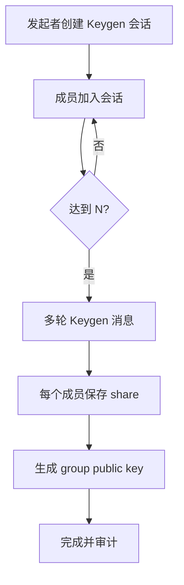
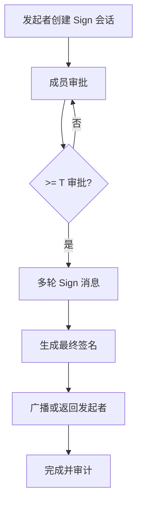
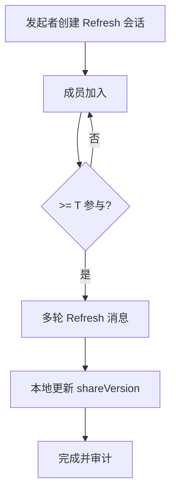
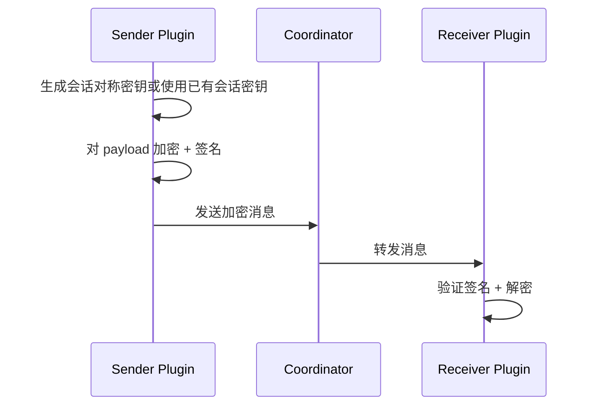
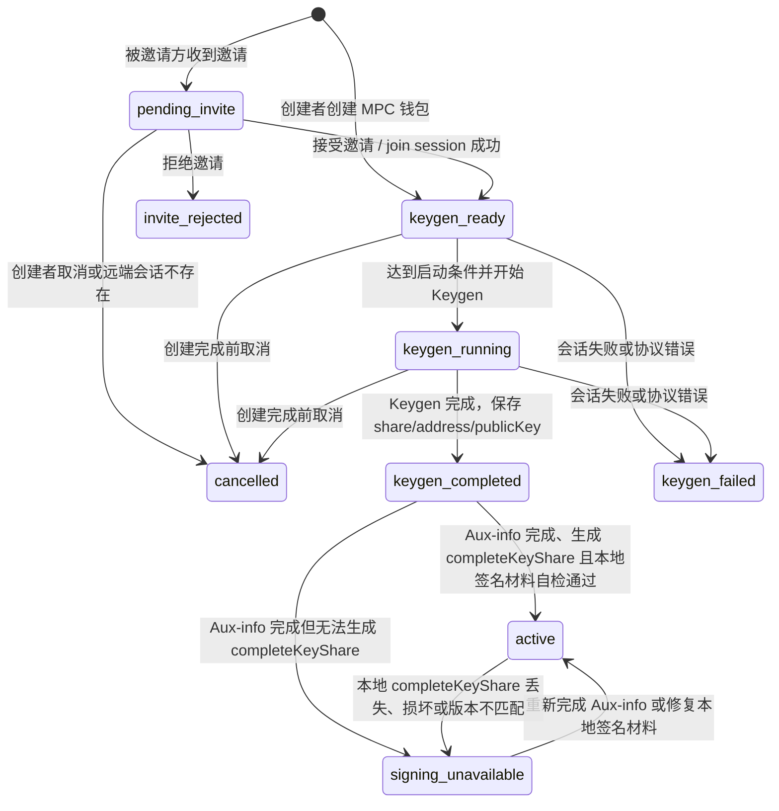
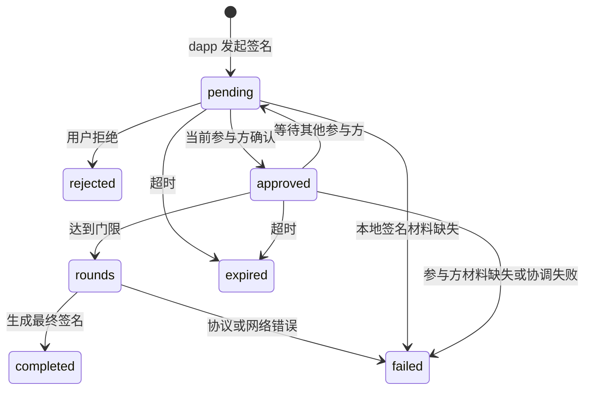

# MPC 门限钱包实验性方案

> 状态：实验性设计，不能作为生产资产安全承诺
>
> 适用版本：Wallet `1.4.23` 的协调模型、状态机与流程骨架；门限密码学能力仍处于实验性阶段
>
> 目标读者：钱包、协调器和安全架构维护者。生产化门槛见 [钱包架构 V2](./钱包架构V2.md)。
>
> 目标：实现 T-of-N 的 MPC 门限钱包，N 个成员分别通过浏览器插件参与签名，达到门限即可生成最终签名并完成交易/消息签名。
> 本文聚焦 **数据结构与流程**，算法可替换（GG18/CGGMP/DKLS 等）。

> 安全提示：当前代码和本文主要定义会话、消息、存储与协调边界，不代表 GG18/CGGMP/DKLS 等门限算法已经完整实现、审计或可用于生产资产。

## 1. 范围与非目标

### 范围
- 门限密钥生成（Keygen）
- 门限签名（Sign）
- 成员管理、阈值策略
- 会话协作与消息编排
- 审计与可追溯记录（不含私密材料）

### 非目标
- 具体 MPC 算法实现细节
- 区块链广播与 Gas 估算优化
- 复杂身份体系/企业 IAM 深度集成

## 2. 生产化决策与安全边界

> 决策状态：已接受
>
> 决策日期：2026-08-08
>
> 适用范围：Wallet、Node MPC Coordinator 及其业务接入方

当前 MPC 能力保持实验性，不用于承载或承诺生产资产安全。

Wallet 和 Node 可以继续提供设备身份、协调会话、参与者展示、端到端消息加密、审计和协议联调，但不得把这些能力描述为已经完成生产级门限密钥生成或门限签名。MPC Wallet 在真实门限 Keygen 完成前不得生成可用账户，不得接收生产资产，也不得进入生产交易签名路径。

只有本节准入条件全部满足并通过独立安全评审后，才能提出新的生产化决策。本决策不允许通过功能开关、免责声明或人工操作绕过。

当前允许：

- 创建实验性 MPC 钱包记录和协调会话。
- 生成独立设备签名密钥与端到端加密密钥。
- 加入会话、交换加密消息和记录审计事件。
- 展示门限、参与者、会话状态和失败原因。
- 在隔离测试环境开展协议互操作和故障实验。

当前禁止：

- 将未生成地址的钱包显示为可用账户。
- 在没有真实门限公钥的情况下推导或伪造钱包地址。
- 使用单方私钥模拟 MPC 签名。
- 直接修改参与者列表而不执行 Key Refresh 或 Resharing。
- 引导用户向实验性 MPC Wallet 转入生产资产。
- 对外宣称当前实现达到生产级门限钱包安全。

重新进入生产评审必须全部满足：

1. 选择维护活跃、支持目标曲线且有公开安全模型的成熟门限签名实现。
2. 获得与目标版本、编译产物和集成方式对应的独立安全审计报告。
3. 完成 Keygen、Sign、Refresh/Resharing 的多实现或多设备互操作测试。
4. 覆盖参与者掉线、消息乱序、重放、重复提交、恶意输入和协调器故障。
5. 定义密钥分片的加密存储、备份、恢复、迁移、轮换和销毁流程。
6. 完成参与者身份绑定、设备替换、成员增加和移除的安全协议。
7. 建立交易内容确认、门限责任展示和高风险操作再认证。
8. 在真实浏览器和目标设备上完成持续 E2E、故障注入及恢复演练。
9. 关闭安全评审中的所有高风险问题，并为剩余风险形成书面接受记录。

发布约束：

- MPC 入口必须明确标记为实验性。
- 默认发布配置不得把实验性 MPC 作为推荐钱包类型。
- 任何生产化 PR 必须引用新的架构决策和安全评审结论。
- Wallet、Node 和业务应用必须使用同一协议版本，禁止静默降级。
- 发现协议状态不一致时应停止签名，不得自动回退为单方签名。

## 3. 角色与组件

**角色**
- **发起者**：创建签名任务/交易的成员。
- **参与者**：持有密钥分片、参与签名的成员。
- **协调器**：中心化服务，负责会话编排、消息转发（优先中心化）。

**客户端组件（插件）**
- UI：会话管理、成员邀请、审批、签名进度。
- Background：密钥分片存储与加解密、消息编排、与协调器通讯。
- Storage：本地持久化（chrome.storage.local + 加密层）。

**服务端组件（可选）**
- **Relay/Coordinator**：WebSocket/HTTP 转发消息与会话状态缓存（中心化优先）。
- 不持有私密材料，仅做路由与队列。

## 4. 已确认设计约束

1) 协调器允许中心化服务（消息转发），优先中心化。  
2) 参与者间消息必须端到端加密。  
3) 支持 Key Refresh（分片刷新，不改变公钥）。  
4) 支持多曲线/多链（secp256k1/ed25519）。  
5) 审计日志支持导出或外部对接。  
6) 协调器鉴权方案：UCAN。  
7) E2E 套件：x25519-aes-gcm。  
8) Refresh 触发策略：手动。  

## 5. 威胁模型与信任边界（摘要）
- 每个成员设备单独保管其密钥分片（share）。
- 协调器不可信，所有会话消息必须端到端加密且具备完整性校验。
- 所有参与者身份与消息签名可验证，防止伪造/重放。
- 可选：成员间 P2P 通道（WebRTC）作为中心化转发的备份方案。

## 6. 核心流程（高层）

### 6.1 Keygen（门限密钥生成）
1) 发起者创建 Keygen 会话，指定阈值 T 与成员 N。  
2) 成员通过邀请加入会话（二维码/链接/会话码）。  
3) 多轮交互完成后：
   - 每个成员保存 **share**（本地加密存储）
   - 生成 **group public key**（共享展示）
4) 会话结束，记录审计条目。

### 6.2 Sign（门限签名）
1) 发起者创建 Sign 会话（交易/消息摘要）。  
2) 达到 T 个成员批准后进入签名多轮。  
3) 生成最终签名，返回给发起者/广播。  
4) 记录审计条目。

### 6.3 Key Refresh（分片刷新）
1) 发起者创建 Refresh 会话（不改变公钥）。  
2) 达到 T 个成员参与后完成刷新多轮。  
3) 每个成员更新本地 share（递增 shareVersion）。  
4) 会话结束，记录审计条目。

## 7. 交互流程图（Mermaid）

### 7.1 Keygen 流程


### 7.2 Sign 流程


### 7.3 Refresh 流程


### 7.4 E2E 消息封装


## 8. 数据模型（核心对象）

> 所有对象均以 JSON 存储；敏感字段用本地加密（AES-GCM + PBKDF2）。

### 8.1 MPCWallet
```json
{
  "id": "mpc_wallet_01",
  "name": "Team Treasury",
  "curve": "secp256k1",
  "chainIds": [1, 137],
  "threshold": 2,
  "participants": ["p1", "p2", "p3"],
  "publicKey": "0x...",
  "address": "0x...",
  "keyVersion": 1,
  "shareVersion": 1,
  "createdAt": 1730000000000,
  "updatedAt": 1730000000000
}
```

### 8.2 Participant
```json
{
  "id": "p1",
  "label": "Alice",
  "deviceId": "dev_a",
  "identity": {
    "type": "did",
    "value": "did:pkh:eth:0xabc..."
  },
  "signingPublicKey": "ed25519:base64(...)",
  "e2ePublicKey": "x25519:base64(...)",
  "contact": {
    "type": "email",
    "value": "alice@example.com"
  },
  "status": "active",
  "joinedAt": 1730000000000
}
```

### 8.3 KeyShare（本地加密）
```json
{
  "id": "share_p1_mpc_wallet_01",
  "walletId": "mpc_wallet_01",
  "participantId": "p1",
  "curve": "secp256k1",
  "keyVersion": 1,
  "shareVersion": 1,
  "encryptedShare": "base64(...)",
  "kdf": "PBKDF2",
  "cipher": "AES-GCM",
  "createdAt": 1730000000000
}
```

### 8.4 Session（Keygen/Sign/Refresh）
```json
{
  "id": "sess_20250101_abc",
  "type": "sign",
  "walletId": "mpc_wallet_01",
  "threshold": 2,
  "participants": ["p1", "p2", "p3"],
  "status": "active",
  "round": 1,
  "curve": "secp256k1",
  "keyVersion": 1,
  "shareVersion": 1,
  "createdAt": 1730000000000,
  "expiresAt": 1730000600000
}
```

### 8.5 SignRequest
```json
{
  "id": "sign_req_01",
  "walletId": "mpc_wallet_01",
  "sessionId": "sess_20250101_abc",
  "initiator": "p1",
  "payloadType": "transaction",
  "payloadHash": "0x...",
  "chainId": 1,
  "status": "pending",
  "approvals": ["p1"],
  "createdAt": 1730000000000
}
```

### 8.6 MPCMessage（会话消息，端到端加密）
```json
{
  "id": "msg_01",
  "sessionId": "sess_20250101_abc",
  "from": "p2",
  "to": "coordinator",
  "round": 1,
  "type": "sign_round_1",
  "envelope": {
    "enc": "x25519-aes-gcm",
    "senderPubKey": "x25519:base64(...)",
    "nonce": "base64(...)",
    "ciphertext": "base64(...)",
    "signature": "base64(...)"
  },
  "createdAt": 1730000000000
}
```

### 8.7 AuditLog
```json
{
  "id": "log_01",
  "walletId": "mpc_wallet_01",
  "sessionId": "sess_20250101_abc",
  "level": "info",
  "action": "sign-approved",
  "actor": "p2",
  "message": "成员已批准签名",
  "time": 1730000000000
}
```

### 8.8 AuditExportConfig
```json
{
  "id": "audit_export_default",
  "enabled": true,
  "mode": "webhook",
  "endpoint": "https://audit.example.com/hooks/mpc",
  "headers": {
    "Authorization": "Bearer <token>"
  },
  "createdAt": 1730000000000,
  "updatedAt": 1730000000000
}
```

## 9. 本地存储建议（chrome.storage.local）

- `mpcWallets`: `{ [walletId]: MPCWallet }`
- `mpcParticipants`: `{ [participantId]: Participant }`
- `mpcKeyShares`: `{ [shareId]: KeyShare }` (加密内容)
- `mpcDeviceKeys`: `{ [deviceId]: { signingPublicKey, encryptedSigningPrivateKey, e2ePublicKey, encryptedE2EPrivateKey } }`
- `mpcSessions`: `{ [sessionId]: Session }`
- `mpcSignRequests`: `{ [requestId]: SignRequest }`
- `mpcMessages`: `{ [messageId]: MPCMessage }` (可设置短期保留)
- `mpcAuditLogs`: `AuditLog[]`
- `mpcAuditExportConfig`: `AuditExportConfig`
- `mpcAuditExportQueue`: `AuditLog[]` (待导出队列)

## 10. 状态机

代码、接口、UI 和测试必须以本节状态语义为准；如实现临时偏离，应在同一变更中记录原因和回收条件。

### 10.1 设计原则

1. MPC 钱包状态必须区分“地址已生成”和“可签名”。地址来自 Keygen，签名能力还依赖 Aux-info 与完整本地签名材料。
2. Web3 登录、交易签名和 typed data 签名都属于签名请求。只要门限大于 1，就必须等待足够参与方共同完成签名。
3. 协调器只编排会话和转发消息，不持有私密材料。钱包本地是否可签名以本地 `completeKeyShare` 为准。
4. UI 可以用简洁文案展示状态，但不得把不可签名的钱包展示成可以立即完成 Web3 登录或交易。
5. 状态流转必须单调收敛。失败、取消、拒绝等终止态不能自动恢复为可用态，除非用户重新发起新会话或执行明确恢复动作。

### 10.2 状态分层

MPC 有三类状态，不能混用：

| 层级 | 对象 | 作用 | 典型字段 |
| --- | --- | --- | --- |
| 钱包状态 | `MPCWallet.status` | 描述本地钱包记录是否可展示、是否已有地址、是否可签名 | `pending_invite`、`keygen_ready`、`keygen_running`、`keygen_completed`、`active` |
| 会话状态 | `MPCSession.status` | 描述一次 Keygen / Aux-info / Sign 协议会话进度 | `ready`、`rounds`、`keygen_completed`、`active`、`failed` |
| 签名请求状态 | `MpcSignRequest.status` | 描述一次 dapp 登录、消息签名或交易签名的审批和多方签名进度 | `pending`、`approved`、`rounds`、`completed`、`failed` |

同一个 MPC 钱包会经历至少两个协议阶段：

```text
Keygen -> 生成 address / publicKey / share -> keygen_completed
Aux-info -> 生成 completeKeyShare -> 本地签名材料自检 -> active / available
Sign -> 多方共同签名 -> 返回 signature
```

### 10.3 MPCWallet 状态

| 状态 | 含义 | 是否有地址 | 是否可选为账户 | 是否可发起签名 | UI 建议文案 |
| --- | --- | --- | --- | --- | --- |
| `pending_invite` | 被邀请方收到 MPC 钱包创建邀请，但尚未接受 | 否 | 否 | 否 | 待接受 |
| `invite_rejected` | 被邀请方拒绝邀请，本地可隐藏或归档 | 否 | 否 | 否 | 已拒绝 |
| `keygen_ready` | Keygen 会话已创建，等待参与方加入或开始 | 否 | 否 | 否 | 等待参与者 |
| `keygen_running` | Keygen 多轮协议正在进行 | 否 | 否 | 否 | 密钥生成中 |
| `keygen_completed` | Keygen 已完成，钱包已有地址和基础 key share，但签名材料尚未通过本地自检 | 是 | 是 | 否 | 签名准备中 |
| `active` | 本地已有 `completeKeyShare`，且本地签名材料自检通过 | 是 | 是 | 是，但仍需满足门限参与方在线/确认 | 已完成 |
| `keygen_failed` | Keygen 失败 | 否 | 否 | 否 | 创建失败 |
| `cancelled` | 创建完成前被创建者取消，或本地未完成记录被移除 | 否 | 否 | 否 | 已取消 |
| `signing_unavailable` | 钱包有地址，但本地签名材料不可用或损坏 | 是 | 是 | 否 | 签名不可用 |

说明：

- `keygen_completed` 不是错误状态。它表示地址已经生成，但不能对用户表达为 `available`，也不能保证 dapp 登录签名可用。
- `active` / `signingStatus === 'available'` 必须表示当前设备本地签名材料自检通过，可以发起签名。它不表示一次 dapp 登录可以单方完成，2-of-2 仍然需要另一个参与方确认并在线推进签名。
- `signing_unavailable` 是诊断态。当前实现更多通过 `signingStatus: unavailable` 和 `signingUnavailableReason` 表达，后续可选择将其收敛为显式 `status`。



进入 `active` 必须同时满足：

| 条件 | 判定依据 |
| --- | --- |
| 已生成地址 | `wallet.address` 是合法链地址 |
| 已保存基础 share | 当前设备存在匹配 `walletId`、`participantId`、`shareVersion` 的 `MpcKeyShare.share` |
| Aux-info 已完成 | `auxInfoStatus === 'completed'` 或本地 key share 已保存 `auxInfo` |
| 已生成完整签名材料 | `MpcKeyShare.completeKeyShare` 存在，且 `completeKeyShareStatus === 'completed'` |
| 签名状态可用 | 本地签名材料自检通过后写入 `signingStatus === 'available'` |

实现收敛规则：

```text
if wallet.address && latestLocalKeyShare.completeKeyShare:
  wallet.status = 'active'
  wallet.signingStatus = 'available'
  wallet.completeKeyShareStatus = 'completed'
else if wallet.address:
  wallet.status = 'keygen_completed'
  wallet.signingStatus = 'unavailable'
  wallet.signingUnavailableReason = precise machine-readable reason
```

这里的“本地签名材料自检”不是链上交易，也不广播签名。当前阶段至少检查当前设备是否存在匹配 `walletId`、`participantId`、`shareVersion` 的基础 share 和 `completeKeyShare`；后续如果 TSS engine 提供安全的本地 dry-run 能力，可升级为一次不出站的签名能力探测。产品上只有自检通过才能显示 `available` / “可签名”。

这条规则只能根据本地材料提升当前设备的本地钱包状态，不能代表其他参与方也已经可签名。

### 10.4 Keygen / Aux-info 会话状态

Keygen 会话：

| 状态 | 含义 | 允许操作 | 下一状态 |
| --- | --- | --- | --- |
| `ready` | 会话已创建，等待参与者加入或启动 | 加入、取消、刷新 | `rounds`、`cancelled` |
| `rounds` | Keygen 多轮消息进行中 | 自动推进、刷新、查看详情 | `keygen_completed`、`failed` |
| `keygen_completed` | Keygen 已完成，结果包含地址、公钥、share 版本 | 启动 Aux-info、查看详情 | `active`、`failed` |
| `failed` | Keygen 失败 | 查看错误、重新创建 | 终止 |
| `cancelled` | 创建完成前取消 | 本地移除、归档 | 终止 |

Aux-info 是 Keygen 后的签名准备阶段，用于把基础 key share 转换为后续签名需要的完整本地材料。

| 状态 | 含义 | 允许操作 | 下一状态 |
| --- | --- | --- | --- |
| `not_started` | Keygen 已完成但尚未启动 Aux-info | 自动启动、手动重试 | `running` |
| `running` | Aux-info 多轮消息进行中 | 自动推进、刷新、查看详情 | `completed`、`failed` |
| `completed` | Aux-info 结果已保存，尝试合成 `completeKeyShare` | 状态收敛 | `active` 或 `signing_unavailable` |
| `failed` | Aux-info 失败 | 重试、查看错误 | `running` 或终止 |

Keygen 完成后，钱包应尽量自动启动或继续 Aux-info，避免用户必须进入详情页手动刷新。

### 10.5 SignRequest 状态

Web3 登录、`personal_sign`、`eth_signTypedData_v4` 和 `eth_sendTransaction` 对 MPC 钱包来说都是签名请求。

| 状态 | 含义 | dapp 侧表现 |
| --- | --- | --- |
| `pending` | 签名请求已创建，等待本地用户确认或等待其他参与方确认 | 请求挂起或显示等待 |
| `approved` | 当前参与方已确认，尚未满足门限或尚未开始签名轮次 | 请求挂起 |
| `rounds` | 门限已满足，MPC sign 多轮消息进行中 | 请求挂起 |
| `completed` | 最终签名已生成 | 返回 signature 或 signed transaction |
| `rejected` | 用户拒绝签名 | 返回用户拒绝错误 |
| `failed` | 协议、网络、材料或协调器错误 | 返回明确错误 |
| `expired` | 签名请求超时 | 返回超时错误 |



Web3 登录通常不是只读取地址，而是要求钱包签名 nonce、SIWE message 或 typed data。

| 钱包状态 | dapp 能否拿到账户地址 | dapp 登录签名能否立即完成 |
| --- | --- | --- |
| `pending_invite` | 否 | 否 |
| `keygen_ready` | 否 | 否 |
| `keygen_running` | 否 | 否 |
| `keygen_completed` | 是 | 否。必须先完成 Aux-info 和本地签名材料自检 |
| `active` | 是 | 可以发起签名，但门限大于 1 时仍需等待足够参与方 |
| `signing_unavailable` | 是 | 否 |

错误语义：

| 错误 | 触发条件 | 用户/产品含义 |
| --- | --- | --- |
| `MPC_KEYGEN_NOT_COMPLETED` | 钱包无地址，或 Keygen 还未完成 | 钱包还不能作为链账户使用 |
| `MPC_COMPLETE_KEY_SHARE_NOT_FOUND` | 钱包有地址，但当前设备没有完整签名材料 | 产品应提供“继续完成创建”或“重试签名准备”，自动完成或修复 Aux-info；用户不需要理解或手动处理密钥材料 |
| `MPC_SIGNING_PENDING` | 签名请求已创建，但仍在等待多方确认或协议轮次 | 等待其他参与方在线确认 |
| `MPC_SIGNER_NOT_CONFIGURED` | 本地 TSS engine 未配置或不可用 | 当前客户端不能执行 MPC 签名 |

签名准备操作：

| 操作 | 输入 | 行为 | 输出 |
| --- | --- | --- | --- |
| `MPC_DIAGNOSE_WALLET` | `walletId` 或 `address` | 只检查本地签名材料状态，不修改本地密钥材料 | `canSign`、`reason`、`hasKeyShare`、`hasAuxInfo`、`hasCompleteKeyShare` |
| `MPC_PREPARE_WALLET_SIGNING` | `walletId` 或 `address`，必要时带 `password` | 缺 `completeKeyShare` 时，优先用本地已保存 `share + auxInfo` 重新合成；否则恢复或启动 Aux-info 会话 | `started`、`resumed`、`repaired`、`diagnosis` |

`MPC_PREPARE_WALLET_SIGNING` 不能把缺失材料兜底为可用。只有重新合成 `completeKeyShare` 成功，或 Aux-info 后续完成并通过本地自检，才允许进入 `active` / `available`。

### 10.6 UI 展示约定

账户管理页面应优先展示用户能理解的状态，不直接暴露所有内部状态。

| 内部状态 | 主状态文案 | 操作入口 |
| --- | --- | --- |
| `pending_invite` | 待接受 | 接受、拒绝、详情 |
| `keygen_ready` | 等待参与者 | 取消创建、详情 |
| `keygen_running` | 密钥生成中 | 详情、刷新 |
| `keygen_completed` 且 `signingStatus !== 'available'` | 签名准备中 | 详情、继续完成创建、重试签名准备 |
| `active` 或 `signingStatus === 'available'` | 已完成 | 详情、可选择登录/签名 |
| `keygen_failed` | 创建失败 | 详情、移除 |
| `cancelled` | 已取消 | 本地隐藏或归档 |
| `signing_unavailable` | 签名不可用 | 详情、重试准备签名能力 |

说明：

- UI 不能把 `keygen_completed` 显示成 `available`。有地址但签名材料未通过自检时，应显示“签名准备中”；只有 `active` 或 `signingStatus === 'available'` 才显示“已完成/可签名”。
- 创建完成前的未完成钱包可以取消或移除。已经生成地址的钱包不应通过“取消创建”入口移除，应走钱包移除/归档流程。
- 被邀请方在接受前必须能看到钱包名称、门限、参与者和详情入口，不能只看到通用邀请标题。

### 10.7 删除与本地移除语义

MPC 钱包删除必须区分三类操作，不能混用同一个产品语义：

| 操作 | 适用状态 | 影响范围 | 协议含义 |
| --- | --- | --- | --- |
| 取消创建 | Keygen 完成前：`keygen_ready`、`keygen_running`、`keygen_interrupted`，且尚未生成最终地址 | 当前设备本地记录；可尽力通知 coordinator 取消未完成 session | 终止尚未完成的钱包创建流程 |
| 删除本地 MPC 钱包 / 从本机移除 | 已生成地址：`keygen_completed`、`active`，以及签名准备失败或 `signingStatus !== 'available'` 的钱包 | 仅当前设备本地记录和当前参与方本地 share | 当前参与方放弃本机继续使用该钱包，不代表全体参与方删除 |
| 参与方变更 / 退出钱包 | 已完成钱包，需要改变参与方集合或阈值 | 需要相关参与方共同执行 refresh / resharing | 重新生成参与方集合和 share 版本，不是简单删除 |

已经生成地址的 MPC 钱包，其地址和 group public key 已经存在。任意一个参与方点击删除，只能删除自己插件里的本地记录和本地密钥分片，不能自动删除其他参与方的钱包，也不能销毁链上地址。其他参与方是否还能继续签名，取决于门限配置和剩余可用参与方数量。例如 2-of-2 中一方删除本地 share 后，另一方本地钱包记录仍可存在，但无法单独完成签名。

“删除本地 MPC 钱包”应清理当前设备内与该钱包相关的本地数据：

| 本地存储 | 清理条件 |
| --- | --- |
| `MPC_WALLETS` | `walletId` 匹配 |
| `MPC_SESSIONS` | `walletId` 匹配，或 `sessionId === wallet.keygenSessionId` |
| `MPC_KEY_SHARES` | `walletId` 或关联 `sessionId` 匹配 |
| `MPC_WIRE_STATES` | 关联 `sessionId` 匹配 |
| `MPC_SIGN_REQUESTS` | `walletId` 或关联 `sessionId` 匹配 |
| `MPC_MESSAGES` | 关联 `sessionId` 匹配 |
| `MPC_PARTICIPANTS` | 关联 `sessionId` 匹配 |

删除本地 MPC 钱包不应清理：

- HD wallet / HD account。
- 其他 MPC 钱包或其他 `sessionId` 的数据。
- MPC device key，除非用户明确重置整个 MPC 设备身份。
- 审计日志，除非用户单独执行清除审计。
- 其他参与方的任何本地数据。

UI 文案应避免让用户误解为“全体参与方删除”或“销毁链上地址”。建议确认弹窗使用：

```text
删除本地 MPC 钱包
此操作只会从本机移除该 MPC 钱包和本地密钥分片，不会删除其他参与方的钱包记录，也不会销毁链上地址。删除后本机将无法再使用该 MPC 钱包签名。
```

成功提示建议使用“本地 MPC 钱包已删除”。垃圾桶图标可以保留，但后台语义必须是本地移除。

授权记录可以不在删除流程中强制同步修改，但 `eth_accounts` / `eth_requestAccounts` 必须过滤当前本地不可用或已删除的 MPC 地址，避免 dapp 在旧授权中继续拿到已经移除或不可签名的钱包地址。后续可以增加授权记录修剪，将已删除的 MPC 地址从保存的 `accounts` 列表中移除。

未来如果需要影响全体参与方，不能复用删除本地钱包接口，应设计独立的“取消创建”或“参与方变更/退出协议”。参与方变更必须通过 Key Refresh / Resharing 完成，并产生新的 share 版本和审计记录。

### 10.8 walletId 与地址

`walletId` 是插件本地 MPC 钱包记录 ID，例如 `mpc_wallet_1787369766153_bxw2k4a`。它用于关联本地钱包记录、Keygen/Aux-info/Sign 会话、本地 key share、审计日志和协调器请求。

链地址是 Keygen 完成后生成的 EVM 地址，例如 `0xfd608b60f57f1cade5006faaca5f8df812a0e093`。地址是用户和 dapp 应该看到的标识；`walletId` 是内部工程标识，除调试日志和诊断页面外不应暴露为主标识。诊断接口应同时支持按 `walletId` 和按 `address` 定位本地钱包。

### 10.8 数据字段约定

MPCWallet：

| 字段 | 要求 |
| --- | --- |
| `name` | 创建 MPC 钱包时必填，不允许使用 `MPC 钱包邀请`、`MPC 钱包创建邀请`、`名称缺失` 等兜底文案作为协议名称 |
| `status` | 使用本文定义的钱包状态 |
| `address` | 仅 Keygen 完成后写入；无地址的钱包不能暴露给 dapp |
| `publicKey` / `uncompressedPublicKey` | Keygen 完成后写入 |
| `keygenSessionId` | 指向创建该钱包的 Keygen session |
| `keyVersion` | Key refresh 后递增 |
| `shareVersion` | 当前本地 share 版本 |
| `auxInfoStatus` | `not_started`、`running`、`completed`、`failed` |
| `completeKeyShareStatus` | `missing`、`completed`、`failed` |
| `signingStatus` | `unavailable`、`available` |
| `signingUnavailableReason` | 不可签名时的机器可读原因 |

MpcKeyShare：

| 字段 | 要求 |
| --- | --- |
| `share` | Keygen 结果，本地敏感材料，必须加密保存 |
| `auxInfo` | Aux-info 结果，本地敏感或半敏感材料，按实现安全要求保存 |
| `completeKeyShare` | 签名所需完整本地材料，存在时当前设备可参与签名 |
| `participantId` | 必须能稳定映射当前钱包账户或 MPC 设备身份 |
| `participantIndex` | 必须与 coordinator / TSS engine 的参与方索引一致 |

## 11. 加密与身份细节

### 11.1 身份
- 默认身份：`did:pkh:eth:<address>` 或 `did:key:<pubkey>`。
- 成员加入会话时必须提供身份与设备指纹（deviceId）。

### 11.2 端到端加密
- 每个设备生成独立的 **E2E 加密密钥对**（推荐 X25519）。
- 会话创建时交换 E2E 公钥，所有会话消息均加密后发送给协调器。
- 会话密钥可由发起者生成并用参与者 E2E 公钥逐个加密分发，或使用 pairwise ECDH + HKDF 派生。
- envelope 中包含：
  - `enc`: 加密套件（固定为 `x25519-aes-gcm`）
  - `senderPubKey`: 发送者 E2E 公钥
  - `nonce` / `ciphertext`
  - `signature`: 发送者对 `ciphertext`/metadata 的签名（抗篡改，使用设备签名密钥）

### 11.3 多曲线/多链
- `curve` 为会话级别参数（secp256k1/ed25519）。
- `chainIds` 允许同一 MPCWallet 覆盖多链地址规则。
- 统一保持：E2E 加密密钥与签名曲线 **解耦**。

### 11.4 Key Refresh
- Refresh 会话只更新 share，不改变 public key。
- shareVersion 自增，用于追踪分片版本。

## 12. 协调器 API 约定（草案）

> 所有请求使用 `Authorization: Bearer <UCAN>`，并校验 `walletId/sessionId` 的访问权限。

### 12.1 创建会话
`POST /api/v1/public/mpc/sessions`
```json
{
  "type": "keygen | sign | refresh",
  "walletId": "mpc_wallet_01",
  "threshold": 2,
  "participants": ["p1","p2","p3"],
  "curve": "secp256k1",
  "expiresAt": 1730000600000
}
```

### 12.2 加入会话
`POST /api/v1/public/mpc/sessions/{sessionId}/join`
```json
{
  "participantId": "p2",
  "deviceId": "dev_b",
  "identity": "did:pkh:eth:0xabc...",
  "e2ePublicKey": "x25519:base64(...)"
}
```

### 12.3 发送消息
`POST /api/v1/public/mpc/sessions/{sessionId}/messages`
```json
{
  "message": {
    "id": "msg_01",
    "from": "p2",
    "round": 1,
    "type": "sign_round_1",
    "seq": 12,
    "envelope": { "enc": "...", "senderPubKey": "...", "nonce": "...", "ciphertext": "...", "signature": "..." }
  }
}
```

### 12.4 拉取消息
`GET /api/v1/public/mpc/sessions/{sessionId}/messages?since=<timestamp>&cursor=<cursor>`

### 12.5 事件流（SSE）
`GET /api/v1/public/mpc/ws?sessionId=<sessionId>&cursor=<cursor>`

### 12.6 会话状态
`GET /v1/mpc/sessions/{sessionId}`

### 12.7 WebSocket 推送
`GET /v1/mpc/ws?sessionId=...`
- 事件类型：`session-update` / `message` / `participant-joined`

**协调器约束**
- 仅转发/缓存加密消息，不做解密。
- 建议设置消息 TTL 与最大缓存条数。
- 建议为消息添加 `seq` 与幂等校验，防止重复与重放。

## 13. 接口草案（插件内部）

### 13.1 UI -> Background
- `MPC_CREATE_SESSION`
- `MPC_JOIN_SESSION`
- `MPC_SEND_MESSAGE`
- `MPC_APPROVE_SIGN`
- `MPC_REFRESH_SHARES`
- `MPC_EXPORT_AUDIT_LOGS`
- `MPC_UPDATE_AUDIT_EXPORT_CONFIG`

### 13.2 Background -> Coordinator
- `createSession`
- `joinSession`
- `sendMessage`
- `fetchMessages`

## 14. 审计与留存

- 审计日志不包含密钥或签名中间值，仅记录事件与元信息。
  - 建议字段：`walletId` / `sessionId` / `action` / `actor` / `time` / `level` / `metadata`
- 可配置保留策略（最大条数/保留天数）。
- 支持导出方式：
  - Webhook（HTTP POST）
  - 本地导出（JSON/CSV）
  - 外部对接（SIEM 或日志平台）

## 15. UI 配置项（设置页）

- **协调器鉴权**：UCAN（默认）
- **端到端加密套件**：x25519-aes-gcm（默认）
- **Key Refresh 触发策略**：手动（默认）

## 16. 关键约束与边界

- 任何签名必须满足：`>= threshold` 成员批准并在线参与。
- 每个成员的 share 必须只在本地解密，严禁上传明文。
- 失败/超时的会话应可安全重试，不影响已存 share。
- `eth_requestAccounts` 和 `eth_accounts` 只能暴露已有合法地址的 MPC 钱包。
- 签名前置校验不能只依赖 `wallet.status === 'active'`，必须允许有地址的钱包进入更精确的签名材料检查。
- 真正执行 MPC 签名前必须校验本地 `completeKeyShare`。缺失时返回 `MPC_COMPLETE_KEY_SHARE_NOT_FOUND`。
- Keygen 完成后应自动启动或继续 Aux-info，不能依赖用户进入详情页点击刷新。
- 钱包列表、详情页和后台同步都应执行状态收敛：发现本地已有 `completeKeyShare` 时，将钱包修复为 `active` / `signingStatus: available`。
- 远端 session 的 `active` 不能直接证明本地可签名。本地可签名必须以本地 key share 为准。
- dapp 签名请求进入等待态时，应保留 request id，允许 UI 显示“等待其他参与方确认”并支持刷新/取消。
- 任何协议失败不得回退到 HD 私钥、单方私钥或模拟签名。

### 16.1 当前 CGGMP24 WASM 验证参数

当前插件接入的 `cggmp24` WASM 引擎使用生产级 RSA 参数，engine metadata 必须明确暴露：

```json
{
  "engine": "cggmp24",
  "securityProfile": "production-1536",
  "productionSafe": true,
  "rsaPrimeBitlen": 1536,
  "rsaPubkeyBitlen": 3071
}
```

生产参数下，Aux-info 在浏览器 WASM 中可能运行数分钟。`productionSafe: true` 只表示密码学参数达到当前选定 profile 的要求，不代表浏览器状态机、持久化和真实多方签名已经验收。

生产化前必须完成以下任一方案，并移除 `dev-verification` profile：

| 方案 | 要求 |
| --- | --- |
| 浏览器可接受的生产级 Aux-info 生成 | 生产参数下在 extension worker/offscreen worker 中稳定完成，不阻塞 UI，并有超时、恢复和进度提示 |
| 受信或可验证的预生成 Aux-info | 明确定义生成、分发、验证、轮换和审计流程，不能把明文私钥或可恢复私钥材料交给协调器 |
| 替换 TSS engine | 选用能在浏览器环境稳定运行、支持 secp256k1 threshold signing、许可和安全边界明确的实现 |

验收必须包含双方独立保存 `completeKeyShare`、真实执行 2-of-2 签名、验证 ECDSA 签名与钱包地址匹配。仅有 metadata、Keygen 完成或 UI 显示“签名准备中”都不算验收通过。

### 16.2 2026-08-25 暂停调试快照

- 浏览器：Chrome CDP `127.0.0.1:9222` 与 Edge CDP `127.0.0.1:9223`。
- 协调器：`http://localhost:8100`，代码位于同级 `node` 仓库。
- 最后观测会话：`c119926a-877b-4788-8ff9-5f4e97c2a635`。
- Keygen 已完成；Aux-info 曾进入高 CPU 计算和 wire message 交换，协调器 cursor 后期停在 `12`。
- Chrome 和 Edge CPU 后续均回落到空闲，没有继续产生 `POST /messages`，两端 UI 仍为“签名准备中”。
- 当前没有观测到 `aux-info:completed`，也没有持久化的 failed 终态；不能认定为仍在正常计算。
- 当前结论：已证明生产参数 Aux-info 能启动，但该浏览器会话未完成 Aux-info，更未完成真实 2-of-2 签名验证。
- 下次调试入口：为 offscreen/worker 补齐 completed、error、messageerror、超时和 worker 消失的终态收敛；持久化 `startedAt`、`lastWorkerResponseAt`、`lastWireProgressAt`、cursor 和具体错误；失败后使用新 request generation 双方重试。

## 17. 验收用例

| 场景 | 期望 |
| --- | --- |
| 创建 2-of-2 MPC 钱包，双方在线并接受 | 双方最终都能看到同名钱包和同一地址 |
| Keygen 完成但 Aux-info 未完成 | 钱包有地址，状态显示已完成或签名准备中；dapp 签名不得误报 `MPC_KEYGEN_NOT_COMPLETED` |
| Aux-info 完成且本地有 `completeKeyShare` | 钱包状态收敛为 `active` 或 `signingStatus: available` |
| 2-of-2 钱包登录 Web3 应用 | 发起签名请求后等待另一方确认，门限满足后返回签名 |
| 另一方不在线 | 签名请求保持 pending/超时，不生成签名 |
| 本地缺少 `completeKeyShare` | 返回 `MPC_COMPLETE_KEY_SHARE_NOT_FOUND`，详情页能提示签名材料不可用 |
| 未完成创建时取消 | 创建者和被邀请方的未完成钱包记录都可移除或归档 |
| 已生成地址后尝试取消创建 | 不使用“取消创建”语义，应走钱包移除/归档流程 |
| 已生成地址后删除 MPC 钱包 | 仅删除当前设备本地钱包记录、share、session、wire/sign/message/participant 缓存；其他参与方本地钱包不应被自动删除 |
| 删除本地 MPC 钱包后 dapp 查询账户 | `eth_accounts` / `eth_requestAccounts` 不应继续返回该本机已删除的 MPC 地址 |

## 18. 后续工作

1. 门限签名库调研和威胁模型评审。
2. 隔离环境完成 Keygen 与 Sign 原型。
3. 实现 Refresh/Resharing 和恢复流程。
4. 故障注入、互操作测试和独立审计。
5. 依据证据重新提交生产化决策。

## 19. 待确认事项

1) Key Refresh 的频率/触发规则（仅手动，是否需要定期提醒）？
2) 审计日志导出方式优先级（Webhook/本地/外部平台）？
