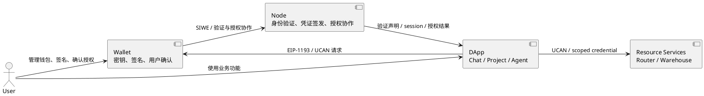

# 夜莺钱包文档中心

> 本目录是钱包产品、架构、协议和演进决策的事实入口。
>
> 当前代码版本：`1.4.18`。文档内容分为“当前基线”“已实现说明”“规范/指南”和“提案”，阅读时以各文档顶部状态为准。

## 1. 钱包定位

夜莺钱包是社区的用户侧身份、密钥与授权确认组件。它负责本地保存钱包密钥、完成 EVM 签名、向 DApp 暴露 EIP-1193 Provider，并协助完成 SIWE 身份认证和 UCAN 能力授权。

Wallet 由用户控制并持有钱包身份、密钥与用户确认权，不拥有社区业务账户、应用目录或业务权限。Node 是可替换的身份验证、凭证签发和授权协作服务；Chat、Project 等系统拥有各自业务状态；资源服务独立校验 UCAN 或 scoped credential。



## 2. 文档地图

### 从这里开始

| 文档 | 状态 | 适合读者 | 回答的问题 |
| --- | --- | --- | --- |
| [钱包架构 V1](./钱包架构V1.md) | 当前实现基线 | 产品、维护者、架构师 | 当前钱包已经实现什么、各组件如何协作 |
| [钱包架构 V2](./钱包架构V2.md) | 目标架构 | 产品、维护者、跨系统架构师 | 尚未实现的下一阶段能力、依赖与完成条件 |
| [钱包架构 V3](./钱包架构V3.md) | 长期演进方向 | 产品、维护者、跨系统架构师 | 非 EVM 网络适配与钱包身份凭证化 |
| [用户使用手册](./用户使用手册.md) | 当前用户指南 | 普通用户、支持人员 | 如何安装、安全使用和排查问题 |
| [Web3 应用集成手册](./web3应用集成手册.md) | 当前集成指南 | Web3 应用开发者 | 怎样连接钱包、登录、授权和联调 |

### 核心技术架构

| 文档 | 状态 | 主题边界 |
| --- | --- | --- |
| [钱包架构 V1](./钱包架构V1.md) | 当前基线 | 已实现的插件分层、运行流程、安全边界和系统职责 |
| [钱包架构 V2](./钱包架构V2.md) | 目标架构 | Passkey、授权收敛、多设备恢复和 MPC 生产化决策 |
| [钱包存储方案](./钱包存储方案.md) | 已实现方案 | 本地双后端、迁移回退、远端加密备份、同步与冲突处理 |
| [MPC 门限钱包方案](./MPC门限钱包方案.md) | 实验性设计 | 门限钱包数据模型、状态机、协调流程、生产化决策和安全边界 |

### 身份、认证与授权

| 文档 | 状态 | 主题边界 |
| --- | --- | --- |
| [SIWE 协议说明](./SIWE协议说明.md) | 规范与实现指南 | 地址控制证明和登录声明，不承载完整能力授权 |
| [UCAN 协议说明](./UCAN协议说明.md) | 规范与项目约定 | 能力委托、能力衰减和请求级授权 |
| [钱包身份方案](./钱包身份方案.md) | 当前目标方案与 V1 契约 | DID、控制器、账户 proof、JWT-VC、WebAuthn/Passkey、无插件登录和 DApp presentation |

## 3. 推荐阅读路径

维护钱包核心代码：

```text
钱包架构 V1 -> 钱包存储方案 -> 对应协议/功能方案；评审未来能力时再阅读钱包架构 V2
```

接入 DApp：

```text
Web3 应用集成手册 -> SIWE 协议说明 -> UCAN 协议说明
```

设计钱包身份与验证体系：

```text
钱包身份方案 -> SIWE 协议说明 -> UCAN 协议说明
```

## 4. 状态定义

| 状态 | 含义 |
| --- | --- |
| 当前基线 | 描述代码当前结构；版本变化后必须复核 |
| 已实现说明 | 对应能力已存在，文档应与实际行为保持一致 |
| 规范与指南 | 同时说明外部标准和本项目采用的约定，不等于所有可选能力均已实现 |
| 实验性 | 已有部分代码或界面，但尚未达到生产安全承诺 |
| 提案 | 用于评审目标和边界，不能作为“已经可用”的依据 |
| 历史快照 | 保留当时决策和变化背景，不作为当前版本事实源 |

发生冲突时，优先级为：当前代码与测试 > 当前基线/已实现说明 > 提案 > 历史快照。发现代码与文档不一致时，应在同一变更中更新文档或明确记录差异。

## 5. 文档维护约定

每份重要文档顶部至少说明：状态、适用版本或更新时间、目标读者、范围与非目标、关联文档。方案文档还应明确系统边界、调用关系、安全模型、当前实现状态、未决事项和验收标准。

- 架构图和跨系统调用图统一使用 PlantUML。
- 用户手册只描述用户可见且已实现的行为，不混入未来设计。
- 协议文档区分“标准要求”“本项目约定”“当前实现”。
- 路线图只跟踪跨模块演进；具体代码缺陷留在架构风险表或 Issue 中。
- 新增文档必须加入本索引，并从相关文档建立双向链接。
- 重大方案从“提案”进入实现前，应补齐 owner、依赖、迁移、回滚和测试计划；完成后将状态改为“已实现说明”。
