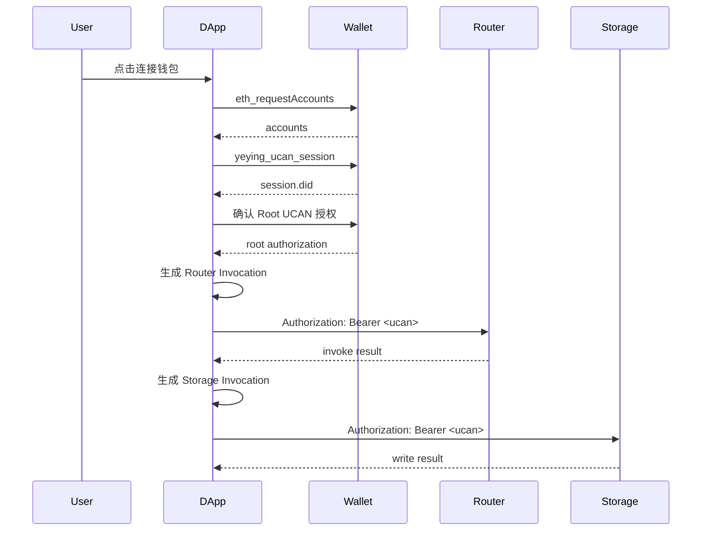

# UCAN 协议说明

本文档只聚焦 UCAN 协议本身，以及它在钱包插件接入 DApp 场景中的使用方式。

目标有两个：

- 把 UCAN 的核心对象和字段讲清楚，尤其是 `iss`、`aud`、`cap`、`with`、`can`。
- 把“协议标准”和“本项目当前实现约定”分开说明，避免把工程写法误认为协议本体。

如果你是第一次接触 UCAN，建议把它理解成：

- JWT 解决“把一组声明打包成令牌”。
- SIWE 解决“用户是谁、当前站点是谁、用户确认了什么”。
- UCAN 解决“谁把什么能力委托给了谁，并允许谁继续把这份能力细化后用于具体服务”。

## 阅读导航

- 当前文档：UCAN 协议语义、能力建模、钱包插件场景示例。
- 前置建议阅读：[SIWE协议说明.md](./SIWE协议说明.md)。
- DApp 集成方式参考：[DApp接入手册.md](./DApp接入手册.md)。

## 约定示例

为了避免不同段落的例子互相切换，本文统一使用以下示例角色：

- DApp 域名：`chat.example.com`
- DApp 标识：`chat-example`
- 模型服务 DID：`did:web:router.example.com`
- 存储服务 DID：`did:web:webdav.example.com`

除非特别说明，后面出现的 `appId` 都指 `chat-example`。

## 1. 什么是 UCAN

UCAN 是一种面向“能力委托”的授权令牌模型。相比只证明身份的签名，UCAN 更关注：

- 谁签发了授权
- 授权给谁
- 授予了哪些能力
- 这些能力作用在哪些资源上
- 什么时候失效
- 能否继续向下游收缩后再委托

这也是 UCAN 和“只做登录”的方案最大区别。

在钱包插件场景里，单靠“站点已连接钱包”是不够的，因为连接只能说明：

- 用户允许这个站点看见地址
- 用户允许这个站点发起后续授权请求

但它不能充分表达：

- 这个 DApp 能不能调用某个模型服务
- 这个 DApp 能不能写入某个存储域
- 这个 DApp 的权限有没有时效
- 这个权限能不能只给某个具体后端使用

UCAN 就是用来把这些能力显式编码进令牌。

## 2. 协议标准和本项目实现的关系

这一节很重要。

### 2.1 UCAN 标准层在表达什么

从标准语义上看，UCAN 的核心是：

- 令牌由某个 issuer 签发
- 令牌面向某个 audience
- 令牌携带一组 capabilities
- capability 描述“对某个资源，允许哪些能力”
- 下游委托不能超出上游授权范围，这叫能力衰减或收缩

也就是说，标准最核心的不是某个 JSON 字段名长什么样，而是：

- 能力是否表达清楚
- 委托链是否成立
- 下游是否没有越权

### 2.2 本项目当前实现怎么表达 capability

在当前钱包插件和配套 SDK 里，能力常写成：

```json
{
  "cap": [
    { "with": "app:all:chat-example", "can": "invoke" },
    { "with": "app:history:chat-example", "can": "write" }
  ]
}
```

这里的：

- `with` 表示资源范围
- `can` 表示动作类型

这是一种非常常见、也很适合工程实现和钱包展示的能力写法。

但要注意，应该把它理解成：

- “本项目当前采用的 capability 表达形式”

而不是：

- “UCAN 协议只允许这样写”

更准确的说法是：

- UCAN 标准关心 capability 的语义
- 当前项目用 `with/can` 这组字段把 capability 落成可读、可校验、可展示的结构

### 2.3 为什么当前项目采用 `with/can`

原因很直接：

- 比只给一个资源 URI 更适合给用户看
- 比把动作塞进资源字符串里更容易做服务端校验
- 比一堆业务化字段更容易形成统一规范

在钱包确认页里，用户看到：

- `with = app:history:chat-example`
- `can = write`

会比看到一段内部路由配置更容易理解。

## 3. 钱包插件场景里 UCAN 在解决什么问题

先把角色拆开：

- 用户：最终授权人
- 钱包插件：保存钱包密钥，生成 UCAN Session，并代用户参与授权流程
- DApp：定义自己申请哪些能力
- 服务端：验证 UCAN，并只接受匹配自身 `aud` 的请求

典型问题是：

- 同一个 DApp 要访问多个后端
- 不同后端需要不同能力
- 用户不应每个请求都重新签主钱包
- DApp 不应拿到无限期、无限目标的万能令牌

因此在当前模型里，会分成三层：

1. 钱包连接
2. 会话级授权
3. 请求级授权

下面逐层解释。

## 4. 核心对象

### 4.1 钱包连接

第一层不是 UCAN，而是站点连接。

DApp 先通过 `eth_requestAccounts` 完成连接授权。这个动作的语义是：

- 允许当前站点与钱包建立关系
- 允许站点请求地址和后续签名流程

它不等于：

- 允许这个站点永久访问你的所有服务
- 允许这个站点自动拥有某些业务能力

因此连接授权只是入口，不是完整授权模型。

### 4.2 UCAN Session

当前钱包实现里，DApp 调用 `yeying_ucan_session` 后，钱包会为：

- 当前 `origin`
- 当前账户地址
- 当前 `sessionId`

生成或复用一个临时 Ed25519 会话密钥对。

对应实现见：

- [js/background/ucan.js](../js/background/ucan.js)

这个 Session 的作用是：

- 作为 UCAN 里的直接 issuer 身份
- 让 DApp 在短时间内可以重复生成请求级令牌
- 避免每次都直接使用钱包主密钥

默认行为：

- 默认 `sessionId = default`
- 默认 TTL 为 24 小时
- Session DID 形如 `did:key:z...`

### 4.3 Root UCAN

Root UCAN 表示“这次会话级授权允许哪些根能力”。

它的职责：

- 把用户对 DApp 的授权范围固定下来
- 作为后续 Invocation UCAN 的上游授权依据
- 提供一个明确的能力上限

你可以把它理解成：

- 用户先同意“这个 DApp 在本次会话里可以申请这些类别的能力”

它不是每个请求都直接拿去调用服务的令牌，而更像本次授权会话里的能力根。

### 4.4 Invocation UCAN

Invocation UCAN 是请求级令牌。它的典型特征：

- `aud` 绑定某个具体服务
- `cap` 是 Root UCAN 能力的子集
- TTL 更短

你可以把它理解成：

- Root UCAN 决定“这次会话最多可以做什么”
- Invocation UCAN 决定“这次请求实际正在做什么”

这就是 UCAN 很重要的一个工程价值：

- 用会话级授权管理能力上限
- 用请求级令牌管理实际调用收敛

## 5. UCAN 关键字段详解

## 5.1 `iss`

`iss` 是 issuer，表示这个令牌是谁签发的。

在当前钱包场景里，常见会看到：

- `iss = did:key:z...`

这表示：

- 当前 UCAN 是由钱包生成的 Session DID 签发

这里要避免一个常见误解：

- `iss` 不一定直接等于链上钱包地址

在这个模型里，链上钱包地址更多承担：

- 用户身份确认
- 连接确认
- 上游签名或 statement 确认

而 UCAN 里真正直接参与签发的是 Session DID。

例子：

```json
{
  "iss": "did:key:z6Mkabc123..."
}
```

它的意思不是“最终用户身份就是 did:key”，而是：

- 当前这张能力令牌，是由这个会话身份签出来的

## 5.2 `aud`

`aud` 是 audience，表示这个令牌是发给谁的。

这是 UCAN 里非常关键的约束字段。`aud` 解决的问题不是：

- 访问哪个资源

而是：

- 哪个接收方有资格接受并使用这个令牌

所以 `aud` 应该绑定目标服务，而不是资源路径。

例子：

```json
{
  "aud": "did:web:router.example.com"
}
```

表示：

- 这个令牌是发给 `router.example.com` 对应服务身份的

如果同一个令牌被拿去调用另一个服务，例如 WebDAV，那么即使能力看起来也像匹配，那个服务也不应该接受，因为：

- `aud` 不对

### Root UCAN 和 Invocation UCAN 的 `aud` 有什么不同

在当前钱包插件模型里，建议这样分：

- Root UCAN 的 `aud`：写当前 DApp 自己的 DID
- Invocation UCAN 的 `aud`：写具体服务 DID

例子：

```json
{
  "aud": "did:web:chat.example.com"
}
```

这个更像是在说：

- 用户把一组根能力委托给 `chat.example.com` 这个应用会话

而发给 Router 的 Invocation 则是：

```json
{
  "aud": "did:web:router.example.com"
}
```

这个是在说：

- 当前请求令牌只给 Router 用

### 为什么 `aud` 一定要单服务绑定

因为如果一个令牌可以同时打多个服务，会出现两个问题：

- 权限边界变得模糊
- 服务端无法确认“这份授权是不是就是发给我的”

所以推荐原则很明确：

- 一个 Invocation UCAN 只面向一个具体服务

## 5.3 `cap`

`cap` 是 capabilities，表示这个令牌携带的一组能力。

例子：

```json
{
  "cap": [
    { "with": "app:all:chat-example", "can": "invoke" },
    { "with": "app:history:chat-example", "can": "write" }
  ]
}
```

这里表达的是两件事：

- 对 `app:all:chat-example` 这类资源允许 `invoke`
- 对 `app:history:chat-example` 这类资源允许 `write`

从语义上说，`cap` 回答的问题是：

- 你到底被授予了哪些能力

工程上建议：

- Root UCAN 可以带完整能力集
- Invocation UCAN 只带当前请求要用的最小子集

例如：

- Root UCAN 有 `invoke`、`read`、`write`
- 当前打 Router 的 Invocation 只带 `invoke`

这样更符合最小权限原则。

## 5.4 `with`

`with` 描述的是能力作用的资源范围。

它回答的问题不是：

- 你要调哪个接口

而是：

- 你被授权操作的是哪一类资源

当前项目推荐格式：

- `app:<scope>:<appId>`

示例：

- `app:all:chat-example`
- `app:history:chat-example`
- `app:media:chat-example`
- `app:profile:chat-example`

这里的语义可以拆成三层：

- `app`：命名空间，表示这是应用级资源
- `scope`：资源域，例如 `all`、`history`、`media`
- `appId`：应用标识，表示是哪个 DApp 的资源

### `with` 为什么重要

因为它定义了资源边界。

没有清楚的 `with`，后续就没法回答：

- 当前权限属于哪个 DApp
- 当前权限是写聊天记录，还是写媒体资源
- 当前权限应该映射到哪个存储前缀或业务域

### `with` 不应该怎么设计

不推荐：

- `with = storage`
- `with = model`
- `with = conversation`

这些名字太抽象，无法稳定表达：

- 资源域
- 租户边界
- 审计语义

### `with` 应该怎么设计

一个足够好的 `with` 至少要满足：

1. 能表达资源边界
2. 能表达应用边界
3. 能稳定比较
4. 能让用户看懂大致用途
5. 能平滑扩展更细粒度

## 5.5 `can`

`can` 描述的是在 `with` 指定资源上允许执行的动作。

它回答的问题是：

- 在这个资源范围里，你能做什么

当前项目推荐保留少量稳定动作：

- `invoke`
- `read`
- `write`

为什么强调“少量稳定动作”：

- 因为动作太细会让授权语言碎片化
- 服务端难统一校验
- 钱包确认页很难给用户解释

### `can` 不应该怎么设计

不推荐：

- `can = sendMessage`
- `can = uploadAvatar`
- `can = syncDraftChunk`

这些都太贴近内部业务接口，而不是通用能力类别。

### `can` 应该怎么设计

建议优先让：

- `with` 表达“对象是谁”
- `can` 表达“动作类别是什么”

例如：

- `with = app:history:chat-example`
- `can = write`

这已经足够表达：

- 允许 `chat-example` 在自己的聊天历史资源域里执行写操作

## 6. `with` 和 `can` 怎么分工

这是社区最容易混淆的部分。

一个简单规则：

- “这是谁的什么资源”放 `with`
- “允许对它做什么”放 `can`

### 例子 1：调用模型服务

如果一个 DApp 要调用模型服务，可以设计为：

```json
{
  "with": "app:all:chat-example",
  "can": "invoke"
}
```

解释：

- `with` 表示当前能力属于 `chat-example` 这个应用域
- `can = invoke` 表示允许执行调用类动作

### 例子 2：写入聊天记录

```json
{
  "with": "app:history:chat-example",
  "can": "write"
}
```

解释：

- `history` 把资源域限定在聊天记录
- `write` 表示允许写入

### 例子 3：读取媒体

```json
{
  "with": "app:media:chat-example",
  "can": "read"
}
```

解释：

- 资源域是媒体文件
- 动作是读，不是写

### 一个反例

如果写成：

```json
{
  "with": "chatCompletion",
  "can": "run"
}
```

问题会很多：

- `with` 不是资源，反而像接口名
- `can` 也不是稳定动作类别
- 后续想复用到别的服务会很困难

## 7. Root UCAN 和 Invocation UCAN 怎么配合

这一节用完整例子说明。

### 7.1 一个聊天 DApp 的根能力

假设 DApp 是 `chat.example.com`，它需要：

- 调用 Router
- 读写聊天历史

那么 Root UCAN 可以表达为：

```json
{
  "iss": "did:key:z6Mkabc123...",
  "aud": "did:web:chat.example.com",
  "cap": [
    { "with": "app:all:chat-example", "can": "invoke" },
    { "with": "app:history:chat-example", "can": "read" },
    { "with": "app:history:chat-example", "can": "write" }
  ],
  "exp": 1767225600
}
```

它的含义是：

- 当前会话身份把这三项根能力委托给 `chat.example.com`

### 7.2 发给 Router 的请求级令牌

真正请求 Router 时，不需要把全部能力都带上，而是收缩成：

```json
{
  "iss": "did:key:z6Mkabc123...",
  "aud": "did:web:router.example.com",
  "cap": [
    { "with": "app:all:chat-example", "can": "invoke" }
  ],
  "exp": 1767140100
}
```

意思是：

- 当前请求只用于调用 Router
- 它只带调用所需最小能力

### 7.3 发给存储服务的请求级令牌

如果当前要写聊天记录，可以再生成：

```json
{
  "iss": "did:key:z6Mkabc123...",
  "aud": "did:web:webdav.example.com",
  "cap": [
    { "with": "app:history:chat-example", "can": "write" }
  ],
  "exp": 1767140100
}
```

它和 Router 的令牌不同点在于：

- `aud` 不同
- `cap` 不同

这正是 UCAN 的收敛能力。

## 8. 什么是能力衰减

能力衰减可以理解成：

- 下游令牌只能比上游更窄，不能比上游更宽

这是 UCAN 作为能力委托协议最关键的约束之一。否则“委托”就会退化成“复制一张更强的新权限”。

在本文场景里：

- Root UCAN 是上游能力集合
- Invocation UCAN 是下游能力集合

因此 Invocation 必须满足至少两条基本原则：

1. 下游 `cap` 必须是上游 `cap` 的子集或收缩版
2. 下游过期时间不能晚于上游过期时间

### 8.1 一个正确例子

上游 Root UCAN：

```json
{
  "aud": "did:web:chat.example.com",
  "cap": [
    { "with": "app:all:chat-example", "can": "invoke" },
    { "with": "app:history:chat-example", "can": "write" }
  ],
  "exp": 1767225600
}
```

下游发给 Router 的 Invocation：

```json
{
  "aud": "did:web:router.example.com",
  "cap": [
    { "with": "app:all:chat-example", "can": "invoke" }
  ],
  "exp": 1767140100
}
```

这是合法收缩，因为：

- `invoke` 本来就在上游能力里
- 只保留了当前请求真正需要的一项能力
- `exp` 更短

### 8.2 一个越权例子：新增上游没有的动作

上游只有：

```json
{
  "cap": [
    { "with": "app:history:chat-example", "can": "read" }
  ]
}
```

如果下游生成：

```json
{
  "cap": [
    { "with": "app:history:chat-example", "can": "write" }
  ]
}
```

这就是越权，因为：

- 上游只有 `read`
- 下游却扩成了 `write`

也就是说，下游不能把“读权限”升级成“写权限”。

### 8.3 一个越权例子：把资源范围变大

上游只有：

```json
{
  "cap": [
    { "with": "app:history:chat-example", "can": "write" }
  ]
}
```

如果下游生成：

```json
{
  "cap": [
    { "with": "app:all:chat-example", "can": "write" }
  ]
}
```

这也是越权，因为：

- 上游只允许写 `history`
- 下游却把资源扩成了 `all`

所以能力衰减不只是“动作不能变强”，也包括“资源范围不能变大”。

### 8.4 一个越权例子：延长时效

上游：

```json
{
  "exp": 1767225600
}
```

如果下游：

```json
{
  "exp": 1767300000
}
```

这同样不合理，因为：

- 上游授权先过期
- 下游却活得更久

正确做法是：

- 下游 TTL 通常比上游短得多

### 8.5 为什么能力衰减很重要

如果没有能力衰减，DApp 或中间层拿到一次上游授权后，就可能：

- 给自己签出更大的资源范围
- 给自己签出更多动作
- 给请求令牌签出更长时效

这样协议就失去了“最小权限”和“逐跳收缩”的意义。

因此在社区实践里，理解 UCAN 不能只停留在：

- “这是一个能签名的 token”

而应明确把它看成：

- “这是一个必须保证下游不超过上游的能力委托链”

## 9. 在钱包插件场景里，用户到底授权了什么

这是实践里经常被问到的问题。

当用户在钱包中确认一次 UCAN 授权时，用户并不是在确认：

- “我允许这个站点永远控制我的钱包”

更准确地说，用户确认的是：

- 我允许这个 DApp 在当前会话中获得某组能力上限
- 这些能力后续可以被收缩成针对具体服务的短期请求令牌

因此，用户确认页应该尽量把这些信息展示清楚：

- 当前 DApp 是谁
- 当前申请了哪些能力
- 这些能力对应哪些资源域
- 这些能力面向哪些服务
- 有效期多久

这也是为什么 `with/can` 的设计必须可读。

## 10. 当前钱包相关 RPC

### 10.1 `yeying_ucan_session`

请求：

```json
{
  "method": "yeying_ucan_session",
  "params": [{ "sessionId": "default", "forceNew": false }]
}
```

响应：

```json
{
  "id": "default",
  "did": "did:key:z...",
  "createdAt": 1767139200000,
  "expiresAt": 1767225600000
}
```

说明：

- 这是获取或创建 UCAN Session
- 当前钱包实现按 `origin + address + sessionId` 维度存储

### 10.2 `yeying_ucan_sign`

请求：

```json
{
  "method": "yeying_ucan_sign",
  "params": [
    {
      "sessionId": "default",
      "signingInput": "<ucan-signing-input>",
      "payload": { "iss": "did:key:z..." }
    }
  ]
}
```

响应：

```json
{
  "signature": "<base64url-signature>"
}
```

说明：

- 钱包会校验 `payload.iss` 是否等于当前 Session DID
- 不一致会返回 `UCAN issuer mismatch`

## 11. 最小流程示例



## 12. 基于 SDK 的示例

下面示例基于当前前端 SDK `@yeying-community/web3-bs`。

```ts
import {
  getProvider,
  requestAccounts,
  getUcanSession,
  createRootUcan,
  createInvocationUcan,
} from "@yeying-community/web3-bs";

const provider = await getProvider({ preferYeYing: true, timeoutMs: 5000 });
await requestAccounts(provider);

const session = await getUcanSession("default", provider);
const appId = "chat-example";

const rootCaps = [
  { with: `app:all:${appId}`, can: "invoke" },
  { with: `app:history:${appId}`, can: "read" },
  { with: `app:history:${appId}`, can: "write" },
];

const root = await createRootUcan({
  provider,
  address: "<wallet-address>",
  sessionId: "default",
  session,
  capabilities: rootCaps,
  statement: `UCAN-AUTH ${JSON.stringify({
    aud: "did:web:chat.example.com",
    cap: rootCaps,
    service_hosts: {
      router: "router.example.com",
      storage: "webdav.example.com",
    },
  })}`,
});

const routerToken = await createInvocationUcan({
  audience: "did:web:router.example.com",
  capabilities: [{ with: `app:all:${appId}`, can: "invoke" }],
  sessionId: "default",
  issuer: session,
});

const storageToken = await createInvocationUcan({
  audience: "did:web:webdav.example.com",
  capabilities: [{ with: `app:history:${appId}`, can: "write" }],
  sessionId: "default",
  issuer: session,
});
```

## 13. 常见误区

### 13.1 把 `aud` 当成资源名

错误理解：

- `aud` 表示访问哪个目录或哪类资源

正确理解：

- `aud` 表示令牌发给哪个服务身份

### 13.2 把 `with` 当成接口名

错误写法：

- `with = chatCompletion`

正确方向：

- `with` 应表达资源范围，而不是函数或路由名

### 13.3 把 `can` 设计得过细

错误写法：

- `sendMessage`
- `appendThreadHistory`
- `uploadAvatar`

正确方向：

- 尽量保留少量稳定动作，例如 `invoke/read/write`

### 13.4 一个请求级令牌打多个服务

错误方向：

- 一个 UCAN 同时发给 Router 和 WebDAV 用

正确方向：

- 一个 Invocation UCAN 对应一个明确 `aud`

### 13.5 只关注签名，不关注能力衰减

如果只看“签名对不对”，不看：

- 下游能力是否超出上游能力
- 请求级能力是否已经收缩

那就没有真正发挥 UCAN 作为“能力委托协议”的价值。

## 14. 常见排查点

- `Site not connected`
  - 先完成 `eth_requestAccounts`。
- `UCAN issuer mismatch`
  - 检查 `payload.iss` 是否等于当前 Session DID。
- 服务端 `audience mismatch`
  - 检查该令牌是否真的发给当前服务。
- 服务端 `capability denied`
  - 检查 `with/can` 是否与当前请求所需能力一致。
- 授权页信息看不懂
  - 往往是能力命名太贴近内部实现，应该回到 `资源 + 动作` 的建模方式。

## 15. 代码参考

- 钱包 UCAN Session 与签名：[js/background/ucan.js](../js/background/ucan.js)
- 钱包 UCAN 请求路由：[js/background/request-router.js](../js/background/request-router.js)
- 钱包授权页能力展示：[js/app/approval.js](../js/app/approval.js)
- 钱包目标服务 UCAN 管理：[js/background/target-ucan-manager.js](../js/background/target-ucan-manager.js)
- DApp 接入说明：[DApp接入手册.md](./DApp接入手册.md)

## 16. 官方参考

下面这些资料建议和本文对照阅读：

- UCAN Working Group 规范仓库：<https://github.com/ucan-wg/spec>
- UCAN Working Group 站点：<https://ucan-wg.github.io/>

本文中的 `with/can`、`app:<scope>:<appId>`、Root/Invocation 分层示例，属于当前项目围绕 UCAN 能力模型给出的推荐实践；它们的目标是让钱包插件、DApp 和后续服务实现能够共享一套清晰、稳定、可展示的能力语言。
