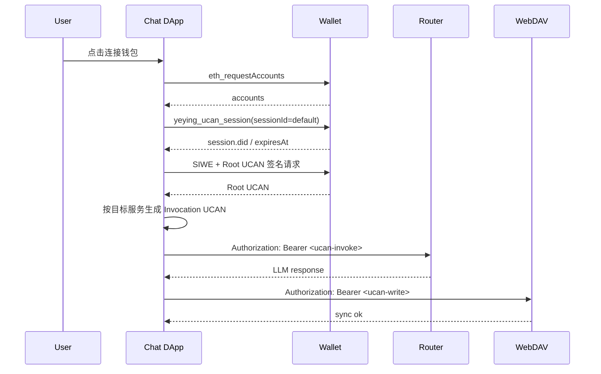

# UCAN 协议说明与使用指南（Chat / Router / WebDAV 模板）

本文档给出一份可直接复用的 UCAN 接入模板，目标是把 `chat`（前端应用）、`router`（模型服务）、`webdav`（存储服务）三者的授权关系讲清楚，并给出 DApp 侧最小接入步骤。

## 阅读导航

- 当前文档：UCAN（授权层）规范与接入。
- 前置建议阅读：`./SIWE协议说明.md`（认证层），理解“谁在授权”与“授权什么”之间的分工。
- 推荐顺序：先读 SIWE，再读 UCAN。

## 1. 适用范围

- 适用钱包：YeYing Wallet 浏览器扩展。
- 适用协议：SIWE（身份声明） + UCAN（能力授权）。
- 适用服务：
  - Chat：发起授权与请求的应用方（依赖方）
  - Router：提供大模型接口（`invoke`）
  - WebDAV：提供会话/媒体存储（`write` / `read`）

## 2. 角色与职责

- 用户：在钱包中确认连接与签名。
- Chat 应用：定义需要的能力并在请求时携带 Invocation UCAN。
- Wallet 扩展：提供 UCAN Session Key 与签名能力，不直接决定业务权限。
- Router / WebDAV：服务端执行 UCAN 验签、能力匹配、受众匹配和约束校验。

## 3. 核心对象

### 3.1 UCAN Session（钱包侧会话密钥）

- 来源：`yeying_ucan_session`
- 默认 `sessionId`：`default`
- 默认 TTL：24 小时（钱包实现）
- 存储键：`ucan_sessions`
- 存储 key 结构：`<origin>::<address>::<sessionId>`

关键代码：

- `js/background/ucan.js`
- `js/storage/storage-keys.js`
- `js/background/request-router.js`

### 3.2 Root UCAN（根授权）

- 用途：承载一次授权中的能力集合（capabilities）。
- 建议有效期：24 小时（可按业务缩短）。
- 通常由 DApp 借助 SDK 生成（例如 `@yeying-community/web3-bs`）。

### 3.3 Invocation UCAN（请求级令牌）

- 用途：面向某个具体后端（Router 或 WebDAV）的短期访问令牌。
- 建议有效期：5 分钟左右。
- 每次请求放入 `Authorization: Bearer <ucan>`。

## 4. 资源与动作模型（推荐）

### 4.1 资源命名

推荐统一资源格式：

- `app:<scope>:<appId>`

示例：

- `app:all:localhost-3020`

兼容格式（历史）：

- `app:<appId>`

说明：

- `scope` 用于表达粒度，默认 `all`，后续可扩展 `profile`、`media` 等。
- `appId` 推荐由发起应用域名归一化得到（如 `localhost:3020 -> localhost-3020`）。

#### 4.1.1 为什么设计为 `app:<scope>:<appId>`

这个格式是为了同时满足“可读、可校验、可扩展、可迁移”四个目标：

1. `app` 是命名空间
   - 先确定这是“应用级资源”，避免和用户资源、系统资源混淆。
   - 服务端可以先按前缀分流策略，日志检索也更清晰。
2. `scope` 预留粒度扩展位
   - 当前默认 `all`，后续可以平滑扩展到 `profile`、`media`、`history` 等。
   - 如果没有 `scope`，后续细粒度只能靠 action 或 constraints 叠补，策略会变复杂。
3. `appId` 明确多租户边界
   - 标识“哪个应用在申请权限”，便于 Router/WebDAV 统一执行租户隔离。
   - 同一 `appId` 可跨服务复用，避免每个服务定义不同资源语言。
4. 与 UCAN 校验职责天然解耦
   - `with` 管对象范围（`app:all:localhost-3020`）
   - `can` 管操作类型（`invoke`/`write`/`read`）
   - `aud` 与 `service_hosts` 管目标服务绑定
5. 兼容历史格式，降低迁移成本
   - 历史 `app:<appId>` 可在解析层视为 `app:all:<appId>`。
   - 新老格式可并存一段时间，不阻断现网。

对比示例（同一 Chat 应用）：

- Router：`with=app:all:localhost-3020`，`can=invoke`
- WebDAV：`with=app:all:localhost-3020`，`can=write`

这种建模使用户看到统一资源语义，服务端按 action + audience 精确收敛权限。

### 4.2 动作命名

- `invoke`：调用执行（典型是 Router 大模型接口）
- `write`：写入（典型是 WebDAV 同步文件）
- `read`：读取（按需开放）

## 5. Chat / Router / WebDAV 标准能力模板

以 Chat（`appId=localhost-3020`）为例：

| 服务 | capability.with | capability.can | 说明 |
| --- | --- | --- | --- |
| Router | `app:all:localhost-3020` | `invoke` | 允许当前应用调用模型接口 |
| WebDAV | `app:all:localhost-3020` | `write` | 允许当前应用写入会话/媒体数据 |

建议 Root UCAN 的 `cap` 至少包含上面两项。

## 6. SIWE Statement 建议载荷

建议在 SIWE statement 中带结构化 UCAN 信息，最少包括：

```json
{
  "version": "UCAN-AUTH-1",
  "aud": "did:web:localhost:3020",
  "service_hosts": {
    "router": "localhost:3011",
    "webdav": "localhost:6065"
  },
  "cap": [
    { "with": "app:all:localhost-3020", "can": "invoke" },
    { "with": "app:all:localhost-3020", "can": "write" }
  ],
  "exp": 1767225600,
  "iat": 1767139200
}
```

说明：

- `aud`：当前应用 DID（不是 Router/WebDAV）。
- `service_hosts`：声明本次授权面向哪些服务地址，供校验与展示使用。
- `cap`：声明根能力集合。

## 7. 钱包扩展对外 RPC（DApp 侧）

### 7.1 连接授权

先调用 `eth_requestAccounts`（或权限接口）完成站点连接授权。

未授权站点直接调用 UCAN 方法会被拒绝（`Site not connected`）。

### 7.2 `yeying_ucan_session`

请求：

```json
{
  "method": "yeying_ucan_session",
  "params": [{ "sessionId": "default", "forceNew": false }]
}
```

响应：

```json
{
  "id": "default",
  "did": "did:key:z...",
  "createdAt": 1767139200000,
  "expiresAt": 1767225600000
}
```

参数说明：

- `sessionId`：可选，默认 `default`
- `forceNew`：可选，强制生成新 session
- `expiresInMs`：可选，自定义 session TTL

### 7.3 `yeying_ucan_sign`

请求：

```json
{
  "method": "yeying_ucan_sign",
  "params": [
    {
      "sessionId": "default",
      "signingInput": "<ucan-signing-input>",
      "payload": { "iss": "did:key:z..." }
    }
  ]
}
```

响应：

```json
{
  "signature": "<base64url-signature>"
}
```

校验行为：

- 若 `payload.iss` 存在且不等于 session.did，会返回 `UCAN issuer mismatch`。

## 8. 标准接入流程（DApp）



## 9. Router 与 WebDAV 的请求模板

### 9.1 Router（大模型调用）

- `audience`：`did:web:<router-host>`
- capability：`app:all:<chatAppId> + invoke`
- 请求头：`Authorization: Bearer <invocation-ucan>`

### 9.2 WebDAV（文件同步）

- `audience`：`did:web:<webdav-host>`
- capability：`app:all:<chatAppId> + write`
- 请求头：`Authorization: Bearer <invocation-ucan>`
- 路径建议：`/dav/apps/<chatAppId>/...`

## 10. 最小代码示例（推荐 SDK 方式）

```ts
import {
  getProvider,
  requestAccounts,
  getUcanSession,
  createRootUcan,
  createInvocationUcan,
} from "@yeying-community/web3-bs";

const provider = await getProvider({ preferYeYing: true, timeoutMs: 5000 });
await requestAccounts(provider);

const session = await getUcanSession("default", provider);
const chatAppId = "localhost-3020";

const rootCaps = [
  { with: `app:all:${chatAppId}`, can: "invoke" },
  { with: `app:all:${chatAppId}`, can: "write" },
];

const root = await createRootUcan({
  provider,
  address: "<wallet-address>",
  sessionId: "default",
  session,
  capabilities: rootCaps,
  statement: `UCAN-AUTH ${JSON.stringify({
    aud: session.did,
    cap: rootCaps,
    service_hosts: { router: "localhost:3011", webdav: "localhost:6065" },
  })}`,
});

const routerToken = await createInvocationUcan({
  audience: "did:web:localhost:3011",
  capabilities: [{ with: `app:all:${chatAppId}`, can: "invoke" }],
  sessionId: "default",
  issuer: session,
});

const webdavToken = await createInvocationUcan({
  audience: "did:web:localhost:6065",
  capabilities: [{ with: `app:all:${chatAppId}`, can: "write" }],
  sessionId: "default",
  issuer: session,
});
```

## 11. 常见失败与排查

- `Site not connected`：
  - 先完成 `eth_requestAccounts` 授权。
- `UCAN issuer mismatch`：
  - 检查 `payload.iss` 与 session.did 是否一致。
- 服务端 `capability denied`：
  - 检查 `with/can`（兼容 `resource/action`）是否匹配服务要求。
- 服务端 `audience` 失败：
  - 检查 Invocation `aud` 是否是目标服务 DID。
- 偶发要求解锁钱包：
  - UCAN 未必过期，但钱包签名能力依赖当前解锁状态。

## 12. 迁移建议（避免反复改动）

- 展示层统一显示：`app:all:<appId>`。
- 服务端保持一段时间兼容：
  - `app:<appId>`
  - `app:all:<appId>`
- 新接入服务优先在 `scope` 维度扩展，不新增过多 action。

## 13. 代码参考

- 钱包 UCAN 会话与签名：`js/background/ucan.js`
- 钱包 UCAN 请求路由：`js/background/request-router.js`
- 钱包授权页能力展示：`js/app/approval.js`
- Chat 侧 UCAN 能力与 statement：`../chat/app/plugins/ucan.ts`
- Chat 侧 Router Invocation：`../chat/app/client/platforms/openai.ts`
- Chat 侧 WebDAV Invocation：`../chat/app/utils/cloud/webdav.ts`
