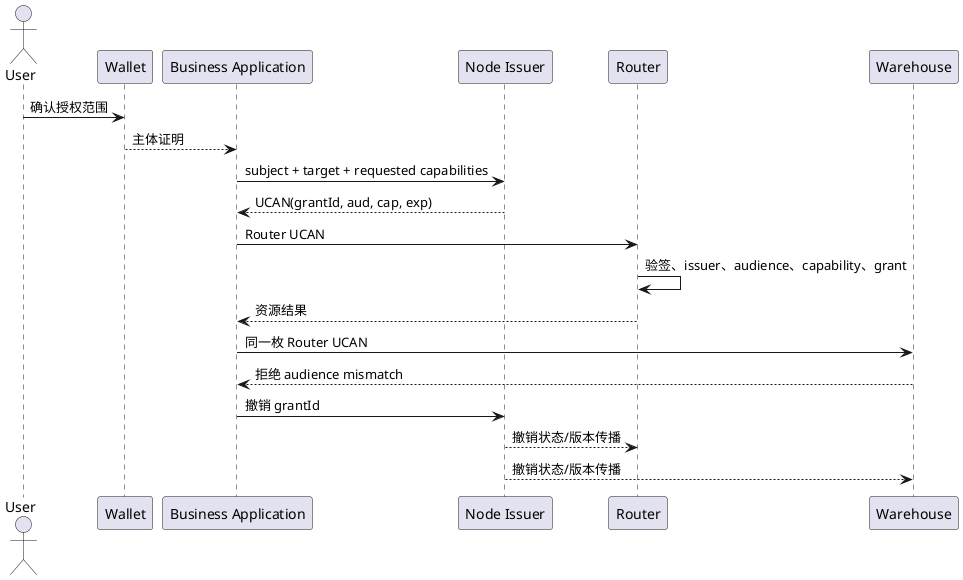

# UCAN 跨服务授权契约

> 状态：V2 规范基线。Node、Router、Warehouse 和业务应用必须共同遵守；任一实现偏离时，V2-M3 不得标记完成。

## 1. 边界

Node 负责认证主体和签发短期能力，业务应用持有并使用能力，Router 与 Warehouse 独立完成验签和授权。Node 登录会话不是资源访问令牌，Wallet 只负责用户确认和根证明，不替资源服务作授权决定。

## 2. 令牌约束

| 字段 | 规范 |
|---|---|
| `iss` | `did:key` 中心签发方或可验证的钱包委托链；生产环境必须配置显式信任列表 |
| `sub` | 规范化主体；钱包地址使用小写 `0x` 地址，社区身份使用稳定 `subjectId` |
| `aud` | 单一目标服务的 `did:web:<host[:port]>`；不得使用跨服务通配 audience |
| `cap[].with` | `app:<appId>` 或目标服务明确登记的资源名；不得由调用方自行扩大为 `app:*` |
| `cap[].can` | 小写动作，例如 `invoke`、`read`、`write`；校验方不得把 `write` 隐式解释为 `invoke` |
| `grantId` | Node 生成的不可预测授权标识，进入令牌事实字段并贯穿日志、查看和撤销 |
| `exp` | 生产默认不超过 10 分钟；高风险写操作应更短 |

Node 可以根据应用登记地址推导初始 audience，但最终值必须与目标服务登记的 audience 完全一致。端口是 audience 的一部分，本地 `did:web:127.0.0.1:6065` 与生产域名是不同受众。

## 3. 校验顺序

资源服务对每次请求依次执行：

1. 校验 JWS、时间窗口和证明链。
2. 校验 `iss` 位于显式信任集合，或委托链可追溯到允许的根主体。
3. 精确比较 `aud`，不接受为其他服务签发的令牌。
4. 对当前路由要求的全部 `with/can` 做最小权限匹配。
5. 查询 `grantId` 撤销状态；缓存必须有确定的最大陈旧时间。
6. 将 `subject`、`grantId`、`audience`、能力和请求结果写入结构化审计日志。

认证失败使用 `401`，已认证但 audience、能力或 grant 不允许使用 `403`。响应不得暴露签名材料和完整令牌；内部错误码分别为 `UCAN_INVALID`、`UCAN_AUDIENCE_MISMATCH`、`UCAN_CAPABILITY_DENIED` 和 `UCAN_GRANT_REVOKED`。

## 4. 撤销

仅撤销 Node 的签发会话不能撤销已经签出的 UCAN。V2 的授权撤销对象是 `grantId`：Node 保存 grant 状态及单调递增版本，Router 和 Warehouse 通过短轮询、推送或在线检查获得状态。

撤销传播的约定上限为 60 秒；服务无法取得超过 60 秒的新鲜撤销状态时，高风险写请求必须失败关闭。令牌过期是第二道边界，不能替代 grant 撤销。

## 5. 联调验收

- Router 令牌访问 Router 成功，同一令牌访问 Warehouse 返回 `UCAN_AUDIENCE_MISMATCH`。
- Warehouse 令牌访问 Warehouse 成功，同一令牌访问 Router 返回 `UCAN_AUDIENCE_MISMATCH`。
- 正确 audience 但缺少路由所需能力时返回 `UCAN_CAPABILITY_DENIED`。
- 非信任中心 issuer 的无证明令牌被拒绝。
- 撤销 `grantId` 后 60 秒内，Router 与 Warehouse 均返回 `UCAN_GRANT_REVOKED`。
- 两个服务的审计记录均可用同一 `grantId` 追溯到 Node 的签发与撤销记录。

当前 Router 和 Warehouse 已具备独立验签、受众与能力拒绝能力；Node 已具备短期中心签发能力。`grantId` 的持久化、查询和跨服务撤销传播仍需在三个服务中共同实现，完成前不得用短令牌过期宣称撤销闭环完成。
