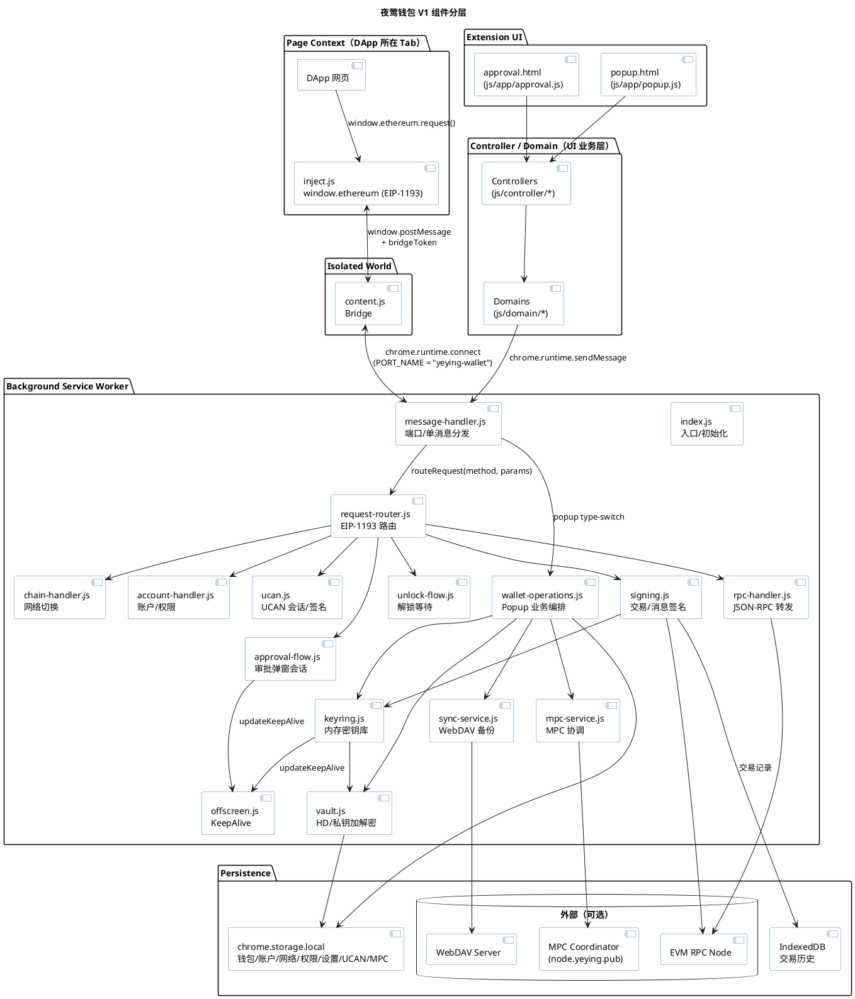
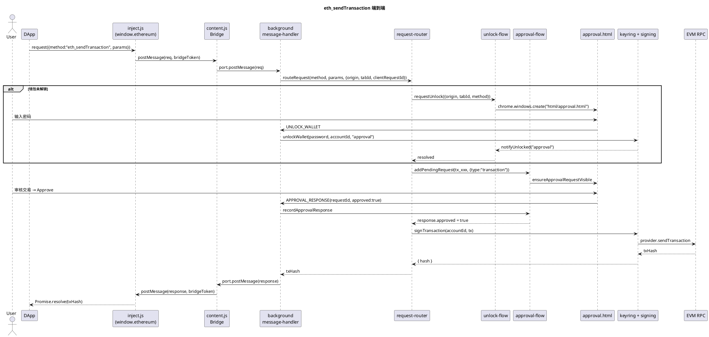
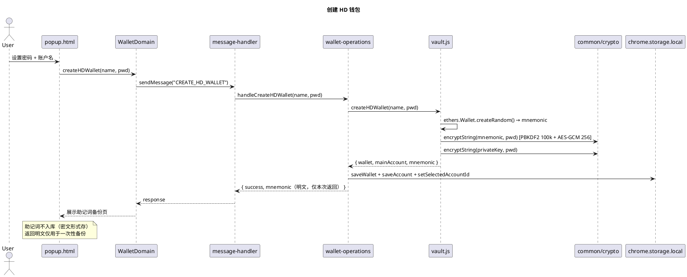
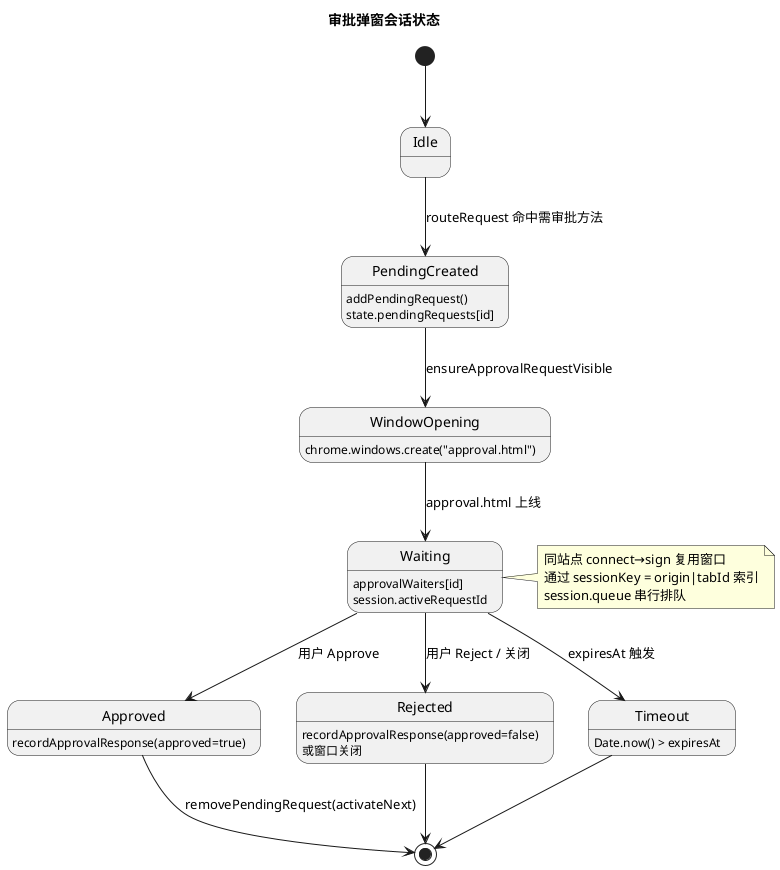
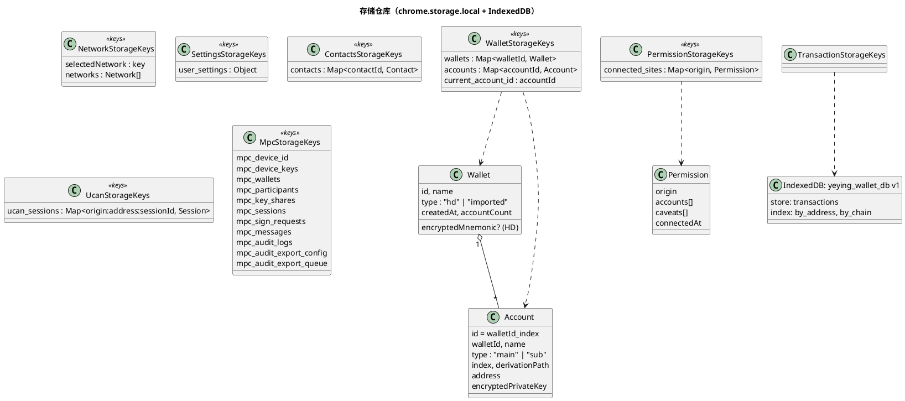
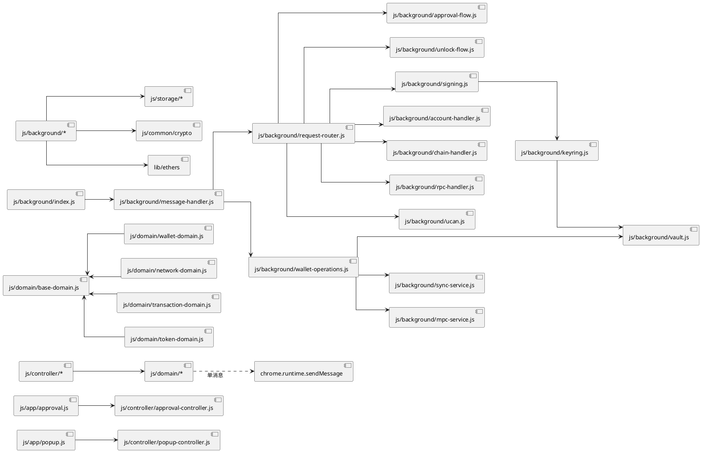

# 夜莺钱包 V1 架构基线

> 基线版本：`manifest.json` v1.4.14；代码哈希以本仓库 main 分支 `ad80297` 为准。
>
> 本文用于沉淀 V1 钱包当前架构现状、关键运行时流程与已知风险点，作为后续演进（V2/V3）的对比基线。
> 文中图形使用 [PlantUML](https://plantuml.com) 表示，源码可直接渲染或粘贴到在线渲染器。

---

## 1. 范围与定位

- **形态**：Chrome Manifest V3 浏览器扩展，纯前端实现，无后端服务依赖（备份同步与 MPC 协调器为可选外部服务）。
- **能力**：
  - HD / 私钥 / MPC 三类钱包，多账户管理；
  - EIP-1193 Provider、EIP-2255 权限、EIP-712 签名、EIP-3326/3085 网络管理、EIP-747 资产监听、EIP-1559 费用计算、EIP-681/4361/5573 协议解析；
  - 站点授权、UCAN 会话与签名（DApp 接入夜莺生态）；
  - WebDAV 加密备份同步；
  - MPC 门限钱包协调（实验性）。
- **不在范围**：原生移动端、NFT 显示、跨链桥、企业级 IAM。

---

## 2. 分层架构总览

V1 采用「页面注入层 → 内容脚本桥 → Background 业务核 → 持久化层」的纵向四层结构。
Popup 与 Approval 页面作为可视化前端，使用同一份 controller/domain 层与 Background 通信。



### 2.1 层职责一览

| 层 | 代码位置 | 主要职责 | 备注 |
| --- | --- | --- | --- |
| 注入层 | `inject.js` | 在页面 MAIN world 注入 EIP-1193 `window.ethereum`；纯转发，不持密钥 | 通过 `bridgeToken` 校验同一 content 实例 |
| 桥接层 | `content.js` | document_start 注入；`window.postMessage` ↔ `chrome.runtime.Port` 中继；离线请求队列 + 重连退避 | `PORT_NAME = "yeying-wallet"` |
| Background 核 | `js/background/*` | 长连接消息处理、EIP-1193 路由、审批弹窗、密钥/签名、RPC 转发、备份同步、MPC | Service Worker（`type: "module"`） |
| Controller/Domain | `js/controller/*`、`js/domain/*` | Popup/Approval UI 业务编排；Domain 通过 `chrome.runtime.sendMessage` 调 Background | `BaseDomain` 统一重试 |
| 协议契约 | `js/protocol/dapp-protocol.js`、`extension-protocol.js` | DApp ↔ Background 报文格式、扩展内部消息常量 | `MESSAGE_TYPE = "yeying_message"` |
| 通用工具 | `js/common/*` | crypto（PBKDF2+AES-GCM）、chain、ui、errors、utils | 全栈共享 |
| 配置 | `js/config/*` | 默认网络、超时、UI、特性开关、校验规则 | `VERSION = "1.0.0"`（注：内部协议版本，非扩展版本） |
| 存储 | `js/storage/*` | 11 个领域仓库；底层默认 `chrome.storage.local`；交易历史走 IndexedDB | 见 §6 |
| 第三方库 | `lib/ethers-6.16.esm.min.js`、`lib/qrcode.min.js` | EVM 签名/Provider；二维码 | 本地打包，无 CDN 依赖 |

---

## 3. 关键运行时流程

### 3.1 DApp `eth_sendTransaction`（含解锁 + 审批）



要点：

- `routeRequest` 在 `js/background/request-router.js:171` 集中路由；`unlockMethods` 集合（`request-router.js:207`）决定哪些方法必须先解锁。
- 同一 `(origin, tabId, method, clientRequestId)` 通过 `clientRequestKey` 去重，防止 DApp 重复请求重开弹窗（`request-router.js:461`）。
- `approval-flow.js` 维护 `state.approvalSessions`，对同一站点的 `connect + sign` 弹窗做会话复用。
- 审批超时阈值由 `config/timeout-config.js TIMEOUTS.REQUEST` 控制；UCAN 用户拒绝路径走 `createUserRejectedError`。

### 3.2 创建 HD 钱包



### 3.3 解锁与自动锁定

- 解锁来源标识：`popup`（用户主动）、`approval`（审批弹窗触发）、`internal`。
- `notifyUnlocked(source)` 只对 `approval` 来源唤醒等待的站点请求，避免「点插件 → 触发站点 connect 弹窗」的串扰（`keyring.js:68`、`unlock-flow.js:69`）。
- 自动锁定：`resetLockTimer` 使用 `TIMEOUTS.UNLOCK` 倒计时；签名时刷新 timer 与密码缓存。
- 密码缓存：`password-cache.js` 最长缓存 `TIMEOUTS.PASSWORD`（用于子账户派生、备份同步、MPC 重新加密分片）。
- Keep-alive：`offscreen.js` 在「有 pending 审批」或「keyring 非空」时创建 offscreen document，避免 Service Worker 被回收。

---

## 4. EIP-1193 / RPC 路由矩阵

| 类别 | 方法 | 处理点 | 是否需要解锁 | 是否需审批 |
| --- | --- | --- | --- | --- |
| 账户 | `eth_accounts` | `account-handler.handleEthAccounts` | 否 | 否（按 origin 返回已授权账户） |
| 账户 | `eth_requestAccounts` | `account-handler.handleEthRequestAccounts` | 是 | 是（首次/未授权站点） |
| 权限 | `wallet_getPermissions` / `wallet_requestPermissions` / `wallet_revokePermissions` | `account-handler.*` | 取决于子方法 | `requestPermissions` 需审批 |
| 链 | `eth_chainId` / `net_version` | `chain-handler.*` | 否 | 否 |
| 链 | `wallet_switchEthereumChain` / `wallet_addEthereumChain` | `chain-handler.*` | 是 | 是 |
| 资产 | `wallet_watchAsset` | `request-router.handleWatchAsset` | 是 | 是 |
| 签名 | `eth_sendTransaction` / `eth_signTransaction` | `request-router.handleSendTransaction` | 是 | 是 |
| 签名 | `personal_sign` / `eth_sign` | `handlePersonalSign` | 是 | 是（reuseSession） |
| 签名 | `eth_signTypedData` / `eth_signTypedData_v4` | `handleSignTypedData` | 是 | 是（reuseSession） |
| UCAN | `yeying_ucan_session` / `yeying_ucan_sign` | `ucan.handleUcan*` | 是 | 需站点已授权 |
| 其他 | 任意其他 method | `rpc-handler.handleRpcMethod` | 否 | 转发到 RPC 节点 |

辅助约束：

- `blockedWhilePopupOpenMethods`：当主 popup 已开启时，所有签名/网络/资产请求会以 `-32002` 拒绝，避免与 popup 内交互冲突（`request-router.js:219`）。
- 单消息回调通过 `chrome.runtime.sendMessage`（popup 用），长连接 Port 用于 content/inject（避免页面级 RPC 滥用阻塞）。

---

## 5. 审批与状态机



实现要点：

- 状态持久化到 `chrome.storage.local`（`approval_pending_requests` / `approval_sessions`），Service Worker 被回收后可通过 `ensureApprovalStateHydrated` 重建。
- `serializePendingRequests` 会把 `response` 字段做浅拷贝；不持久化 `approvalWaiters`（重新 hydrate 后通过 polling/事件重新连接）。
- 弹窗位置：用户拖动后由 popup `UPDATE_POPUP_BOUNDS` 上报，存储在 `user_settings.popupBounds`，重新打开审批/解锁/资产弹窗时通过 `withPopupBoundsAsync` 复用位置。

---

## 6. 数据与存储模型



要点：

- 钱包私钥/助记词在 `vault.js` 用 **PBKDF2(SHA-256, 100000 轮) + AES-GCM-256** 加密后入库；明文只在解锁后驻留内存 `state.keyring`。
- `state.keyring` 是 `Map<accountId, ethers.Wallet>`，**不会**持久化；服务工作者重启即清零，必须重新解锁。
- IndexedDB 当前仅注册了一个 store（交易历史，`storage/transaction-storage.js:13`）；其余领域（钱包、网络、UCAN、MPC）均走 `chrome.storage.local`。
- `connected_sites` 记录站点授权；解锁后通过 `checkSessionAndNotify` 主动向 inject 广播 `connect` 事件。
- 备份同步打包以上键值（除审批临时态、密码缓存外），用 PBKDF2 派生密钥加密后 PUT 到 WebDAV（`sync-service.js:1`）。

---

## 7. 安全模型

- **密钥隔离**：所有解密操作都在 Service Worker 内完成；inject/content 仅做转发，永远拿不到明文私钥。
- **bridgeToken**：每个 content 实例生成 `${runtimeId}:${ts}:${rand}`，inject 启动时通过 URL 参数读取，所有跨边界消息必须带 token；同一页面多次注入会替换前一个 bridge 并 `dispose`，避免重放。
- **请求来源校验**：`registerConnection` 用 `port.sender.url` 推导 origin，签名路由前再次比对站点授权。
- **方法白名单**：解锁/审批集合是闭集，未列入 `unlockMethods` 的方法不会触发密钥访问；未列入路由的方法走 `handleRpcMethod` 直接转发到 RPC。
- **CSP & 资源**：`web_accessible_resources` 限定 `inject.js` 与 `dapp-protocol.js`，其余脚本不暴露给页面。
- **审批失活**：弹窗关闭即视为 reject（`request-router.js:399`）；UCAN/签名都有 `expiresAt`，避免 pending 永驻。
- **未实现/弱项**：见 §9。

---

## 8. 模块依赖关系（精简）



---

## 9. 现状评估与已知风险

### 9.1 优点

- **职责分层清晰**：注入/桥接/Background/UI 各司其职，密钥只在 Service Worker 内出现。
- **协议常量集中**：`protocol/*` 统一定义跨边界消息，便于 DApp SDK 对齐。
- **审批可恢复**：pending 状态写入 `chrome.storage.local`，Service Worker 重启不会丢请求。
- **存储抽象较薄但解耦**：`storage/index.js` 作为唯一出口，重命名/迁移 store 时改一点即可。
- **MV3 keep-alive 已处理**：offscreen document + 60s 连接清理 + 自动锁定。

### 9.2 已识别风险与改进点

| 编号 | 现象 | 影响 | 建议演进 |
| --- | --- | --- | --- |
| R1 | `wallet-operations.js` 1871 行、`settings-controller.js` 3077 行、`sync-service.js` 1247 行 | 单文件过厚，维护与单测困难 | 按 feature 拆分（accounts / contacts / backup / mpc / tokens 等） |
| R2 | `message-handler.js` 1230 行 + 巨型 switch | 新增 popup 消息时易漏分支；类型不安全 | 用 `handlerMap[type]` 注册模式 + 集中校验 |
| R3 | IndexedDB 仅承载交易历史，其余仍在 `chrome.storage.local` | `chrome.storage.local` 单 key 序列化代价随数据量上涨；备份冲突合并代价大 | 渐进式将 wallets/accounts/networks 迁到 IndexedDB |
| R4 | 没有真正的状态机/事件总线，跨模块靠 `state` 全局对象 + 直接 import | 隐式耦合；难做单元测试 | 引入显式状态机（如审批流）或观察者，关键模块以 DI 注入 |
| R5 | 没有 TypeScript / 静态类型 | 协议字段重命名易漏改 | 渐进引入 `// @ts-check` + JSDoc 或迁移 TS |
| R6 | 自动化测试只有 `scripts/test-approval-flow.mjs` 一份 | 回归覆盖低 | 引入单测（vitest/jest）+ Provider 兼容性脚本 |
| R7 | 密码缓存默认窗口较长（`TIMEOUTS.PASSWORD`） | 子账户派生体验好，但延长了内存暴露窗口 | 用户可配；增加敏感操作前的 fresh-auth |
| R8 | 解锁判定基于 `state.keyring != null`，无设备/会话指纹 | 多窗口竞态下偶发 | 引入 unlock session id + 心跳 |
| R9 | 签名审批界面元数据（合约 ABI / 资产符号）依赖 RPC 实时拉取 | 离线场景体验弱 | 内置常用合约元数据缓存 |
| R10 | EIP-55 校验和不完整（README 标注） | 大小写不一致地址可能通过校验 | 补齐 `ethers.getAddress` 检查 |

### 9.3 适配范围与边界

- 仅支持 EVM L1/L2 链（通过 `chainId` 切换），未抽象多链账户模型。
- Provider 仅暴露 `window.ethereum`，未对外暴露 `wallet.providers`（EIP-6963 多 Provider 协议尚未支持）。
- 备份同步以「合并优先」策略写回，冲突解决 UI 在 `RESOLVE_BACKUP_SYNC_CONFLICT` 路径。
- MPC 模块为实验性，UI、签名分发与审计已串通，但密钥生成算法可替换层未落地。

---

## 10. 演进基线（建议下一阶段）

1. **降耦**：拆分 `wallet-operations` / `settings-controller` / `sync-service`，引入消息 handler 注册表。
2. **类型化**：JSDoc → TS 渐进迁移，至少协议（`protocol/*`）与存储 schema 先类型化。
3. **测试**：补齐核心域（vault、keyring、approval-flow、sync-service）单元测试，Provider 兼容性走 Hardhat/Anvil 脚本。
4. **多 Provider**：实现 EIP-6963，避免与其他扩展抢占 `window.ethereum`。
5. **存储统一**：分阶段把 wallets/accounts/networks 迁到 IndexedDB，备份策略改为差分。
6. **观测**：Background 日志接入可选的 Sentry/PostHog（用户可关闭），定位审批超时和 RPC 失败链路。

---

## 附录 A：版本与文件锚点

| 项目 | 值 |
| --- | --- |
| 扩展版本 | `manifest.json` v1.4.14 |
| 内部协议版本 | `js/config/app-config.js VERSION = "1.0.0"` |
| 默认 Service Worker | `js/background/index.js`（type: module） |
| 默认 Popup | `html/popup.html` |
| 审批弹窗 | `html/approval.html` |
| Offscreen | `html/offscreen.html` |
| EIP-1193 实现 | `inject.js` |
| 桥接 | `content.js` |
| Provider 协议 | `js/protocol/dapp-protocol.js` |
| 扩展内协议 | `js/protocol/extension-protocol.js` |
| 加密参数 | PBKDF2-SHA256 100k → AES-GCM-256（`js/common/crypto/crypto-constants.js`） |

## 附录 B：渲染 PlantUML

任意 PlantUML 渲染器均可，推荐：

```bash
# 本地（需 java + plantuml.jar）
plantuml docs/V1架构基线.md

# 或 VSCode 安装 "PlantUML" 插件直接预览
```
