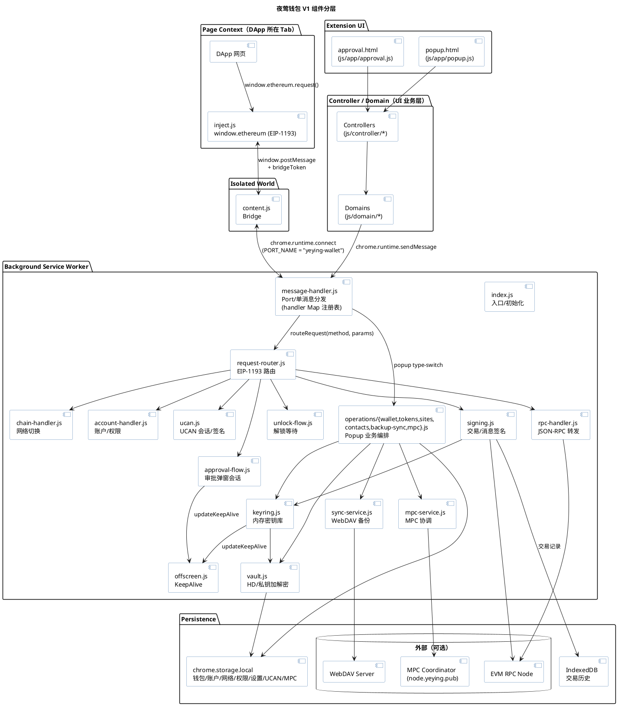
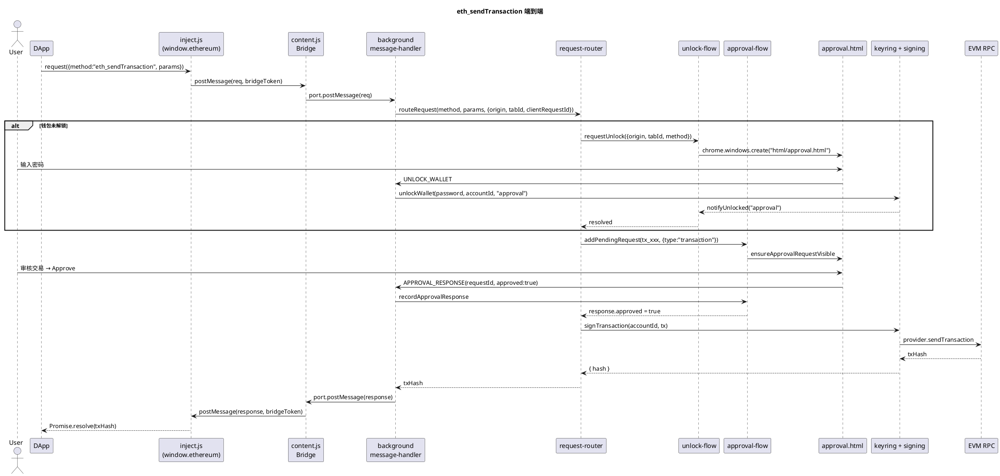
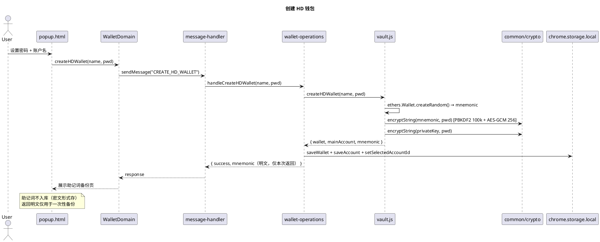
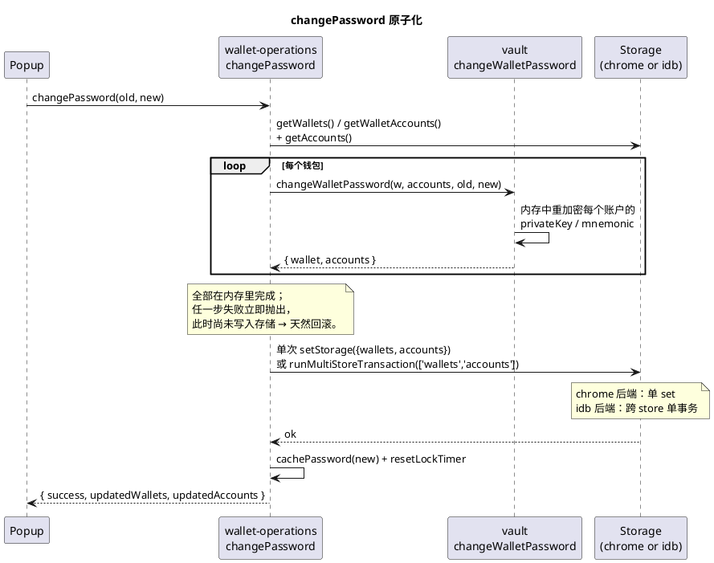
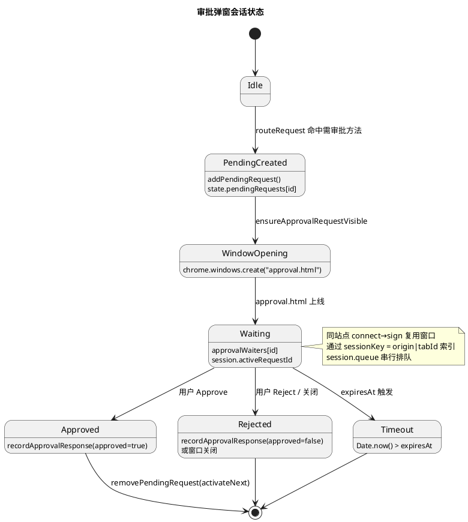
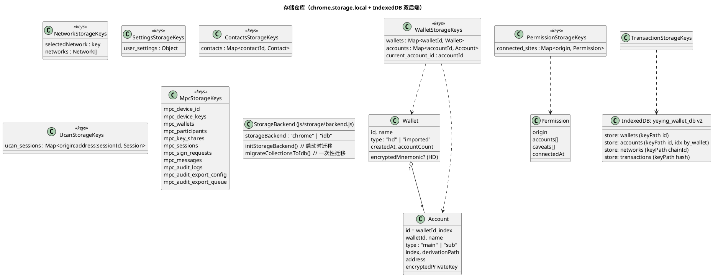
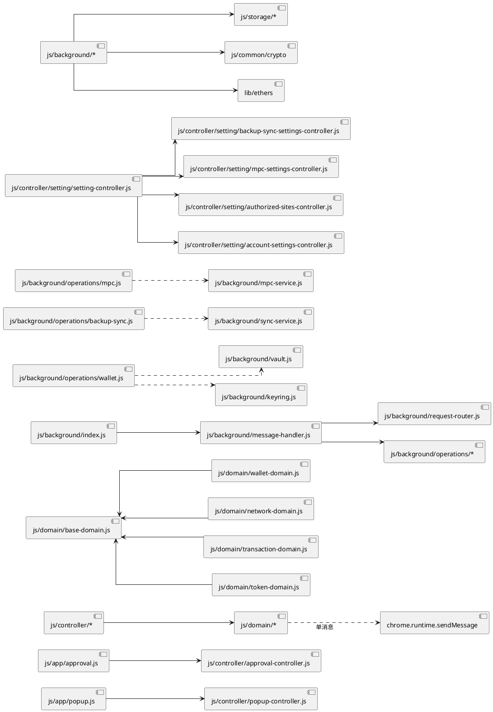

# 夜莺钱包 V1 架构基线

> 基线版本：`manifest.json` v1.4.15；代码哈希以本仓库 main 分支 `bf8b8bd` 为准。
>
> 本文用于沉淀 V1 钱包当前架构现状、关键运行时流程与已知风险点，作为后续演进（V2/V3）的对比基线。
> 文中图形使用 [PlantUML](https://plantuml.com) 表示，源码可直接渲染或粘贴到在线渲染器。
>
> **本版本（v1.4.14 → v1.4.15）的主要工作**：拆分巨型 `wallet-operations`/`settings-controller`、`message-handler` 改注册表、`changePassword` 原子化（修复导出密码错乱的真实 bug）、EIP-55 校验和补齐、双后端存储（chrome + IndexedDB）迁移、CI 接入、覆盖各层纯函数/集成测试 503 例。详见 §11 变更日志。

---

## 1. 范围与定位

- **形态**：Chrome Manifest V3 浏览器扩展，纯前端实现，无后端服务依赖（备份同步与 MPC 协调器为可选外部服务）。
- **能力**：
  - HD / 私钥 / MPC 三类钱包，多账户管理；
  - EIP-1193 Provider、EIP-2255 权限、EIP-712 签名、EIP-3326/3085 网络管理、EIP-747 资产监听、EIP-1559 费用计算、EIP-681/4361/5573 协议解析；
  - 站点授权、UCAN 会话与签名（DApp 接入夜莺生态）；
  - WebDAV 加密备份同步；
  - MPC 门限钱包协调（实验性）。
- **不在范围**：原生移动端、NFT 显示、跨链桥、企业级 IAM。

---

## 2. 分层架构总览

V1 采用「页面注入层 → 内容脚本桥 → Background 业务核 → 持久化层」的纵向四层结构。
Popup 与 Approval 页面作为可视化前端，使用同一份 controller/domain 层与 Background 通信。



### 2.1 层职责一览

| 层 | 代码位置 | 主要职责 | 备注 |
| --- | --- | --- | --- |
| 注入层 | `inject.js` | 在页面 MAIN world 注入 EIP-1193 `window.ethereum`；纯转发，不持密钥 | 通过 `bridgeToken` 校验同一 content 实例 |
| 桥接层 | `content.js` | document_start 注入；`window.postMessage` ↔ `chrome.runtime.Port` 中继；离线请求队列 + 重连退避 | `PORT_NAME = "yeying-wallet"` |
| Background 核 | `js/background/*` | 长连接消息处理、EIP-1193 路由、审批弹窗、密钥/签名、RPC 转发、备份同步、MPC | Service Worker（`type: "module"`） |
| Controller/Domain | `js/controller/{token,account,setting,contact,popup,approval,transaction,site}`、`js/domain/*` | Popup/Approval UI 业务编排；`SettingController` 持有 4 个子 controller（backup/mpc/sites/account）| Domain 通过 `chrome.runtime.sendMessage` 调 Background；`BaseDomain` 统一重试 |
| 协议契约 | `js/protocol/dapp-protocol.js`、`extension-protocol.js` | DApp ↔ Background 报文格式、扩展内部消息常量 | `MESSAGE_TYPE = "yeying_message"` |
| 通用工具 | `js/common/*` | crypto（PBKDF2+AES-GCM）、chain、ui、errors、utils | 全栈共享 |
| 配置 | `js/config/*` | 默认网络、超时、UI、特性开关、校验规则 | `VERSION = "1.0.0"`（注：内部协议版本，非扩展版本） |
| 存储 | `js/storage/*` | 11 个领域仓库；底层双后端：默认 `chrome.storage.local`、迁移成功后 `IndexedDB`（wallets/accounts/networks/transactions）| 见 §6 + `docs/存储架构.md` |
| 第三方库 | `lib/ethers-6.16.esm.min.js`、`lib/qrcode.min.js` | EVM 签名/Provider；二维码 | 本地打包，无 CDN 依赖 |

---

## 3. 关键运行时流程

### 3.1 DApp `eth_sendTransaction`（含解锁 + 审批）



要点：

- `routeRequest` 在 `js/background/request-router.js:171` 集中路由；`unlockMethods` 集合（`request-router.js:207`）决定哪些方法必须先解锁。
- 同一 `(origin, tabId, method, clientRequestId)` 通过 `clientRequestKey` 去重，防止 DApp 重复请求重开弹窗（`request-router.js:461`）。
- `approval-flow.js` 维护 `state.approvalSessions`，对同一站点的 `connect + sign` 弹窗做会话复用。
- 审批超时阈值由 `config/timeout-config.js TIMEOUTS.REQUEST` 控制；UCAN 用户拒绝路径走 `createUserRejectedError`。

### 3.2 创建 HD 钱包



### 3.3 解锁与自动锁定

- 解锁来源标识：`popup`（用户主动）、`approval`（审批弹窗触发）、`internal`。
- `notifyUnlocked(source)` 只对 `approval` 来源唤醒等待的站点请求，避免「点插件 → 触发站点 connect 弹窗」的串扰（`keyring.js:68`、`unlock-flow.js:69`）。
- 自动锁定：`resetLockTimer` 使用 `TIMEOUTS.UNLOCK` 倒计时；签名时刷新 timer 与密码缓存。
- 密码缓存：`password-cache.js` 最长缓存 `TIMEOUTS.PASSWORD`（用于子账户派生、备份同步、MPC 重新加密分片）。
- Keep-alive：`offscreen.js` 在「有 pending 审批」或「keyring 非空」时创建 offscreen document，避免 Service Worker 被回收。

### 3.4 `changePassword` 原子化（修复 R11）



要点：

- 历史实现对每个账户逐个 `await updateAccount`（整表读改写 × N），Service Worker 在改密中途被回收会留下「部分账户新密码、部分旧密码」混杂，导致用户用新密码导出报 "Invalid password"。v1.4.15 改为**内存中重加密所有钱包与账户后单次原子写**。
- chrome 后端用单次 `setStorage({wallets, accounts})`；idb 后端用 `runMultiStoreTransaction(['wallets','accounts'], 'readwrite', ...)` 跨 store 单事务。
- MPC 设备密钥重加密（`mpcService.reencryptDeviceKeys`）在主写之后跑，**失败不回退已成功的钱包改密**（独立存储），仅 console.warn，由 MPC 流程单独重试。
- 子账户 index 仍按 `max(account.index) + 1` 计算，避免删除中间账户后复用旧 index（R12）。
- 回归由 `tests/change-password.test.mjs` + `tests/change-password-edges.test.mjs` 锁死。

---

## 4. EIP-1193 / RPC 路由矩阵

| 类别 | 方法 | 处理点 | 是否需要解锁 | 是否需审批 |
| --- | --- | --- | --- | --- |
| 账户 | `eth_accounts` | `account-handler.handleEthAccounts` | 否 | 否（按 origin 返回已授权账户） |
| 账户 | `eth_requestAccounts` | `account-handler.handleEthRequestAccounts` | 是 | 是（首次/未授权站点） |
| 权限 | `wallet_getPermissions` / `wallet_requestPermissions` / `wallet_revokePermissions` | `account-handler.*` | 取决于子方法 | `requestPermissions` 需审批 |
| 链 | `eth_chainId` / `net_version` | `chain-handler.*` | 否 | 否 |
| 链 | `wallet_switchEthereumChain` / `wallet_addEthereumChain` | `chain-handler.*` | 是 | 是 |
| 资产 | `wallet_watchAsset` | `request-router.handleWatchAsset` | 是 | 是 |
| 签名 | `eth_sendTransaction` / `eth_signTransaction` | `request-router.handleSendTransaction` | 是 | 是 |
| 签名 | `personal_sign` / `eth_sign` | `handlePersonalSign` | 是 | 是（reuseSession） |
| 签名 | `eth_signTypedData` / `eth_signTypedData_v4` | `handleSignTypedData` | 是 | 是（reuseSession） |
| UCAN | `yeying_ucan_session` / `yeying_ucan_sign` | `ucan.handleUcan*` | 是 | 需站点已授权 |
| 其他 | 任意其他 method | `rpc-handler.handleRpcMethod` | 否 | 转发到 RPC 节点 |

辅助约束：

- `blockedWhilePopupOpenMethods`：当主 popup 已开启时，所有签名/网络/资产请求会以 `-32002` 拒绝，避免与 popup 内交互冲突（`request-router.js:219`）。
- 单消息回调通过 `chrome.runtime.sendMessage`（popup 用），长连接 Port 用于 content/inject（避免页面级 RPC 滥用阻塞）。

---

## 5. 审批与状态机



实现要点：

- 状态持久化到 `chrome.storage.local`（`approval_pending_requests` / `approval_sessions`），Service Worker 被回收后可通过 `ensureApprovalStateHydrated` 重建。
- `serializePendingRequests` 会把 `response` 字段做浅拷贝；不持久化 `approvalWaiters`（重新 hydrate 后通过 polling/事件重新连接）。
- 弹窗位置：用户拖动后由 popup `UPDATE_POPUP_BOUNDS` 上报，存储在 `user_settings.popupBounds`，重新打开审批/解锁/资产弹窗时通过 `withPopupBoundsAsync` 复用位置。

---

## 6. 数据与存储模型



要点：

- 钱包私钥/助记词在 `vault.js` 用 **PBKDF2(SHA-256, 100000 轮) + AES-GCM-256** 加密后入库；明文只在解锁后驻留内存 `state.keyring`。
- `state.keyring` 是 `Map<accountId, ethers.Wallet>`，**不会**持久化；服务工作者重启即清零，必须重新解锁。
- **双后端存储**（v1.4.15 引入）：`js/storage/backend.js` 持 `storageBackend: 'chrome' | 'idb'` 内存开关，默认 `'chrome'`。Background 启动时调 `initStorageBackend()` 跑一次性 `migrateCollectionsToIdb()`，**仅迁移成功**才切 `'idb'`；失败/IDB 不可用自动回退 chrome.storage，资产始终可见。迁移集：wallets/accounts/networks。`transaction-storage` 走 IDB 是原状保留。详细架构与安全边界见 [`docs/存储架构.md`](./存储架构.md)。
- **脏标记**：`js/storage/mutation-events.js` 提供 pub/sub（`onMutation` / `notifyMutation`），IDB 后端下写函数成功后 `notifyMutation(collection)`，`sync-service` 改订阅 mutation 替代 `chrome.storage.onChanged`（contacts/settings/permissions/ucan/mpc 仍在 chrome.storage，仍走 onChanged）。
- `connected_sites` 记录站点授权；解锁后通过 `checkSessionAndNotify` 主动向 inject 广播 `connect` 事件。
- 备份同步打包以上键值（除审批临时态、密码缓存外），用 PBKDF2 派生密钥加密后 PUT 到 WebDAV（`sync-service.js:1`）。

---

## 7. 安全模型

- **密钥隔离**：所有解密操作都在 Service Worker 内完成；inject/content 仅做转发，永远拿不到明文私钥。
- **bridgeToken**：每个 content 实例生成 `${runtimeId}:${ts}:${rand}`，inject 启动时通过 URL 参数读取，所有跨边界消息必须带 token；同一页面多次注入会替换前一个 bridge 并 `dispose`，避免重放。
- **请求来源校验**：`registerConnection` 用 `port.sender.url` 推导 origin，签名路由前再次比对站点授权。
- **方法白名单**：解锁/审批集合是闭集，未列入 `unlockMethods` 的方法不会触发密钥访问；未列入路由的方法走 `handleRpcMethod` 直接转发到 RPC。
- **CSP & 资源**：`web_accessible_resources` 限定 `inject.js` 与 `dapp-protocol.js`，其余脚本不暴露给页面。
- **审批失活**：弹窗关闭即视为 reject（`request-router.js:399`）；UCAN/签名都有 `expiresAt`，避免 pending 永驻。
- **未实现/弱项**：见 §9。

---

## 8. 模块依赖关系（精简）



---

## 9. 现状评估与已知风险

### 9.1 优点

- **职责分层清晰**：注入/桥接/Background/UI 各司其职，密钥只在 Service Worker 内出现。
- **协议常量集中**：`protocol/*` 统一定义跨边界消息，便于 DApp SDK 对齐。
- **审批可恢复**：pending 状态写入 `chrome.storage.local`，Service Worker 重启不会丢请求。
- **存储抽象较薄但解耦**：`storage/index.js` 作为唯一出口，重命名/迁移 store 时改一点即可。
- **MV3 keep-alive 已处理**：offscreen document + 60s 连接清理 + 自动锁定。

### 9.2 已识别风险与改进点

| 编号 | 现象 | 影响 | 状态 |
| --- | --- | --- | --- |
| R1 | `wallet-operations.js` 1871 行、`settings-controller.js` 3077 行、`sync-service.js` 1247 行 | 单文件过厚，维护与单测困难 | **已缓解**：拆为 `operations/{wallet,tokens,sites,contacts,backup-sync,mpc}.js`；`settings-controller` 拆为 4 个 sub-controller（backup/mpc/sites/account-settings）；`sync-service` 抽出常量与无状态工具到 `sync/`。 |
| R2 | `message-handler.js` 1230 行 + 巨型 switch | 新增 popup 消息时易漏分支；类型不安全 | **已缓解**：popup 巨型 switch 改为 `Map<type, handler>` 注册表（`message-handler.js` `popupHandlers`）。content 端口路径未动（统一路由语义）。 |
| R3 | IndexedDB 仅承载交易历史，其余仍在 `chrome.storage.local` | `chrome.storage.local` 单 key 序列化代价随数据量上涨；备份冲突合并代价大 | **已缓解**：双后端（chrome + IDB），后台启动一次性迁移，迁移失败回退 chrome。wallets/accounts/networks 进 IDB（keyPath + by_wallet 索引），写后 `notifyMutation` 通知 sync 标脏。**仍未自动测**：必须在真 Chrome 验存量升级与回退；Node 测仅覆盖迁移状态机与 IDB CRUD。 |
| R4 | 没有真正的状态机/事件总线，跨模块靠 `state` 全局对象 + 直接 import | 隐式耦合；难做单元测试 | 未变 |
| R5 | 没有 TypeScript / 静态类型 | 协议字段重命名易漏改 | **部分缓解**：`protocol/*` 与 `storage` schema 加 JSDoc + `// @ts-check`（`tsconfig.json` `checkJs: false`，仅 @ts-check 文件被 `npx tsc` 检）。CI 接入 `npm run typecheck`。完整 TS 迁移仍未做。 |
| R6 | 自动化测试只有 `scripts/test-approval-flow.mjs` 一份 | 回归覆盖低 | **已缓解**：v1.4.15 新增 503 例单元 + 8 例 sync-service 集成 + 6 例 approval 集成（`tests/`）。CI 跑 `npm test` + `npm run test:sync` + `npm run test:approval` + `npm run typecheck`。**仍未覆盖**：UI 渲染、Service Worker 重启竞态、IDB 实际持久化路径。 |
| R7 | 密码缓存默认窗口较长（`TIMEOUTS.PASSWORD`） | 子账户派生体验好，但延长了内存暴露窗口 | 未变 |
| R8 | 解锁判定基于 `state.keyring != null`，无设备/会话指纹 | 多窗口竞态下偶发 | 未变 |
| R9 | 签名审批界面元数据（合约 ABI / 资产符号）依赖 RPC 实时拉取 | 离线场景体验弱 | 未变 |
| R10 | EIP-55 校验和不完整 | 大小写不一致地址可能通过校验 | **已修复**：`validateEthereumAddress` 默认路径走 `ethers.isAddress`（坏 checksum 混合大小写地址拒绝）；`validation-rules.test.mjs` 覆盖回归。`address-utils.isValidChecksum` 保留兼容。 |
| R11 | `changePassword` 非原子：每账户 `await updateAccount` 写一次 | Service Worker 改密中途被回收留下「部分账户新密码、部分旧密码」混杂，导致用户用新密码导出报 "Invalid password" | **已修复**（v1.4.15，`55eb04b`）：内存中重加密所有钱包/账户后**单次** `setStorage({wallets, accounts})` 原子写。chrome 后端单 set；idb 后端走 `runMultiStoreTransaction(['wallets','accounts'], 'readwrite', ...)` 跨 store 单事务。`change-password.test.mjs` 锁死此不变量。 |
| R12 | 子账户 index 复用 `wallets.accounts.length` | 删除中间子账户后新建会复用旧 index，导致助记词 + 派生路径一致时静默覆盖旧账户 | **已修复**（`55eb04b`）：`newIndex = max(account.index) + 1`（用 `Number.isFinite` 守卫）。`change-password.test.mjs` 覆盖。 |
| R13 | `validateAddressOrEns` 顺序：先 ENS 再 UD，ENS 通用正则吃掉所有 `label.tld`，UD 死代码 | `.crypto`/`.wallet` 等 UD 域名被误判为 ENS | **已修复**（`9c23711`）：UD 检测提前；ENS 通用正则不再抢判。 |
| R14 | `isValidEnsName` 未做 ENS 规范 3-100 字符长度限制 | 超长/过短可过 | **已修复**（`9c23711`）：`< 3 \|\| > 100` 直接 false。 |
| R15 | `GAS__CONFIG`（双下划线）拼写错误 | `validateGasPrice` 超上限分支抛 ReferenceError | **已修复**（`02ed774`）：改为 `GAS_CONFIG`。`transaction-config.test.mjs` 覆盖回归。 |
| R16 | `realignAccountPasswords` 占位未实现却被 message-handler 注册 | 调用即抛 | **已移除**（用户要求「不要让代码冗余」），handler 与相关 case 同步删除。 |
| R17 | `message-handler` 中存在 `handleGetMpcAuditExportConfig` 笔误（应为 `handleMpcGetAuditExportConfig`） | ReferenceError | **已修复**：`tests/message-handler-dispatch.test.mjs` 引用解析扫过。 |

### 9.3 适配范围与边界

- 仅支持 EVM L1/L2 链（通过 `chainId` 切换），未抽象多链账户模型。
- Provider 仅暴露 `window.ethereum`，未对外暴露 `wallet.providers`（EIP-6963 多 Provider 协议尚未支持）。
- 备份同步以「合并优先」策略写回，冲突解决 UI 在 `RESOLVE_BACKUP_SYNC_CONFLICT` 路径。
- MPC 模块为实验性，UI、签名分发与审计已串通，但密钥生成算法可替换层未落地。

---

## 10. 演进基线（已完成 / 未完成）

| 编号 | 演进项 | 状态 | 落地物 |
| --- | --- | --- | --- |
| E1 | 拆分 `wallet-operations` / `settings-controller` / `sync-service` | ✅ | `operations/{wallet,tokens,sites,contacts,backup-sync,mpc}.js`；`setting/{authorized-sites,account-settings,backup-sync-settings,mpc-settings}-controller.js` |
| E2 | `message-handler` 巨型 switch → handler Map | ✅ | `message-handler.js` `popupHandlers = new Map([...])` |
| E3 | 补齐 EIP-55 校验和 | ✅ | `validation-rules.validateEthereumAddress` 默认走 `ethers.isAddress` |
| E4 | 单测覆盖核心域 | ✅ | 503 例（单元 503 + sync 集成 8 + approval 集成 6），CI 接入 |
| E5 | 存储迁 IndexedDB（双后端） | ✅ | `js/storage/backend.js` + `mutation-events.js`；存量升级需真 Chrome 验证 |
| E6 | 协议/storage JSDoc + `// @ts-check` | ✅ | `tsconfig.json` + CI `npm run typecheck` |
| E7 | 观测（日志环） | ✅ | `js/background/diagnostics.js` 200 条 ring buffer，敏感键脱敏 |
| E8 | 命名统一（复数→单数） | ✅ | `tokens-list` → `token-list`、`contacts` → `contact`、`settings` → `setting`、tokens-list-controller → token-controller、contacts-controller → contact-controller |
| E9 | 拆分 popup 巨型文件 | ✅ | `operations/*` 按域；`setting/*` 子 controller；`sync/*` 工具/常量 |
| E10 | 真实 bug 修复 | ✅ | R10/R11/R12/R13/R14/R15/R16/R17 全部 fix（见 §9.2） |
| E11 | 多 Provider（EIP-6963） | ✅ | `inject.js` 补齐 `eip6963:announceProvider` 规范合规（随机 uuid + `Object.freeze` info/detail） |
| E12 | 显式状态机 / DI | ❌ | 仍依赖 `state` 全局（R4） |
| E13 | 完整 TS 迁移 | ❌ | 仅 `// @ts-check` 起步（R5） |
| E14 | 真实 Chrome 端到端测试 | ❌ | IDB 迁移存量升级、EIP-55 行为变更、settings tab 交互需手测 |
| E15 | 解锁 session id / 心跳 | ❌ | R8 未变 |
| E16 | 离线场景合约元数据缓存 | ❌ | R9 未变 |
| E17 | 备份策略改差分 | ❌ | 仍是合并优先 |

---

## 附录 A：版本与文件锚点

| 项目 | 值 |
| --- | --- |
| 扩展版本 | `manifest.json` v1.4.15 |
| 内部协议版本 | `js/config/app-config.js VERSION = "1.0.0"` |
| 默认 Service Worker | `js/background/index.js`（type: module） |
| 默认 Popup | `html/popup.html` |
| 审批弹窗 | `html/approval.html` |
| Offscreen | `html/offscreen.html` |
| EIP-1193 实现 | `inject.js` |
| 桥接 | `content.js` |
| Provider 协议 | `js/protocol/dapp-protocol.js` |
| 扩展内协议 | `js/protocol/extension-protocol.js` |
| 加密参数 | PBKDF2-SHA256 100k → AES-GCM-256（`js/common/crypto/crypto-constants.js`） |

## 附录 B：渲染 PlantUML

任意 PlantUML 渲染器均可，推荐：

```bash
# 本地（需 java + plantuml.jar）
plantuml docs/V1架构基线.md

# 或 VSCode 安装 "PlantUML" 插件直接预览
```

---

## 11. 变更日志（v1.4.14 → v1.4.15）

### 11.1 Bug 修复

| 编号 | 简述 | 关键 commit |
| --- | --- | --- |
| R10 | EIP-55 默认路径接受坏 checksum 混合大小写地址 | `f2e3da2` |
| R11 | `changePassword` 非原子：Service Worker 改密中途回收导致部分账户新密码、部分旧密码（用户报"导出密码错乱"） | `55eb04b` |
| R12 | 子账户 index 复用：删除中间子账户后新建会复用旧 index | `55eb04b` |
| R13 | `validateAddressOrEns` UD 检测被 ENS 通用正则抢判 | `9c23711` |
| R14 | `isValidEnsName` 未做 3-100 字符长度限制 | `9c23711` |
| R15 | `validateGasPrice` 引用 `GAS__CONFIG` 双下划线拼错 | `02ed774` |
| R16 | `realignAccountPasswords` 占位未实现却被 message-handler 注册 | 删除 |
| R17 | `handleGetMpcAuditExportConfig` 笔误（应为 `handleMpcGetAuditExportConfig`） | `tests/message-handler-dispatch.test.mjs` 扫出 |

### 11.2 架构改进

| 编号 | 简述 | 关键 commit |
| --- | --- | --- |
| E1 | `wallet-operations.js` (1871 行) 拆为 `operations/{wallet,tokens,sites,contacts,backup-sync,mpc}.js` | `1f72caa` |
| E1 | `settings-controller.js` (3077 行) 拆为 4 个 sub-controller（backup-sync / mpc / authorized-sites / account-settings） | `bc3fe98` `c4dcc25` `048b8a7` |
| E1 | `sync-service.js` 抽出常量与无状态工具到 `sync/` 子目录 | `aefd395` |
| E2 | `message-handler` popup 巨型 switch 改 `Map<type, handler>` 注册表 | `7718e46` |
| E5 | 双后端存储（chrome + IDB）迁移：迁移状态机 + 安全回退 + `mutation-events` 替代 `onStorageChanged` | `5c61604` `e4bdc54` `cb41d58` |
| E6 | `protocol/*` 与 `storage` schema 加 JSDoc + `// @ts-check`；CI 跑 `tsc` | `b3bf6e0` `6b15c7b` |
| E7 | 后台本地诊断日志环（200 条 cap，敏感键脱敏） | `7c25a55` |
| E8 | 命名统一：目录 `tokens/accounts/settings` → `token/account/setting`；类 `TokensListController`→`TokenController`、`ContactsController`→`ContactController` | `4646052` `2eef87b` `a491a2d` `500c90d` |
| E11 | EIP-6963 规范合规：随机 uuid + `Object.freeze` info/detail | `daf94c2` |

### 11.3 测试新增

- `npm test`：503 例（迁移前 0 例；v1.4.15 起按 `tests/` 目录运行 Node 内置 runner + `fake-indexeddb@6`）
- `npm run test:sync`：8 例（sync-service 集成，需 `--test-isolation=none`，与单测分开跑）
- `npm run test:approval`：6 例（DOM-stub 端到端审批流）
- `npm run typecheck`：0 错误

测试覆盖的纯函数/模块（v1.4.15）：

| 域 | 测试文件 | 主要覆盖 |
| --- | --- | --- |
| crypto | `crypto.test.mjs`（基础） + `crypto-utils.test.mjs` + `password.test.mjs` + `crypto-validation.test.mjs` | 加解密栈地基、密码强度/校验、签名 |
| chain | `chain-utils.test.mjs` + `address-utils.test.mjs` | chainId/hex 互转、地址格式/校验和、ENS/UD |
| utils | `object-utils` + `json-utils` + `id-number-utils` + `time-utils` | 通用工具 |
| config | `network-config` + `transaction-config` + `validation-rules` + `timeout-config` + `storage-keys` + `app-config` + `feature-flags`（读路径） | 网络/费用/校验/超时/键名/版本/特性开关 |
| format | `format-ui.test.mjs` | 余额/地址/时间显示 |
| controller | `popup-controller` + `account-settings` + `authorized-sites` + `token-controller` + `contact-controller` | DOM 集成 |
| background | `message-handler-dispatch` + `change-password` + `change-password-edges` + `settings-utils` + `diagnostics` + `vault` + `keyring` | 消息分发、改密原子性/边界、设置工具、诊断 |
| storage | `storage-backend` + `storage-idb` | 迁移状态机 + IDB CRUD（fake-indexeddb） |

### 11.4 仓库结构变化

- 旧 `scripts/test/` + `scripts/test-approval-flow.mjs` → `tests/` 统一目录
- CI：`.github/workflows/ci.yml` 跑 `npm ci` + `npm test` + `npm run test:sync` + `npm run test:approval` + `npm run typecheck`（Node 22.x）
- 文档：新增 `docs/存储架构.md`（双后端 + 迁移 + 回退）
- `package.json` scripts: `test` / `test:sync` / `test:approval` / `test:all` / `typecheck`
- devDependencies: `fake-indexeddb@6`（运行时仍零依赖）

## 附录 C：仍未自动测 / 需真 Chrome 验证

- IDB 迁移存量升级：旧版本 chrome.storage 已有数据装新版 → 启动迁移 → 数据完整、能解锁、能导出
- IDB 后端 IDB 不可用（隐身/手动删库）回退 chrome：资产仍可见
- 重置钱包 + 自定义网络增删 + 切换网络
- 改密时离线/多窗口竞态
- EIP-55 行为变化在 UI 的实际提示（错误提示文案）
- settings tab 各子 controller 实际交互（PopupController 委派路由已用 DOM 集成测，渲染未测）
- 站点授权弹窗的多签/重放/同源复用（仅 integration 测了 happy path）
