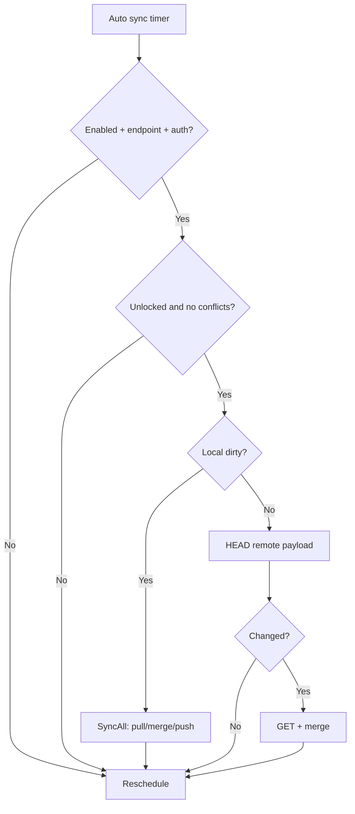

# Backup & Sync (WebDAV)

> Goal: sync account names/count, contacts, and network IDs across devices that share the same mnemonic (SRP).
> Data is encrypted client-side and stored as a WebDAV file; the server cannot read it. UCAN is default, SIWE/Basic are supported as fallback.

## 1. Scope and non-goals

### Scope (current)
- Sync objects:
  - Account names (HD accounts)
  - Account count (HD derivation index)
  - Contacts (name / note / address)
  - Network IDs (chain IDs)
- Triggers: unlock, lock, startup/disable, local changes, and periodic auto sync.
- Storage: WebDAV (PUT/GET/HEAD/MKCOL/DELETE).
- Auth: UCAN bearer token (default), SIWE token, or Basic Auth.

### Non-goals
- No private keys, mnemonic, hardware accounts, or imported accounts.
- No transaction history, site permissions, or balances.
- No server-side decryption or merge.

## 2. WebDAV endpoint and auth
- Default endpoint: `https://webdav.yeying.pub/api` (trailing slash optional).
- If the user only provides an origin or `/`, the wallet probes these prefixes via `OPTIONS`:
  `/`, `/dav`, `/webdav`, `/api` and picks the first non-404.
- With UCAN **app scope** enabled (`required_resource=app:*`), the wallet stores sync data under `/apps/<appId>/...`.
  The default appId is the extension domain (the `<id>` part of `chrome-extension://<id>/`).
- Auth headers:
  - SIWE / UCAN: `Authorization: Bearer <token>`
  - Basic Auth: `Authorization: Basic <base64>`
- UCAN default capability: `app:<extension-id>#write`

## 3. Namespace and key derivation
- Fingerprint: `srpFingerprint = sha256("yeying-sync-id:" + mnemonic)`
- Sync key: `syncKey = sha256("yeying-sync-key:" + mnemonic)`
- Sync key is kept in memory only while the wallet is unlocked.

## 4. WebDAV file layout
```
{endpoint}/apps/<appId>/payload.<srpFingerprint>.json.enc
```
- The `/apps/<appId>/` directory is created via `MKCOL` when missing (create `/apps` first).
- `payload.<srpFingerprint>.json.enc` is a fully encrypted envelope.

## 5. Payload (v1)
```json
{
  "version": 1,
  "updatedAt": 1710000000000,
  "accountCount": 3,
  "accounts": [
    { "index": 0, "address": "0x...", "name": "Account 1", "nameUpdatedAt": 1710000000000 }
  ],
  "contacts": [
    { "id": "0xabc...", "name": "Alice", "note": "", "address": "0xabc...", "updatedAt": 1710000002000 }
  ],
  "networkIds": ["0x1", "0xaa36a7"],
  "networksUpdatedAt": 1710000003000
}
```

## 6. Sync flow (high level)
- **Unlock**: `pull → merge → push` (if changes), then auto sync starts.
- **Lock**: attempt `push` if dirty, then auto sync stops.
- **Local changes**: mark dirty and debounce a push.
- **Manual**: "Sync now" runs a full sync.

## 7. Auto sync and remote change detection (implemented)
- **Prerequisites**: enabled + endpoint set + valid auth (UCAN/SIWE/Basic) + wallet unlocked.
  Auto sync pauses if there are unresolved conflicts.
- **Schedule**: runs every ~5 minutes with ±30s jitter. On failure, exponential backoff up to 15 minutes
  (minimum interval 30 seconds).
- **Behavior**:
  - If local state is dirty: `syncAll('auto')` (pull → merge → push).
  - If clean: send `HEAD` to `payload.<srpFingerprint>.json.enc` and compare `ETag` / `Last-Modified` with cached values.
    Only pull when changed.
  - If `HEAD` is not supported (405/501), fall back to `GET`.
  - If remote returns 404, skip and clear the cache.
- Remote metadata cache is stored in `settings.backupSyncRemoteMeta`.

## 8. Conflict merge rules
- Account names and contacts: last-write-wins (LWW) by timestamp.
  If timestamps are equal but values differ, a conflict is recorded for UI resolution.
- Account count: `max(local, remote)` (only grows).
- Network IDs: union set.

## 9. Local settings (selected keys)
- `backupSyncEnabled` (default true)
- `backupSyncEndpoint` (default `https://webdav.yeying.pub/api`)
- `backupSyncAuthMode` (`ucan` | `siwe` | `basic`, default `ucan`)
- `backupSyncAuthToken` / `backupSyncUcanToken` / `backupSyncBasicAuth`
- `backupSyncLastPullAt` / `backupSyncLastPushAt`
- `backupSyncDirty`
- `backupSyncConflicts`
- `backupSyncRemoteMeta` (cached `ETag` / `Last-Modified`)
- `backupSyncLogs` (sync activity log)

## 10. Auto sync flow (Mermaid)

