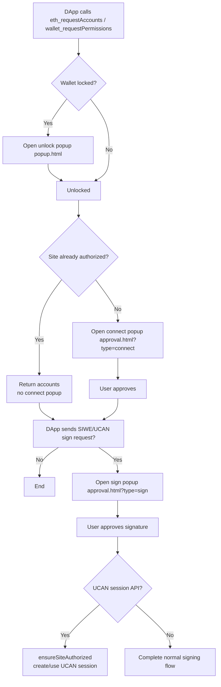

# DApp Connection and SIWE/UCAN Authorization Flow

This document describes the actual flow based on the current code.

## Summary
- First-time connect: Connect page + SIWE/UCAN signing page (2 popups if already unlocked).
- Returning site: If already authorized, only the SIWE/UCAN signing page appears.
- Wallet locked: An unlock popup appears first (skipped when already unlocked).

> Note: the signing page only appears when the DApp actually sends a signing request (e.g. SIWE/UCAN login message).

## Key Code Pointers
- Unlock flow: `js/background/unlock-flow.js`
- Connect approval: `js/background/account-handler.js` (`handleEthRequestAccounts`)
- Request routing: `js/background/request-router.js`
- Approval UI: `html/approval.html` + `js/app/approval.js`
- UCAN session: `js/background/ucan.js`

## Detailed Flow
1. **DApp requests accounts**  
   Typically `eth_requestAccounts` / `wallet_requestPermissions`.  
   - If locked, `request-router` calls `requestUnlock()` and opens the unlock popup.  
   - After unlocking, connection continues.

2. **Connect approval (Connect page)**  
   `handleEthRequestAccounts` checks whether the site is already authorized:  
   - **Authorized**: returns accounts directly, no connect popup.  
   - **Not authorized**: opens `approval.html?type=connect`.

3. **SIWE/UCAN signing (Sign page)**  
   When the DApp sends a SIWE/UCAN login message (e.g. `personal_sign`, `eth_sign`, `eth_signTypedData`),  
   the wallet opens `approval.html?type=sign...` for user confirmation.

4. **UCAN session/sign APIs**  
   `yeying_ucan_session` / `yeying_ucan_sign` call `ensureSiteAuthorized` first.  
   If the site is not authorized, it fails — so the connect step must happen first.

## Flowchart (Mermaid)

