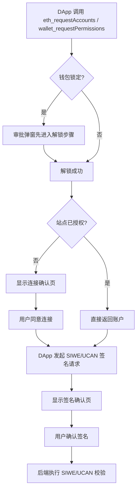

# Web3 应用集成手册

> 状态：当前集成指南
>
> 适用版本：Wallet `1.4.22`
>
> 目标读者：接入 EIP-1193、SIWE、UCAN 和 Node Passport 的 DApp 前后端开发者。Passport-backed Wallet Login 目标方案见 [通行证登录方案](./通行证登录方案.md)。

本文面向 DApp 开发者，说明 YeYing Wallet 的推荐接入顺序、用户可见审批行为，以及常见问题排查方式。

## 0. 阅读导航

- 文档总入口：[README.md](./README.md)
- 当前文档：接入步骤与联调清单。
- 认证规范：`./SIWE协议说明.md`
- 授权规范：`./UCAN协议说明.md`
- 推荐顺序：先本手册，再 SIWE，再 UCAN。

## SDK 推荐（web3-bs）

- 推荐前端 SDK：`@yeying-community/web3-bs`
- SDK 仓库：`yeying-community/web3-bs`
- 适合 DApp 的核心能力：
  - Provider 发现与连接：`getProvider`、`requestAccounts`
  - SIWE 登录：`loginWithChallenge`、`authFetch`
  - UCAN 授权：`getUcanSession`、`createRootUcan`、`createInvocationUcan`
  - 多后端编排：`initDappSession`、`initWebDavStorage`
- 接入建议：优先使用 SDK 封装；仅在特殊场景下再直接调用底层 `provider.request`。

## 1. 适用范围

- 钱包：YeYing Wallet 浏览器扩展。
- 登录签名：`personal_sign`、`eth_sign`、`eth_signTypedData(_v4)`。
- 授权能力：`yeying_ucan_session`、`yeying_ucan_sign`。
- 典型场景：DApp 登录、Passport-backed Wallet Login、SIWE + UCAN 组合授权、Router/WebDAV 访问。

## 2. 前置条件

- DApp 已接入 EIP-1193 Provider（支持 `provider.request`）。
- 后端已具备 SIWE 验签与 nonce 防重放机制。
- 若需要社区身份或已验证邮箱，后端必须接入 Node Passport，并以 `subjectId` 作为外部身份主键。
- 后端已具备 UCAN 能力校验（`with/can/aud/exp/iss`）。

## 3. 快速开始（最小路径）

1. 连接账户：`getProvider` + `requestAccounts`。
2. 如果只需要钱包地址：使用 `loginWithChallenge`（或手动构造 SIWE + `signMessage`）。
3. 如果需要社区身份或邮箱：使用 Passport-backed Wallet Login，领取并校验 Node Passport assertion。
4. 申请 UCAN 会话：`getUcanSession`（钱包支持时会优先走钱包 UCAN RPC）。
5. 签发请求令牌：`createInvocationUcan`。
6. 访问后端资源：`authFetch`（JWT）或 `authUcanFetch`（UCAN）。
7. 后端完成 Passport/SIWE + UCAN 联合校验后建立会话与权限上下文。

## 4. 标准接入步骤

### 4.1 连接账户

- 调用 `eth_requestAccounts` 或 `wallet_requestPermissions`。
- 未授权站点会弹连接确认页。
- 已授权站点通常会直接返回账户地址。

### 4.2 发起 SIWE 登录签名

- 建议补齐 SIWE 关键字段：`domain`、`uri`、`chainId`、`nonce`、`issuedAt`。
- 推荐使用 `personal_sign`，参数顺序 `[message, address]`。
- 钱包审批页会提示域名一致性、时间窗口和能力声明风险。

### 4.3 申请 UCAN 能力

- 调用 `yeying_ucan_session` 获取或复用会话 DID。
- 调用 `yeying_ucan_sign` 对 signing input 签名。
- 站点未完成连接授权时，UCAN 接口会拒绝请求。

### 4.4 服务端校验与放行

- SIWE：验签、nonce 一次性、时间有效性、domain 绑定。
- Passport assertion：校验 Node 签名、`audience`、`appId`、`nonce`、`exp`、scope 和钱包地址一致性。
- UCAN：`with/can` 能力匹配、`aud` 目标匹配、`exp` 与 `iss` 校验。

### 4.5 Passport-backed Wallet Login

当 DApp 需要社区身份、已验证邮箱或无钱包登录兼容时，钱包登录才需要走 Passport-backed Wallet Login。用户体验仍是“钱包登录”，但 DApp 后端最终信任的是 Node Passport assertion，而不是钱包签名里的自声明邮箱。若 DApp 只需要钱包地址，继续使用现有 SIWE / `loginWithChallenge` 即可，不要求 Wallet 向 Node 领取 assertion。

已有 SIWE 登录接口的应用应优先在原接口上扩展，不强制新增平行接口。扩展点是 `scope`，不是新的登录 mode：

- `POST /api/v1/public/auth/challenge`：传 `address` 和可选 `scope`。不传 `scope` 或只请求钱包地址时，现有 SIWE 行为保持不变。
- 请求 `identity.basic`、`identity.wallet`、`identity.username`、`identity.email` 等 Passport scope 时，后端仍创建一次性登录会话和 nonce，并在响应中返回 `appId/audience/scope/passportEndpoint`。
- `POST /api/v1/public/auth/verify`：后端根据 challenge 会话中保存的 scope 判断是否必须提交 `walletProof + passportAssertion`，校验后签发应用本地 session。

推荐后端流程：

1. DApp 后端在现有 `challenge` 接口中读取 `scope`，创建一次性登录会话，保存 `nonce`、`state`、`scope`、过期时间和浏览器会话绑定。
2. 普通 SIWE 只返回原有 challenge；需要 Passport claims 时，额外返回给前端：`appId`、`audience`、`nonce`、`scope`、`passportEndpoint`。
3. 前端调用 Wallet 的 Passport assertion 能力（目标 RPC 名称以实现为准，建议为 `yeying_passport_assertion`），传入上述字段。
4. Wallet 展示站点、钱包地址、请求的 scope；当包含 `identity.email` 时明确提示会读取已验证邮箱。
5. Wallet 使用当前地址签名登录意图，并向 Node 请求 Passport assertion。
6. Wallet 返回 `address`、`walletProof` 和 `passportAssertion`。
7. DApp 前端把三者提交到现有 `verify` 接口。
8. DApp 后端校验钱包签名和 Node assertion，确认：
   - assertion 由可信 Node 签发，未过期、未撤销；
   - `aud` 是当前应用，`appId` 匹配登记应用；
   - assertion `nonce` 与后端登录会话一致且未使用；
   - assertion `walletAddress` 与钱包签名恢复地址一致；
   - assertion scope 覆盖业务所需字段；
   - 如果要求邮箱，`emailVerified === true`。
9. DApp 后端使用 `subjectId` / `sub` 查找或绑定本地用户，检查用户禁用状态和业务权限，最后签发自己的本地 session。

推荐请求 scope：

```json
["identity.basic", "identity.wallet", "identity.email"]
```

字段含义：

| Scope | 返回字段 | 说明 |
| --- | --- | --- |
| `identity.basic` | `subjectId` / `sub` | 第三方应用保存的外部身份主键 |
| `identity.wallet` | `walletAddress` | 当前已绑定的钱包地址，适合展示和链上操作上下文 |
| `identity.username` | `username`、`usernameVerified`、`usernameVerifiedAt` | 用户名已由钱包控制权认证后登记，并且用户授权时返回 |
| `identity.email` | `email`、`emailVerified`、`emailVerifiedAt` | 只有 Passport subject 已完成邮箱验证且用户授权时返回 |

应用不得把钱包本地资料、钱包签名文本或前端提交的用户名/邮箱视为已验证声明。用户名和邮箱是否验证过只以身份验证服务 assertion 或服务端 exchange / introspection 结果为准。

### 4.6 无钱包通行证登录

无钱包插件时，DApp 应使用 Node Passport 的 authorization code + PKCE 流程或 Passkey 登录页面。后端处理应与 Passport-backed Wallet Login 收敛到同一套本地逻辑：

```text
Passport claims -> subjectId -> localUserId -> 本地 session
```

也就是说，两种入口不同，但后端最终都只信任 `subjectId` 和 Node 签发的 claims：

```text
有钱包插件：Wallet 签名 + Node Passport assertion
无钱包插件：Passkey / 通行证页面 + Node exchange
```

如果已有历史钱包登录用户，迁移期可以在首次拿到 `subjectId` 时按 `walletAddress` 找到历史用户并建立 `subjectId -> localUserId` 映射；不得只因前端声称某地址或邮箱就自动合并账户。

## 5. 最小调用示例（SDK 方式，推荐）

```ts
import {
  getProvider,
  requestAccounts,
  requestPassportAssertion,
  getUcanSession,
  createInvocationUcan,
  authUcanFetch,
} from "@yeying-community/web3-bs";

const provider = await getProvider({ preferYeYing: true, timeoutMs: 5000 });
if (!provider) throw new Error("No injected wallet provider");

const accounts = await requestAccounts({ provider });
const account = accounts[0];
if (!account) throw new Error("No account returned");

const loginRequest = await fetch("/api/v1/public/auth/challenge", {
  method: "POST",
  headers: { "Content-Type": "application/json" },
  body: JSON.stringify({
    address: account,
    appId: "your-app-id",
    scope: ["identity.basic", "identity.wallet", "identity.email"],
  }),
}).then((res) => res.json());

const passportLogin = await requestPassportAssertion({
  provider,
  appId: loginRequest.appId,
  audience: loginRequest.audience,
  nonce: loginRequest.nonce,
  scope: loginRequest.scope,
  passportEndpoint: loginRequest.passportEndpoint,
});

await fetch("/api/v1/public/auth/verify", {
  method: "POST",
  headers: { "Content-Type": "application/json" },
  body: JSON.stringify({
    ...passportLogin,
  }),
});

const session = await getUcanSession("default", provider);
const appId = "your-app-id";
const ucan = await createInvocationUcan({
  audience: "did:web:api.example.com",
  capabilities: [{ with: `app:all:${appId}`, can: "invoke" }],
  sessionId: "default",
  issuer: session,
});

const response = await authUcanFetch("https://api.example.com/v1/chat", {
  method: "POST",
  headers: { "Content-Type": "application/json" },
  body: JSON.stringify({ message: "hello" }),
}, {
  ucan,
});
```

说明：

- SDK 会优先尝试钱包提供的 `yeying_ucan_session` / `yeying_ucan_sign`。
- 若钱包不支持上述 UCAN RPC，SDK 会回退到本地 UCAN session 模式。

## 6. 用户可见审批流程

- 首次连接：显示连接确认页。
- 钱包锁定：先进入解锁步骤，再进入连接/签名。
- 连接后紧接签名：会尽量复用同一审批弹窗，减少多窗口打断。
- 已授权站点再次访问：通常不再显示连接确认，仅在需要时显示签名页。



## 7. 验收清单（联调完成标准）

- 连接授权成功，首次与复访行为符合预期。
- SIWE 签名可通过后端验签，nonce 不可重放。
- Passport-backed Wallet Login 可返回 Node 签发的 assertion，后端能校验签名、audience、nonce、scope 和过期时间。
- 请求 `identity.email` 时，已验证邮箱能以 Passport claim 返回；未验证、未授权或未请求 scope 时不会被当作可信邮箱使用。
- 应用以 `subjectId` 绑定本地用户；钱包地址只作为凭据和展示字段。
- 无钱包通行证登录与钱包登录进入同一个本地用户映射逻辑。
- UCAN session 与 sign 接口返回正常，issuer 校验通过。
- Router/WebDAV 请求的 UCAN 能力与 audience 能被正确校验。
- 钱包锁定、超时、拒签场景下 DApp 能正确提示用户重试。

## 8. 常见问题排查

- 用户总是先看到解锁页
  - 钱包已锁定；所有签名能力请求都要求先解锁。
- 有时不弹连接页
  - 站点已授权，连接请求可直接返回账户。
- `yeying_ucan_session` 报未授权
  - 先执行连接授权，再调 UCAN 接口。
- 后端提示 `issuer mismatch` 或 `capability denied`
  - 对照 `iss`、`with/can`、`aud`、`exp` 做逐项核对。
- 钱包登录拿不到邮箱
  - 确认走的是 Passport-backed Wallet Login，而不是普通 SIWE 钱包登录；确认请求了 `identity.email`；确认用户已在 Wallet 绑定社区身份并完成邮箱验证码。
- 后端拿到邮箱但不能视为已验证
  - 只有 Node Passport assertion / exchange 中 `emailVerified: true` 才能作为已验证邮箱；前端表单、钱包 profile 或普通签名文本都不能作为验证依据。
- 同一用户钱包登录和通行证登录进入不同账号
  - 检查是否以 `subjectId` 做本地映射；迁移期应在首次 Passport 登录时将历史 `walletAddress -> localUserId` 绑定升级为 `subjectId -> localUserId`。

## 9. 附录：钱包内部实现参考

- 解锁流程：`js/background/unlock-flow.js`
- 连接授权：`js/background/account-handler.js`（`handleEthRequestAccounts`）
- 请求路由：`js/background/request-router.js`
- 审批 UI：`html/approval.html` + `js/app/approval.js`
- UCAN 会话：`js/background/ucan.js`
- 相关 SDK 仓库：`yeying-community/web3-bs`

## 10. 钱包资料与 Passport 邮箱

SIWE 用于证明用户控制钱包地址，UCAN 用于能力授权。旧的钱包资料读取接口仅保留兼容，不是 Passport 邮箱声明来源，不会改变 `eth_accounts`、SIWE 或 UCAN 的标准返回结构。

站点连接后，先请求需要的资料字段：

```js
await ethereum.request({ method: 'eth_requestAccounts' });
await ethereum.request({
  method: 'wallet_requestPermissions',
  params: [{ yeying_profile: { fields: ['username', 'email'] } }]
});
```

钱包会显示独立的资料共享确认。用户允许后读取资料：

```js
const result = await ethereum.request({
  method: 'yeying_getProfile',
  params: [{ fields: ['username', 'email'] }]
});
```

返回值包含 `address`、`chainId` 和 `profile`。只返回当前站点已获授权且本次明确请求的字段。Wallet 不再维护可写入的本地资料邮箱；第三方应用需要邮箱时，必须请求 Passport `identity.email` scope，并以后端验证过的 Node Passport assertion / exchange claims 为准。

## 11. 第三方应用改造清单

第三方社区 Web3 应用如果要同时支持“钱包插件登录”和“无钱包通行证登录”，需要完成以下改造：

1. 在 Node 应用中心登记应用，维护 `appId`、允许的 `redirectUri`、`audience` 和所需 scope。
2. 后端新增 Passport 登录会话表或缓存，保存 `nonce/state/codeVerifier/scope/expiresAt/status`；这些敏感字段不得返回前端。
3. 钱包登录入口按需升级为 Passport-backed Wallet Login：需要社区身份或邮箱时，在现有 `challenge` 请求中增加 Passport `scope`；仅需地址时继续走普通 SIWE。
4. 无钱包入口使用 Node Passport authorization code + PKCE 或 Passkey 页面，后端 exchange 后得到同一类 claims。
5. 本地用户绑定从 `walletAddress` 主键升级为 `subjectId -> localUserId`；历史钱包用户可在首次 Passport 登录时按已绑定地址迁移。
6. 用户名和邮箱只从 Passport claims 读取，并分别要求 `usernameVerified === true`、`emailVerified === true`；处理用户名唯一冲突、资料变更和撤销。
7. 登录成功后仍执行本地业务权限检查：用户是否禁用、是否属于组织、是否有访问当前应用的权限。
8. 审计登录方式、`subjectId`、钱包地址指纹、scope、失败原因和 requestId；不要记录完整签名、完整 assertion 或验证码。
9. 编写验收测试：普通钱包登录、Passport-backed 钱包登录、无钱包通行证登录、邮箱未验证、scope 未授权、nonce 重放、audience 不匹配、已禁用用户。
