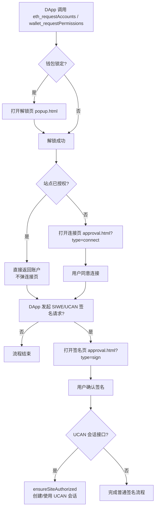

# DApp 连接与 SIWE/UCAN 授权流程

本文基于当前代码实现说明 DApp 连接钱包、SIWE/UCAN 授权的实际流程。

## 流程总结
- 首次连接：连接页 + SIWE/UCAN 签名页（2 个弹窗，若已解锁）。
- 以后再进：如果站点已授权，只剩 SIWE/UCAN 签名页。
- 如果钱包锁了：会先出现解锁页（已解锁则跳过）。

> 备注：签名页只会在 DApp 发起签名请求时出现（如 SIWE/UCAN 登录消息）。

## 关键逻辑（代码指引）
- 解锁流程：`js/background/unlock-flow.js`
- 连接授权：`js/background/account-handler.js`（`handleEthRequestAccounts`）
- 请求路由：`js/background/request-router.js`
- 授权 UI：`html/approval.html` + `js/app/approval.js`
- UCAN 会话：`js/background/ucan.js`

## 详细流程说明
1. **DApp 请求连接账户**  
   通常调用 `eth_requestAccounts` / `wallet_requestPermissions`。  
   - 若钱包锁定，`request-router` 会先触发 `requestUnlock()` 打开解锁弹窗。  
   - 解锁成功后进入连接流程。

2. **连接授权（Connect 页面）**  
   `handleEthRequestAccounts` 会判断站点是否已授权：  
   - **已授权**：直接返回账户列表，不弹连接页。  
   - **未授权**：打开 `approval.html?type=connect` 让用户确认连接。

3. **SIWE/UCAN 签名（Sign 页面）**  
   DApp 发送 SIWE/UCAN 登录消息（如 `personal_sign` / `eth_sign` / `eth_signTypedData`）时，  
   会打开 `approval.html?type=sign...` 进行签名确认。

4. **UCAN 会话/签名接口**  
   调用 `yeying_ucan_session` / `yeying_ucan_sign` 时，后台会先 `ensureSiteAuthorized`，  
   **未授权会直接报错**，因此必须先完成连接授权。

## 流程图（Mermaid）

