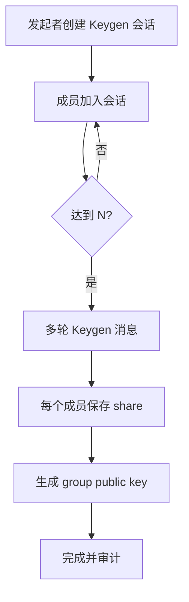
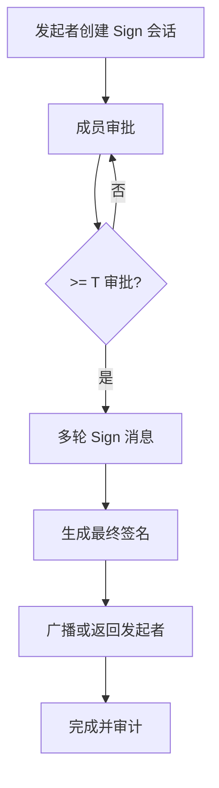
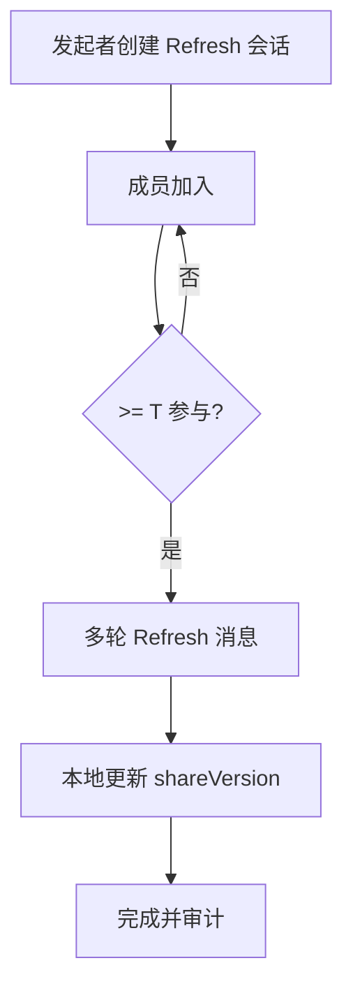
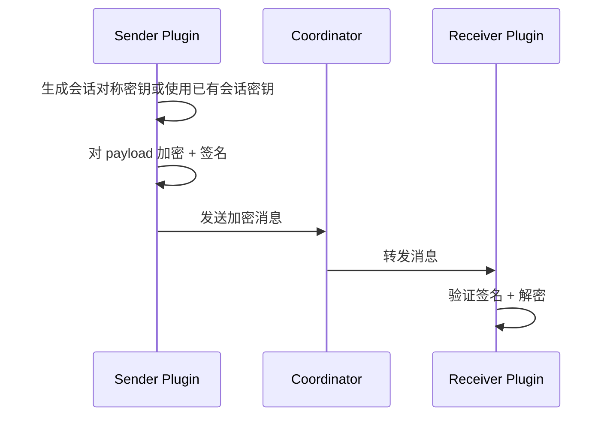

# MPC门限钱包数据设计文档

> 目标：实现 T-of-N 的 MPC 门限钱包，N 个成员分别通过浏览器插件参与签名，达到门限即可生成最终签名并完成交易/消息签名。
> 本文聚焦 **数据结构与流程**，算法可替换（GG18/CGGMP/DKLS 等）。

## 1. 范围与非目标

### 范围
- 门限密钥生成（Keygen）
- 门限签名（Sign）
- 成员管理、阈值策略
- 会话协作与消息编排
- 审计与可追溯记录（不含私密材料）

### 非目标
- 具体 MPC 算法实现细节
- 区块链广播与 Gas 估算优化
- 复杂身份体系/企业 IAM 深度集成

## 2. 角色与组件

**角色**
- **发起者**：创建签名任务/交易的成员。
- **参与者**：持有密钥分片、参与签名的成员。
- **协调器**：中心化服务，负责会话编排、消息转发（优先中心化）。

**客户端组件（插件）**
- UI：会话管理、成员邀请、审批、签名进度。
- Background：密钥分片存储与加解密、消息编排、与协调器通讯。
- Storage：本地持久化（chrome.storage.local + 加密层）。

**服务端组件（可选）**
- **Relay/Coordinator**：WebSocket/HTTP 转发消息与会话状态缓存（中心化优先）。
- 不持有私密材料，仅做路由与队列。

## 3. 已确认设计约束

1) 协调器允许中心化服务（消息转发），优先中心化。  
2) 参与者间消息必须端到端加密。  
3) 支持 Key Refresh（分片刷新，不改变公钥）。  
4) 支持多曲线/多链（secp256k1/ed25519）。  
5) 审计日志支持导出或外部对接。  
6) 协调器鉴权方案：UCAN。  
7) E2E 套件：x25519-aes-gcm。  
8) Refresh 触发策略：手动。  

## 4. 威胁模型与信任边界（摘要）
- 每个成员设备单独保管其密钥分片（share）。
- 协调器不可信，所有会话消息必须端到端加密且具备完整性校验。
- 所有参与者身份与消息签名可验证，防止伪造/重放。
- 可选：成员间 P2P 通道（WebRTC）作为中心化转发的备份方案。

## 5. 核心流程（高层）

### 5.1 Keygen（门限密钥生成）
1) 发起者创建 Keygen 会话，指定阈值 T 与成员 N。  
2) 成员通过邀请加入会话（二维码/链接/会话码）。  
3) 多轮交互完成后：
   - 每个成员保存 **share**（本地加密存储）
   - 生成 **group public key**（共享展示）
4) 会话结束，记录审计条目。

### 5.2 Sign（门限签名）
1) 发起者创建 Sign 会话（交易/消息摘要）。  
2) 达到 T 个成员批准后进入签名多轮。  
3) 生成最终签名，返回给发起者/广播。  
4) 记录审计条目。

### 5.3 Key Refresh（分片刷新）
1) 发起者创建 Refresh 会话（不改变公钥）。  
2) 达到 T 个成员参与后完成刷新多轮。  
3) 每个成员更新本地 share（递增 shareVersion）。  
4) 会话结束，记录审计条目。

## 6. 交互流程图（Mermaid）

### 6.1 Keygen 流程


### 6.2 Sign 流程


### 6.3 Refresh 流程


### 6.4 E2E 消息封装


## 7. 数据模型（核心对象）

> 所有对象均以 JSON 存储；敏感字段用本地加密（AES-GCM + PBKDF2）。

### 7.1 MPCWallet
```json
{
  "id": "mpc_wallet_01",
  "name": "Team Treasury",
  "curve": "secp256k1",
  "chainIds": [1, 137],
  "threshold": 2,
  "participants": ["p1", "p2", "p3"],
  "publicKey": "0x...",
  "address": "0x...",
  "keyVersion": 1,
  "shareVersion": 1,
  "createdAt": 1730000000000,
  "updatedAt": 1730000000000
}
```

### 7.2 Participant
```json
{
  "id": "p1",
  "label": "Alice",
  "deviceId": "dev_a",
  "identity": {
    "type": "did",
    "value": "did:pkh:eth:0xabc..."
  },
  "signingPublicKey": "ed25519:base64(...)",
  "e2ePublicKey": "x25519:base64(...)",
  "contact": {
    "type": "email",
    "value": "alice@example.com"
  },
  "status": "active",
  "joinedAt": 1730000000000
}
```

### 7.3 KeyShare（本地加密）
```json
{
  "id": "share_p1_mpc_wallet_01",
  "walletId": "mpc_wallet_01",
  "participantId": "p1",
  "curve": "secp256k1",
  "keyVersion": 1,
  "shareVersion": 1,
  "encryptedShare": "base64(...)",
  "kdf": "PBKDF2",
  "cipher": "AES-GCM",
  "createdAt": 1730000000000
}
```

### 7.4 Session（Keygen/Sign/Refresh）
```json
{
  "id": "sess_20250101_abc",
  "type": "sign",
  "walletId": "mpc_wallet_01",
  "threshold": 2,
  "participants": ["p1", "p2", "p3"],
  "status": "active",
  "round": 1,
  "curve": "secp256k1",
  "keyVersion": 1,
  "shareVersion": 1,
  "createdAt": 1730000000000,
  "expiresAt": 1730000600000
}
```

### 7.5 SignRequest
```json
{
  "id": "sign_req_01",
  "walletId": "mpc_wallet_01",
  "sessionId": "sess_20250101_abc",
  "initiator": "p1",
  "payloadType": "transaction",
  "payloadHash": "0x...",
  "chainId": 1,
  "status": "pending",
  "approvals": ["p1"],
  "createdAt": 1730000000000
}
```

### 7.6 MPCMessage（会话消息，端到端加密）
```json
{
  "id": "msg_01",
  "sessionId": "sess_20250101_abc",
  "from": "p2",
  "to": "coordinator",
  "round": 1,
  "type": "sign_round_1",
  "envelope": {
    "enc": "x25519-aes-gcm",
    "senderPubKey": "x25519:base64(...)",
    "nonce": "base64(...)",
    "ciphertext": "base64(...)",
    "signature": "base64(...)"
  },
  "createdAt": 1730000000000
}
```

### 7.7 AuditLog
```json
{
  "id": "log_01",
  "walletId": "mpc_wallet_01",
  "sessionId": "sess_20250101_abc",
  "level": "info",
  "action": "sign-approved",
  "actor": "p2",
  "message": "成员已批准签名",
  "time": 1730000000000
}
```

### 7.8 AuditExportConfig
```json
{
  "id": "audit_export_default",
  "enabled": true,
  "mode": "webhook",
  "endpoint": "https://audit.example.com/hooks/mpc",
  "headers": {
    "Authorization": "Bearer <token>"
  },
  "createdAt": 1730000000000,
  "updatedAt": 1730000000000
}
```

## 8. 本地存储建议（chrome.storage.local）

- `mpcWallets`: `{ [walletId]: MPCWallet }`
- `mpcParticipants`: `{ [participantId]: Participant }`
- `mpcKeyShares`: `{ [shareId]: KeyShare }` (加密内容)
- `mpcDeviceKeys`: `{ [deviceId]: { signingPublicKey, encryptedSigningPrivateKey, e2ePublicKey, encryptedE2EPrivateKey } }`
- `mpcSessions`: `{ [sessionId]: Session }`
- `mpcSignRequests`: `{ [requestId]: SignRequest }`
- `mpcMessages`: `{ [messageId]: MPCMessage }` (可设置短期保留)
- `mpcAuditLogs`: `AuditLog[]`
- `mpcAuditExportConfig`: `AuditExportConfig`
- `mpcAuditExportQueue`: `AuditLog[]` (待导出队列)

## 9. 状态机（简述）

### Keygen
`created -> invited -> ready -> rounds -> completed | failed | expired`

### Sign
`created -> approvals -> rounds -> completed | rejected | failed | expired`

### Refresh
`created -> invited -> rounds -> completed | failed | expired`

## 10. 加密与身份细节

### 10.1 身份
- 默认身份：`did:pkh:eth:<address>` 或 `did:key:<pubkey>`。
- 成员加入会话时必须提供身份与设备指纹（deviceId）。

### 10.2 端到端加密
- 每个设备生成独立的 **E2E 加密密钥对**（推荐 X25519）。
- 会话创建时交换 E2E 公钥，所有会话消息均加密后发送给协调器。
- 会话密钥可由发起者生成并用参与者 E2E 公钥逐个加密分发，或使用 pairwise ECDH + HKDF 派生。
- envelope 中包含：
  - `enc`: 加密套件（固定为 `x25519-aes-gcm`）
  - `senderPubKey`: 发送者 E2E 公钥
  - `nonce` / `ciphertext`
  - `signature`: 发送者对 `ciphertext`/metadata 的签名（抗篡改，使用设备签名密钥）

### 10.3 多曲线/多链
- `curve` 为会话级别参数（secp256k1/ed25519）。
- `chainIds` 允许同一 MPCWallet 覆盖多链地址规则。
- 统一保持：E2E 加密密钥与签名曲线 **解耦**。

### 10.4 Key Refresh
- Refresh 会话只更新 share，不改变 public key。
- shareVersion 自增，用于追踪分片版本。

## 11. 协调器 API 约定（草案）

> 所有请求使用 `Authorization: Bearer <UCAN>`，并校验 `walletId/sessionId` 的访问权限。

### 11.1 创建会话
`POST /api/v1/public/mpc/sessions`
```json
{
  "type": "keygen | sign | refresh",
  "walletId": "mpc_wallet_01",
  "threshold": 2,
  "participants": ["p1","p2","p3"],
  "curve": "secp256k1",
  "expiresAt": 1730000600000
}
```

### 11.2 加入会话
`POST /api/v1/public/mpc/sessions/{sessionId}/join`
```json
{
  "participantId": "p2",
  "deviceId": "dev_b",
  "identity": "did:pkh:eth:0xabc...",
  "e2ePublicKey": "x25519:base64(...)"
}
```

### 11.3 发送消息
`POST /api/v1/public/mpc/sessions/{sessionId}/messages`
```json
{
  "message": {
    "id": "msg_01",
    "from": "p2",
    "round": 1,
    "type": "sign_round_1",
    "seq": 12,
    "envelope": { "enc": "...", "senderPubKey": "...", "nonce": "...", "ciphertext": "...", "signature": "..." }
  }
}
```

### 11.4 拉取消息
`GET /api/v1/public/mpc/sessions/{sessionId}/messages?since=<timestamp>&cursor=<cursor>`

### 11.5 事件流（SSE）
`GET /api/v1/public/mpc/ws?sessionId=<sessionId>&cursor=<cursor>`

### 11.5 会话状态
`GET /v1/mpc/sessions/{sessionId}`

### 11.6 WebSocket 推送
`GET /v1/mpc/ws?sessionId=...`
- 事件类型：`session-update` / `message` / `participant-joined`

**协调器约束**
- 仅转发/缓存加密消息，不做解密。
- 建议设置消息 TTL 与最大缓存条数。
- 建议为消息添加 `seq` 与幂等校验，防止重复与重放。

## 12. 接口草案（插件内部）

### 12.1 UI -> Background
- `MPC_CREATE_SESSION`
- `MPC_JOIN_SESSION`
- `MPC_SEND_MESSAGE`
- `MPC_APPROVE_SIGN`
- `MPC_REFRESH_SHARES`
- `MPC_EXPORT_AUDIT_LOGS`
- `MPC_UPDATE_AUDIT_EXPORT_CONFIG`

### 12.2 Background -> Coordinator
- `createSession`
- `joinSession`
- `sendMessage`
- `fetchMessages`

## 13. 审计与留存

- 审计日志不包含密钥或签名中间值，仅记录事件与元信息。
  - 建议字段：`walletId` / `sessionId` / `action` / `actor` / `time` / `level` / `metadata`
- 可配置保留策略（最大条数/保留天数）。
- 支持导出方式：
  - Webhook（HTTP POST）
  - 本地导出（JSON/CSV）
  - 外部对接（SIEM 或日志平台）

## 14. UI 配置项（设置页）

- **协调器鉴权**：UCAN（默认）
- **端到端加密套件**：x25519-aes-gcm（默认）
- **Key Refresh 触发策略**：手动（默认）

## 15. 关键约束与边界

- 任何签名必须满足：`>= threshold` 成员批准并在线参与。
- 每个成员的 share 必须只在本地解密，严禁上传明文。
- 失败/超时的会话应可安全重试，不影响已存 share。

## 16. 待确认事项

1) Key Refresh 的频率/触发规则（仅手动，是否需要定期提醒）？
2) 审计日志导出方式优先级（Webhook/本地/外部平台）？
