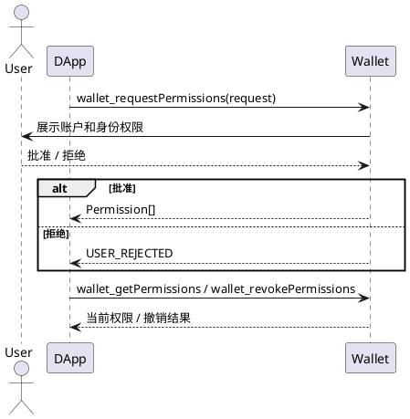

# 钱包权限协议

`wallet_requestPermissions` 用于声明和更新 DApp 权限。权限对象必须明确列出 `eth_accounts` 以及需要的 `wallet_identity.scopes`。Wallet 按权限对象展示确认页面，用户批准后返回权限结果，拒绝返回统一错误码。

身份 scope 和资料出示规则见[钱包身份协议](./钱包身份协议.md)。权限授权不替代 SIWE 登录，权限撤销不代表业务服务端会话自动注销。

