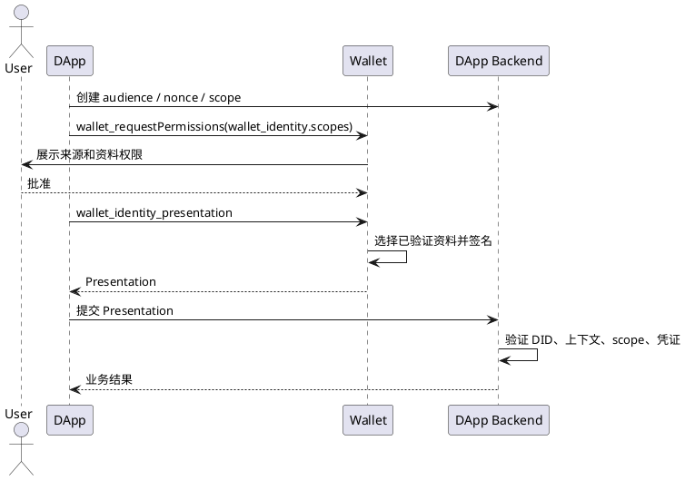

# 钱包身份协议

> 状态：当前规范
>
> 定位：Wallet 提供的独立身份授权和身份出示协议，不依赖 SIWE。

## 1. 适用范围

本协议定义 DApp 如何请求钱包身份资料，以及 Wallet 如何生成面向特定应用的身份出示证明。它可被登录、资料读取、资格确认和高风险操作等业务复用。应用是否使用 SIWE，由应用独立决定。

## 2. 角色

| 角色 | 职责 |
| --- | --- |
| DApp 前端 | 获取 `audience`、`nonce`、`scope`，调用 Wallet Provider，向后端提交结果 |
| Wallet | 展示请求来源和资料范围，获得用户确认，生成身份出示证明 |
| DApp 后端 | 生成一次性请求上下文，验证 Presentation 和凭证 |
| 身份服务 | 签发和维护用户名、邮箱、头像等身份凭证 |

## 3. 标准流程

1. DApp 后端生成一次性 `audience`、`nonce`、`scope` 和有效期。
2. DApp 调用 `wallet_requestPermissions`，声明 `wallet_identity.scopes`。
3. Wallet 展示来源和资料权限，用户确认或拒绝。
4. DApp 调用 `wallet_identity_presentation`。
5. Wallet 按 scope 选择已验证资料，绑定请求上下文并签名。
6. DApp 后端验证 Presentation；业务登录、资料读取或操作授权由应用自行建立。

Wallet 设置中的身份建立流程属于身份服务业务流程：创建/选择 DID、关联账户、完成用户名/邮箱/头像验证并保存凭证。该流程完成后，DApp 只通过本协议请求已验证资料，不参与凭证签发。

### 3.1 Provider API

```ts
type IdentityPresentationRequest = {
  audience: string;
  nonce: string;
  scopes: Array<'identity.basic' | 'identity.wallet' | 'identity.username' | 'identity.email' | 'identity.avatar'>;
  account?: { chainKey: string; address: string };
  issuer?: string;
  issuerEndpoint?: string;
  expiresAt?: string;
};
```

Wallet 通过 `wallet_identity_presentation` 返回 Presentation。`issuerEndpoint` 只用于本地凭证过期时的受控续签，不是每次登录的在线依赖。DApp 必须保存并逐项比较自己的 audience、nonce、scope 和有效期。



## 4. 请求和结果要求

身份请求必须明确：

- `audience`：业务后端的固定标识；
- `nonce`：服务端生成的一次性随机值；
- `scope`：固定资料范围，如 `identity.basic`、`identity.wallet`、`identity.username`、`identity.email`、`identity.avatar`；
- `expiration`：请求和证明的最晚有效时间。

Wallet 返回的 Presentation 至少包含 holder DID、audience、nonce、scope、有效期、身份文档、已验证凭证和钱包地址证明，并由身份 controller 签名。

### 4.1 资料范围

`wallet_identity.scopes` 是本协议唯一的资料授权字段，必须使用以下固定值：

| Scope | 授权内容 |
| --- | --- |
| `identity.basic` | 钱包身份 DID 和身份基础信息 |
| `identity.wallet` | 身份关联的钱包地址证明 |
| `identity.username` | 已验证用户名 |
| `identity.email` | 已验证邮箱 |
| `identity.avatar` | 已验证头像 URI |

Wallet 只能出示用户已明确同意、且身份服务已验证的资料。未验证资料必须拒绝出示并返回明确错误；不得用未验证值填充 Presentation。

## 5. 服务端验证

DApp 后端必须按以下顺序验证：

1. audience 等于当前应用配置的值；
2. nonce 存在、未使用且属于当前登录会话；
3. Presentation 未过期，且 issued-at、expiration 合理；
4. DID 签名有效，签名控制者与 holder DID 一致；
5. scope 完全覆盖业务所需资料；
6. 凭证 issuer、subject、签名和有效期有效；
7. 若包含 `identity.wallet`，验证地址绑定证明；
8. 验证通过后消费 nonce，禁止跨应用或跨请求复用。

验证过程使用部署时配置的身份 issuer/JWKS 或本地信任目录，不应把 Node 在线请求作为每次登录的必要步骤。凭证续期、撤销或信任目录更新属于独立运维流程。

## 6. Presentation 格式

`wallet_identity_presentation` 是面向单一应用的一次性身份出示证明，至少包含：

| 字段 | 含义 |
| --- | --- |
| `version` | Presentation 版本，当前为 `1` |
| `holder` | 钱包身份 DID |
| `audience` | 请求目标应用或后端 |
| `nonce` | 应用生成的一次性随机值 |
| `issuedAt` / `expiresAt` | 出示证明的有效时间窗口 |
| `scopes` | 用户批准且 Wallet 实际出示的资料范围 |
| `identityDocument` | 身份 DID 文档及 controller 公钥 |
| `credentials` | 与 scope 对应的已验证凭证；`identity.wallet` 必须包含 Node 签发的 `WalletAccountCredential` |
| `walletProof` | `identity.wallet` 请求时的地址绑定证明 |
| `proof` | 身份 controller 对规范化 Presentation 的 Ed25519 签名 |

签名覆盖除 `proof` 外的全部字段。服务端必须使用 DID 文档中的 controller 公钥验证签名，并拒绝字段缺失、scope 超额、签名无效、过期或上下文不匹配的 Presentation。

## 7. 用户界面要求

- 未请求身份 scope 时，不显示身份资料权限。
- 请求身份 scope 时，在连接请求页直接列出用户名、邮箱、头像等具体权限。
- 用户拒绝资料权限时，Wallet 返回明确错误；DApp 不得把拒绝伪装成普通登录成功。
- Wallet 锁定时先要求解锁，解锁成功后继续原请求。
- Wallet 不负责展示业务登录成功页面，由 DApp 自己展示业务结果。

错误码、错误结构、用户提示、DApp 处理建议和重试规则统一见[钱包错误码](./钱包错误码.md)。

## 8. 安全边界

Presentation 是面向特定应用的一次性身份证明，不是长期登录令牌、UCAN 能力令牌或 Node 会话。DApp 不得复用其他应用的 Presentation，不得跳过 audience、nonce、scope 和凭证有效期校验。

相关协议：[钱包权限协议](./钱包权限协议.md)、[SIWE 登录协议](./SIWE登录协议.md)。
