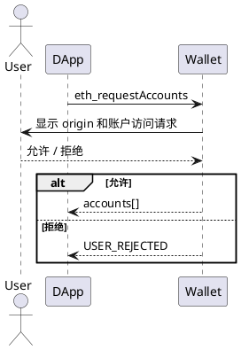

# 钱包连接协议

> 状态：当前规范

## 1. Provider 接口

Wallet 对 DApp 暴露标准 EIP-1193 Provider。所有调用必须通过 `provider.request({ method, params })`，并使用标准的 Promise 响应和错误对象格式。应用不得读取钱包内部存储或绕过 Provider 调用插件内部接口。

常用标准方法包括：

- `eth_accounts`：读取已授权的当前账户；
- `eth_requestAccounts`：请求账户连接和 `eth_accounts` 权限；
- `eth_chainId`：读取当前链；
- `personal_sign`、`eth_signTypedData_v4`：请求用户签名；
- `eth_sendTransaction`：请求用户确认并发送交易。

Wallet 扩展方法也必须遵守 EIP-1193 的请求、响应和错误结构，例如 `wallet_requestPermissions`、`wallet_getPermissions`、`wallet_revokePermissions` 和 `wallet_identity_presentation`。扩展方法的业务语义分别见对应协议。

## 2. 账户连接流程

DApp 使用标准 `eth_requestAccounts` 请求账户连接。Wallet 展示来源、请求账户和用户可见的权限，用户确认后返回账户地址；拒绝返回 `USER_REJECTED`。连接授权可在网站管理中撤销。

连接账户不等于登录，也不等于签名或身份资料授权。需要登录时，DApp 必须继续执行 [SIWE 登录协议](./SIWE登录协议.md) 或钱包身份协议；需要身份资料时，必须明确请求资料范围。

## 3. 事件和错误

Provider 应按 EIP-1193 发出 `accountsChanged`、`chainChanged`、`connect` 和 `disconnect` 事件。账户切换或连接撤销后，DApp 不得继续使用旧账户上下文。

连接请求失败时返回结构化错误，常见错误包括 `USER_REJECTED`、`WALLET_LOCKED` 和 `WALLET_POPUP_OPEN`。具体错误码见[钱包错误码](./钱包错误码.md)。
