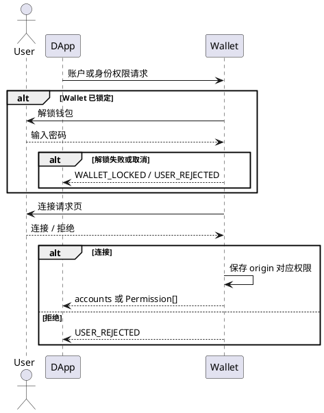
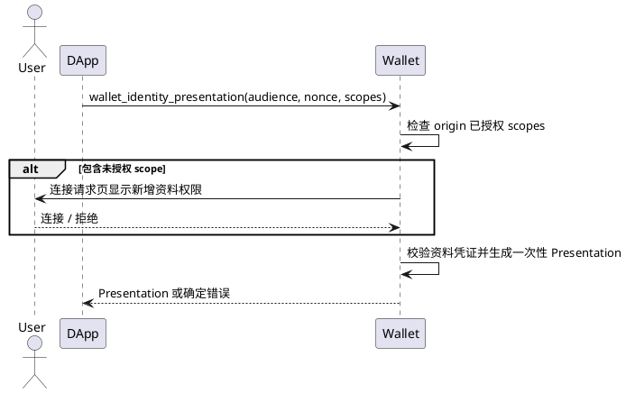

# 连接授权页面规范

> 状态：当前 Wallet UI 规范

本文定义 DApp 请求账户连接和 Wallet Identity 资料权限时，Wallet 审批窗口的页面内容、交互顺序和状态处理。Provider 方法、权限对象和错误结构分别见[钱包连接协议](../协议规范/钱包连接协议.md)、[钱包权限协议](../协议规范/钱包权限协议.md)、[钱包身份协议](../协议规范/钱包身份协议.md)和[钱包错误码](../协议规范/钱包错误码.md)。

## 1. 页面职责

连接授权页只负责让用户确认站点可以访问哪些 Wallet 能力：

- 读取已批准的钱包账户；
- 请求余额查询和后续签名；
- 读取用户明确批准的 Wallet Identity 资料范围。

连接授权不等于登录、签名、交易确认或 UCAN 能力委托。Wallet 不得因为站点完成连接而自动执行 SIWE、生成身份出示证明、签发 UCAN 或建立 DApp 业务会话。

## 2. 请求到页面的映射

| Provider 请求 | 是否打开连接授权页 | 用户确认结果 |
| --- | --- | --- |
| 首次 `eth_requestAccounts` | 是 | 批准站点读取当前账户 |
| 已有账户权限的 `eth_requestAccounts` | 否 | 直接返回已批准账户 |
| `wallet_requestPermissions({ eth_accounts: {} })` | 是 | 授予或更新账户权限 |
| `wallet_requestPermissions({ wallet_identity: { scopes } })` | 请求包含未授权 scope 时打开 | 授予请求中的身份资料 scope |
| 同时请求 `eth_accounts` 和 `wallet_identity` | 是，合并为一个连接授权页 | 一次批准账户权限和身份 scope |
| `wallet_identity_presentation` | 仅缺少 scope 时打开 | 补充 scope 授权后生成 Presentation |
| SIWE、普通消息签名、EIP-712 | 否 | 使用签名审批页 |
| 交易、添加网络、添加通证 | 否 | 使用对应审批页 |

同一 Provider 请求只能产生一个连接授权结果。用户批准全部请求权限，或拒绝整个请求；当前页面不提供逐项勾选。

## 3. 页面结构

### 3.1 页头

页头必须显示：

- 标题“连接请求”；
- 发起请求的站点 origin；
- 明确的网站来源标识。

Wallet 以浏览器提供的 origin 作为安全边界。网站名称和图标只能作为辅助信息，不能替代 origin，也不能由请求参数覆盖 origin。

### 3.2 权限列表

账户连接请求显示以下能力：

- 查看账户地址；
- 查看账户余额；
- 后续发起链下签名请求。

后续签名仍须经过独立签名审批。连接页上的“请求链下签名”不代表用户已经批准任何具体消息。

请求 `wallet_identity.scopes` 时，在同一权限列表追加身份资料项：

| Scope | 页面文案 | 返回内容边界 |
| --- | --- | --- |
| `identity.basic` | 读取钱包身份 | holder DID 和身份基础信息 |
| `identity.wallet` | 读取钱包账户证明 | DID 与钱包地址的绑定证明 |
| `identity.username` | 读取已验证用户名 | 有效 UsernameCredential 覆盖的用户名 |
| `identity.email` | 读取已验证邮箱 | 有效 EmailCredential 覆盖的邮箱 |
| `identity.avatar` | 读取已验证头像 | 有效 AvatarCredential 覆盖的头像 URI |

未请求的 scope 不得显示，也不得保存为已授权权限。`identity.wallet` 是身份与地址的绑定证明，不等于 EIP-1193 的 `eth_accounts` 权限。

### 3.3 页脚

页脚固定显示：

- “只连接您信任的网站”风险提示；
- “拒绝”按钮；
- “连接”按钮。

正文可以滚动，页头和页脚保持可见。两个操作按钮位于同一行，拒绝为次要操作，连接为主要操作。提交期间两个按钮均禁用，防止重复响应。

## 4. 解锁和审批顺序

钱包锁定时，解锁是当前 Provider 请求的前置步骤，不是独立授权：

解锁成功后必须继续原请求，不能要求 DApp 重新发起。连接批准后审批窗口关闭，不显示 Wallet“连接成功”页；业务登录结果由 DApp 展示。

## 5. Wallet Identity 出示

`wallet_identity_presentation` 使用已经批准的身份 scope：

Presentation 不设置第二个确认页。站点权限与单次证明的边界如下：

- scope 权限按 origin 保存，可以在后续请求中复用；
- Presentation 必须绑定当前请求的 `audience`、`nonce`、scope 和有效期；
- 每次登录使用新的 nonce 和 Presentation；
- 其他 origin、其他 audience 或旧 nonce 不能复用已有 Presentation；
- 请求资料未验证、凭证过期或 scope 不足时返回错误，不降级返回部分资料。

## 6. 重复请求和权限扩大

- 已有账户权限时，`eth_requestAccounts` 直接返回已批准账户。
- 已批准全部请求 scope 时，不重复显示连接页。
- 请求新增身份 scope 时，只显示本次请求声明的完整 scope 集合，并在批准后合并到该 origin 的已有权限。
- 同一 origin 已有连接审批进行中时，后续重复请求返回请求处理中错误，不能打开多个重叠审批窗口。
- 账户权限或身份 scope 被撤销后，下一次请求重新显示连接页。
- 权限撤销只影响 Wallet Provider 权限，不自动注销 DApp 服务端会话。

## 7. 页面状态

| 状态 | 页面行为 |
| --- | --- |
| 加载请求 | 操作按钮不可用，加载完成后显示确定内容 |
| 等待用户 | 权限列表完整可见，允许滚动查看 |
| 正在提交 | 禁用全部按钮和输入，禁止重复提交 |
| 用户拒绝 | 关闭窗口并返回 `USER_REJECTED` |
| 用户关闭窗口 | 按拒绝处理，不保存任何新增权限 |
| 请求超时 | 关闭审批并返回超时错误 |
| 请求数据无效 | 不显示可批准页面，返回参数错误 |
| Service Worker 重启 | 恢复待处理请求，或明确失败；不得静默批准 |

当审批队列中已有后续签名请求时，连接页可以提示“连接后继续签名确认”，但不能把连接按钮描述成已经批准后续签名。

## 8. 安全和隐私要求

- origin、请求方法和 scope 必须来自后台规范化后的请求对象。
- 页面不得显示助记词、私钥、钱包密码、完整凭证令牌或内部存储对象。
- 身份权限必须使用固定 scope 和固定中文文案，不能直接渲染 DApp 提供的 HTML。
- 用户拒绝后不得返回账户、部分身份资料或空壳成功结果。
- 普通账户连接不得附带身份资料；身份权限不得隐式升级为 SIWE 或 UCAN。
- 页面文本不能代替 Provider 错误码，DApp 必须按标准错误结构处理失败。

## 9. 验收条件

1. 首次账户连接只出现一个连接请求页；锁定时先出现解锁页。
2. 账户权限和身份 scope 同时请求时，全部内容在同一个连接页展示，只确认一次。
3. 未请求身份 scope 时，页面不出现用户名、邮箱或头像权限。
4. 用户拒绝或关闭窗口后，站点权限没有变化，Provider 返回拒绝错误。
5. 已授权 scope 的 Presentation 请求不重复显示连接页，并返回绑定新 nonce 的证明。
6. 扩大 scope 时重新显示连接页；拒绝后不得生成降级 Presentation。
7. 连接完成后 Wallet 关闭审批窗口，不显示额外成功页。
8. SIWE、消息签名和交易继续使用各自审批页，不被连接授权代替。

完整浏览器用例见[钱包登录验收标准](../钱包测试/登录验收标准.md)。
