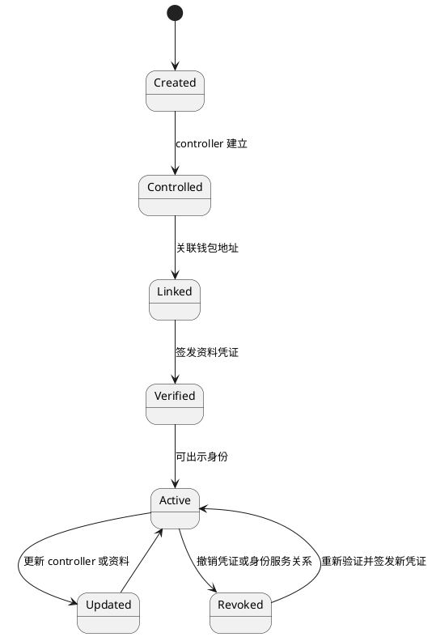

# 身份生命周期

身份创建、controller 更新、地址关联、资料验证、凭证撤销和恢复必须保留审计记录。地址丢失不应自动删除 DID；恢复 controller 才能恢复身份控制权。

## Controller 和恢复策略

当前管理策略为 1-of-1：初始 `wallet_key` 具备 authentication、assertion 和 manage 用途，并生成独立 `recovery_key`。新增控制器需要当前 manage controller 签名和持有证明；替换或移除 manage controller 延迟 24 小时生效，恢复密钥可在延迟期取消。恢复完成后必须轮换旧控制器和 recovery key，且不能移除最后一个 manage controller。

Passkey、MPC 和硬件钱包可以作为认证或断言控制器，但不承担唯一恢复责任。

## 用户名策略

用户名在单一 issuer 命名空间内唯一，标准形式为 `<username>@<issuer-host>`。Wallet 默认展示短名，跨 issuer 或冲突时展示全名。用户名规范化后使用小写字母、数字、点、下划线和连字符，长度 3-32，首字符为字母或数字；不得从邮箱、地址、DID 或应用昵称自动生成。
