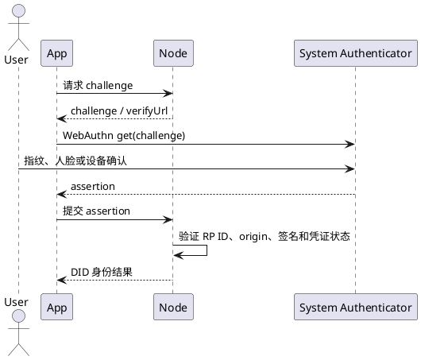
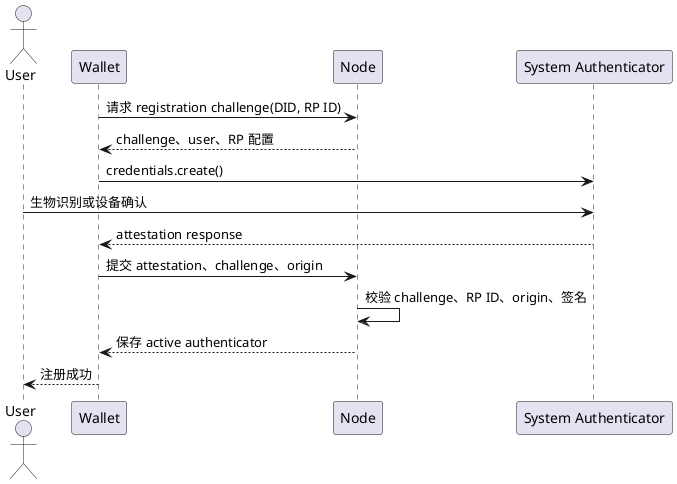
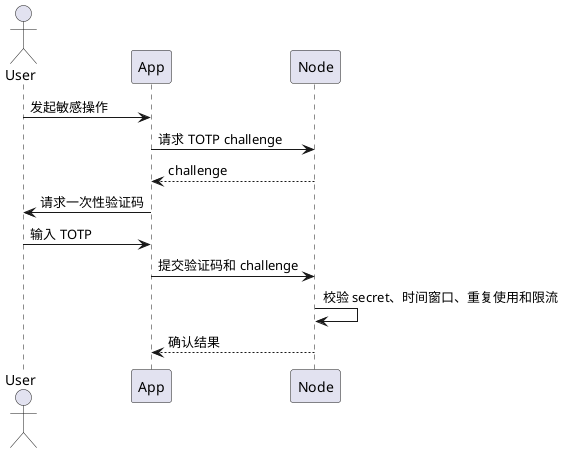
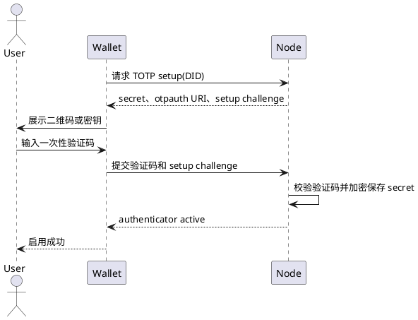

# 身份认证器

本文定义绑定到 Wallet Identity DID 的认证器，以及它们在无 Wallet 插件登录和敏感操作确认中的使用方式。不定义身份 DID、资料凭证或业务登录会话。

## 认证器对象

```text
Wallet Identity DID
    └── Authenticator
        ├── kind: passkey | totp
        ├── credentialId 或 secretRef
        ├── publicKey 或加密 secret
        ├── rpId / origin（Passkey）
        ├── status: active | revoked
        └── createdAt / lastUsedAt
```

认证器记录必须绑定身份 DID，并拥有独立标识和状态。Passkey 保存 credential ID、公钥、RP 约束和计数器；TOTP 只保存服务端加密的 secret 引用，明文 secret 不进入身份文档、DApp 或日志。

## 1. Passkey/WebAuthn

注册和认证必须校验 challenge、RP ID、origin、用户验证状态和凭证状态。Wallet 插件内流程使用插件 origin；无插件流程使用身份服务页面 origin。一个凭证只能注册一次，撤销后不得继续认证。

WebAuthn 注册生成密钥对，私钥留在系统认证器，Node 仅保存公钥和 credential ID。浏览器返回的 origin 必须精确匹配允许来源；RP ID 通常为域名，开发环境可使用 `localhost`。Wallet 插件不是 WebAuthn RP，Node 是 RP；插件调用时 origin 为 `chrome-extension://<extension-id>`，Node 授权页调用时 origin 为 Node 页面地址。

Node 只接受自身 origin 或已发布 Wallet 应用中明确登记的插件 origin，不接受路径差异或未登记来源。

Node 的注册、列表、撤销和无插件授权接口分别使用 registration request/confirm、list、revoke 以及 authorize request/challenge/approve/exchange。注册和撤销还必须先取得 Wallet Identity 动作 challenge，由 controller 对 action、audience、payload hash、nonce 和有效期签名；DID Document 自身的长期签名不能代替本次操作授权。

接口路径：

```text
POST /api/v1/public/identity/passkeys/register/request
POST /api/v1/public/identity/passkeys/register/confirm
POST /api/v1/public/identity/passkeys/list
POST /api/v1/public/identity/passkeys/revoke
POST /api/v1/public/identity/authorize/request
POST /api/v1/public/identity/authorize/challenge
POST /api/v1/public/identity/authorize/approve
POST /api/v1/public/identity/authorize/exchange
```

Passkey 的典型流程：



无 Wallet 插件时，应用直接使用身份服务的 WebAuthn 验证入口；Wallet 插件内的 Passkey 管理则使用 Wallet 身份设置页面。

无插件登录由 DApp 后端创建 Node 授权请求，用户在 `verifyUrl` 使用已注册 Passkey 完成 challenge，Node 验证后通过 PKCE exchange 返回 DID 和允许的身份资料。该流程不依赖 Wallet Provider，也不把地址作为身份主键。

### Passkey 注册



重复 credential ID 必须返回已注册错误；注册失败不得创建半成品记录。

## 2. TOTP

TOTP 仅作为身份高风险确认器，服务端必须校验密钥、时间窗口、重复使用和失败限流。认证器绑定身份 DID，不绑定单个钱包地址。

TOTP 生命周期由 setup、confirm、verify、status 和 revoke 组成：setup 创建 pending secret，confirm 使用首次验证码激活，verify 只接受 active 认证器，revoke 立即失效。setup/revoke 必须使用一次性 Wallet Identity 动作授权；身份文档的 manage proof 只用于验证 controller 公钥。secret 仅在 setup 响应中返回 Wallet，Node 持久化密文。

接口路径：

```text
GET  /api/v1/public/identity/totp/status
POST /api/v1/public/identity/totp/setup
POST /api/v1/public/identity/totp/confirm
POST /api/v1/public/identity/totp/verify
POST /api/v1/public/identity/totp/revoke
```

典型敏感操作流程：



### TOTP 注册



TOTP secret 只在注册确认阶段返回 Wallet；Node 必须加密保存，备份和日志不得包含明文 secret。撤销后原 secret 立即失效，重新注册必须生成新 secret。

Wallet Identity 认证器的共同规则：认证器绑定 DID；撤销后不能继续使用；认证成功只证明认证器控制权，业务服务仍须独立校验会话、scope 和操作权限。
