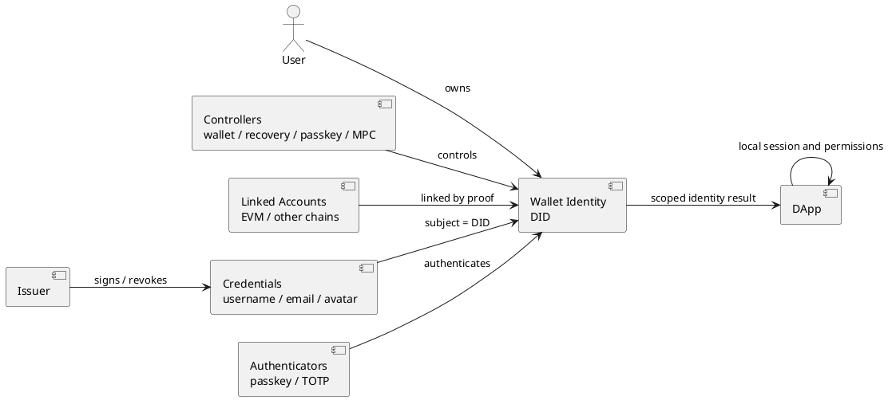

# 钱包身份模型

> 状态：当前身份模型基线。

本文只定义 Wallet Identity 的核心对象、关联关系、生命周期和安全不变量。协议调用、认证器实现、应用接入和测试分别由关联文档维护。

## 1. 核心结论

钱包身份是跨 Wallet、Node 和 Web3 应用使用的稳定身份主体。身份主键是 Wallet 生成的 DID：

```text
did:yeying:wid_<base64url-random>
```

DID 不由钱包地址、邮箱、用户名、助记词或 Node 数据库 ID 派生。Wallet 控制身份密钥，Node 和应用只能验证和引用该 DID。

## 2. 对象关系

| 对象 | 主键或形式 | 所有者 | 模型职责 |
| --- | --- | --- | --- |
| 钱包身份 | `did:yeying:wid_*` | 用户 | 跨设备、跨应用的长期身份主体 |
| 身份控制器 | 公钥、钱包密钥、Passkey、MPC 或恢复密钥 | 用户 | 控制身份文档、签名和恢复操作 |
| 链账户 | `chainKey + address` | 用户 | 可关联或移除的链账户，不等于身份 |
| 账户关联证明 | 身份 controller proof + 账户控制 proof | 用户 | 证明链账户属于某个 DID |
| Issuer | `did:web:*` 或受信 HTTPS issuer | 验证服务 | 签发、更新和撤销资料凭证 |
| 身份凭证 | compact JWS JWT-VC | 用户持有，issuer 可撤销 | 按 scope 出示已验证资料 |
| 身份认证器 | Passkey、TOTP 等 | 用户设备或认证服务 | 证明用户控制认证器 |
| DApp 用户 | DApp 自有 `localUserId` | DApp | 保存业务会话和业务权限 |

```text
Wallet Identity DID
    ├── controller / recovery controller
    ├── 一个或多个链账户关联证明
    ├── UsernameCredential
    ├── EmailCredential
    ├── AvatarCredential
    └── Passkey / TOTP 认证器
```

对象关系图：



- 钱包地址是经过验证的关联账户，不是身份主键。
- 用户名、邮箱和头像是 issuer 签发的可验证凭证，不是身份主键。
- Passkey 和 TOTP 是身份认证器，不是独立身份主体。
- 一个 DID 可以关联多个地址、多个凭证和多个认证器。
- 不同 DID 必须保持独立，Wallet 不自动合并身份。

## 3. 身份文档和控制器

身份 DID Document 声明 DID、controller、公钥用途和 revision。controller 负责身份文档更新、Presentation 签名和恢复授权。文档签名、版本冲突和公钥用途见[身份文档规范](./身份文档规范.md)。

## 4. 地址和凭证关联

地址关联必须包含链标识、地址、DID、一次性 nonce 和可验证 proof。地址变更不改变 DID，也不使其他凭证失效。凭证 subject 必须是 DID，issuer、签名、有效期和撤销状态必须可验证，详见[身份凭证规范](./身份凭证规范.md)。

### 链账户关联

`chainKey` 是完整命名空间，不得只使用数字 chain ID，推荐使用 CAIP-2 或等价形式，例如 `eip155:1`。将账户加入身份必须同时证明身份 controller 同意和新账户控制者拥有该地址。关联 proof 必须绑定 DID、chain、address、用途、一次性 nonce 和有效期。EVM 使用 EIP-191，其他链使用对应原生签名域。

当前 Node 账户关联接口为：

```text
POST /api/v1/public/identity/account-links/challenge
POST /api/v1/public/identity/account-links/verify
```

当前实现支持 EVM `eip155:<chainId>`；其他链必须使用独立适配器，不能复用 EIP-191。

## 5. 认证器定位

认证器用于证明用户控制某个身份认证设备：

- Passkey/WebAuthn 支持无 Wallet 插件身份登录和高风险确认。
- TOTP 用于敏感操作的二次确认。
- 认证器绑定 DID，不绑定单个钱包地址。
- 认证器注册、验证、撤销和 RP/origin 规则见[身份认证器](./身份认证器.md)。

## 6. 身份生命周期

```text
创建 DID
  -> 建立 controller
  -> 关联链账户
  -> 签发并验证资料凭证
  -> 注册认证器
  -> 向应用出示身份
  -> 更新、撤销或恢复
```

身份恢复依赖 recovery controller 或明确的恢复材料。丢失日常钱包地址不应删除 DID；恢复 controller 后可以重新建立地址关联。生命周期细节见[身份生命周期](./身份生命周期.md)。

## 7. 安全不变量

1. DID 是唯一跨系统身份主键。
2. 地址、邮箱、用户名和认证器不能单独替代 DID。
3. 凭证必须绑定 DID，并验证 issuer、签名、有效期和状态。
4. Presentation 必须绑定 audience、nonce、scope 和有效期。
5. Wallet、Node、DApp 各自验证自己负责的边界，不共享私钥或长期秘密。
6. 恢复和撤销不能通过单个普通地址绕过 controller 安全策略。

## 8. 文档边界

- [身份文档规范](./身份文档规范.md)：DID Document、controller 和 revision。
- [身份凭证规范](./身份凭证规范.md)：issuer、JWT-VC、JWKS 和凭证状态。
- [身份认证器](./身份认证器.md)：Passkey、WebAuthn 和 TOTP。
- [钱包身份协议](../协议规范/钱包身份协议.md)：Wallet Provider 身份授权和 Presentation。
- web3-bs 的钱包身份登录接入：应用 session、SDK 调用和后端登录流程。
- `docs/钱包测试/`：跨仓库测试向量和验收标准。
