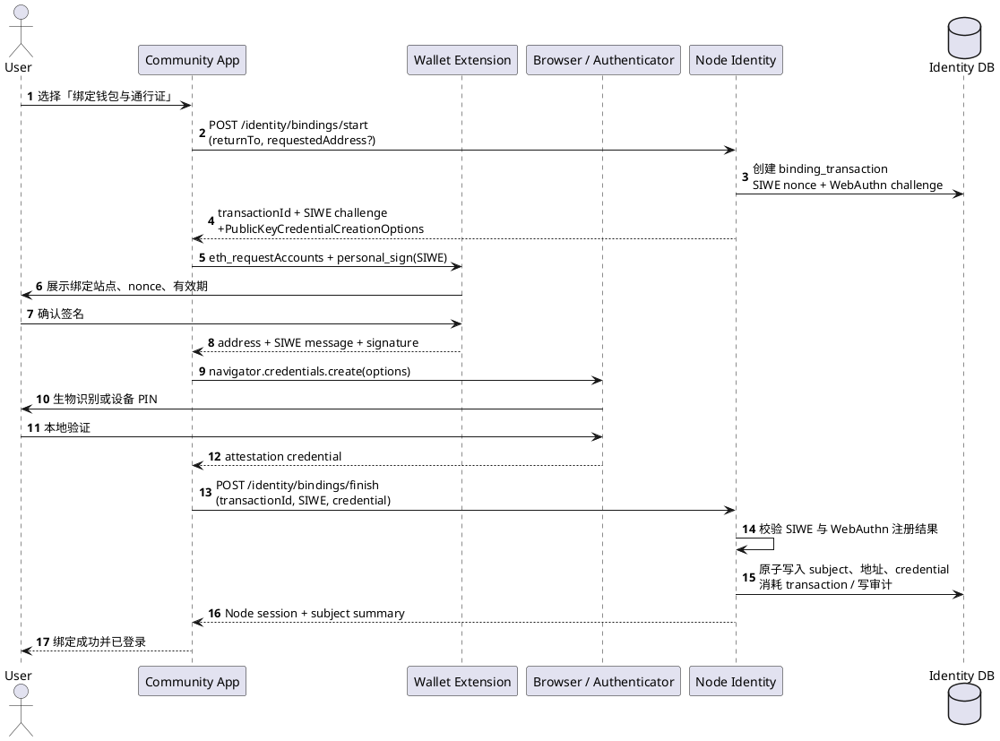
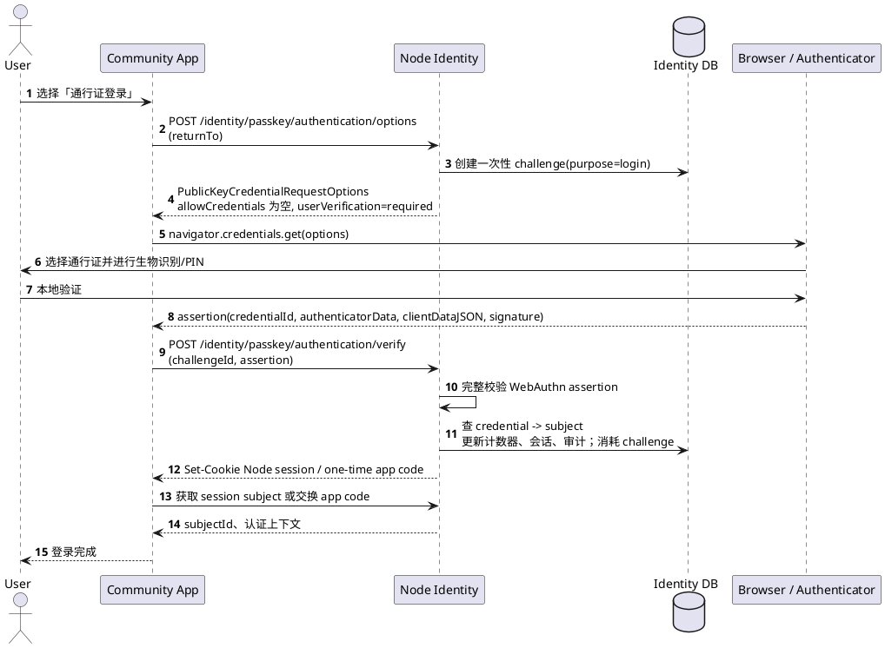
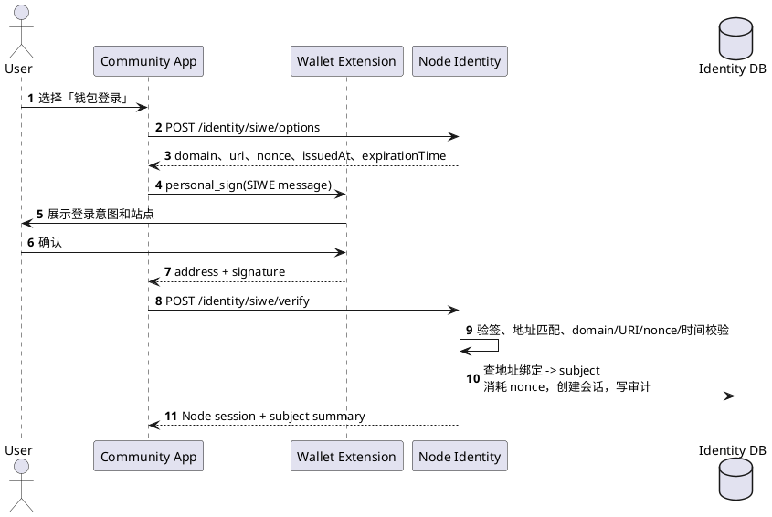
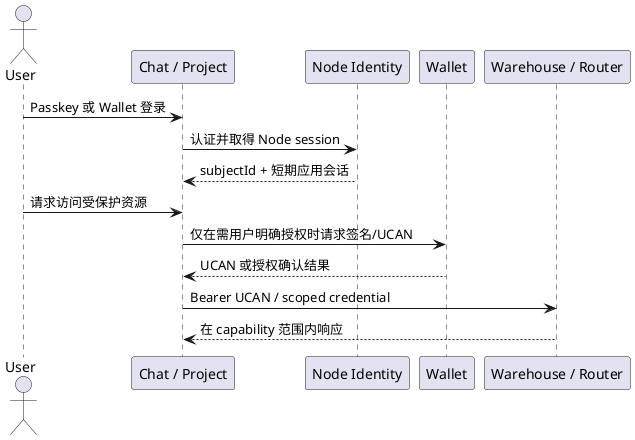
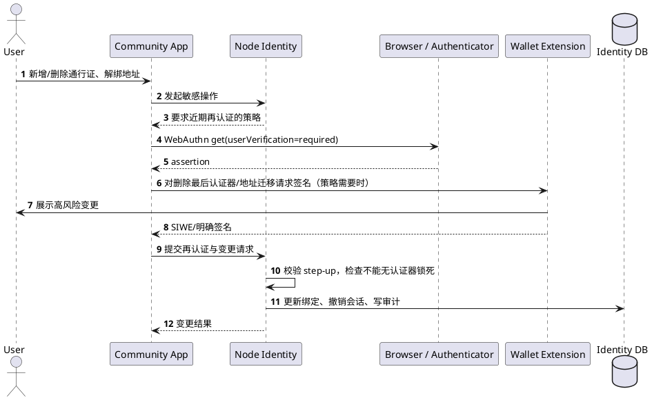

# 通行证登录方案

> 状态：提案
>
> 适用版本：跨系统目标方案；Wallet `1.4.18` 尚未提供通行证登录
>
> 目标读者：Wallet、Node Identity、Chat、Project 和安全架构维护者
>
> 目标：让已绑定钱包地址的社区用户在未安装或未启用 Wallet 浏览器插件时，仍能以同一社区身份安全、低摩擦地登录 Node、Chat、Project 等社区应用。
>
> 关联文档：[文档中心](./README.md) · [SIWE 协议说明](./SIWE协议说明.md) · [UCAN 协议说明](./UCAN协议说明.md) · [钱包架构 V2](./钱包架构V2.md)

## 1. 结论与范围

本方案中的“通行证”是 **WebAuthn/FIDO2 passkey**，不是密码、助记词、UCAN，也不是可直接签署 EVM 交易的私钥。

它作为同一社区身份的另一种认证器：

```text
社区主体 subjectId
  ├── 钱包认证器：Ethereum 地址 + SIWE 签名
  └── 通行证认证器：WebAuthn credential 公钥
```

用户首次以 Wallet 完成地址控制证明并创建通行证；以后可任选一种认证器登录。两种路径都由 Node 映射到相同的 `subjectId`、组织成员关系和业务权限。

本方案只处理“认证，即谁在登录”。登录后的细粒度服务授权仍使用 UCAN 或服务侧的短期 scoped credential：

- SIWE：证明控制某一 Ethereum 地址。
- Passkey：证明控制已绑定通行证的设备/系统凭据。
- Node session：向社区应用表达已认证的 `subjectId`。
- UCAN：向 Router、Warehouse、Agent 等资源服务表达受限、可过期、可撤销的能力。

不在本方案范围内：将 passkey 直接用于 EOA 链上交易签名、托管 Wallet 私钥、用邮箱重置替代高价值身份恢复，或让业务应用各自保存 WebAuthn 凭据。

## 2. 角色与数据归属

| 组件 | 拥有的事实 | 必须做的事 | 不应做的事 |
| --- | --- | --- | --- |
| 浏览器/操作系统认证器 | 通行证私钥、生物识别或设备 PIN 的本地验证 | 创建和使用 WebAuthn credential | 向网页、插件或服务端导出私钥 |
| Node Identity | `subjectId`、地址绑定、credential 公钥、challenge、会话、撤销和审计 | 完成 WebAuthn/SIWE 校验，签发登录会话 | 保存 Wallet 私钥或业务权限副本 |
| Wallet | 地址控制证明、签名、用户侧高风险确认 | 首次绑定、改绑/恢复的 SIWE 或明确签名 | 代替 Node 校验 WebAuthn，保存 passkey 私钥 |
| Chat / Project / Agent 等 Relying App | 自己的业务状态和权限 | 验证 Node 会话，按 `subjectId` 做业务授权 | 自行创建 credential 或相信浏览器传来的地址 |
| Warehouse / Router | 各自的资源与策略 | 校验 UCAN/scoped credential | 用 Node 登录 cookie 直接作为资源操作凭据 |

Node 是唯一 WebAuthn Relying Party（RP）。建议生产环境使用稳定主域，例如 `node.yeying.pub`；所有由 Node 签发会话的子应用必须通过受控回调或同站点 cookie 消费该会话。不能让 `chat.example`、`project.example` 分别注册同一套 passkey，除非它们属于同一注册域并显式使用一致的 RP ID。

## 3. 核心数据模型

以下字段存于 Node 的身份库，均不包含通行证私钥：

```json
{
  "subjectId": "usr_01J...",
  "status": "active",
  "walletBindings": [{
    "address": "0x1234...",
    "chainId": 1,
    "did": "did:pkh:eip155:1:0x1234...",
    "verifiedAt": "2026-08-01T12:00:00Z",
    "state": "active"
  }],
  "passkeys": [{
    "credentialId": "base64url(...)",
    "publicKeyCose": "base64url(COSE_Key)",
    "algorithm": -7,
    "transports": ["internal", "hybrid"],
    "backupEligible": true,
    "backupState": true,
    "signCount": 42,
    "uvCapable": true,
    "createdAt": "2026-08-01T12:01:00Z",
    "lastUsedAt": "2026-08-04T09:30:00Z",
    "state": "active"
  }]
}
```

另存以下短生命周期数据：

| 数据 | 最长寿命 | 绑定字段 | 用途 |
| --- | --- | --- | --- |
| `webauthn_challenge` | 5 分钟，单次使用 | `purpose`、浏览器会话、RP ID、回调地址 | 防重放与流程关联 |
| `binding_transaction` | 10 分钟，单次完成 | Wallet 地址、SIWE nonce、WebAuthn challenge、目标 `subjectId` | 确保地址证明和通行证在同一绑定操作中 |
| `node_session` | 建议 8 小时 idle / 7 天 absolute | `subjectId`、认证方式、认证时间、会话版本 | 社区登录态 |
| `audit_event` | 按合规策略 | subject、credential/address 指纹、IP 风险摘要、结果、requestId | 追踪、撤销和异常响应 |

`credentialId`、COSE 公钥和地址均按规范化形式建立唯一索引。日志只能记录地址和 credential ID 的截断/哈希指纹，不能记录原始 assertion、完整 token、SIWE 签名或 challenge。

## 4. 调用关系

### 4.1 首次绑定：Wallet 地址 + 新通行证

用户已安装 Wallet 时，首次绑定需同时证明“控制该地址”与“控制该通行证”。Node 必须将两份证明收敛到单一、一次性的 `binding_transaction`，不能先孤立地创建一个未归属 credential。



Node 应允许用户在完成 SIWE 后立即注册通行证；也可以先注册通行证、后提交 SIWE，但在两项校验都成功前不能激活 credential 或建立长期登录态。

### 4.2 无插件的发现式通行证登录

推荐使用 discoverable credential（resident key），使用户无需先输入邮箱或地址。浏览器凭 RP ID 展示可用通行证；Node 从 assertion 中的 credential ID 找到对应 `subjectId`。



当浏览器或认证器不支持 discoverable credential，可先让用户输入已验证的账户标识，再由 Node 根据该 `subjectId` 生成 `allowCredentials`。输入的标识只用于缩小候选集合，不能作为认证证据。

### 4.3 原有 Wallet 登录兼容路径



若地址尚未绑定到社区主体，Node 可以引导用户完成新账户创建及通行证绑定；不得仅因某地址曾访问过某 DApp 就把它绑定给当前会话。

### 4.4 跨应用会话与能力授权



Passkey 登录不得被误用成 Warehouse、Router 的全权 bearer token。需要资源权限时，仍由 Wallet/Node 以最小能力、明确 audience、短过期时间签发 UCAN 或 scoped credential。

## 5. WebAuthn 算法与校验细节

### 5.1 注册参数

Node 生成 `PublicKeyCredentialCreationOptions` 时至少应设置：

```json
{
  "challenge": "32 bytes generated by CSPRNG, base64url",
  "rp": { "id": "node.yeying.pub", "name": "YeYing Community" },
  "user": {
    "id": "opaque stable subject handle, <= 64 bytes",
    "name": "non-sensitive internal login label",
    "displayName": "user-selected label"
  },
  "pubKeyCredParams": [
    { "type": "public-key", "alg": -7 },
    { "type": "public-key", "alg": -8 },
    { "type": "public-key", "alg": -257 }
  ],
  "authenticatorSelection": {
    "residentKey": "required",
    "userVerification": "required"
  },
  "attestation": "none",
  "timeout": 300000
}
```

- `challenge` 必须由密码学安全随机数生成器产生，至少 32 字节；服务端只保存其哈希、用途、过期时间和浏览器会话绑定。
- 优先支持 ES256（COSE `-7`）；可按部署环境支持 EdDSA（`-8`）与 RS256（`-257`）。仅接受服务端声明且验证库完整支持的算法，禁止按客户端声明的任意算法验签。
- 默认 `attestation: "none"`，因为日常社区登录不需要设备厂商身份，且可减少设备指纹与隐私成本。只有企业受管设备场景才另行设计 direct/enterprise attestation 验证和信任根。
- `user.id` 是不可猜测的内部 opaque handle，不使用钱包地址、邮箱或用户名，避免认证器把敏感标识同步到用户设备生态。

### 5.2 注册结果校验

Node 对 `navigator.credentials.create()` 的结果必须逐项验证：

1. `clientDataJSON.type` 等于 `webauthn.create`。
2. `clientDataJSON.challenge` 与服务器保存的未使用 challenge 做常量时间比较。
3. `clientDataJSON.origin` 必须精确属于允许 origin 集合（协议、主机、端口均匹配），不能只做后缀或字符串包含判断。
4. 解析 `authenticatorData`，验证 `rpIdHash == SHA-256(expectedRpId)`。
5. 验证 User Present（UP）和 User Verified（UV）标志均为真；本方案拒绝只触摸、不验证用户的 credential。
6. 解析并保存 credential ID、COSE 公钥、算法、AAGUID、transports、backup eligibility/state 和 signCount。
7. 确认 credential ID 未归属其他 active subject；冲突必须显式人工处理，不能悄悄迁移绑定。
8. 消耗 challenge，并和 SIWE 绑定事务一起原子提交。

### 5.3 认证 assertion 校验

认证所签名的字节为：

```text
signedBytes = authenticatorData || SHA-256(clientDataJSON)
signature = Sign(credentialPrivateKey, signedBytes)
```

Node 按 credential 存储的 COSE 公钥和允许算法验证 `signature`，并重复校验：

1. `clientDataJSON.type == "webauthn.get"`。
2. challenge、origin、RP ID hash、UP、UV、过期和单次使用状态。
3. credential 为 active，且可解析至唯一 `subjectId`。
4. assertion 签名对 `signedBytes` 有效。
5. authenticator 的 `signCount`：对于支持单调计数器的认证器，新计数必须大于已存值；降级或重复计数记为高风险事件，可要求二次认证或暂时冻结。对始终返回零的同步 passkey，不能把零本身误判为克隆证据，应记录能力状态并使用其他风控信号。
6. 备份状态、设备/网络异常、短时间大量失败等风险信号进入审计与策略判断，但不能以 IP 变化单独拒绝合法用户。

建议直接使用经过维护、覆盖 CBOR/COSE 与 WebAuthn Level 3 边界条件的服务端库；不得以浏览器回传的 `userHandle`、地址或前端“验签成功”作为身份事实。

## 6. SIWE 与绑定事务的算法细节

绑定用 SIWE 消息至少包含：`domain`、`uri`、`chainId`、Node 生成的 `nonce`、`issuedAt`、`expirationTime`、声明为“绑定/新增通行证”的可读 `statement`，以及关联 `binding_transaction` 的资源标识。

Node 验证 SIWE 时必须：

1. 使用 Ethereum 签名恢复地址，采用链和合约账户兼容的验签路径。
2. 要求恢复地址与消息 address、请求声明地址一致。
3. 精确校验 domain、URI、chain ID、nonce、签发/失效时间与资源引用。
4. 以事务方式消耗 nonce；任一步失败不得留下可用 session、地址绑定或 credential。
5. 不把 SIWE 签名保存为长期登录凭据；只存验证结果和必要的审计摘要。

地址可绑定多个 passkey，passkey 也可用于一个主体关联的多个地址；一个 active credential 不可同时属于不同主体。地址迁移、删除最后一个认证器、增加恢复方法属于高风险变更。

## 7. 会话设计

Node 推荐使用服务端 opaque session 或短期签名 token 加轮换 refresh session。无论形式如何，浏览器会话必须满足：

- Cookie 使用 `Secure`、`HttpOnly`、适当的 `SameSite=Lax` 或 `Strict`、限定 `Path` 和最小 `Domain`；不得把长期 token 放入 localStorage。
- 变更认证器、注销全部设备、检测到 credential 风险时，递增 `sessionVersion`，使所有旧会话失效。
- 登录、绑定、改绑、恢复、授权等 state-changing 请求使用 CSRF 防护；同站 cookie 也不能替代 CSRF 设计。
- 对第三方应用采用一次性、短期 authorization code + PKCE 交换应用会话，或受控后端 token exchange；不要将 Node 根会话 cookie 暴露给任意应用前端。
- 普通登录可维持 8 小时 idle、7 天 absolute 的可用性；查看恢复材料、导出私钥、签发广域 UCAN、改绑和删除认证器必须近期重新认证（passkey UV 或 Wallet 签名）。

## 8. 高风险操作、撤销与恢复

### 8.1 新增/删除通行证与地址解绑



建议策略：新增第二把 passkey只需近期 passkey 再认证；删除最后一把 passkey、解绑唯一钱包地址、修改恢复策略必须同时要求已有 passkey 和 Wallet 地址证明，或进入受控恢复流程。

### 8.2 设备丢失恢复

优先级应为：

1. 另一把已绑定通行证（含硬件安全密钥）。
2. 已绑定 Wallet 的 SIWE 签名，随后注册新通行证，并撤销丢失设备的 credential。
3. 经独立安全设计的恢复联系人/人工审核，带延迟、通知、审计和撤销窗口。

邮箱只能用于通知、找回流程启动和风险提示，不能单独作为高价值账户的认证或立即改绑依据。恢复成功后必须撤销现有会话、记录审计，并通知所有既有通知渠道。

## 9. 威胁与控制措施

| 威胁 | 风险 | 必要控制 |
| --- | --- | --- |
| 钓鱼站点 | 诱导用户在仿冒页登录 | 精确 origin/RP ID 校验；浏览器的 RP 绑定；登录页面不接受复制粘贴签名替代 assertion |
| challenge 重放 | 旧 assertion 被再次提交 | 高熵、单次、短期 challenge；与浏览器会话和 purpose 绑定；服务端事务消耗 |
| CSRF / 登录混淆 | 攻击者把受害者登录到攻击者账户 | state/returnTo allowlist、SameSite cookie、CSRF token、绑定 transaction 与发起浏览器会话 |
| credential 克隆或同步异常 | 不同设备滥用同一凭据 | 记录 signCount 与 backup 状态；计数异常触发 step-up/通知；不要错误拒绝同步 passkey 的零计数 |
| 认证器丢失 | 用户永久失去账户 | 至少两把 credential、硬件备份、Wallet 证明恢复、受控人工恢复 |
| 服务端数据库泄漏 | 公钥和关联关系泄漏 | 不保存私钥或生物数据；加密敏感元数据；最小化日志；凭据与审计访问控制 |
| 会话窃取 | 攻击者复用登录态 | HttpOnly Secure cookie、短期会话、会话轮换、设备列表、注销全端、风险 step-up |
| Wallet 被盗或错误签名 | 地址绑定被恶意改写 | SIWE 的 domain/nonce/expiry 校验；高风险变更要求近期 WebAuthn；变更通知和延迟撤销 |
| RP ID 配置错误 | 认证器被错误域使用或生产不可用 | 将 RP ID 与允许 origin 作为版本化生产配置；发布前用真实域名端到端测试；禁止通配符推断 |

WebAuthn 提升了日常登录对钓鱼和密码泄漏的抵抗力，但不能抵抗已获控制权的用户浏览器恶意脚本、受损操作系统认证器或被盗的已解锁设备。因此高权限操作仍要采用近期再认证、最小授权和可审计撤销。

## 10. API 草案

| Endpoint | 调用方 | 作用 |
| --- | --- | --- |
| `POST /api/v1/identity/bindings/start` | Community App | 创建 Wallet + passkey 绑定事务 |
| `POST /api/v1/identity/bindings/finish` | Community App | 原子校验 SIWE 与注册结果并激活绑定 |
| `POST /api/v1/identity/passkey/authentication/options` | Community App | 获取一次性 WebAuthn assertion options |
| `POST /api/v1/identity/passkey/authentication/verify` | Community App | 校验 assertion 并建立 Node session |
| `POST /api/v1/identity/siwe/options` | Community App | 获取 SIWE nonce 与标准消息字段 |
| `POST /api/v1/identity/siwe/verify` | Community App | 校验 SIWE 并建立 Node session |
| `GET /api/v1/identity/me` | Community App 后端 | 获取当前主体和认证上下文 |
| `POST /api/v1/identity/passkeys` | Community App | 在 step-up 后新增通行证 |
| `DELETE /api/v1/identity/passkeys/{id}` | Community App | 在 step-up 后撤销通行证 |
| `POST /api/v1/identity/recovery/start` | Community App | 启动不改变状态的受控恢复流程 |

所有 finish/verify 接口应返回统一错误码，而不要把“此 credential 是否存在”“该地址是否已注册”等可枚举信息暴露给未认证调用方。接口响应与日志都应带 `requestId`。

## 11. 分期实施与验收

### 第一阶段：安全的单域通行证登录

1. Node 实现 WebAuthn 注册/认证、credential 模型、challenge 存储和 Node session。
2. Wallet 登录仍按现有 SIWE 流程工作；增加首次“SIWE + passkey”原子绑定页面。
3. 支持多个 discoverable passkey、查看最近使用时间、撤销和全部会话退出。
4. 完成真实 Chrome、Safari、Windows Hello、Android/iOS 的端到端测试。

### 第二阶段：跨应用身份分发

1. Chat、Project 等统一接入 Node session 或 authorization code + PKCE。
2. 明确各应用 `returnTo` allowlist、cookie 域与 CSRF 策略。
3. 保持 UCAN/scoped credential 与 Node 登录会话分离。

### 第三阶段：恢复和风险策略

1. Wallet 地址证明恢复、硬件安全密钥备份、变更通知与审计查询。
2. 计数器/设备/会话风险策略和 step-up 规则。
3. 若未来支持智能账户，再另立提案把 passkey 作为合约账户验证器；不得把该能力混入本登录方案。

验收底线：无插件的新浏览器能以已绑定 passkey 登录到原有 `subjectId`；错误 origin、过期/replay challenge、无 UV assertion、SIWE nonce 重放都被拒绝；注销/撤销后旧会话不可继续使用；资源服务不能仅凭 Node 登录 cookie 获得超出授权范围的访问。
