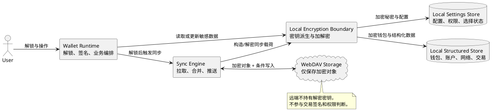
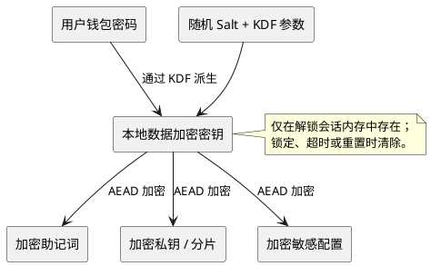
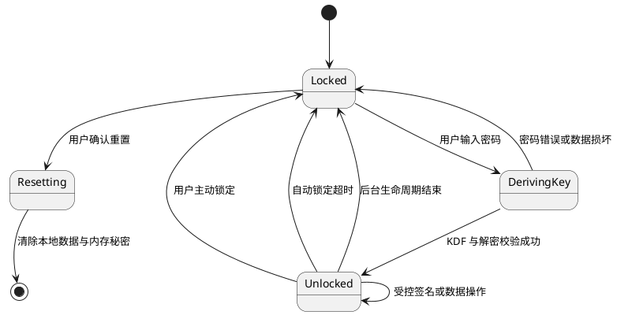
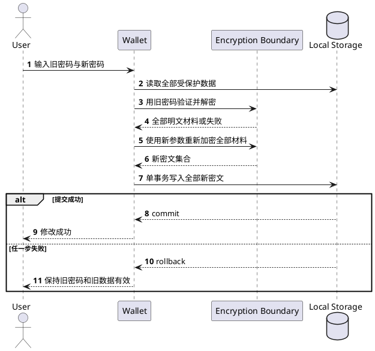
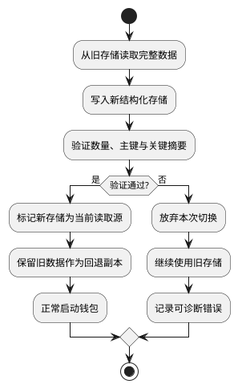
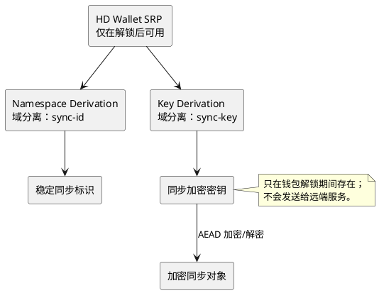
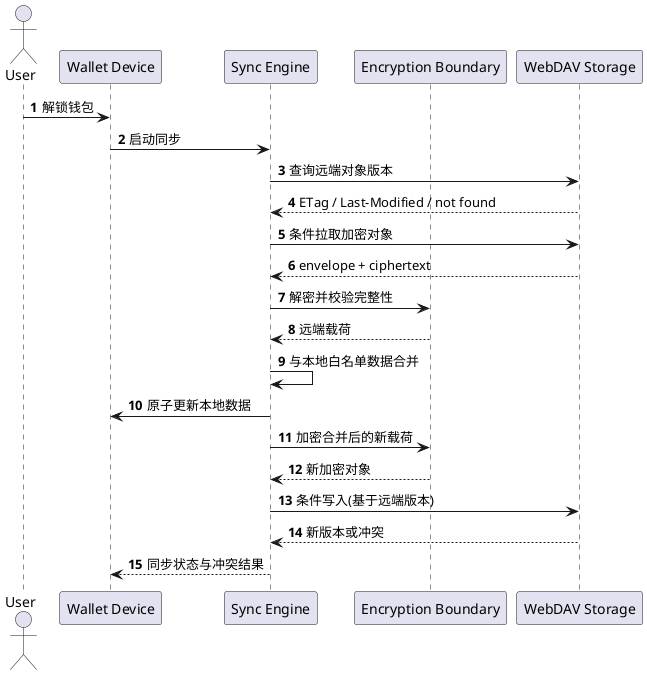
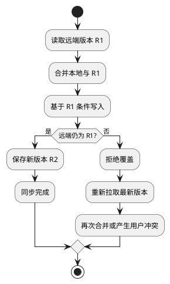
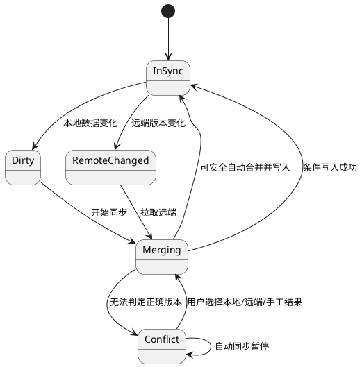

# 钱包存储方案

> 状态：V1 已实现方案与后续演进基线
>
> 适用版本：Wallet `1.4.18`
>
> 目标读者：钱包、安全、备份服务和架构维护者
>
> 目标：说明钱包数据如何在本地安全持久化、如何迁移和回退、哪些数据可以远端同步，以及多设备场景下如何保证机密性、完整性和可恢复性。

## 1. 设计目标

钱包存储首先服务于密钥安全，其次才是性能和多设备体验。

本方案遵循以下原则：

1. 助记词和私钥只以加密形式持久化，解密材料只在用户明确解锁后短期存在于内存。
2. 本地钱包数据是钱包运行的第一事实源，远端备份不参与日常签名决策。
3. 远端服务只保存客户端加密后的数据，不能读取助记词、私钥或用户明文资料。
4. 存储升级必须可验证、可重试、可回退，不允许因迁移失败导致资产不可见。
5. 修改密码、重置钱包等跨数据集合操作必须具备事务语义，不能留下部分成功状态。
6. 多设备同步采用明确的数据白名单，不因为“方便同步”扩大敏感数据范围。
7. 冲突无法自动安全合并时，应暂停写回并交由用户选择。

## 2. 范围与边界

### 2.1 本地保存的数据

| 数据类别 | 示例 | 敏感级别 | 主要要求 |
| --- | --- | --- | --- |
| 核心秘密 | 助记词、私钥、MPC 本地分片 | 极高 | 强加密、最小解密窗口、禁止远端明文 |
| 钱包结构 | 钱包、账户、派生路径、账户索引 | 高 | 与核心秘密一致提交、可迁移和回退 |
| 用户配置 | 当前账户、当前网络、自动锁定、安全设置 | 中 | 启动可快速读取，变更可追踪 |
| 权限与会话 | 已连接站点、资料授权、UCAN 会话元数据 | 中到高 | 可撤销、按站点隔离、过期清理 |
| 业务辅助数据 | 联系人、自定义网络、通证列表 | 中 | 支持同步和冲突处理 |
| 可重建数据 | 余额缓存、网络元数据、临时状态 | 低 | 可过期、可清理，不作为资产事实 |
| 历史与审计 | 交易历史、同步日志、诊断摘要 | 中 | 分页、保留期限、敏感字段脱敏 |

### 2.2 远端同步的数据

允许同步：

- HD 账户数量、账户索引、账户名称和更新时间。
- 联系人名称、备注、地址和更新时间。
- 用户选择的网络标识及更新时间。
- 同步协议版本、完整性元数据和冲突所需时间信息。

禁止同步：

- 助记词、私钥及其可逆等价物。
- 钱包密码、解锁凭据和内存会话密钥。
- MPC 私密分片和设备私钥。
- 已连接站点的长期授权、可直接访问资源的长期令牌。
- 不属于当前同步白名单的新字段。

导入私钥账户不能依赖助记词在其他设备重新派生，因此不进入当前远端同步模型。

## 3. 总体架构

本地存储分为快速配置层和结构化数据层。远端存储是独立的加密备份层，不替代本地运行数据。

### 3.1 本地配置层

本地配置层适合保存数据量小、启动时高频读取、需要浏览器事件通知的状态，例如当前账户、当前网络、安全设置、站点权限和同步状态。

配置层不应承担不断增长的大集合，也不应依靠单个超大对象长期保存所有钱包数据。

### 3.2 本地结构化数据层

结构化数据层保存钱包、账户、网络和交易历史等需要索引、事务和增量读写的数据。

它需要提供：

- 按钱包查询账户。
- 按地址、网络或交易标识查询。
- 钱包与账户跨集合原子更新。
- 数据库版本升级和结构迁移。
- 大数据量下稳定的读取和分页能力。

### 3.3 远端加密备份层

远端层只接收完整的加密对象及必要的非敏感协议元数据。服务端可以提供对象保存、版本、条件写入和访问控制，但不能解密钱包内容，也不能代表用户合并数据。

## 4. 本地加密边界

### 4.1 密钥层次

钱包密码用于派生本地加密密钥，不直接作为链上密钥，也不应被持久化。

加密算法必须同时提供机密性和完整性。每份密文使用独立随机 nonce，并保存算法版本、KDF 参数和 salt，以支持未来升级。

### 4.2 解锁生命周期

锁定后应清除派生密钥、明文助记词、明文私钥、同步密钥以及所有能直接完成签名的临时材料。页面状态和普通配置不应被误认为钱包仍处于解锁状态。

## 5. 数据一致性与原子操作

### 5.1 修改密码

修改密码会同时影响同一钱包下的助记词、账户私钥和其他受密码保护的数据。整个过程必须先在内存完成验证与重新加密，再以单一事务提交。

不允许逐账户提交后再修改钱包主记录，否则中途退出会形成新旧密码混杂状态。

### 5.2 重置钱包

重置操作需要明确区分：

- 删除本地钱包与账户秘密。
- 清除权限、会话、联系人和用户配置。
- 清除交易历史、缓存和迁移状态。
- 清除内存中的解锁材料和同步密钥。
- 是否删除远端加密备份必须单独确认，不能随本地重置静默执行。

## 6. 本地存储迁移与回退

存储升级采用“复制、验证、切换、保留回退副本”的策略。

迁移必须满足：

- 可重复执行，重复启动不会生成重复账户或覆盖较新数据。
- 只有验证成功才切换读取源。
- 迁移失败不阻断钱包启动，不隐藏原有资产。
- 回退副本在至少一个完整稳定版本周期内保留。
- 清理旧副本需要独立版本决策、用户数据验证和回滚预案。

旧存储与新存储同时存在期间，必须明确唯一写入策略。不能让两个数据源独立接受更新后再依靠时间戳猜测哪个是真实版本。

## 7. 远端同步身份与密钥

同一 HD 钱包的设备通过助记词派生稳定的同步命名空间和同步加密密钥。两种派生必须使用不同的域分离标识，避免相同输入在不同用途间复用。

同步标识应使用单向摘要，不能直接暴露助记词；同步加密密钥不得被用作钱包私钥、本地密码验证器或资源访问令牌。

## 8. 远端对象模型

每个 HD 钱包使用独立的远端加密对象。对象由版本化 envelope 和加密载荷组成。

| 层次 | 内容 | 是否可由服务端读取 |
| --- | --- | --- |
| 对象定位 | 应用命名空间、同步标识派生的对象名 | 是，但不包含助记词明文 |
| Envelope | 格式版本、加密套件、KDF/载荷版本、密文 | 是 |
| 加密载荷 | 账户名称、账户数量、联系人、网络标识、更新时间 | 否 |

载荷至少包含：

- 格式版本和整体更新时间。
- HD 账户索引、地址校验信息、显示名称及名称更新时间。
- 只增不减的账户派生范围。
- 联系人稳定标识、地址、名称、备注及更新时间。
- 网络标识集合和更新时间。

地址用于校验和展示，HD 派生索引才是跨设备补齐账户的稳定依据。

## 9. 同步流程

### 9.1 标准流程

### 9.2 触发策略

- 解锁后执行拉取、合并，并在需要时推送。
- 本地白名单数据变化后标记待同步，经过短暂合并窗口再推送。
- 钱包锁定前可以尝试完成已经准备好的推送，但不得为了同步延长秘密驻留时间。
- 定期检查远端版本；远端未变化时不下载完整对象。
- 网络或服务失败后采用带抖动的指数退避，避免持续重试。
- 存在未处理冲突时暂停自动推送，防止覆盖用户选择。

### 9.3 条件写入

远端写入必须绑定最近读取的对象版本。若版本已经变化，服务端拒绝覆盖，客户端重新拉取并合并。

## 10. 合并与冲突策略

| 数据 | 自动合并策略 | 需要用户处理的情况 |
| --- | --- | --- |
| HD 账户数量 | 取最大派生范围，只扩展不自动收缩 | 用户明确希望隐藏或废弃账户 |
| 账户名称 | 较新更新时间胜出 | 时间相同但名称不同 |
| 联系人 | 按稳定标识合并，较新更新时间胜出 | 同时间不同内容、地址身份发生变化 |
| 网络标识 | 取集合并集 | 同一网络标识对应的关键参数冲突 |

冲突记录只保存解决问题所需的字段差异和版本信息，不记录助记词、私钥、同步密钥或完整授权令牌。

## 11. 远端访问授权

远端存储的访问凭据与同步加密密钥是两个完全不同的安全域：

- 同步加密密钥决定谁能读取载荷明文，由钱包从 SRP 派生。
- 访问凭据决定谁能读写远端对象，由远端服务验证。
- 获得访问凭据的服务或攻击者仍不应能够解密载荷。
- 获得同步加密密钥但没有访问凭据的一方不应能够读取远端对象。

推荐授权顺序：

1. UCAN：默认方式，能力绑定具体服务 audience、应用命名空间、操作范围和过期时间。
2. SIWE 会话：面向普通用户的兼容方式，由服务端验证一次性登录证明后签发短期访问会话。
3. Basic：仅作为受控环境兼容方式，不作为默认体验，也不能与钱包密码复用。

任何访问方式都不应使用长期管理员凭据，也不应允许钱包默认写入用户远端根目录。

## 12. 故障与恢复

| 故障 | 钱包行为 | 安全结果 |
| --- | --- | --- |
| 本地迁移失败 | 保持旧存储为读取源，下次启动重试 | 资产继续可见，不形成半迁移状态 |
| 新本地存储不可用 | 切回经过保留和验证的旧副本 | 优先保证可恢复性 |
| 远端不可用 | 保持本地使用，记录待同步状态并退避 | 不影响签名和本地资产访问 |
| 远端对象损坏 | 拒绝解密和合并，不覆盖本地 | 完整性失败不会污染本地数据 |
| 密码错误 | 不产生任何存储写入 | 防止用错误密钥覆盖有效数据 |
| 条件写入冲突 | 重新拉取并合并，必要时交给用户 | 避免最后写入者静默覆盖 |
| 设备丢失 | 使用助记词恢复钱包，再重新建立远端授权 | 远端服务不成为密钥恢复方 |

远端删除和本地重置是两个独立动作。用户删除本地钱包时，不应静默删除其他设备仍依赖的远端备份；删除远端对象必须单独确认并说明影响。

## 13. 安全威胁与控制

| 威胁 | 控制措施 |
| --- | --- |
| 本地数据被复制 | 强 KDF、AEAD 加密、独立 salt/nonce、自动锁定 |
| 存储迁移中断 | 写新副本、完整验证后切换、旧副本保留、幂等重试 |
| 修改密码中断 | 全量重新加密后单事务提交，失败整体回滚 |
| 远端服务泄漏 | 仅上传客户端密文，服务端不持有同步密钥 |
| 远端对象回滚 | 记录远端版本、更新时间和条件写入状态，异常触发提示 |
| 多设备并发覆盖 | ETag/版本条件写入、重新拉取、确定性合并和冲突暂停 |
| 授权范围过大 | audience、应用目录、动作和过期时间全部受限 |
| 日志泄漏秘密 | 地址和对象标识最小化展示，令牌、密钥和密文不进入普通日志 |

## 14. 方案演进

### V1 基线

- 本地配置与结构化数据分层。
- 核心集合迁移具备失败回退。
- 修改密码具备跨钱包与账户的原子语义。
- WebDAV 保存客户端加密的完整同步对象。
- 支持账户、联系人和网络数据的自动合并与冲突处理。

### V2 目标

- 为本地和远端格式建立统一版本迁移协议。
- 增加加密 manifest、对象摘要和更明确的远端回滚检测。
- 评估差分同步，降低完整对象反复上传的成本。
- 建立设备列表、远端会话撤销和恢复演练。
- 将 Passkey 身份恢复、Wallet 助记词恢复和数据备份边界统一描述，但始终保持 Node 身份服务无法恢复钱包私钥。
- 完成存量升级、浏览器存储异常、多设备并发和远端故障的真实环境验收。

V2 目标的整体依赖与顺序见 [钱包架构 V2](./钱包架构V2.md)。
