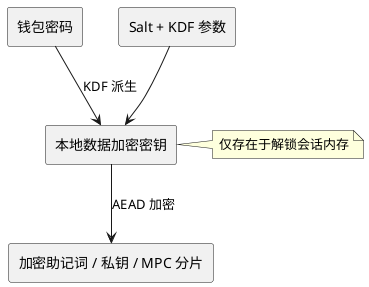
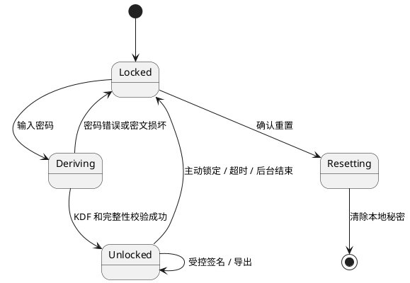

# 密钥安全

> 本文说明 Wallet 的密钥保护和密钥托管功能。托管服务保存钱包密码加密后的恢复密文，不是明文密钥；普通数据备份见[数据安全](./数据安全.md)。

## 1. 密钥保护边界

- 密钥材料只在用户设备本地生成、加密保存和使用。
- Wallet 是明文密钥边界，网页、Node、RPC 和业务服务均不得取得明文私钥。
- 钱包密码只用于派生本地加密密钥，不作为链上密钥或远端凭据保存。
- MPC 分片属于私密密钥材料，按同等或更高等级保护，不能上传到普通备份服务。

## 2. 密钥生命周期

生成、导入、解锁、签名、导出、锁定和重置都必须在 Wallet 内完成用户确认和权限校验。明文密钥仅在必要操作期间存在于内存；锁定、超时、Service Worker 生命周期结束或重置后必须清除。

## 3. 加密要求

使用带完整性保护的 AEAD；每份密文使用独立随机 nonce，并保存算法版本、salt 和 KDF 参数。密码修改必须先完成全部材料的重新加密，再以单一事务提交，失败时保持旧数据有效。

## 4. 签名边界

Provider 只传递请求，不接触密钥。签名和交易必须经过 Wallet UI 的请求展示、风险提示和用户确认。任何远端服务都不能代表用户完成签名。

## 5. 验收重点

- 复制本地存储不能得到可用私钥。
- 锁定后无法继续签名。
- 错误密码、篡改密文和迁移失败不会覆盖有效密钥。
- Node、RPC、WebDAV 日志和响应不包含密钥材料。

## 6. 密钥托管功能

设置中的“密钥托管”是独立于普通数据备份的恢复功能。启用时，Wallet 解锁后读取当前钱包的助记词（HD 钱包）或全部账户私钥（私钥钱包），同时记录钱包 ID、类型、账户地址和派生路径，组成版本化 `secret` 对象。

Wallet 使用用户钱包密码通过 `encryptObject(secret, password)` 生成密文，凭 `custody` UCAN 调用托管服务的 `upsertSecret` 写入。服务端只保存 `ciphertext`、钱包 ID 和账户数量等非敏感元数据，不能读取明文密钥、钱包密码或直接完成签名。

### 托管内容边界

托管密文中的 `secret` 仅包含当前钱包的密钥恢复材料和必要校验信息：

- HD 钱包助记词；
- 私钥钱包中各账户的私钥；
- 钱包 ID、钱包类型、钱包名称、创建时间和账户数量；
- 每个账户的 account ID、地址和派生路径；
- 导出时间和版本号。

密钥托管**不包含钱包身份敏感信息**，包括：

- Wallet Identity DID 私钥、controller secret 和 recovery key；
- 用户名、邮箱、头像及其 JWT-VC 凭证；
- Passkey 私钥、credential secret 和 TOTP secret；
- 身份文档、地址关联 proof、DApp 站点授权、SIWE 签名和 UCAN 令牌；
- 联系人、网络配置、交易历史、余额和业务会话。

身份资料和认证器由身份系统独立保存和恢复；普通元数据由[数据安全](./数据安全.md)定义。密钥托管服务即使被读取，也只能得到钱包密码加密后的恢复密文，不能据此访问身份资料或替用户完成身份认证。

```plantuml
@startuml custody
actor User
participant Wallet
participant "UCAN / Node" as Node
cloud "Custody Service" as Service
User -> Wallet : 解锁并启用托管
Wallet -> Node : 获取 custody UCAN
Wallet -> Wallet : 读取 secret
Wallet -> Wallet : encryptObject(secret, password)
Wallet -> Service : upsertSecret(walletId, ciphertext, metadata)
Service --> Wallet : 状态和同步时间
@enduml
```

## 7. 新增钱包与更新

托管记录以 `walletId` 为唯一键。新增钱包会建立新记录，不会覆盖已有钱包。已有钱包新增、删除或导入账户，以及钱包密钥变化后，下一次立即同步或重新启用托管会重新读取该钱包的全部账户并以同一 `walletId` 更新完整密文；服务端不合并明文记录。

## 8. 托管恢复

恢复时 Wallet 通过身份/通行证授权列出托管记录，用户选择钱包并输入创建记录时使用的原钱包密码。Wallet 在本地下载并解密密文，校验版本、钱包类型、首账户地址和 HD 派生结果；任何校验失败都不得导入。校验成功后调用本地 HD 或私钥导入流程，并使用新设备密码重新加密保存。托管服务不会恢复本地会话、站点权限或 UCAN。

## 9. 托管安全验收

- 未绑定通行证或无 `custody` UCAN 时不能启用和读取记录。
- 错误密码、密文损坏、地址不匹配和未知版本必须拒绝恢复。
- 托管密文不得进入普通同步白名单、日志或诊断摘要。
- 删除本地钱包不会静默删除托管记录；删除托管记录必须单独确认。

## 6. 密钥层次



钱包密码不能直接作为密钥保存或传输。KDF 参数和 salt 可以持久化，但必须与密文一起校验版本；更换密码时重新派生本地加密密钥并重新加密全部受保护集合。

## 7. 解锁生命周期



锁定必须清除派生密钥、明文助记词、私钥、同步密钥以及能直接完成签名的临时材料。Service Worker 重启、扩展重新加载和浏览器关闭都应按锁定处理，不能仅依靠 UI 显示状态。

## 8. 签名与导出

Provider 只负责 EIP-1193 请求转发。Runtime 在签名前检查钱包解锁状态、请求来源、账户权限和用户确认；消息签名、EIP-712 签名、交易发送和助记词/私钥导出必须分别显示风险信息。拒绝、锁定、账户不匹配和来源不可信都必须返回确定错误码。

## 9. MPC 分片

MPC 本地分片等同于私钥材料：单个分片不能写入普通同步白名单，不能进入日志、备份或诊断摘要。分片使用必须绑定 session、participant 和 protocol，完成签名后清除临时状态；门限协议失败时不得降级为导出或单方签名。

## 10. 威胁控制

| 威胁 | 控制 |
| --- | --- |
| 本地存储被复制 | KDF、AEAD、独立 nonce、自动锁定 |
| 密文被篡改 | AEAD 完整性校验，失败即拒绝解密 |
| 页面窃取密钥 | Provider 与 Runtime 隔离，禁止网页访问存储 |
| 后台任务残留 | 锁定和 Worker 生命周期结束时清理内存 |
| 日志泄漏 | 日志只记录 wallet/session 标识和状态，不记录密钥、明文或可重放材料 |
| 远端服务越权 | Node、RPC、WebDAV 永不接收可签名密钥 |

## 11. 实现检查清单

- 所有密钥读取路径都经过解锁边界。
- 所有签名入口都经过来源、账户和用户确认检查。
- 锁定、超时、重启后不能继续签名。
- 修改密码和重置钱包具备事务语义并可回滚。
- 导入、导出和 MPC 流程均有失败清理测试。
