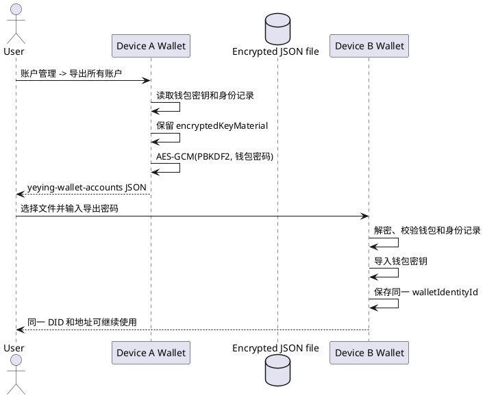
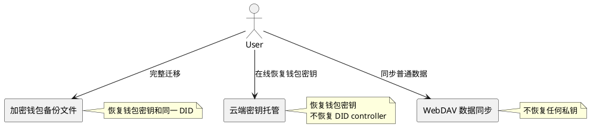
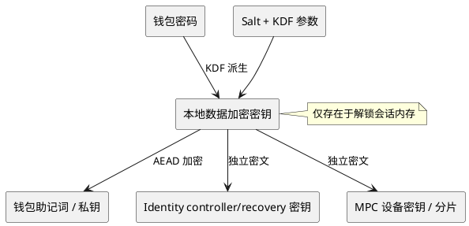
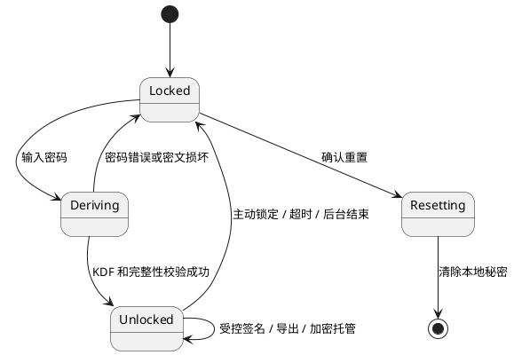

# 密钥安全

> 本文定义 Wallet 的密钥保护、加密钱包备份文件和云端密钥托管边界。两种恢复机制都支持完整恢复钱包密钥和同一 Wallet Identity DID。普通 WebDAV 数据同步见[数据安全](./数据安全.md)。

> 实现状态：加密钱包备份文件和 Wallet 端云端托管均包含 Wallet Identity 加密控制密钥；Node 身份授权兑换需返回 `custodyRecovery` 恢复 token。

## 1. 密钥保护边界

- 密钥材料只在用户设备本地生成、解密和使用。
- Wallet 是明文密钥边界，网页、Node、RPC、WebDAV 和托管服务均不得取得明文助记词或私钥。
- 钱包密码只用于派生本地加密密钥，不作为链上密钥或远端凭据保存。
- Wallet Identity controller/recovery 私钥属于身份控制密钥，与钱包账户密钥分开保护。
- MPC 分片属于私密密钥材料，按同等或更高等级保护，不能进入普通备份或云端密钥托管。

## 2. 密钥生命周期

生成、导入、解锁、签名、导出、托管、恢复、锁定和重置都必须在 Wallet 内完成用户确认和权限校验。明文密钥仅在必要操作期间存在于内存；锁定、超时、Service Worker 生命周期结束或重置后必须清除。

## 3. 加密要求

- 使用带完整性保护的 AEAD；每份密文使用独立随机 nonce。
- 密文必须带有算法版本、salt 和 KDF 参数，解密时先校验格式和完整性。
- 钱包密码不能直接保存或传输；密码只用于本地 KDF 派生加密密钥。
- 修改密码必须先完成全部本地材料的重新加密，再以单一存储事务提交；失败时保持旧数据有效。
- 托管密文和文件备份都必须在 Wallet 内加密，服务端只能处理密文和必要的非敏感索引。

## 4. 签名边界

Provider 只传递请求，不接触密钥。签名和交易必须经过 Wallet UI 的请求展示、风险提示和用户确认。任何远端服务都不能代表用户完成签名，也不能使用托管密文直接签名。

## 5. 加密钱包备份文件

### 5.1 产品定位

加密钱包备份文件是用户主动生成的离线迁移文件，格式为 `yeying-wallet-accounts` v1。它是当前 Wallet 中唯一同时迁移钱包密钥和 Wallet Identity 控制权的入口。

它适用于：

- 更换电脑或浏览器配置；
- 完整恢复钱包账户；
- 恢复同一个 Wallet Identity DID 的本地签名能力；
- 离线保存灾难恢复材料。

### 5.2 文件内容和加密边界

Wallet 目前导出所有 HD 钱包和私钥钱包账户，并把本地身份记录放入同一个加密 payload：

```text
payload.format = yeying-wallet-accounts
payload.version = 1
payload.wallets = HD 助记词或私钥钱包账户
payload.identities = DID 文档、公开 JWK、凭证、encryptedKeyMaterial
payload.selectedIdentityId = 当前选中的身份
payload.selectedAddress = 当前选中的地址
```

外层文件只保存：

```text
format
version
cipher = AES-GCM
ciphertext = encryptObject(payload, walletPassword)
```

身份记录中的 `privateJwk` 和 `recoveryPrivateJwk` 不以明文进入 payload；它们先保存在 `encryptedKeyMaterial` 中，再随整个 payload 进行外层加密。导出文件中不出现明文身份私钥。

文件不包含：

- MPC 钱包、MPC 分片、MPC 设备私钥和会话；
- DApp 站点授权、SIWE 签名、UCAN 会话和业务会话；
- WebDAV 远端对象；
- Node 上的 Passkey/TOTP 注册记录。

当前导出入口要求本地至少存在一个 HD 或私钥钱包账户。只有 MPC 钱包时，现有“导出所有账户”入口不能生成身份迁移文件。

### 5.3 导出和导入流程

设备 A：

1. 解锁 Wallet。
2. 打开“账户管理”，点击“导出所有账户”。
3. 输入当前钱包密码。
4. 将生成的 JSON 文件离线保存或传给设备 B。

设备 B：

1. 安装 Wallet，选择“导入钱包”。
2. 切换到“备份文件”，选择 JSON 文件。
3. 输入设备 A 导出时使用的同一个钱包密码。
4. Wallet 解密并校验钱包和身份记录，然后导入钱包密钥。
5. Wallet 保存同一 `walletIdentityId` 和 `encryptedKeyMaterial`，恢复选中的身份。

导入后：

- DID 必须保持完全一致；
- controller/recovery 私钥可以使用输入密码解密；
- HD 或私钥钱包地址必须保持一致；
- 设备 B 的本地 `walletId` 可以不同；
- DApp 权限和会话必须重新建立；
- 文件导入不需要 Node 在线。

### 5.4 密码变更

修改 Wallet 密码时，Wallet 必须同时重新加密：

- HD 钱包助记词；
- 账户私钥；
- MPC 设备密钥；
- Wallet Identity controller/recovery 私钥。

密码变更成功后，新密码可以解密身份控制密钥，旧密码必须失败。已经生成的备份文件不会自动更新，仍使用导出时的密码；需要新密码备份时必须重新导出。



## 6. 云端密钥托管

### 6.1 产品定位

云端密钥托管是可选的在线完整恢复服务。Wallet 在本地加密当前钱包及 Wallet Identity 的全部恢复材料，然后把密文写入 Node 提供的托管服务。它不是普通 WebDAV 数据同步。

当前托管对象是：

- HD 钱包助记词；
- 当前钱包各账户的私钥恢复材料（现有实现会在 `secret.accounts[*].privateKey` 写入每个可解密账户；HD 钱包同时写入助记词）；
- 钱包 ID、类型、名称、创建时间和账户数量；
- 账户 ID、地址和派生路径；
- 版本号和导出时间。

### 6.2 加密和服务端数据

Wallet 使用 `encryptObject(secret, password)` 生成 `ciphertext`，并通过 `custody/write` UCAN 调用：

```text
POST /api/v1/public/custody/secrets
```

服务端接收钱包 ID、账户 ID、地址、密文和非敏感元数据。服务端不能读取：

- 助记词、私钥或钱包密码；
- Wallet Identity DID controller/recovery 私钥；
- DID 文档、用户名、邮箱、头像和 JWT-VC；
- Passkey 私钥、TOTP secret 和 MPC 分片；
- DApp 授权、SIWE 签名和 UCAN 会话。

托管记录以 `walletId` 为唯一键。一次同步重新读取当前钱包全部账户并更新完整密文，不在服务端合并明文账户。

### 6.3 开启、同步和关闭

开启托管的固定顺序是：

1. Wallet 请求钱包密码并解锁当前账户。
2. Wallet 校验或生成目标托管服务的 `custody/write` UCAN。
3. Wallet 检查托管服务返回的 `passkeyBound=true`。
4. Wallet 在本地构造并加密当前钱包的完整密钥快照。
5. Wallet 成功写入远端后，保存 `custodyEnabled` 和最近同步时间。

账户新增、删除、导入或钱包密码变更后，必须重新同步。密码变更只更新本地密钥，不能自动改写远端旧密文；用户必须输入新密码执行“立即同步”。

关闭托管时，Wallet 使用 `custody/write` 权限删除当前 `walletId` 的远端记录。关闭失败时本地开关保持开启；删除本地钱包不会静默删除远端托管记录。

### 6.4 当前设备恢复

已具备有效 `custody/write` UCAN 的设备可以：

1. 列出托管记录；
2. 选择钱包记录；
3. 输入创建托管记录时使用的原钱包密码；
4. 在本地解密并校验版本、钱包类型、首账户地址和 HD 派生结果；
5. 校验成功后导入钱包，并使用新设备密码重新加密。

错误密码、密文损坏、未知版本、缺少字段或地址不匹配时，必须拒绝导入，不创建钱包，不覆盖本地数据。

### 6.5 新设备恢复

新设备不能复制设备 A 的普通 `custody/write` UCAN。恢复流程使用独立的身份授权：

1. 设备 B 请求 Node 的 `identity.basic` 和 `custody.recovery` 授权；
2. 用户使用绑定到该 DID 的通行证完成验证；
3. Wallet 使用 PKCE 兑换短期恢复 token；
4. Wallet 使用恢复 token 列出托管记录；
5. 用户输入原钱包密码；
6. Wallet 下载密文，在本地解密、校验并导入钱包。

通行证只负责证明恢复授权，原钱包密码负责解密托管密文。缺少任一条件都不能恢复钱包密钥。

当前端到端实现的前置条件是：Node 的 `POST /api/v1/public/identity/authorize/exchange` 必须在请求包含 `custody.recovery` 时返回 `custodyRecovery.token` 和有效期。Wallet 已按此字段读取恢复 token；如果 Node 只返回 DID、地址和资料凭证而没有该字段，新设备恢复会在取得恢复授权后停止，不能读取托管记录。

### 6.6 云端托管是否恢复同一 DID

#### 当前实现结论

**产品目标和实现契约是恢复同一 DID。**

托管密文现在包含身份控制材料，恢复流程会校验并写回原身份记录，因此云端托管属于钱包身份控制权的完整恢复。

这是当前实现的明确边界，原因如下：

1. 云端托管 payload 只构造钱包助记词和账户私钥；代码不会读取或写入 `wallet_identities`。
2. `custody.recovery` 只授权读取钱包密文，不能把 Wallet Identity controller/recovery 私钥传给新设备。
3. Passkey 或 Node 授权证明用户有恢复资格，但不等于拥有 DID controller 私钥。
4. 身份控制密钥一旦进入云端托管，服务就从“钱包密钥托管”变成“身份控制权托管”，需要独立的身份恢复协议、密钥轮换、撤销、审计和威胁模型；当前协议没有定义这些内容。
5. `createWalletIdentity()` 使用独立随机的 Ed25519 密钥生成 `wid_` 和 DID，DID 不由 HD 助记词或 EVM 地址确定性派生；仅恢复助记词/私钥不可能计算出原 DID。

因此云端托管恢复的结果是：

- 恢复同一钱包地址和钱包账户控制权；
- 不恢复同一 Wallet Identity DID 的本地签名控制权；
- 不应在恢复后自动创建新 DID 并绑定同一地址。

云端托管和第 5 节加密钱包备份文件都可以恢复同一 DID；两者均不得自动生成新 DID。

#### 产品决策边界

| 产品问题 | 当前 V1 结论 | 需要恢复同一 DID 时的变更 |
| --- | --- | --- |
| 云端托管恢复什么 | 钱包密钥和 Wallet Identity 全部材料 | 已由 V2 托管密文和恢复流程实现 |
| 新设备恢复结果 | 新设备得到同一地址的钱包密钥；不得到原 DID 的签名能力 | 解密并校验原 `walletIdentityId`、controller/recovery 密钥和 DID 文档后，恢复原 DID |
| Node 的职责 | 只签发短期 `custody.recovery` 读取授权 | 还要定义身份恢复授权、密钥轮换、撤销和审计，不得仅凭 Passkey 直接导出身份私钥 |
| 用户承诺 | “可在线恢复钱包密钥” | 才能承诺“可在线恢复完整钱包身份” |

云端密钥托管和加密钱包备份文件是两个入口，但都属于完整钱包恢复；云端恢复必须保留原 Wallet Identity DID。

## 7. 两种恢复机制的产品协同

两者不能合并成一个“备份”开关，产品页面必须使用明确名称：

| 能力 | 产品名称 | 恢复内容 | 必需凭据 | 在线依赖 |
| --- | --- | --- | --- | --- |
| 离线完整迁移 | 加密钱包备份文件 | 钱包密钥 + Wallet Identity | 文件 + 导出密码 | 不需要 Node |
| 在线密钥恢复 | 云端密钥托管 | 当前钱包密钥 | 通行证授权 + 原钱包密码 | 需要 Node/托管服务 |
| 普通数据同步 | 数据同步 | 账户名称、联系人、网络等白名单数据 | 同步授权和同步密钥 | 需要 WebDAV |

推荐产品流程：

1. 创建钱包后引导用户先生成加密钱包备份文件。
2. 用户可以单独开启云端密钥托管，并明确提示“只恢复钱包密钥，不恢复 Wallet Identity”。
3. 钱包账户或密码变化后，将云端托管标记为“需要重新同步”。
4. 恢复页面分别提供“从加密备份文件恢复”和“从云端托管恢复钱包密钥”。
5. 从云端恢复后校验并继续使用原 Wallet Identity DID。
6. WebDAV 数据同步单独显示状态，不能显示为密钥备份成功。

Wallet 不应自动把加密文件上传到托管服务，也不应把云端密文自动生成可下载的身份备份文件。两种机制的状态、失败提示和删除操作必须分别展示。



## 8. 密钥层次



## 9. 解锁生命周期



锁定必须清除派生密钥、明文助记词、私钥、同步密钥以及能直接完成签名的对象。托管恢复 token 只保存在恢复流程的临时状态中，恢复成功后清除，过期或无效 token 必须由服务端拒绝。Service Worker 重启、扩展重新加载和浏览器关闭都应按锁定处理，不能仅依靠 UI 显示状态。

## 10. MPC 分片

MPC 本地分片等同于私钥材料：

- 不能写入普通 WebDAV 数据同步；
- 不能写入云端密钥托管；
- 不能进入加密账户备份文件；
- 不能进入日志、审计摘要或诊断摘要；
- 使用必须绑定 session、participant 和 protocol；
- 完成签名后清除临时状态；
- 门限协议失败时不得降级为导出或单方签名。

MPC 钱包需要单独定义设备迁移、分片恢复、轮换和销毁协议。

## 11. 威胁控制

| 威胁 | 控制 |
| --- | --- |
| 本地存储被复制 | KDF、AEAD、独立 nonce、自动锁定 |
| 密文被篡改 | AEAD 完整性校验，失败即拒绝解密 |
| 页面窃取密钥 | Provider 与 Runtime 隔离，禁止网页访问存储 |
| 后台任务残留 | 锁定和 Worker 生命周期结束时清理内存 |
| 文件泄漏 | 文件整体加密，导出密码不写入文件或日志 |
| 托管服务泄漏 | 服务端只保存密码加密密文，不保存明文密钥 |
| 恢复授权越权 | `custody/write` 和 `custody.recovery` 分离，校验 audience、能力和有效期 |
| 日志泄漏 | 只记录 wallet/session 标识和状态，不记录密钥、明文或可重放材料 |
| 远端服务越权 | Node、RPC、WebDAV 和托管服务永不接收可签名密钥 |

## 12. 实现检查清单

- 所有密钥读取路径都经过解锁边界。
- 所有签名入口都经过来源、账户和用户确认检查。
- 加密钱包备份文件包含身份控制密钥的加密材料，但不包含明文私钥。
- 云端托管包含当前钱包密钥和 `wallet_identities` 中的加密身份材料。
- 云端托管恢复原 DID，不创建新 DID。
- 锁定、超时、重启后不能继续签名或使用明文密钥。
- 修改密码和重置钱包具备事务语义并可回滚。
- 文件导入、托管同步、托管恢复和 MPC 流程均有失败清理测试。
- 备份文件、托管密文、Node 响应和日志均无明文密钥。
