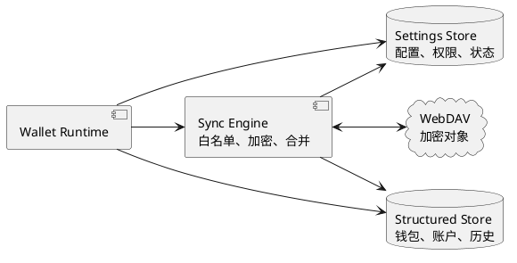
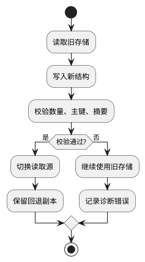
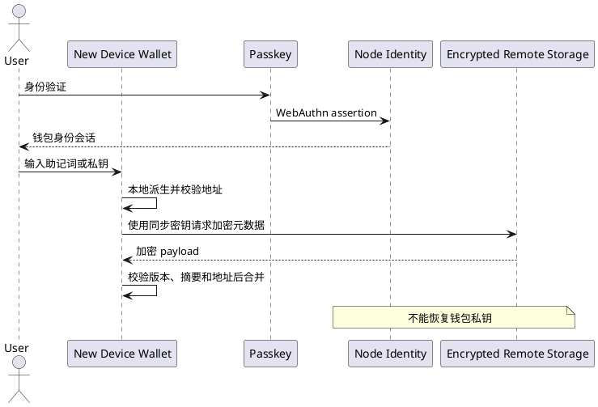

# 数据安全

> 本文是钱包元数据备份、同步和恢复的安全规范。普通备份不包含私钥；密钥托管功能另见[密钥安全](./密钥安全.md)。

## 1. 数据备份内容

数据备份是客户端加密的元数据备份，不是密钥备份。当前同步载荷明确包含：

- HD 钱包账户索引、地址、账户数量；
- 账户名称及名称更新时间；
- 账户用户名及更新时间；
- 联系人 ID、名称、备注、地址和更新时间；
- 已配置网络的 chain ID 列表；
- 载荷版本、更新时间、同步原因和完整性元数据。

新增字段必须先加入白名单和版本协议，不能因序列化自动进入远端对象。

## 2. 明确不备份的数据

普通数据备份绝不包含：

- 助记词、私钥、硬件钱包密钥和 MPC 分片；
- 钱包密码、解锁缓存、密钥派生材料和签名授权凭据；
- Passkey 私钥、TOTP secret；
- 交易记录、余额、RPC 返回缓存和轮询游标；
- DApp 站点授权、SIWE 签名、UCAN 令牌和业务会话；
- 身份 DID 私钥、身份 controller secret 和可直接访问资源的长期令牌。

密钥托管是独立功能，保存钱包密码加密后的恢复密文，不属于数据备份载荷。

## 3. 备份模型

远端只保存客户端加密对象，不能解密、签名或决定钱包权限。本地存储是运行事实源，远端备份不可用时不应阻塞钱包启动、读取资产或签名。

## 4. 完整性与一致性

备份对象必须包含版本、摘要和条件写入信息。恢复时先验证格式、版本、地址关联和完整性，再合并到本地；失败不得覆盖本地数据。多设备冲突必须重新拉取并确定性合并，无法安全合并时暂停写回并请求用户处理。

## 5. 恢复边界

数据备份只能恢复白名单元数据，不能恢复私钥或签名能力。用户必须先通过助记词或独立私钥恢复密钥，再导入加密元数据。远端删除和本地重置是两个独立操作，必须分别确认。

## 6. 运维与审计

备份服务只记录对象标识、版本和状态，不记录明文资料、密钥或可重放令牌。备份失败、回滚检测、冲突和迁移失败必须产生可诊断但不泄密的错误与审计记录。

## 7. 数据分类与白名单

| 类别 | 示例 | 备份策略 |
| --- | --- | --- |
| 钱包结构 | 钱包标识、账户索引、派生路径 | 加密后备份 |
| 用户配置 | 当前网络、账户名称、自动锁定设置 | 加密后备份 |
| 业务辅助 | 联系人、自定义网络、通证列表 | 加密后备份，可冲突合并 |
| 权限元数据 | 站点授权、资料 scope、撤销时间 | 默认本地保存，按协议单独处理 |
| 临时缓存 | 余额、RPC 元数据、轮询游标 | 不备份，可重建 |
| 核心秘密 | 助记词、私钥、MPC 分片、密码 | 普通同步禁止；托管功能单独加密保存 |

新增字段必须先加入白名单和版本协议，不能因为序列化自动包含而进入远端对象。

## 8. 存储分层

本地存储是钱包运行的第一事实源。小型高频状态放在配置层，需索引、事务和分页的数据放在结构化层；远端只保存客户端加密对象，不参与签名、权限判断或钱包启动。

## 9. 对象格式与条件写入

远端对象至少包含 `schemaVersion`、`walletId`、对象摘要、更新时间、版本号和加密载荷。写入使用版本或 ETag 条件，条件失败时重新拉取，不允许最后写入者静默覆盖较新数据。服务端可验证对象版本和访问权限，但不能解密载荷。

## 10. 同步流程

1. Wallet 解锁后读取本地白名单数据。
2. Sync Engine 构造带版本和摘要的载荷并在本地加密。
3. 拉取远端对象并验证格式、摘要和版本。
4. 对无冲突字段执行确定性合并，对冲突字段暂停写回并提示用户。
5. 以条件写入提交新对象，成功后更新本地同步游标。

同步失败不得阻塞首页、余额读取或签名；失败状态应可重试并显示最后一次成功时间。

## 11. 迁移与回退

迁移必须幂等、可重复执行；只有验证成功才能切换读取源。迁移中断、浏览器崩溃或版本回退不能隐藏资产，也不能生成重复账户。旧副本至少保留一个稳定版本周期。

## 12. 冲突与恢复

同一字段按明确版本规则合并，不能用不可靠的本地时间猜测真实版本。无法安全合并时保留双方版本并要求用户选择。新设备恢复顺序是：先使用助记词或独立私钥恢复密钥，再导入并解密元数据；数据备份不能恢复签名能力。远端删除和本地重置必须分别确认。

## 13. 故障处理

| 故障 | 行为 |
| --- | --- |
| 远端不可用 | 使用本地数据，后台重试 |
| 对象损坏 | 拒绝解密，不覆盖本地 |
| 版本冲突 | 重新拉取并合并，必要时交给用户 |
| 密码错误 | 不产生任何写入 |
| 迁移失败 | 保留旧存储并记录诊断信息 |
| 设备丢失 | 用户恢复密钥后重新建立备份授权 |

## 14. 验收清单

- 远端抓包只能看到加密对象和非敏感元数据。
- 修改联系人、网络和账户名称可正确同步并处理并发冲突。
- 远端故障不阻塞钱包使用。
- 损坏对象、回滚对象和过期版本不会污染本地数据。
- 新设备不能仅凭远端备份恢复私钥。

## 15. 三类恢复边界

三类恢复不能互相替代，也不能向用户暗示通行证或远端备份能够恢复私钥。

| 恢复对象 | 恢复凭据 | 恢复结果 | 不能恢复 |
| --- | --- | --- | --- |
| 钱包身份 | Passkey 或 Wallet 地址控制证明 | 身份主体和应用登录关系 | 助记词、私钥、钱包资产控制权 |
| 钱包密钥 | 助记词或独立私钥备份 | HD 钱包、账户地址、签名能力 | Node 登录会话、已撤销授权 |
| 钱包元数据 | 同一钱包派生的同步密钥和加密 payload | 账户名称、联系人、网络和个人资料 | 助记词、私钥、Passkey 私钥 |

## 16. 新设备恢复流程

1. 安装 Wallet，先导入助记词或独立私钥备份。
2. Wallet 在本地派生账户并验证首地址，密钥材料不发送给 Node 或远端。
3. HD 钱包从助记词派生同步 fingerprint 和同步密钥。
4. 拉取对应 fingerprint 的远端对象，验证版本、结构、摘要和回滚状态。
5. 远端地址必须与本地相同派生序号的地址一致；不一致的数据不应用。
6. 仅合并账户名称、联系人、网络和个人资料，远端不能单独创建根钱包。
7. 钱包身份需要时单独使用 Passkey，它不参与钱包密钥恢复。

## 17. 恢复失败结果

- 错误助记词产生不同 fingerprint，不会读取原钱包对象。
- 错误密码无法建立同步上下文，不产生写入。
- 远端不可用时保留本地可用性，后台记录并重试。
- 对象损坏、版本未知或时间倒退时停止同步，不应用也不覆盖远端。
- 同序号地址不一致时跳过账户，不能用远端地址替换本地派生地址。

## 18. 恢复专项测试

- 设备 A 生成 payload，清空浏览器数据模拟设备 B。
- 未恢复助记词时，payload 不得创建钱包或账户密钥。
- 导入同一助记词后，地址保持一致，白名单元数据可恢复。
- 未知版本、损坏结构、无效时间戳均被拒绝。
- 拉取或解密失败后不得继续 PUT 覆盖远端对象。
- Service Worker 重启后回到锁定态，重新解锁后地址保持不变。
