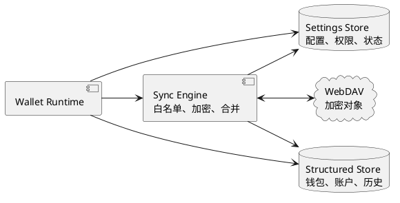
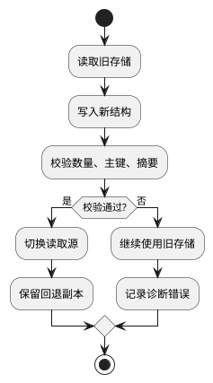
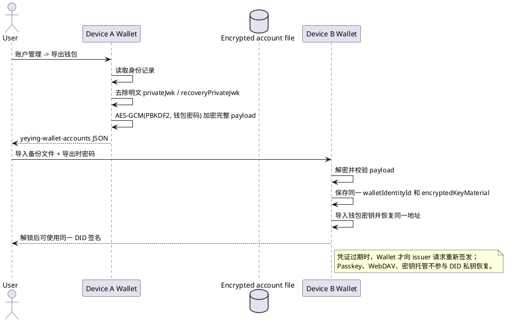

# 数据安全

> 本文是钱包元数据备份、同步和恢复的安全规范。WebDAV 数据备份不包含私钥；账户管理中的加密“导出钱包”文件是独立的全量迁移文件，会保存钱包密钥和 Wallet Identity 的二次加密密文。密钥托管功能另见[密钥安全](./密钥安全.md)。

## 1. 数据备份内容

数据备份是客户端加密的元数据备份，不是密钥备份。当前同步载荷明确包含：

- HD 钱包账户索引、地址、账户数量；
- 账户名称及名称更新时间；
- 账户用户名及更新时间；
- 联系人 ID、名称、备注、地址和更新时间；
- 已配置网络的 chain ID 列表；
- 载荷版本、更新时间、同步原因和完整性元数据。

新增字段必须先加入白名单和版本协议，不能因序列化自动进入远端对象。

## 2. 明确不备份的数据

普通数据备份绝不包含：

- 助记词、私钥、硬件钱包密钥和 MPC 分片；
- 钱包密码、解锁缓存、密钥派生材料和签名授权凭据；
- Passkey 私钥、TOTP secret；
- 交易记录、余额、RPC 返回缓存和轮询游标；
- DApp 站点授权、SIWE 签名、UCAN 令牌和业务会话；
- 身份 DID 私钥、身份 controller secret 和可直接访问资源的长期令牌。

密钥托管是独立功能，保存钱包密码加密后的恢复密文，不属于数据备份载荷。

## 3. 备份模型

远端只保存客户端加密对象，不能解密、签名或决定钱包权限。本地存储是运行事实源，远端备份不可用时不应阻塞钱包启动、读取资产或签名。

## 4. 完整性与一致性

备份对象必须包含版本、摘要和条件写入信息。恢复时先验证格式、版本、地址关联和完整性，再合并到本地；失败不得覆盖本地数据。多设备冲突必须重新拉取并确定性合并，无法安全合并时暂停写回并请求用户处理。

## 5. 恢复边界

数据备份只能恢复白名单元数据，不能恢复私钥或签名能力。用户必须先通过助记词或独立私钥恢复密钥，再导入加密元数据。远端删除和本地重置是两个独立操作，必须分别确认。

## 6. 运维与审计

备份服务只记录对象标识、版本和状态，不记录明文资料、密钥或可重放令牌。备份失败、回滚检测、冲突和迁移失败必须产生可诊断但不泄密的错误与审计记录。

## 7. 数据分类与白名单

| 类别 | 示例 | 备份策略 |
| --- | --- | --- |
| 钱包结构 | 钱包标识、账户索引、派生路径 | 加密后备份 |
| 用户配置 | 当前网络、账户名称、自动锁定设置 | 加密后备份 |
| 业务辅助 | 联系人、自定义网络、通证列表 | 加密后备份，可冲突合并 |
| 权限元数据 | 站点授权、资料 scope、撤销时间 | 默认本地保存，按协议单独处理 |
| 临时缓存 | 余额、RPC 元数据、轮询游标 | 不备份，可重建 |
| 核心秘密 | 助记词、私钥、MPC 分片、密码 | 普通同步禁止；托管功能单独加密保存 |

新增字段必须先加入白名单和版本协议，不能因为序列化自动包含而进入远端对象。

## 8. 存储分层

本地存储是钱包运行的第一事实源。小型高频状态放在配置层，需索引、事务和分页的数据放在结构化层；远端只保存客户端加密对象，不参与签名、权限判断或钱包启动。

## 9. 对象格式与条件写入

远端对象至少包含 `schemaVersion`、`walletId`、对象摘要、更新时间、版本号和加密载荷。写入使用版本或 ETag 条件，条件失败时重新拉取，不允许最后写入者静默覆盖较新数据。服务端可验证对象版本和访问权限，但不能解密载荷。

## 10. 同步流程

1. Wallet 解锁后读取本地白名单数据。
2. Sync Engine 构造带版本和摘要的载荷并在本地加密。
3. 拉取远端对象并验证格式、摘要和版本。
4. 对无冲突字段执行确定性合并，对冲突字段暂停写回并提示用户。
5. 以条件写入提交新对象，成功后更新本地同步游标。

同步失败不得阻塞首页、余额读取或签名；失败状态应可重试并显示最后一次成功时间。

## 11. 迁移与回退

迁移必须幂等、可重复执行；只有验证成功才能切换读取源。迁移中断、浏览器崩溃或版本回退不能隐藏资产，也不能生成重复账户。旧副本至少保留一个稳定版本周期。

## 12. 冲突与恢复

同一字段按明确版本规则合并，不能用不可靠的本地时间猜测真实版本。无法安全合并时保留双方版本并要求用户选择。本文的 WebDAV 数据备份只能恢复白名单元数据；新设备必须先用助记词、独立私钥或密钥托管恢复钱包密钥，再导入并解密元数据。远端删除和本地重置是两个独立操作，必须分别确认。

## 13. 故障处理

| 故障 | 行为 |
| --- | --- |
| 远端不可用 | 使用本地数据，后台重试 |
| 对象损坏 | 拒绝解密，不覆盖本地 |
| 版本冲突 | 重新拉取并合并，必要时交给用户 |
| 密码错误 | 不产生任何写入 |
| 迁移失败 | 保留旧存储并记录诊断信息 |
| 设备丢失 | 用户恢复密钥后重新建立备份授权 |

## 14. 验收清单

- 远端抓包只能看到加密对象和非敏感元数据。
- 修改联系人、网络和账户名称可正确同步并处理并发冲突。
- 远端故障不阻塞钱包使用。
- 损坏对象、回滚对象和过期版本不会污染本地数据。
- 新设备不能仅凭远端备份恢复私钥。

## 15. 恢复对象和凭据边界

三种恢复入口互相独立，不能把 Passkey、WebDAV 对象或密钥托管记录当成 Wallet Identity 控制密钥。

| 恢复对象 | 当前入口 | 必需凭据 | 恢复结果 | 不能恢复 |
| --- | --- | --- | --- | --- |
| Wallet Identity 本地控制权 | 账户管理中的“导出钱包”生成的 `yeying-wallet-accounts` 加密文件，再在新设备“备份文件”导入 | 加密文件和导出时的钱包密码 | 同一个 DID、controller/recovery 加密私钥、身份文档、已保存凭证和选中身份 | WebDAV 数据备份、密钥托管、Passkey 登录本身 |
| 钱包密钥和身份 | 助记词/独立私钥导入、加密文件或密钥托管恢复 | 原钱包密码及对应恢复授权 | 钱包账户、本地签名能力和同一 Wallet Identity DID | Node 会话、已撤销授权 |
| WebDAV 钱包元数据 | 数据备份同步 | 同一 HD 钱包派生的 fingerprint、同步密钥和远端密文 | 账户名称、联系人、网络等白名单元数据 | 助记词、私钥、Wallet Identity 和 Passkey 私钥 |

## 16. Wallet Identity 新设备恢复流程

### 设备 A：生成加密账户文件

1. 确认 Wallet Identity 已创建，必要的用户名、邮箱、头像和钱包账户凭证已经保存。
2. 打开“账户管理”，选择“导出钱包”，输入当前钱包密码。
3. Wallet 在本地构造 `yeying-wallet-accounts` v1 payload。身份记录保留 DID 文档、公开 JWK、凭证和 `encryptedKeyMaterial`，明文身份私钥不会进入文件。
4. 文件外层使用 AES-GCM 和该密码加密；文件应当像助记词一样离线保管。

### 设备 B：导入并恢复控制权

1. 安装 Wallet，选择“导入钱包 -> 备份文件”。
2. 选择设备 A 导出的 JSON，输入导出文件使用的同一个钱包密码。
3. Wallet 解密后保存 `wallet_identities` 中的身份记录，并恢复 `selected_wallet_identity_id`；同时导入助记词或私钥，导入后的本地 `walletId` 可以不同，但地址必须相同。
4. 解锁设备 B。Wallet 使用该密码解密 `encryptedKeyMaterial` 中的 `privateJwk` 和 `recoveryPrivateJwk`，因此新设备能够代表原 DID 签名。
5. 需要更换设备密码时，先用导出密码完成导入，再在设备 B 修改钱包密码。修改密码会同时重加密钱包、账户、MPC 设备密钥和 Wallet Identity 控制密钥。
6. 使用 `wallet_identity_presentation` 时，仍按请求的 scope 选择本地有效凭证。凭证过期或被撤销时，Wallet 使用 DID controller proof 向 issuer 重新签发；issuer 不可用或没有可续签事实时，必须回到身份验证流程。

## 17. 其他入口不能恢复 Wallet Identity 控制权

- WebDAV 数据备份的白名单不包含 `wallet_identities`，不能从 WebDAV 拉回 DID 私钥或凭证。
- 密钥托管保存钱包密钥及 Wallet Identity 全部材料的密码加密密文，恢复结果包含原 DID、身份文档和身份凭证。
- Passkey 是身份认证器。Node 可以用它完成无插件应用登录，但认证结果不会导出 Wallet controller 私钥。
- 只导出 DID Document、用户名、邮箱、头像、地址关联证明或 JWT-VC，不能恢复 Wallet 的签名能力。
- 如果加密账户文件和身份控制密钥都丢失，在 Wallet 中无法恢复原 DID；创建身份会得到新的 DID，原 DID 的凭证不能自动迁移。

历史版本在修改钱包密码时没有重加密 Wallet Identity 控制密钥。当前版本已修复该流程；已经发生过改密且没有旧密码的旧身份记录仍无法通过新密码解密。

## 18. 恢复失败结果和专项测试

- 备份文件密码错误、密文损坏或版本未知时拒绝导入，不写入身份或钱包数据。
- 备份文件没有 `encryptedKeyMaterial` 时只能拒绝作为 Wallet Identity 恢复文件，不能创建空壳 DID。
- 导入后使用同一密码解密 `privateJwk` 和 `recoveryPrivateJwk`，并验证 DID 文档 id 与 `walletIdentityId` 一致。
- 修改密码后，新密码可以解密身份控制密钥，旧密码必须失败；任一身份材料迁移失败时钱包、账户和身份都保持旧密码。
- 导入同一助记词后地址保持一致；WebDAV 只合并白名单元数据，不覆盖身份或私钥。
- 凭证过期、撤销、issuer 不可用和 controller proof 无效时，Presentation 按确定错误返回，不伪造有效凭证。
