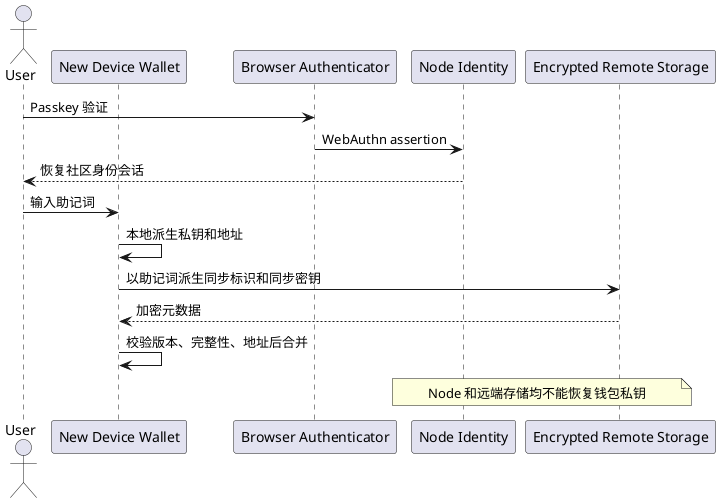

# 钱包恢复边界与验收

> 本文定义 V2 的三类恢复边界。三类恢复不能互相替代，也不能向用户暗示通行证或远端备份能够恢复私钥。

## 1. 三类恢复

| 恢复对象 | 恢复凭据 | 恢复结果 | 不能恢复 |
|---|---|---|---|
| 社区身份 | Passkey，或 Wallet 地址控制证明 | `subjectId`、应用登录关系 | 助记词、私钥、钱包资产控制权 |
| 钱包密钥 | 助记词或独立私钥备份 | HD 钱包、账户地址、签名能力 | Node 登录会话、已撤销授权 |
| 钱包元数据 | 同一钱包派生的同步密钥和远端加密 payload | 账户名称、联系人、网络、个人资料 | 助记词、私钥、Passkey 私钥 |

## 2. 新设备标准流程

1. 用户安装 Wallet，先导入助记词或私钥备份。
2. Wallet 在本地派生账户并验证首地址，密钥材料不发送给 Node 或远端存储。
3. 对 HD 钱包，Wallet 从助记词派生同步 fingerprint 和同步密钥。
4. Wallet 拉取对应 fingerprint 的远端对象，完成解密、payload 版本和结构校验、回滚检测。
5. 远端账户地址必须与本地相同派生序号的地址一致；不一致的数据不应用。
6. 合并账户名称、联系人、网络和个人资料。远端数据不能单独创建根钱包。
7. 社区身份需要时单独使用 Passkey 登录；它不参与钱包密钥恢复。

## 3. 失败与安全结果

- 错误助记词：派生出不同 fingerprint，不会读取原钱包的远端对象。
- 错误密码：无法解密本地钱包，不能建立同步上下文。
- 远端不可用：保留本地钱包可用性，记录同步错误，不阻塞签名。
- 远端对象损坏或版本未知：停止该钱包同步，不应用也不覆盖远端。
- 远端时间倒退：停止应用与推送，要求用户明确保留本地或信任远端。
- 同序号地址不一致：跳过该账户，不能用远端地址替换本地派生地址。

## 4. 持续验收

- 从设备 A 生成同步 payload，清空浏览器数据模拟设备 B。
- 未恢复助记词时，应用 payload 不得创建钱包或账户密钥。
- 导入同一助记词后，账户地址保持一致，元数据可以恢复。
- 未知 payload 版本、损坏账户结构、无效时间戳均被拒绝。
- 拉取或解密失败后不得继续 PUT 覆盖远端对象。
- Service Worker 重启后必须回到锁定态，重新输入密码后地址保持不变。
