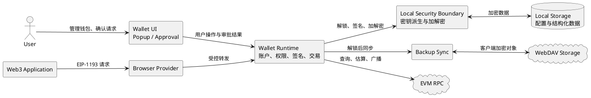
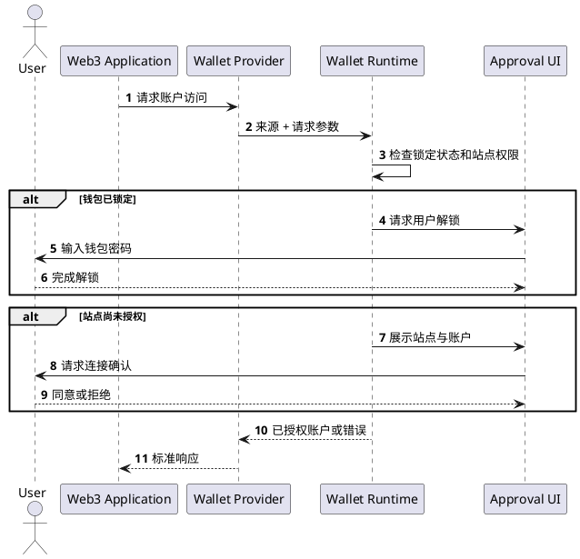
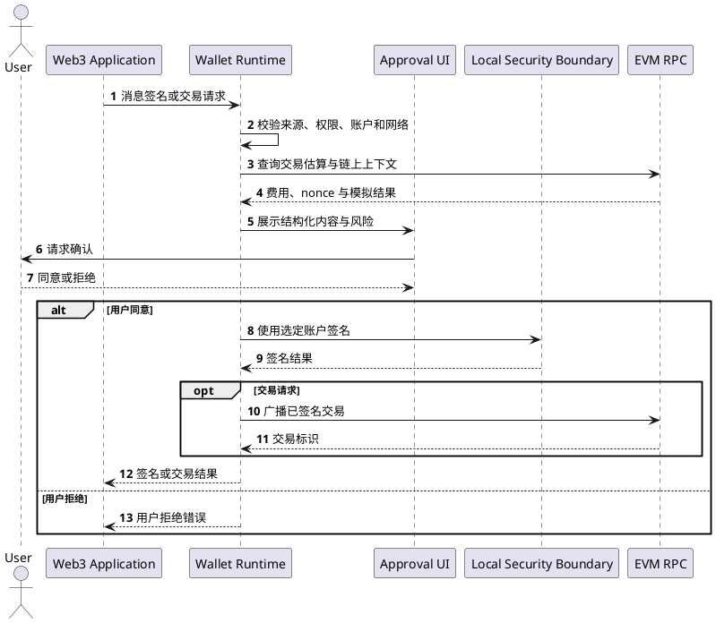
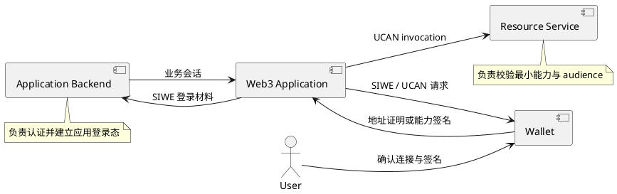
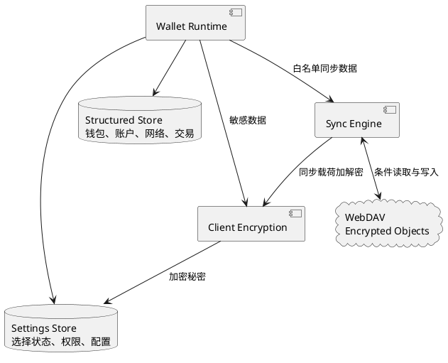
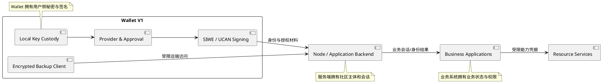

# 夜莺钱包架构 V1

> 状态：当前实现基线
>
> 适用版本：Wallet `1.4.18`
>
> 目标读者：产品负责人、钱包维护者、Web3 应用开发者和安全评审人员
>
> 本文只描述 V1 已经实现并可由当前钱包提供的能力。尚未实现的目标统一记录在 [钱包架构 V2](./钱包架构V2.md)。

## 1. 产品定位

夜莺钱包 V1 是运行在浏览器中的 EVM 用户钱包，承担四项核心职责：

1. 在用户设备上创建、导入和保护钱包密钥。
2. 为 Web3 应用提供账户、网络、签名和交易能力。
3. 向用户展示连接、签名、交易和能力授权请求，并取得明确确认。
4. 协助社区应用完成 SIWE 身份认证和 UCAN 能力授权。

Wallet 不拥有社区业务账户、应用目录、项目权限、模型额度或文件服务权限。业务系统必须根据自己的身份会话和权限模型作出最终访问决定。

## 2. 能力范围

| 能力域 | V1 已实现能力 |
| --- | --- |
| 钱包与账户 | HD 钱包、助记词导入、私钥导入、多钱包、多账户、账户派生与切换 |
| 密钥保护 | 本地密码加密、解锁与主动锁定、自动锁定、修改密码、助记词和私钥导出确认 |
| 网络 | EVM 网络列表、网络切换、自定义网络、RPC 访问 |
| 资产 | 原生资产余额、基础 ERC-20 通证管理、收款、转账、手续费估算、交易历史 |
| Web3 Provider | EIP-1193 请求接口、EIP-6963 多 Provider 发现、账户与网络事件 |
| 站点权限 | 连接确认、账户访问权限、资料字段授权、已授权站点管理与撤销 |
| 签名与交易 | 消息签名、EIP-712 签名、交易审批、签名和广播 |
| 身份认证 | SIWE 消息识别、结构化展示、风险提示和签名 |
| 能力授权 | ReCap 能力摘要展示、UCAN 会话身份和签名能力 |
| 数据保存 | 本地分层存储、结构化数据迁移与回退、加密 WebDAV 备份同步 |

V1 面向 EVM 网络，不包含原生移动端、多链异构账户、Passkey 无插件登录和生产级 MPC 门限签名。

## 3. 总体架构

V1 的安全中心位于用户设备：Web3 页面不能直接接触钱包秘密，外部 RPC 和 WebDAV 服务也不持有能够完成钱包签名的私钥。

## 4. 组件职责

### 4.1 Web3 Provider

Provider 位于网页与钱包之间，对外提供标准请求入口并传递账户或网络变化事件。

它只负责协议通信：

- 不保存助记词和私钥。
- 不自行批准连接、签名或交易。
- 不信任网页声明的账户、来源或审批结果。
- 所有敏感请求都交由钱包运行时进行权限判断。

### 4.2 钱包界面

钱包界面包含日常管理界面和独立审批界面。

- 日常管理界面负责钱包、账户、网络、通证、联系人、备份和安全设置。
- 审批界面负责连接、签名、交易、网络变更、通证添加和资料共享确认。
- 钱包锁定时，敏感流程先完成解锁，再返回原请求继续审批。
- 用户关闭或拒绝审批时，请求必须结束，不能在后台继续执行。

### 4.3 钱包运行时

钱包运行时是 V1 的业务和安全控制中心，负责：

- 判断调用站点是否拥有账户或资料权限。
- 管理锁定状态、待审批请求和请求超时。
- 组织账户选择、网络切换、交易估算、签名和广播。
- 管理 SIWE、ReCap 与 UCAN 请求的展示和签名边界。
- 通过统一存储边界读写钱包数据。

### 4.4 本地安全边界

本地安全边界负责钱包密码派生、助记词和私钥加解密、解锁期间的内存秘密以及签名操作。

核心要求：

- 持久化介质只保存加密后的钱包秘密。
- 钱包密码不等于链上私钥，也不发送给任何网站或远端服务。
- 明文密钥只在解锁后的必要操作期间存在。
- 锁定、超时或重置后清除内存秘密。
- 修改密码时，所有受保护数据作为一个整体完成重新加密和提交。

### 4.5 本地与远端存储

本地存储是钱包运行事实源，分别承载小型配置和结构化钱包数据。WebDAV 是可选的客户端加密备份层，不参与交易签名或站点权限判断。

远端同步只包含白名单数据；助记词、私钥、钱包密码和直接资源访问凭据不进入同步载荷。完整方案见 [钱包存储方案](./钱包存储方案.md)。

## 5. DApp 请求流程

### 5.1 连接钱包

已授权站点再次请求账户时可以直接得到已经授权的账户范围；新增资料字段或扩大权限仍需独立确认。

### 5.2 签名和交易

交易内容、目标地址、金额、网络和费用必须在签名前确定。审批后发生关键字段变化时，应视为新的请求重新确认。

## 6. 身份认证与能力授权

V1 将登录认证和资源授权分为不同层次：

| 层次 | 协议 | Wallet 的职责 | 服务端职责 |
| --- | --- | --- | --- |
| 账户连接 | EIP-1193 权限 | 获得用户对站点读取账户的确认 | 不把连接结果直接视为登录 |
| 身份认证 | SIWE | 展示登录声明并以选定地址签名 | 校验签名、domain、URI、nonce 和有效期，建立业务会话 |
| 授权摘要 | ReCap | 展示 SIWE 中携带的能力意图 | 不能仅凭摘要放行资源 |
| 能力委托 | UCAN | 提供受站点权限约束的会话身份和签名 | 校验 issuer、audience、能力范围、衰减和有效期 |

协议细节分别见 [SIWE 协议说明](./SIWE协议说明.md)、[UCAN 协议说明](./UCAN协议说明.md)和 [Web3 应用集成手册](./web3应用集成手册.md)。

## 7. 数据与存储

V1 采用本地优先的数据模型：

- 钱包、账户、网络和交易历史使用结构化本地存储。
- 当前账户、当前网络、站点权限和用户设置使用本地配置存储。
- 核心数据升级采用先复制、验证后切换并保留回退副本的策略。
- 备份同步由钱包在客户端加密和合并，WebDAV 只保存密文对象。
- 远端不可用不影响本地解锁、签名和交易。

## 8. 安全边界

### 8.1 信任关系

- Web3 页面是不可信输入源，所有请求必须校验来源、参数、权限和用户确认。
- EVM RPC 可以提供链上数据和广播服务，但不能替代本地交易确认。
- WebDAV 可以保存对象，但不能获得同步明文或钱包密钥。
- 已授权站点仍可能被攻击，敏感签名和扩大权限需要独立审批。
- Wallet 只能证明地址控制并协助授权，不能替业务服务决定最终权限。

### 8.2 V1 安全保证

- 助记词和私钥不会以明文形式长期存储。
- 未解锁钱包不能完成敏感签名。
- 未获站点权限的页面不能读取账户或调用受保护能力。
- 签名和交易需要用户可见审批。
- SIWE 登录材料包含站点、nonce 和时间语义。
- UCAN 能力按 issuer、audience、资源、动作和有效期校验。
- 存储迁移失败时保持旧数据可用，不以迁移成功为钱包启动前提。
- 远端同步失败或密文损坏不会覆盖本地有效钱包数据。

## 9. V1 系统边界

V1 的事实边界是：钱包保护密钥并取得用户确认；服务端验证认证和授权材料；业务系统保存并校验自己的权限。任何系统都不应通过复制其他系统的数据或长期凭据绕过该边界。

## 10. 关联文档

- [用户使用手册](./用户使用手册.md)：用户可见功能和安全操作。
- [Web3 应用集成手册](./web3应用集成手册.md)：应用连接、登录和授权流程。
- [钱包存储方案](./钱包存储方案.md)：本地存储、加密备份和同步。
- [SIWE 协议说明](./SIWE协议说明.md)：登录声明与服务端验签。
- [UCAN 协议说明](./UCAN协议说明.md)：能力委托和请求级授权。
- [钱包架构 V2](./钱包架构V2.md)：尚未实现的下一阶段目标。
