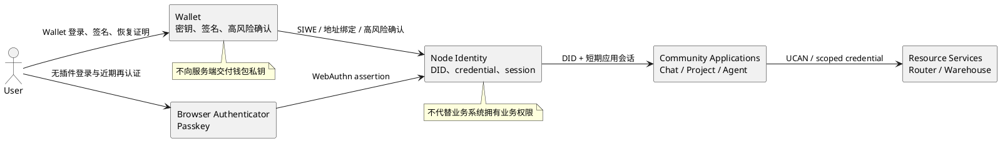
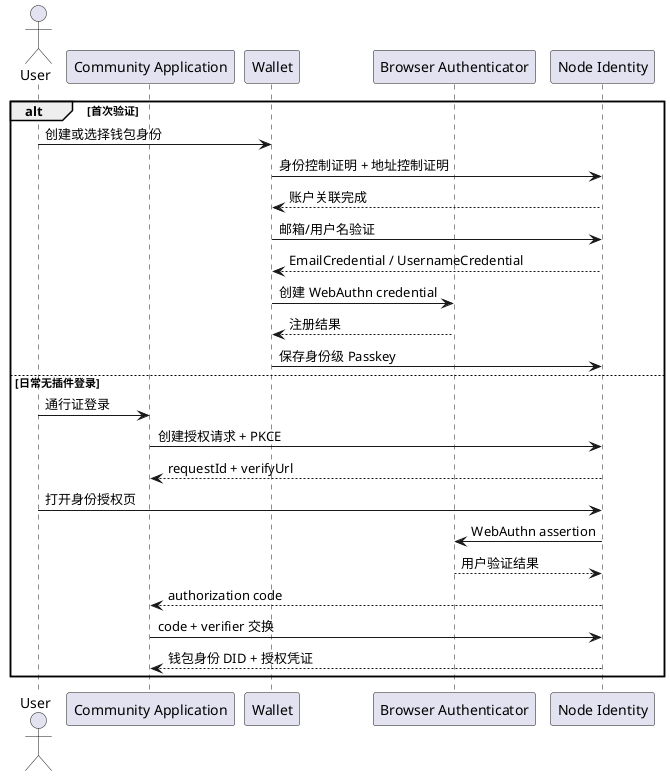
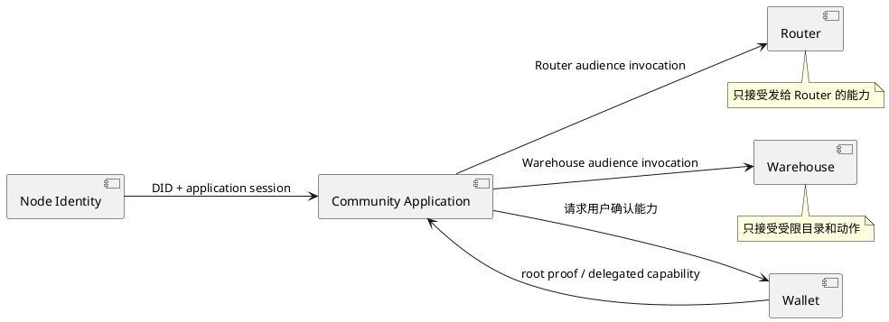
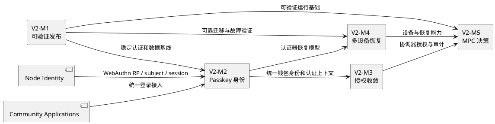

# 夜莺钱包架构 V2

> 状态：分阶段实现中；M2、M5 已完成，M1、M3、M4 尚未完成
>
> 基线来源：[钱包架构 V1](./钱包架构V1.md)
>
> 目标读者：产品负责人、Wallet、Node、Chat、Project、Agent 和安全架构维护者
>
> 本文只记录尚未进入 V1 当前实现的目标能力。目标完成并形成稳定发布后，应将实际架构重新沉淀为新的实现基线，而不是回写 V1。
>
> V2 之后的长期方向见：[钱包架构 V3](./钱包架构V3.md)。V3 聚焦不兼容 EVM 的网络适配和社区身份主体去中心化。

## 1. V2 目标

V2 在保留本地密钥安全边界的基础上，解决以下问题：

1. 让没有浏览器钱包插件的用户也能以同一社区身份登录。
2. 统一 Wallet、Node 和业务应用之间的身份主体与会话交换。
3. 将登录认证与资源能力授权彻底分离，减少长期和过宽凭据。
4. 提升多设备备份、恢复、撤销和冲突处理的可靠性。
5. 建立生产级 MPC 是否可行的明确决策和安全门槛。
6. 让关键钱包流程能够在真实浏览器环境持续验证。

## 2. 目标系统关系

## 3. V2-M1 可验证发布

> 进度：进行中。真实 Chromium 验收已覆盖首次创建 HD 钱包、助记词导入、主动锁定、错误密码拒绝、正确密码解锁、RPC 故障降级和 Service Worker 重启后的安全锁定与再次解锁，并接入 CI。存储 Map 更新已按 key 串行化，DApp 消息已严格约束协议版本。

当前已实现：创建、导入、锁定、解锁、错误密码拒绝、重开后状态保持、RPC 不可用时不阻塞钱包首页、Service Worker 生命周期恢复、同一存储集合的并发更新保护、DApp 协议版本拒绝，以及 CI 中的 Chromium 扩展冒烟测试。

尚未实现：存量升级/数据迁移的浏览器验收、存储与同步故障的浏览器注入、多窗口 UI 并发验收，以及连接站点、签名、审批和发送交易的完整浏览器 E2E。这些仍属于 V2-M1，不能以现有冒烟测试代替。

目标：关键用户路径能够在真实浏览器环境稳定、重复地验证。

范围：

- 首次安装、存量升级和数据迁移。
- 创建、导入、锁定、解锁和修改密码。
- 连接站点、消息签名、交易审批与发送。
- Service Worker 生命周期变化后的请求和解锁状态恢复。
- 存储不可用、RPC 失败、远端同步失败和多窗口并发。
- 关键协议报文和存储 schema 的静态约束。

完成条件：关键路径进入持续验证流程；发布前无需依赖非结构化人工操作才能证明数据迁移和安全回退有效。

## 4. V2-M2 钱包身份与 Passkey 登录

> 状态：正在收口到钱包身份。Node 已实现钱包身份账户关联、邮箱/用户名凭证、身份级 Passkey 注册/登录，以及 authorization code + PKCE 接口；Wallet 负责创建和保存钱包身份 DID、完成邮箱/用户名验证、注册身份级 Passkey，并在没有钱包插件的场景下通过通行证入口完成同一钱包身份登录。

> 本地联调：以 Node 本地服务为身份 issuer，验证 `/api/v1/public/identity/*` 的账户关联、邮箱/用户名凭证、Passkey 注册和授权码交换。旧 Passport subject 流程不再进入联调或测试入口。

> 应用接入：Web3 应用按 Node 契约生成服务端 PKCE verifier、创建授权请求、展示 `verifyUrl`、接收一次性 code，并在服务端换取钱包身份结果。应用不向浏览器返回 verifier；回调必须命中仍有效的本地 `state` 会话。

目标：同一钱包身份 DID 同时拥有已验证 Wallet 地址、WebAuthn Passkey、用户名和邮箱凭证。

范围：

- Node 作为 WebAuthn Relying Party。
- 钱包身份 DID 与链账户地址控制证明。
- 邮箱和用户名验证凭证。
- 身份级 Passkey 注册、撤销和登录。
- Discoverable credential 无用户名登录。
- 使用 Wallet 地址证明或身份级 Passkey 完成受控恢复。
- 通过 authorization code + PKCE 向业务应用分发钱包身份结果。

完成条件：没有 Wallet 插件的新浏览器可以登录原有钱包身份；错误 origin/RP ID、重放 challenge、缺少用户验证、缺少授权 scope 和已撤销 credential 均被拒绝。详细方案见 [通行证登录方案](./通行证登录方案.md)。

## 5. V2-M3 授权与资源访问收敛

> 状态：部分完成。Node 已支持短期中心签发和应用 UCAN 策略，Router、Warehouse 已独立校验签名、issuer、audience 与 capability，并具备受众错配拒绝测试。统一命名、错误语义和跨服务验收已形成 [UCAN 跨服务授权契约](./UCAN跨服务授权契约.md)；`grantId` 持久化及 60 秒内跨服务撤销传播尚未实现，因此不能标记完成。

目标：不同社区服务使用一致、最小且可撤销的能力凭据。

范围：

- 统一 UCAN audience、资源和动作命名。
- 建立共享的能力校验规则和错误语义。
- 使用短期、服务绑定、范围受限的资源凭据。
- 支持授权查看、撤销和审计。
- Node 登录会话不能直接成为 Router、Warehouse 等资源服务的全权凭据。

完成条件：每个资源请求可追溯至主体、grant 和 audience；跨服务令牌不能复用；撤销可在约定时间内生效。

## 6. V2-M4 多设备与恢复

> 状态：部分完成。远端加密同步、冲突 UI、payload 版本/结构校验和远端回滚检测已实现；拉取、解密或格式校验失败时停止同步，不会用本地数据覆盖不可读的远端备份。服务层新设备恢复演练已证明远端元数据不能创建钱包密钥，只有先导入同一助记词后才能恢复账户元数据。Node 已提供 Passkey 凭证列表、重命名和撤销；钱包备份设备编目、远端同步会话撤销和真实多设备浏览器联调尚未完成。

目标：设备丢失、数据损坏和多设备并发时，用户可以恢复且不降低密钥安全。

范围：

- 版本化本地与远端加密格式。
- 加密 manifest、对象完整性和远端回滚检测。
- 设备列表、远端会话撤销和恢复演练。
- 更明确的冲突 UI 和幂等同步。
- 评估差分同步，减少完整对象反复上传。
- 明确 Passkey 身份恢复、助记词钱包恢复和远端数据恢复的不同边界。

完成条件：新设备恢复、旧版本升级、并发编辑、远端故障和错误密码都有确定且经过验证的结果；Node 与远端存储服务始终不能恢复钱包私钥。存储基础方案见 [钱包存储方案](./钱包存储方案.md)，恢复对象和验收流程见 [钱包恢复边界与验收](./钱包恢复边界与验收.md)。

## 7. V2-M5 MPC 生产化决策

> 状态：决策已完成。当前 MPC 明确保持实验性，不承载或承诺生产资产安全；只有成熟门限签名实现、互操作与恢复验证、独立审计全部满足后才能重新申请生产化。决策见 [MPC 生产化决策](./MPC生产化决策.md)。

V1 中存在 MPC 协调流程相关探索，但没有形成可以承诺生产资产安全的门限密码学能力。V2 必须先作正式决策，而不是默认继续扩展。

进入生产的前置条件：

- 采用成熟、经过独立审计并支持目标曲线的门限签名实现。
- 明确参与者身份、设备密钥、恶意协调器、重放、掉线恢复和 key refresh 威胁模型。
- 完成协议互操作、故障注入和恢复演练。
- UI 清晰展示门限、参与者、签名内容和最终责任。
- 完成独立安全审计并关闭高风险发现。

完成条件：已形成正式架构决策，结论为当前不进入生产。MPC 保持实验性，不进入生产资产承诺；后续只有满足准入条件并形成新的安全评审结论，才能改变该决定。实验方案见 [MPC 门限钱包方案](./MPC门限钱包方案.md)。

## 8. 里程碑依赖

优先顺序：V2-M1 是所有后续阶段的质量基础；V2-M2 需要 Node 和业务应用共同实施；V2-M3 依赖主体与会话收敛；V2-M4 可以并行推进格式版本和恢复验证；V2-M5 在全部安全前置条件具备之前不得进入生产。

## 9. 进入实现的门槛

V2 中任何能力进入开发前必须明确：

- 用户问题、成功指标、范围和非目标。
- 责任系统、数据所有权和跨系统调用关系。
- 密钥、credential、会话、grant 和审计生命周期。
- 威胁模型、滥用场景和恢复路径。
- API 与数据格式版本、兼容迁移和回滚方案。
- 自动化验证、真实浏览器验收和发布开关。
- 负责人、依赖仓库和上线顺序。

完成后应将实际行为沉淀到对应版本的实现基线和用户/集成文档，不回写或改造 [钱包架构 V1](./钱包架构V1.md) 的事实描述。

## 10. V2 跨系统依赖与联调

V2 是社区身份、授权和恢复能力的共同版本，不是钱包插件单仓库版本。Wallet、Node、业务应用和资源服务必须在同一 V2 契约下推进并完成联调；不能因为某项能力需要跨仓库协作而后移版本。

| V2 能力 | 责任系统 | 钱包仓库交付 | 联调完成条件 |
| --- | --- | --- | --- |
| M2 钱包身份与 Passkey | Node Identity、业务应用、Wallet | 钱包身份 DID、地址控制证明、邮箱/用户名验证、Passkey 注册和登录回调适配 | Node 校验 WebAuthn；业务应用经 code + PKCE 获得钱包身份结果；无插件浏览器可登录同一钱包身份 |
| M3 授权收敛 | Node、Router、Warehouse、业务应用、Wallet | 能力确认、委托请求和授权查看 | 服务独立校验 audience/grant；撤销可传播；跨服务令牌不能复用 |
| M4 多设备恢复 | Wallet、Node、远端存储服务 | 本地加密格式、备份恢复、设备确认 UI | 设备目录、撤销、回滚检测和恢复演练形成确定结果 |
| M5 MPC 决策 | Wallet、MPC 协调服务、安全评审 | 用户确认、参与者展示和实验性适配 | 门限密码学、恢复和独立审计满足生产门槛，或正式决定不进入生产 |

每个依赖仓库在开始开发前都必须确认 API owner、版本化协议、迁移与回滚、测试环境和上线顺序。V2 仅在跨系统验收通过后完成，不以单个仓库合并代替联调。
