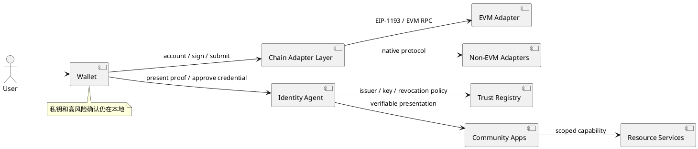
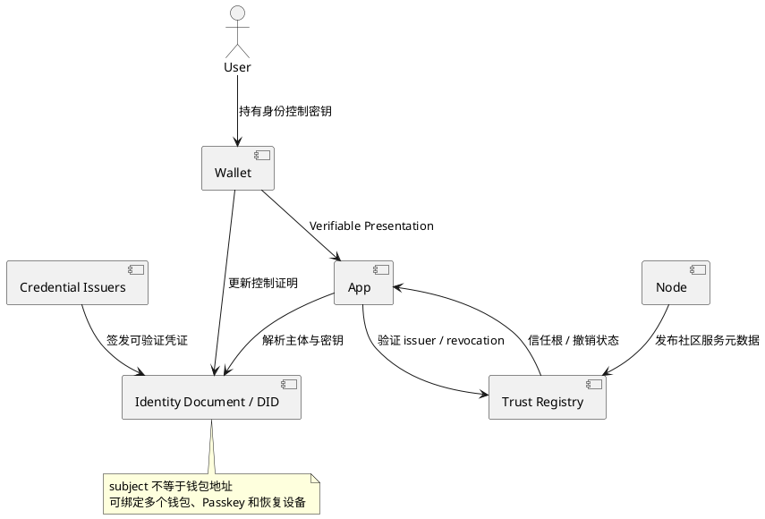

# 夜莺钱包架构 V3

> 状态：架构方向设计，尚未进入实现。
>
> V3 在 V2 的 Passkey、跨服务授权和恢复边界之上，推进两个长期方向：异构网络支持、社区身份主体去中心化。

## 1. V3 目标

1. 支持不兼容 EVM 的网络，同时保留现有 EVM DApp 兼容能力。
2. 让社区身份不依赖单一 Node 服务保存唯一主体和唯一登录入口。
3. 将“钱包密钥”“链账户”“社区身份”“应用会话”拆成可组合的协议对象。
4. 迁移过程必须兼容 V1/V2 钱包，不要求用户重新创建 EVM 钱包或社区账号。

## 2. 总体架构



## 3. 方向一：不兼容 EVM 的网络

### 3.1 不能继续沿用的假设

当前钱包大量逻辑默认：

- 地址是 `0x` 加 20 字节。
- 账户由 secp256k1 私钥派生。
- 交易有 `to/value/data/nonce/gas` 字段。
- RPC 使用 `eth_*` 方法。
- 签名可以统一映射为 ECDSA 十六进制字符串。

这些假设对 Bitcoin、Solana、Cosmos、Substrate、Sui 等网络不成立。V3 不应把非 EVM 网络伪装成“特殊 EVM 网络”，也不能复用 EVM 交易审批器后仅替换 RPC URL。

### 3.2 新的账户和网络抽象

```text
ChainDefinition
  chainKey: bitcoin:mainnet / solana:mainnet / cosmos:<chain-id>
  family: evm | utxo | solana | cosmos | substrate | object
  addressCodec
  keySchemes: [secp256k1, ed25519, sr25519, ...]
  transactionCodec
  feeModel
  signingDomain
  capabilities

Account
  accountId
  chainKey
  keyRef
  address
  publicKey
  derivationPath / derivationMeta
```

账户主键必须包含 `chainKey + accountId`，不能只用地址。相同字符串地址在不同网络或不同地址编码规则下不能视为同一账户。

### 3.3 适配器边界

每个链适配器至少实现：

- 地址派生、校验和和展示格式。
- 公钥/私钥类型与签名算法。
- 交易或消息编码、解析和签名前摘要。
- 费用估算、余额查询、广播和确认状态。
- 连接请求和审批页面所需的可读摘要。

Provider 层只向 EVM 网站暴露 EIP-1193。非 EVM 应用使用明确的链协议适配器或 Wallet Link，不能让非 EVM 请求伪装成 `eth_sendTransaction`。

### 3.4 迁移顺序

1. 先抽象 `ChainDefinition`、`Account` 和统一签名请求，不改变 EVM 行为。
2. 增加只读适配器：网络发现、地址、余额、交易历史。
3. 增加离线签名和可读审批摘要。
4. 最后增加广播、确认、DApp 连接和备份恢复。
5. 每个新链单独进行密钥派生、交易解析、恶意输入和恢复审计。

### 3.5 主要风险

- 把不同曲线的私钥错误地放入同一派生路径。
- 把原始签名当成可跨链重放的通用签名。
- 审批页无法展示非 EVM 交易的真实资产变化。
- 以地址字符串或数字 chainId 判断网络，造成跨链转账误导。
- 复用 EVM RPC 的错误、重试和确认语义，导致状态判断错误。

## 4. 方向二：社区身份主体去中心化

### 4.1 V2 的中心化边界

V2 中 Node 保存 `subjectId`、钱包绑定、Passkey 凭证和授权记录，并向 Project 分发身份结果。V3 不直接删除 Node，而是把 Node 从“唯一身份真相源”演进为：

- 默认身份服务和社区发现服务。
- 信任根和撤销状态的发布者之一。
- 应用授权协调器。

身份主体的控制权由用户持有的密钥、可验证凭证和恢复策略共同承担。

### 4.2 推荐模型



建议主体采用 DID 或等价的不可预测标识，身份文档声明控制密钥和服务端点；钱包地址、Passkey 和社区资料通过可验证凭证或绑定声明关联。`sub_xxx` 仍可作为 Node 内部兼容 ID，但不能成为唯一的跨社区身份标准。

### 4.3 去中心化的分阶段实现

**V3-A：可迁移主体**

- Node 导出主体绑定证明和凭证目录。
- Project 保存 `subjectId` 映射，但支持通过签名证明迁移到另一身份服务。
- 钱包可添加或移除多个身份控制设备。

**V3-B：可验证登录**

- 应用验证 Wallet 提交的主体证明和 Passkey 凭证，不必每次向 Node 查询登录事实。
- Node 只提供短期会话、发现和撤销状态。
- 应用配置受信 issuer、主体 DID 方法和最大凭证有效期。

**V3-C：多方信任和恢复**

- 身份控制密钥支持多设备或门限恢复。
- 撤销由多个受信服务或用户恢复委员会共同发布。
- 高风险主体变更需要旧设备、恢复密钥或延迟生效窗口。

### 4.4 必须保留的中心化能力

去中心化不等于取消所有服务端：

- 应用仍需要会话、风控、反滥用和审计。
- 社区仍需要应用登记、域名信任和凭证撤销查询。
- 用户需要明确的恢复和丢失处理，而不是不可逆的“自主管理”宣传。

## 5. 两个方向的共同安全原则

- 链账户和社区身份使用不同主键，互相通过明确的绑定证明关联。
- 应用不得把钱包地址当作永久用户 ID，也不得把 `subjectId` 当作可验证身份凭据。
- 所有签名请求声明算法、链/网络域、用途、过期时间和受众。
- 身份迁移、钱包替换、设备添加和撤销都必须产生审计事件。
- V3 新协议必须支持离线验证、撤销状态、版本协商和旧版本降级保护。

## 6. V3 里程碑

| 里程碑 | 目标 | 完成条件 |
|---|---|---|
| V3-M1 | 链适配器抽象 | EVM 行为不回归，统一账户/签名请求通过测试 |
| V3-M2 | 首个非 EVM 只读链 | 地址、余额、历史和网络识别可验证 |
| V3-M3 | 首个非 EVM 签名链 | 离线签名、审批摘要、广播和恢复通过独立测试 |
| V3-M4 | 可迁移社区主体 | 主体绑定证明可导出、验证和迁移 |
| V3-M5 | 多 issuer 可验证登录 | 应用无需依赖单一 Node 在线查询即可验证登录 |
| V3-M6 | 多方恢复和撤销 | 设备丢失、主体迁移、issuer 撤销和恢复演练通过 |

V3 不应一次性同时接入多个异构链或直接替换 V2 Passport。每个里程碑都必须有独立协议、威胁模型、迁移方案和回滚策略。
