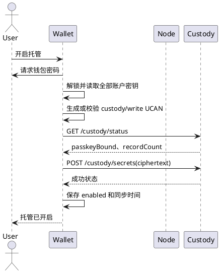
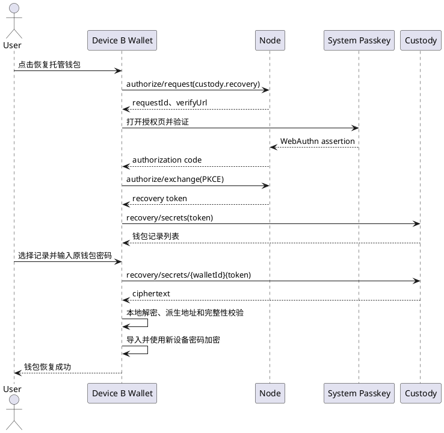

# 密钥托管验收标准

> 本文定义 Wallet 密钥托管功能的可重复验收步骤。托管对象是钱包密钥和 Wallet Identity 全部材料的密码加密密文，不包含 MPC 分片或普通数据备份。新设备恢复必须通过 Node 身份授权兑换接口取得 `custodyRecovery` token。

## 1. 验收范围

本标准覆盖以下流程：

- 配置托管服务并检查服务状态；
- 首次开启密钥托管；
- 手动同步和钱包账户变更后的完整更新；
- 已初始化设备读取托管记录并恢复钱包；
- 新设备通过身份服务授权和通行证恢复钱包；
- 钱包密码变更后的托管更新；
- 关闭托管和删除远端托管记录；
- 授权、加密、地址校验、错误处理和日志脱敏。

以下内容不属于本标准：

- Wallet Identity DID controller/recovery 私钥和身份凭证；
- MPC 钱包密钥分片、MPC 会话和设备密钥；
- WebDAV 数据备份；
- DApp 站点授权、SIWE 签名、UCAN 会话和业务数据。

## 2. 验收总则

- 每个用例记录 Wallet 版本、Node/托管服务地址、钱包类型、钱包 ID、账户地址、钱包锁定状态、通行证状态、UCAN 状态和最终结果。
- 测试只使用专用测试助记词和私钥，不使用真实资产钱包。
- 助记词、私钥、钱包密码、托管密文解密结果和 UCAN 原文不得出现在 UI、网络明文、日志、错误消息或测试报告中。
- 任意授权、密码、解密、版本、地址或网络错误都必须终止当前操作；失败操作不得标记为成功，不得覆盖有效本地数据。
- 托管服务不可用时，Wallet 仍可使用本地钱包；托管失败不能阻塞余额查看、DApp 连接和本地签名。
- “已开启”只表示远端完整密文已经成功写入并且本地状态保存成功，不能仅凭开关状态判定托管成功。

## 3. 测试环境和前置数据

### 3.1 环境

准备以下环境：

| 项目 | 要求 |
| --- | --- |
| Wallet | 当前待验收版本，浏览器扩展已重新加载 |
| Node | 可访问身份授权、通行证和托管接口 |
| 托管服务 | 提供 `/api/v1/public/custody/*` 接口 |
| 设备 A | 已创建 HD 钱包和私钥钱包测试数据 |
| 设备 B | 空 Wallet 配置，用于新设备恢复 |
| 通行证 | 至少一个 DID 已绑定 active 通行证 |
| 账号 | 至少一个可用于签名 UCAN 的解锁账户 |

### 3.2 测试数据

至少准备：

1. 一个 HD 钱包，包含主账户和至少一个子账户。
2. 一个私钥钱包，包含至少一个账户。
3. 一个未绑定通行证的身份。
4. 一个已绑定通行证的身份。
5. 正确钱包密码、错误钱包密码和长度不足 8 位的密码。
6. 有效 `custody/write` UCAN、过期 UCAN、audience 错误 UCAN、resource/action 错误 UCAN。
7. 可篡改的密文、未知版本密文、地址不匹配密文和缺少字段的密文。

## 4. 托管数据边界

### 4.1 本地构造的密文内容

Wallet 解锁后读取当前钱包全部账户，构造版本化 `secret`：

```json
{
  "version": 1,
  "wallet": {
    "id": "wallet-id",
    "name": "钱包名称",
    "type": "hd 或 imported",
    "createdAt": "创建时间",
    "accountCount": 2
  },
  "mnemonic": "仅 HD 钱包存在",
  "accounts": [
    {
      "accountId": "账户 ID",
      "address": "0x...",
      "derivationPath": "m/44'/60'/0'/0/0",
      "privateKey": "当前实现对每个可解密账户写入；只存在于 ciphertext 明文载荷"
    }
  ],
  "exportedAt": "导出时间"
}
```

`secret` 必须使用 `encryptObject(secret, password)` 加密。发送到托管服务的请求包含：

```text
walletId
accountId
address
ciphertext
metadata.version
metadata.walletType
metadata.accountCount
metadata.exportedAt
```

服务端可以看到钱包 ID、账户 ID、地址和非敏感元数据，但不能从 `ciphertext` 得到助记词、私钥或钱包密码。`privateKey` 即使属于 HD 账户，也只存在于 Wallet 本地解密前后的临时载荷中，不得出现在请求明文、日志或服务端可读字段中。

### 4.2 明确禁止托管的内容

托管请求和托管密文不得包含：

- Wallet Identity DID controller/recovery 私钥、身份文档和身份凭证；
- 用户名、邮箱、头像和 JWT-VC；
- Passkey 私钥、TOTP secret；
- MPC 分片、MPC 设备私钥和 MPC 会话；
- DApp 授权、SIWE 签名、UCAN 令牌、联系人、网络配置和交易历史。

抓包、服务端数据库、浏览器存储和日志均不得出现上述明文秘密。

## 5. 配置和状态检查

### CUST-001 默认配置

1. 打开 Wallet 设置中的密钥托管页面。
2. 确认托管服务地址默认显示 `https://node.yeying.pub`，或者显示部署配置指定的地址。
3. 确认资源和动作固定为 `custody`、`write`，普通用户页面不要求手工填写 UCAN token。
4. 未开启托管时，状态显示“未开启”，同步按钮不可执行。

预期：配置页面不显示钱包密码、助记词、私钥或 UCAN 原文。

### CUST-002 地址校验

1. 输入空地址，保存配置。
2. 输入非法 URL，保存配置。
3. 输入合法 HTTP 或 HTTPS URL，保存配置。

预期：非法 URL 被拒绝；合法地址保存后去除末尾多余 `/`；配置失败不改变原地址。

### CUST-003 服务状态

1. 在托管页面点击“检查状态”。
2. 输入钱包密码。
3. Wallet 请求托管服务状态。

预期：页面显示 `passkeyBound`、远端记录数量和最近同步时间。密码错误、服务不可用或 HTTP 非成功响应时显示明确错误，不能显示“已绑定”或“已同步”。

## 6. 首次开启托管

### CUST-010 已绑定通行证且 UCAN 有效

1. 使用设备 A 解锁 Wallet。
2. 确认当前钱包包含全部待托管账户。
3. 打开密钥托管开关。
4. 在密码窗口输入当前钱包密码。
5. Wallet 校验或生成目标为托管服务的 UCAN，能力必须为 `custody/write`。
6. Wallet 获取托管服务状态，确认 `passkeyBound=true`。
7. Wallet 读取当前钱包全部账户，在本地构造 `secret` 并加密。
8. Wallet 调用 `POST /api/v1/public/custody/secrets`。
9. 服务端成功返回后，Wallet 保存 `custodyEnabled=true`、服务地址、最近同步时间和远端状态。

预期：

- 页面显示“密钥托管已开启”；
- 远端只产生当前 `walletId` 的一条完整记录；
- HD 钱包的主账户和子账户均包含在同一密文中；
- 私钥钱包的全部账户私钥均包含在同一密文中；
- 网络请求和日志中没有明文助记词、私钥或密码；
- 本地设置中不保存钱包密码。

### CUST-011 未绑定通行证

1. 切换到未绑定通行证的身份。
2. 使用正确密码开启托管。

预期：状态检查返回未绑定，操作失败并提示先绑定通行证；开关恢复为关闭；不得上传 `ciphertext`，不得写入“已开启”状态。

### CUST-012 Wallet 锁定或密码错误

1. 锁定 Wallet，开启托管；或者输入错误密码。
2. 观察页面、网络请求和本地设置。

预期：操作在读取密钥前失败；不调用成功的 `upsertSecret`；开关保持原状态；本地钱包和原托管记录不变。

### CUST-013 当前钱包无可托管密钥

1. 使用没有可用账户密钥的钱包状态执行开启操作。

预期：返回“当前钱包没有可托管的密钥”类错误，不产生远端记录，不改变本地开启状态。

## 7. 手动同步和内容更新

### CUST-020 强制同步

1. 在已开启托管的钱包中点击“立即同步”。
2. 输入当前钱包密码。
3. Wallet 使用 `forceRefresh=true` 重新取得或生成 UCAN，并重新构造全部账户密文。

预期：服务端同一 `walletId` 的记录被完整更新；页面更新最近同步时间；同步成功提示只在服务端写入成功后出现。

### CUST-021 新增 HD 子账户

1. 在设备 A 新增一个 HD 子账户。
2. 执行“立即同步”。
3. 从托管服务读取并解密记录。

预期：远端仍使用同一 `walletId`，密文包含原账户和新增账户；服务端不生成第二个独立钱包记录。

### CUST-022 删除或导入账户

1. 删除一个本地账户，执行同步。
2. 再导入一个账户，执行同步。
3. 读取远端密文并比较账户集合。

预期：远端内容是当前钱包的完整快照，不保留已删除账户，不丢失仍存在的账户，不按明文合并不同版本。

### CUST-023 修改钱包密码

1. 在已开启托管的钱包中将密码从旧密码改为新密码。
2. 使用新密码点击“立即同步”。
3. 尝试使用旧密码解密改密前的托管密文。

预期：

- Wallet 本地钱包密钥使用新密码；
- 改密后的旧远端密文不能使用新密码解密；
- 使用新密码同步后，新的远端密文可以解密；
- 旧密码不能解密新的远端密文；
- 同步失败不把本地开关伪装成已同步。

## 8. 已初始化设备恢复

该流程用于设备上已经有 Wallet 且已经具备 `custody` UCAN 的情况。恢复必须在没有相同地址本地钱包的测试环境执行。

### CUST-030 读取托管记录

1. 使用有效 `custody` UCAN 请求 `GET /api/v1/public/custody/secrets`。
2. 选择一个 `walletId` 请求对应记录。
3. 输入原钱包密码。

预期：Wallet 在本地解密记录，并校验版本、钱包类型、首账户地址和 HD 派生结果。服务端只返回密文和元数据，不返回明文助记词或私钥。

### CUST-031 HD 钱包恢复

1. 选择 `walletType=hd` 的记录。
2. 输入创建托管记录时使用的原钱包密码。
3. Wallet 解密助记词并按记录中的派生路径计算首地址。
4. 地址校验成功后调用本地 HD 导入流程。

预期：新设备导入成功，地址与托管记录一致；本地使用输入的密码重新加密保存；托管服务不获得新设备密码。

### CUST-032 私钥钱包恢复

1. 选择 `walletType=imported` 的记录。
2. 输入原钱包密码。
3. Wallet 解密第一个账户私钥并计算地址。
4. 地址校验成功后调用本地私钥导入流程。

预期：导入地址与托管记录一致；错误私钥或地址不匹配时拒绝导入。

## 9. 新设备通行证恢复

新设备恢复使用独立的恢复授权，不把普通 `custody/write` UCAN 复制到新设备。

前置条件：Node 的 `POST /api/v1/public/identity/authorize/exchange` 在 `custody.recovery` scope 下返回短期 `custodyRecovery.token`。Wallet 当前会读取该字段；只返回 DID、地址或资料凭证而没有恢复 token 时，后续托管列表请求不得开始。

### CUST-040 授权请求

1. 在设备 B 的欢迎页面点击“恢复托管钱包”。
2. Wallet 生成 PKCE verifier、challenge 和 state，并保存到本地临时状态。
3. Wallet 请求 Node：

```text
POST /api/v1/public/identity/authorize/request
scopes = ["identity.basic", "custody.recovery"]
```

4. 浏览器打开 Node 授权页面。
5. 用户使用已绑定到该 DID 的通行证完成验证。
6. Node 回调 Wallet，Wallet 校验 `state` 和 PKCE code verifier。
7. Wallet 调用 `POST /api/v1/public/identity/authorize/exchange`，取得短期恢复 token。

预期：

- 未完成通行证验证不能进入托管记录选择页；
- state、redirect URI、PKCE 不匹配时拒绝兑换；
- 恢复 token 只保存在临时本地状态，不写入日志；
- 恢复授权完成后只显示可恢复的钱包记录，不显示密文内容。

若 Node 未返回 `custodyRecovery.token`，预期为明确失败并停留在授权失败状态；该用例不得降级为普通身份登录或直接调用 `custody/write`。

### CUST-041 选择记录并恢复

1. Wallet 使用恢复 token 请求 `GET /api/v1/public/custody/recovery/secrets`。
2. 用户选择一个钱包记录。
3. 输入创建托管记录时使用的原钱包密码。
4. Wallet 请求对应恢复密文。
5. Wallet 在本地解密并执行版本、类型、首地址和 HD 派生校验。
6. 校验成功后导入钱包，并清除恢复 token、PKCE 状态和密码输入框。

预期：

- 恢复成功后显示“钱包恢复成功”；
- 新设备产生新的本地 `walletId`，但恢复地址保持一致；
- 本地导入后的钱包使用恢复输入的密码；
- 设备 B 不恢复设备 A 的站点授权、UCAN 会话或 MPC 分片；必须恢复身份 controller/recovery 加密私钥及同一 DID；
- 恢复失败不得创建钱包或账户。

本用例必须验证 Wallet Identity DID 恢复：恢复后的 `document.id`、controller/recovery 公钥和本地加密控制密钥必须与设备 A 完全一致。

### CUST-042 恢复授权失败

分别验证以下情况：

- 通行证取消或验证失败；
- authorization code 过期；
- state 不匹配；
- PKCE verifier 不匹配；
- Node 返回的恢复 token 缺失；
- 恢复 token 过期或没有 `custody.recovery` 权限；
- 远端记录为空。

预期：每种情况都停留在失败状态，显示明确错误；不显示记录密文，不导入钱包，不保留已失效的临时恢复授权。

## 10. 解密和完整性验收

### CUST-050 密码错误

1. 对有效托管记录输入错误密码。

预期：AES-GCM 完整性校验失败，返回密码错误或密文损坏；不调用本地导入流程，不创建钱包，不修改当前钱包。

### CUST-051 密文篡改

1. 修改 `ciphertext` 任意字符后恢复。

预期：解密失败；不接受部分内容，不降级为明文解析，不写入本地钱包。

### CUST-052 未知版本和字段缺失

分别移除或修改以下字段：

- `secret.version`；
- `secret.wallet`；
- `secret.accounts`；
- HD 钱包的 `mnemonic`；
- 私钥钱包首账户的 `privateKey`；
- 首账户 `address`。

预期：恢复被拒绝，返回格式或版本错误，不调用导入流程。

### CUST-053 地址不匹配

1. 保留有效助记词或私钥，修改记录中的首账户地址。
2. 执行恢复。

预期：派生地址与记录地址不一致时返回地址校验失败，不导入密钥。

## 11. UCAN 和服务端权限

### CUST-060 写入权限

验证 `handleEnableCustody`、状态读取、同步和关闭操作：

- audience 必须指向当前托管服务；
- resource 必须为 `custody`；
- action 必须为 `write`；
- token 未过期且未进入刷新窗口；
- token 不匹配目标时必须重新生成或拒绝请求。

预期：audience、resource、action、签发主体或有效期任一不符合时，服务端拒绝操作，Wallet 不显示成功。

### CUST-061 恢复权限

恢复接口只接受 Node 授权返回的恢复 token。普通 `custody/write` UCAN 不能访问恢复列表接口；没有 `custody.recovery` 权限的 token 必须返回未授权。

### CUST-062 UCAN 刷新

1. 配置有效且未临近过期的 token，执行同步。
2. 配置临近过期或 `forceRefresh=true` 的 token，执行同步。
3. 配置 audience、resource 或 action 不一致的 token，执行同步。

预期：第一种情况复用有效 token；第二、三种情况使用解锁账户重新生成目标 token；生成失败时不上传密文。

## 12. 关闭托管和远端删除

### CUST-070 正常关闭

1. 在已开启托管的钱包中关闭开关。
2. 输入钱包密码。
3. Wallet 使用 `custody/write` 权限调用：

```text
DELETE /api/v1/public/custody/secrets/{walletId}
```

4. 删除成功后更新本地状态。

预期：远端记录删除，本地显示未开启，最近状态清除；本地钱包、身份和账户不被删除。

### CUST-071 删除失败

1. 让 DELETE 请求返回 401、403、404 或 5xx。
2. 观察开关和本地设置。

预期：页面显示关闭失败，开关恢复为开启，远端记录状态不被伪造；本地钱包不受影响。

### CUST-072 删除本地钱包

1. 在托管记录仍存在时删除本地钱包。
2. 检查远端记录。

预期：本地删除不静默删除远端托管记录；远端删除必须通过关闭托管或明确的删除操作完成。

## 13. 故障矩阵

| 条件 | 预期错误或结果 | 是否允许写远端 | 是否允许导入 |
| --- | --- | --- | --- |
| 托管服务地址为空 | 托管服务地址未配置 | 否 | 否 |
| 地址格式错误 | 托管服务地址格式不正确 | 否 | 否 |
| Wallet 锁定 | 需要解锁钱包 | 否 | 否 |
| 钱包密码错误 | 密码错误或密文损坏 | 否 | 否 |
| 未绑定通行证 | 请先绑定通行证 | 否 | 否 |
| UCAN 过期或能力错误 | 未授权或 UCAN 能力不完整 | 否 | 否 |
| 服务端 401/403 | 托管请求未授权 | 否 | 否 |
| 服务端 404/5xx | 托管服务请求失败 | 否 | 否 |
| 密文篡改 | 密文完整性校验失败 | 不适用 | 否 |
| 未知 `version` | 托管记录格式不受支持 | 不适用 | 否 |
| 地址不匹配 | 托管记录地址校验失败 | 不适用 | 否 |
| 恢复记录为空 | 没有可恢复的托管钱包 | 不适用 | 否 |
| 恢复成功 | 钱包导入成功 | 不适用 | 是 |

## 14. 页面和网络流程

### 14.1 开启和同步



### 14.2 新设备恢复



## 15. 安全和隐私验收

- 浏览器开发者工具的 Request、Response、Console 和 Network 保存内容中没有助记词、私钥或密码。
- Node、托管服务、Wallet background、Service Worker 和 UI 日志只记录钱包 ID、地址摘要、记录数量、状态和错误码。
- 托管密文使用独立 salt 和 nonce；重复同步不能复用同一密文参数。
- 复制 `chrome.storage.local` 后不能直接得到可用助记词或私钥。
- 锁定 Wallet、关闭浏览器、扩展重新加载后，内存中的明文密钥和临时恢复 token 都不可继续使用。
- 远端服务不能使用托管密文直接完成链上签名。
- 托管恢复必须恢复 Wallet Identity controller/recovery 加密私钥和原 DID。
- MPC 分片不进入托管请求、普通备份、诊断摘要和测试报告。

## 16. 最小回归集合

每个发布候选版本至少执行：

1. `CUST-001` 至 `CUST-003`，确认配置和状态显示。
2. `CUST-010`、`CUST-011`、`CUST-012`，确认首次开启的授权和失败回滚。
3. `CUST-020` 至 `CUST-023`，确认完整快照更新和密码变更。
4. `CUST-030` 至 `CUST-032`，确认 HD 和私钥钱包恢复。
5. `CUST-040` 至 `CUST-042`，在 Node 已返回 `custodyRecovery` token 的版本中确认新设备通行证恢复和 PKCE 校验；未接线时记录为阻塞项。
6. `CUST-050` 至 `CUST-053`，确认密文、版本和地址完整性。
7. `CUST-060` 至 `CUST-062`，确认 UCAN audience、能力和有效期。
8. `CUST-070` 至 `CUST-072`，确认远端删除和本地钱包边界。
9. 检查抓包、日志、浏览器存储和错误报告，确认没有秘密泄漏。

自动化测试至少覆盖：

- 密文载荷字段白名单；
- 错误密码和篡改密文拒绝恢复；
- 地址派生不匹配拒绝恢复；
- 未绑定通行证不能开启托管；
- 托管同步失败时 UI 开关回滚；
- 新设备恢复成功后地址保持一致；
- 恢复失败不写入钱包、账户和身份存储。

## 17. 验收记录模板

```text
用例编号：CUST-___
执行时间：____
Wallet 版本：____
浏览器和版本：____
Node/托管服务地址：____
钱包类型：hd / imported
钱包 ID：____
账户地址：____
Wallet 锁定状态：locked / unlocked
通行证状态：bound / unbound
UCAN audience/resource/action：____ / custody / write
操作步骤：____
预期结果：____
实际结果：____
最终错误码或状态：____
网络和日志是否泄露秘密：是 / 否
结论：通过 / 不通过
```
