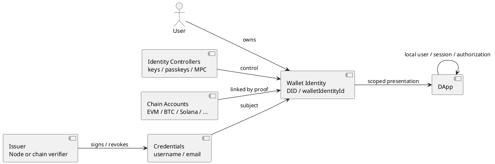

# 钱包身份协议与数据模型

> 状态：实施前设计基线，尚未上线。
>
> 适用范围：Wallet、Node/验证服务、web3-bs、Project、Router、Social 与其他 DApp。
>
> 非目标：本文件不定义某条区块链的交易格式、资产托管规则或某个应用的业务权限。

## 1. 决策摘要

钱包身份不是 EVM 地址、助记词、某个钱包文件、Node 账户或应用用户。它是用户持有且可恢复、可关联多链账户和多个控制器的稳定主体。

首版身份主键为 Wallet 本地生成的随机 `walletIdentityId`，主体标识为 `did:yeying:<walletIdentityId>`。该标识不从地址、邮箱、用户名、助记词或 Node 数据库 ID 派生。

一个用户可以拥有多个钱包身份；一个钱包身份可以关联多个 EVM 与非 EVM 账户、多个控制器和多个验证服务。任何自动合并账户、助记词或身份的行为都被禁止。

Node 是可替换的验证服务和凭证签发方（issuer），不拥有用户身份、私钥、资产、用户名、邮箱或业务账户。它只在执行验证、签发、撤销和反滥用时保存必要最小状态。

本方案不保留 `subjectId`、`sub_xxx` 或 Node Passport subject 兼容层；它们不得进入新的 Wallet、Node、web3-bs 或 DApp 外部契约。

## 2. 概念与所有权

| 对象 | 主键/形式 | 所有者 | 生命周期 |
| --- | --- | --- | --- |
| 钱包身份 | `walletIdentityId` / `did:yeying:<id>` | 用户 | 跨链、跨设备、跨应用长期存在 |
| 身份控制器 | 公钥、Passkey、MPC 控制器或恢复密钥 | 用户 | 可添加、轮换、撤销 |
| 链账户 | `chainKey + accountId` | 用户 | 可绑定/移除，不等于身份 |
| 账户关联证明 | 双方控制证明 | 用户 | 随关联撤销或过期 |
| 验证服务关联 | issuer DID/URL 与服务策略 | 用户 | 可随时移除 |
| 用户名/邮箱凭证 | issuer 签名的 credential | 用户持有，issuer 可撤销 | 可更新、过期或撤销 |
| 应用本地用户 | `localUserId` | DApp | DApp 自行管理 |
| 应用会话 | Cookie/token | DApp | 短期、可注销 |



## 3. 多钱包、多链规则

### 3.1 默认关系

新建 Wallet 时，用户创建一个默认的个人钱包身份；该身份可以关联当前及未来创建的账户。导入私钥、助记词、硬件钱包或 MPC 钱包时，用户必须明确选择：

1. 关联至已有钱包身份。
2. 创建新的钱包身份。
3. 仅导入为独立链账户，暂不关联身份。

“同一助记词派生”“地址在同一设备”“曾经登录同一应用”都不是自动关联或自动合并的依据。

### 3.2 多身份

用户可创建个人、工作、组织/金库或隔离身份。Wallet 应以身份为顶层组织账户和凭证，不以某个 EVM 地址或助记词为顶层。

```text
Wallet Client
  Identity: personal
    - EVM account A
    - EVM MPC vault B
    - Solana account C
    - EmailCredential / UsernameCredential
  Identity: work
    - EVM account D
    - Passkey controller
  Identity: treasury
    - MPC controller quorum
    - organization-issued credentials
```

身份合并是高风险操作，首版不实现。未来若支持，必须要求两个身份各自满足修改策略的控制器签名，提供延迟窗口、审计和恢复取消能力。

## 4. 身份标识和文档

### 4.1 标识

```text
walletIdentityId: wid_<128-bit-or-greater-random-base64url>
did:              did:yeying:wid_<...>
```

`walletIdentityId` 必须由加密安全随机数生成，永不复用，且不能包含用户名、邮箱、地址、链 ID 或 Node 生成 ID。Wallet 在身份创建时本地生成它；Node 只能验证并引用该标识。

### 4.2 身份文档

首版使用 Wallet 加密本地存储的版本化身份文档，并提供导出格式。解析和更新不依赖链上注册。后续可以把同一语义锚定到 DID resolver 或链上注册表，但不得改变对象含义。

```ts
type WalletIdentityDocument = {
  version: 1;
  id: `did:yeying:${string}`;
  walletIdentityId: string;
  createdAt: string;
  updatedAt: string;
  revision: number;
  controllers: IdentityController[];
  accounts: LinkedAccount[];
  issuers: TrustedIssuerLink[];
  recovery: RecoveryPolicy;
};

type IdentityController = {
  controllerId: string;
  kind: 'wallet_key' | 'passkey' | 'mpc' | 'recovery_key';
  publicKey: string;
  algorithm: 'secp256k1' | 'ed25519' | 'p256' | 'multisig';
  purposes: Array<'authentication' | 'assertion' | 'manage' | 'recovery'>;
  status: 'active' | 'revoked';
  addedAt: string;
  revokedAt?: string;
};

type LinkedAccount = {
  accountId: string;
  chainKey: string;
  family: 'evm' | 'utxo' | 'solana' | 'cosmos' | 'substrate' | 'sui';
  address: string;
  publicKey?: string;
  controllerId: string;
  proof: AccountLinkProof;
  status: 'active' | 'revoked';
  createdAt: string;
  revokedAt?: string;
};
```

## 5. 链账户关联

### 5.1 链无关约束

- `chainKey` 是完整命名空间，不得只使用数字 `chainId`。推荐采用 CAIP-2/等价形式，如 `eip155:1`、`solana:mainnet`、`bip122:<genesis-hash>`。
- 地址的唯一性范围是 `chainKey + address`，不能跨链把相同字符串地址视为同一账户。
- `accountId` 是 Wallet 内部稳定记录 ID；地址变动、UTXO 派生路径或重新发现不应改变身份主键。
- `controllerId` 和地址分离。一个控制器可以管理多个账户；同一身份也可使用多个控制器。

### 5.2 双向证明

将账户加入身份必须同时证明：现有身份控制器同意，且新账户控制者确实控制该地址/公钥。

```ts
type AccountLinkProof = {
  version: 1;
  identity: string;
  account: { chainKey: string; address: string; publicKey?: string };
  nonce: string;
  issuedAt: string;
  expiresAt: string;
  purpose: 'identity-account-link';
  identityControllerProof: SignatureProof;
  accountControlProof: SignatureProof;
};
```

签名域必须包括链、网络、地址、身份 DID、用途、nonce 和过期时间。不得把普通交易签名、SIWE 登录签名或历史消息签名复用于账户关联。

### 5.3 移除与轮换

移除账户不销毁身份或其他账户。若被移除账户是唯一 `manage` 控制器，操作必须被拒绝；若是高价值/MPC 控制器，默认延迟生效并允许恢复控制器取消。

## 6. 控制器与恢复

身份的“拥有权”由控制器和恢复策略决定，不由 Node 或某个单一地址决定。

首版最小策略：

- 创建身份时添加一个 `wallet_key` 控制器，具备 `authentication`、`assertion`、`manage`。
- 添加控制器：现有 `manage` 控制器批准，且新控制器提交持有证明。
- 修改/移除控制器：满足 `manage` 策略；不得移除最后一个 `manage` 控制器。
- 恢复：首版至少支持恢复密钥；MPC 或多设备恢复作为后续能力。
- 高风险变更：控制器替换、恢复策略变更、身份合并必须记录审计，并提供延迟窗口。

Passkey、MPC 和硬件钱包都是控制器实现，不是钱包身份本身。

## 7. 验证服务关联与凭证

### 7.1 操作分离

| 操作 | 输入 | 服务端职责 | 结果 |
| --- | --- | --- | --- |
| 关联验证服务 | DID、钱包控制证明、issuer 元数据 | 校验控制证明和服务策略 | `TrustedIssuerLink` |
| 验证用户名 | DID、控制证明、用户名 | 规范化、唯一性/保留词检查、签发 | `UsernameCredential` |
| 验证邮箱 | DID、控制证明、邮箱、验证码 | 投递验证码、校验控制权、签发 | `EmailCredential` |
| 移除服务关联 | DID、控制证明、issuer ID | 撤销关联和该 issuer 凭证 | Wallet 停止信任 issuer |

“关联验证服务”成功不表示用户名或邮箱已验证；资料验证失败、取消或未开始也不得阻止解除关联。

### 7.2 Issuer 关联

```ts
type TrustedIssuerLink = {
  issuer: string;                 // issuer DID or canonical HTTPS URL
  displayName: string;
  credentialFormats: string[];
  verificationMethod: string;    // JWKS/DID document/key id
  revocationEndpoint?: string;
  linkedAt: string;
  status: 'active' | 'revoked';
};
```

Wallet 不得仅因网络地址可访问就信任 issuer。首次关联必须展示 issuer 名称、签发范围、隐私说明、撤销端点和验证密钥来源，由用户确认。

### 7.3 凭证最小格式

首版选择可离线验证的非对称签名 JWS/VC 形式；禁止继续使用仅 Node 可解密或对称密钥签发的 assertion 作为长期凭证。JSON/JSON-LD 的具体封装可后续确定，但以下语义为固定字段。

```ts
type VerifiedCredential = {
  id: string;
  type: 'UsernameCredential' | 'EmailCredential';
  issuer: string;
  subject: `did:yeying:${string}`;
  issuedAt: string;
  expiresAt?: string;
  status: { type: 'StatusList' | 'OnlineStatus'; id: string };
  claims: Record<string, unknown>;
  proof: { type: string; verificationMethod: string; proofValue: string };
};
```

`UsernameCredential.claims` 至少包含规范化 `username` 与 `usernamePolicyVersion`。`EmailCredential.claims` 至少包含 `email`、`emailVerifiedAt` 与验证方法版本。完整邮箱只在用户授权对应 scope 时出示。

## 8. DApp 登录与 Presentation

### 8.1 保留 SIWE 入口，替换身份载荷

DApp 保留现有 `challenge` / `verify`。只需地址的场景保持普通 SIWE，不请求身份 scope，也不需要访问 issuer。

需要身份或验证资料时，DApp 后端在 challenge 会话中固化 `appId`、`audience`、`nonce`、`scope`、`expiresAt`。Wallet 在用户确认后返回控制证明和 Verifiable Presentation。

```text
DApp backend -> Wallet: challenge + audience + nonce + requested scope
Wallet -> User: 展示身份、账户和资料声明授权
Wallet -> DApp: walletProof + identityPresentation
DApp backend: 校验控制证明、issuer 签名、scope、audience、nonce、时效、撤销
DApp backend: did:yeying:* -> localUserId -> local session
```

### 8.2 Scope

| Scope | Wallet 返回 | 后端校验 |
| --- | --- | --- |
| `identity.basic` | DID、当前控制器证明 | DID 格式、控制器用途、audience、nonce、时效 |
| `identity.wallet` | 当前关联账户及链信息 | 账户关联证明、钱包签名与账户一致 |
| `identity.username` | `UsernameCredential` | issuer 信任、非对称签名、subject、状态、scope、audience、nonce、时效 |
| `identity.email` | `EmailCredential` | issuer 信任、非对称签名、subject、状态、scope、audience、nonce、时效 |

一个凭证不得因为钱包曾给过某站点 profile 权限就自动出示。每次 presentation 都受本次 scope、受众、nonce 和用户确认限制。

### 8.3 无插件登录

无 Wallet 插件时，仍使用 authorization code + PKCE，但授权器是钱包身份的 Passkey/恢复设备。服务端 exchange 返回同样的 DID 和 scope 限制的 presentation；DApp 不因入口不同而建立第二套用户主键。

## 9. 数据存储与隐私

Wallet 本地加密保存身份文档、控制器私密材料引用、issuer 关联和用户持有凭证。备份必须绑定用户密钥，远端同步服务不得能解密身份私钥或凭证明文。

Issuer 仅保存：DID、凭证 ID、必要的用户名规范值/哈希、邮箱投递与验证最小数据、签发时间、撤销状态、限流和审计记录。验证码只保存哈希且有短期有效期；日志不得记录验证码、完整 presentation、完整签名或不必要的邮箱正文。

DApp 只保存自身必要的 `DID -> localUserId` 映射、用户授权资料副本和本地业务审计。DApp 不得把拿到的邮箱凭证转给其他应用或将其当作跨站跟踪 ID。

## 10. 安全约束

1. 所有控制证明、账户关联和 presentation 必须包含域、用途、受众、nonce、签发时间和过期时间。
2. 不接受地址字符串、前端用户名/邮箱、普通签名文本或钱包 profile 作为验证资料。
3. issuer 使用非对称签名并公开验证材料；DApp 默认离线验签，撤销查询有明确最大陈旧时间。
4. 资料凭证 subject 必须与本次 DID 控制证明一致。
5. Wallet 不自动合并账户、身份或 issuer；用户可见并确认所有高风险关联。
6. 所有修改身份文档的请求均以 `revision` 防并发覆盖，并生成可审计事件。
7. 不支持的链、算法、凭证格式或 issuer 必须失败关闭，不得降级为信任前端声明。

## 11. 实施顺序

1. **协议冻结**：确认 DID 方法、身份文档 canonical serialization、签名算法、凭证封装、issuer 元数据与撤销格式。
2. **Wallet foundation**：实现 `walletIdentityId`、身份文档、本地加密存储、初始控制器、账户关联证明和多身份选择。
3. **Node issuer**：删除 Passport subject 模型，改为 DID subject；实现非对称 issuer key、JWKS/DID 元数据、用户名/邮箱凭证和撤销。
4. **web3-bs**：提供 `requestIdentityPresentation`、presentation 类型、DApp 验证辅助和失败状态。
5. **DApp migration**：Project、Router、Social 以 DID 映射本地用户，按需请求 scope，离线验签并处理撤销。
6. **恢复与多链**：增加 Passkey/MPC/recovery 控制器、首个非 EVM 账户关联及演练。

## 12. 验收标准

- 用户能创建两个独立钱包身份，导入账户时可选择归属，Wallet 不自动合并。
- 一个身份可关联至少两个 EVM 账户和一个非 EVM 测试账户，且所有关联均有双向证明。
- 用户名与邮箱凭证的 subject 均为 DID；更换一个地址后凭证继续可用。
- 普通 SIWE 地址登录不依赖 Node；请求资料 scope 时 DApp 能离线验证 presentation。
- 过期、撤销、错误 issuer、错误 audience、nonce 重放、账户/控制器不匹配和未授权 scope 均被拒绝。
- 移除 issuer 不删除钱包身份或资产，且不会继续向 DApp 出示该 issuer 的凭证。
- 丢失日常地址后，恢复控制器仍可恢复身份；任何单个非恢复地址均不能绕过恢复策略。

## 13. V1 Profile 决策

以下选择已冻结为 v1 实现契约。它们优先保证 Wallet JavaScript、Node TypeScript、web3-bs JavaScript 以及 DApp 的 Java/Go/JavaScript 后端能用成熟库实现和离线验签；不以首版支持选择性披露、多链链上注册或复杂门限策略为前提。

### 13.1 DID 文档：受信目录解析，本地优先

v1 DID 方法固定为 `did:yeying:<walletIdentityId>`。

- Wallet 是身份文档的创建者、加密本地存储者和用户可导出的事实源。
- Node 提供只读的受信 DID 目录端点，例如 `GET /.well-known/yeying-identities/<walletIdentityId>`，用于让 DApp 取得最新公开控制器、revision、账户关联摘要和 issuer 服务端点。
- 文档更新必须由当前 `manage` 控制器签名；目录只校验、版本化和发布签名文档，不生成 DID 或替用户修改控制器。
- DApp 校验 presentation 时可使用 presentation 内嵌的控制器证明；需要最新控制器或撤销信息时解析目录。目录不可用时，依赖当前未过期的 presentation 和本地缓存策略，不得接受无法验证的身份更新。
- 首版不要求链上锚定，不使用 `did:pkh` 作为身份 DID。后续可把同一 canonical 文档哈希锚定到链、IPFS 或独立 resolver，但不能变更 DID、控制器、账户关联和凭证的语义。

身份文档签名输入固定采用 RFC 8785 JCS（JSON Canonicalization Scheme）后的 UTF-8 字节；所有时间使用 RFC 3339 UTC；`revision` 必须单调递增，更新请求带前一 revision，防止并发覆盖。

### 13.2 凭证封装：紧凑 JWS JWT-VC Profile

v1 采用紧凑序列化 JWS JWT-VC profile，issuer 使用 Ed25519 `EdDSA` 签名并通过 JWKS 发布公钥。它的目标是让 Web extension、Node、Java 与 Go 后端可以直接用标准 JWT/JWS 库验证，而不要求 JSON-LD canonicalization 或 SD-JWT 选择性披露实现。

凭证 JWT 的固定声明：

```json
{
  "iss": "did:web:node.yeying.pub",
  "sub": "did:yeying:wid_<random>",
  "jti": "urn:yeying:credential:<random>",
  "iat": 1786579200,
  "nbf": 1786579200,
  "exp": 1787184000,
  "vc": {
    "type": ["VerifiableCredential", "UsernameCredential"],
    "credentialSubject": {
      "id": "did:yeying:wid_<random>",
      "username": "alice",
      "usernamePolicyVersion": "v1"
    },
    "credentialStatus": {
      "id": "https://node.yeying.pub/api/v1/public/identity/credentials/<jti>/status",
      "type": "YeyingCredentialStatusV1"
    }
  }
}
```

- 邮箱凭证同样使用 `EmailCredential`，并在 `credentialSubject` 写入 `email` 与 `emailVerifiedAt`。
- `kid` 必须指向 issuer JWKS 中当前或未过期的 Ed25519 公钥；DApp 必须限定 `alg=EdDSA`，禁止算法协商或接受 `none` / 对称算法。
- v1 presentation 不追求同一凭证的选择性披露。Wallet 只在用户授权相应 scope 时携带完整用户名或邮箱凭证；不请求 `identity.email` 时绝不发送邮箱凭证。
- SD-JWT VC 是 v2 优化项，用于未来在同一凭证内最小化披露；Data Integrity VC 仅在需要 JSON-LD 生态互操作时评估，不阻塞 v1。

### 13.3 撤销：短期凭证加在线状态

v1 采用“短期凭证 + 在线状态”组合，而非首版实现 StatusList。

- `UsernameCredential` 与 `EmailCredential` 默认有效期为 24 小时，最长不得超过 7 天；Wallet 在出示前按需刷新。
- issuer 提供批量状态查询 `POST /api/v1/public/identity/credentials/status` 和单凭证状态 URL；返回 `active`、`revoked`、`superseded` 或 `unknown`，并带 `checkedAt`、`nextUpdateAt`。
- DApp 对登录、资料变更、组织管理和高风险写操作必须在线检查状态，且状态不得超过 5 分钟；检查失败或状态未知时失败关闭。
- 对只读低风险展示，可接受最多 1 小时的已缓存 `active` 状态，但不得因此建立长会话或执行授权写操作。
- 用户名/邮箱变更时 issuer 先签发新凭证，再将旧凭证标记为 `superseded`；移除 issuer 关联或发现滥用时标记为 `revoked`。
- v2 可在保持相同状态语义的前提下增加 W3C StatusList，降低在线查询频率。

### 13.4 控制器与恢复：单管理控制器加恢复密钥

v1 身份文档采用明确而保守的 1-of-1 管理策略：

- 初始 `wallet_key` 控制器具有 `authentication`、`assertion`、`manage` 三项用途。
- 创建身份时必须生成独立的 `recovery_key`；其私钥只在用户导出/备份路径出现，不能由 Node、同步服务或 DApp 获得。
- 添加新的日常控制器需要当前 `manage` 控制器签名，且新控制器提交持有证明。
- 替换、移除日常 `manage` 控制器需要当前 `manage` 控制器签名，并延迟 24 小时生效；恢复密钥可在延迟期间取消。
- 若日常控制器丢失，恢复密钥可以一次性添加新 `manage` 控制器；恢复完成后必须轮换旧控制器和 recovery key。
- 不允许移除最后一个 `manage` 控制器；Passkey、MPC 和硬件钱包在 v1 可作为认证/断言控制器加入，但不承担唯一恢复责任。
- 2-of-3 多控制器、社交恢复与 MPC 恢复是 v2 能力，身份文档字段可预留 `threshold`，v1 固定为 `1`。

### 13.5 用户名：issuer 命名空间内唯一

v1 用户名的唯一性范围是单一 issuer 命名空间，而不是全局互联网命名系统。

- 标准形式：`<username>@<issuer-host>`，例如 `alice@node.yeying.pub`；Wallet 默认只展示短名 `alice`，在跨 issuer 或冲突场景展示全名。
- username 规范化为 Unicode NFC 后的 ASCII 小写 `a-z`、`0-9`、点、下划线、连字符，长度 3-32；首字符必须为字母或数字。
- issuer 必须维护保留词、删除/撤销后的冷却期和反抢注策略；凭证中固定写入 `usernamePolicyVersion`。
- 不把 email local-part、钱包地址、DID 或应用本地昵称自动转换为用户名。
- 后续若需要跨 issuer 的可验证用户名，新增独立命名 issuer 或链上命名服务；不得把某个社区 issuer 的短名误当成全局唯一名。

## 14. V1 开工输入

各仓库可以据此开始实施，但必须共享以下固定常量和测试向量：

```text
DID method:                did:yeying
Identity ID:                wid_ + 128-bit-or-greater random base64url
Identity document signing: RFC 8785 JCS + Ed25519/EdDSA
Issuer credential format:  compact JWS JWT-VC, EdDSA only
Issuer discovery:           did:web issuer + HTTPS JWKS
Credential default TTL:     24 hours
Credential max TTL:         7 days
High-risk status freshness: <= 5 minutes, fail closed
Low-risk status freshness:  <= 1 hour, display only
Manage threshold:           1-of-1 in v1
Controller change delay:    24 hours
Username namespace:         issuer host
```

在开始编码前，Wallet、Node、web3-bs 至少共同提交：身份文档 canonical JSON 测试向量、账户关联 proof 测试向量、issuer JWKS 示例、两类 credential JWT 示例、状态接口样例，以及 `identity.*` presentation 成功/失败测试向量。
