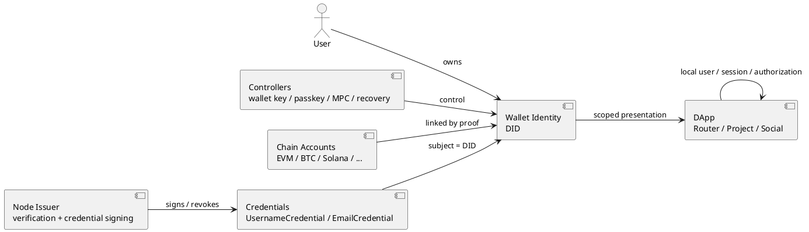
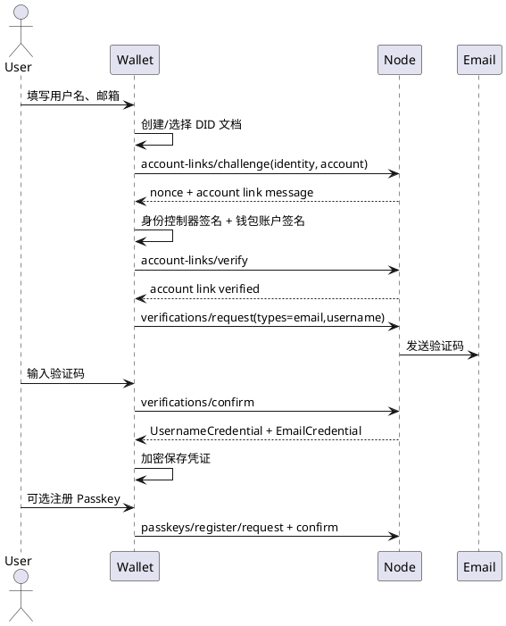
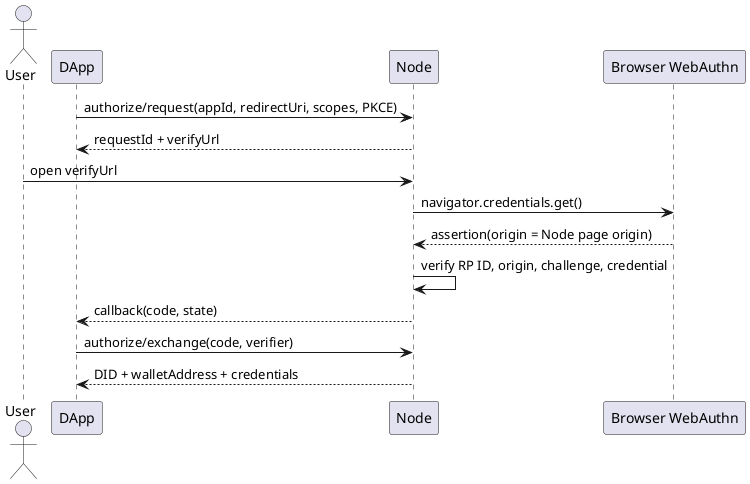
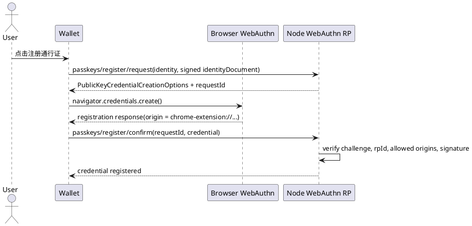
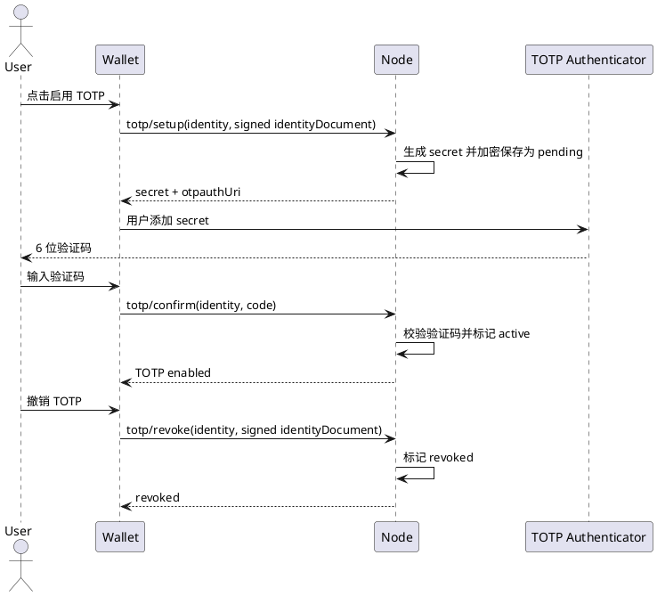
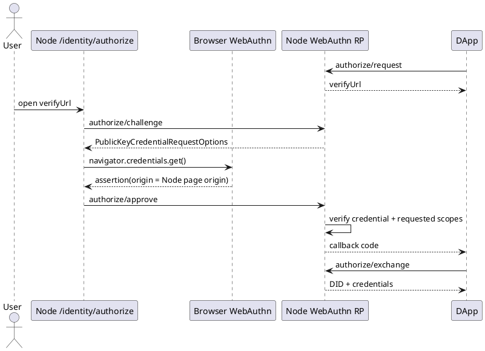

# 钱包身份方案

> 状态：当前目标方案与 V1 跨仓库实现契约，尚未正式上线。
>
> 适用范围：Wallet、Node、web3-bs、Router、Project、Social 与其他 Web3 应用。
>
> 非目标：本文不定义某条区块链的交易格式、资产托管规则、应用业务权限、邮箱模板或具体数据库表。

## 1. 结论

钱包身份是夜莺社区 Web3 应用共同使用的正式身份主体。它不是钱包地址、助记词、钱包文件、Node 账户、应用用户、用户名、邮箱或 Passkey。

正式身份主键只有：

```text
did:yeying:wid_<base64url-random>
```

其中 DID 由 Wallet 在本地用密码学安全随机数生成，不能从地址、邮箱、用户名、助记词或 Node 数据库 ID 派生。Node 只能验证、签发凭证和引用该 DID，不能替用户生成或拥有身份。

钱包地址、用户名、邮箱和 Passkey 的定位如下：

- 钱包地址是钱包身份已验证关联的链账户，不是身份主键。
- 用户名是 Node issuer 签发的 `UsernameCredential`。
- 邮箱是 Node issuer 签发的 `EmailCredential`，必须经过邮箱验证码验证。
- Passkey/通行证是钱包身份的可选认证器，用于无 Wallet 插件登录和高风险确认，不是独立身份主体。

旧 Passport subject、Passport assertion、`subjectId`、`sub_xxx` 和“绑定通行证”不再是新协议概念，也不得进入 Wallet、Node、web3-bs 或 DApp 的新外部契约。

## 2. 核心概念

| 对象 | 主键/形式 | 所有者 | 说明 |
| --- | --- | --- | --- |
| 钱包身份 | `did:yeying:wid_*` | 用户 | 跨链、跨设备、跨应用长期存在 |
| 身份控制器 | 公钥、Passkey、MPC 控制器或恢复密钥 | 用户 | 可添加、轮换、撤销 |
| 链账户 | `chainKey + accountId/address` | 用户 | 可绑定/移除，不等于身份 |
| 账户关联证明 | 身份控制器证明 + 链账户控制证明 | 用户 | 证明某链账户属于某 DID |
| Issuer / 验证服务 | `did:web:*` 或 HTTPS issuer | Node 或其他验证服务 | 签发用户名、邮箱等凭证 |
| 凭证 | compact JWS JWT-VC | 用户持有，issuer 可撤销 | 按 scope 出示 |
| Passkey / 通行证 | WebAuthn credential | 用户设备/认证器 | 钱包身份认证器，不是身份主键 |
| DApp 本地用户 | `localUserId` | DApp | DApp 自行管理会话和权限 |



## 3. WebAuthn、Passkey 和 WebAuthn RP

### 3.1 WebAuthn 是什么

WebAuthn 是浏览器提供的公钥认证标准。它允许网站或应用让用户用系统认证器完成注册和登录，例如 Touch ID、Windows Hello、Android/iOS 生物识别、安全密钥或平台 Passkey。

WebAuthn 的核心特征是：

- 注册时生成一对公私钥。私钥留在用户设备或认证器中，服务端只保存公钥和 credential ID。
- 登录或确认时，服务端发 challenge，认证器用私钥签名，服务端用公钥验证。
- 浏览器会把当前页面 origin 写入 WebAuthn 响应，服务端必须校验该 origin。
- credential 绑定到 RP ID。RP ID 通常是域名，例如 `node.yeying.pub` 或本地 `localhost`。
- WebAuthn 证明“用户控制某个认证器”，不是自动证明用户邮箱、钱包地址或应用权限。

在本方案中，WebAuthn 只用于 Passkey/通行证能力：证明用户控制某个已经注册到钱包身份 DID 的认证器。

### 3.2 WebAuthn RP 是什么

WebAuthn RP 是 Relying Party，即发起 WebAuthn 注册/认证并保存公钥的服务方。夜莺体系中，Node 是钱包身份 Passkey 的 WebAuthn RP。

Node 作为 RP 负责：

- 生成 registration/authentication challenge。
- 配置 `rpId` 和 `rpName`。
- 校验浏览器返回的 `origin`、`rpId`、challenge、用户验证结果和签名。
- 保存 credential ID、公钥、计数器、设备名和撤销状态。
- 在无 Wallet 插件登录时，用 Passkey assertion 确认用户控制某个钱包身份 DID。

Wallet 插件不是 WebAuthn RP。Wallet 只是调用浏览器 `navigator.credentials.create()` 或 `navigator.credentials.get()` 的客户端界面。由于调用发生在插件页面里，浏览器返回的 WebAuthn origin 是插件 origin：

```text
chrome-extension://<wallet-extension-id>
```

如果用户在 Node 自带页面 `/identity/authorize` 上用 Passkey 确认登录，WebAuthn origin 是 Node 页面 origin：

```text
https://node.example.com
http://localhost:8100
```

Node 运行时配置只声明 Node 自己的 WebAuthn origin。Wallet 插件 origin 不写入运行时配置，应通过 Node 应用中心发布 Wallet 插件应用，并把插件 origin 写入该应用的 `redirectUris`。Node 在确认 Passkey 注册时读取 WebAuthn 响应里的真实 origin，只接受 Node 自己的 origin 或已发布应用 `redirectUris` 中的 origin。否则会出现类似错误：

```text
Unexpected registration response origin "chrome-extension://...", expected "http://localhost:8100"
```

### 3.3 RP ID 与 Origin 的关系

`rpId` 和 `origin` 是两个不同概念：

| 配置 | 示例 | 含义 |
| --- | --- | --- |
| `rpId` | `node.yeying.pub` / `localhost` | WebAuthn credential 绑定的 RP 域名 |
| `origin` | `https://node.yeying.pub` | Node 授权页的浏览器来源 |
| `origins` | `['https://node.yeying.pub', 'chrome-extension://...']` | 允许完成 WebAuthn 响应的全部浏览器来源 |

`rpId` 必须是当前域名或其可注册父域；本地开发可使用 `localhost`。`origin` / `origins` 必须精确匹配浏览器实际来源，包含协议和端口，不包含路径。

## 4. 用户流程

### 4.1 Wallet 插件内完成钱包身份验证

Wallet 设置页负责帮助用户完成可复用的钱包身份验证：

1. 创建或选择钱包身份文档。
2. 使用身份控制器签名身份文档。
3. 使用当前钱包账户签名 Node 生成的账户关联 challenge。
4. Node 验证身份控制证明和链账户控制证明。
5. 用户填写用户名和邮箱。
6. Node 发送邮箱验证码。
7. 用户输入验证码后，Node 签发 `UsernameCredential` 和 `EmailCredential`。
8. Wallet 加密保存凭证到当前钱包身份。
9. 用户按需注册身份级 Passkey。Passkey 注册是可选步骤，可在身份验证完成后立即注册，也可之后在设置页的钱包身份区域进入“通行证”管理页新增或撤销。



### 4.2 有 Wallet 插件的 DApp 登录

DApp 通过 web3-bs 请求 Wallet 出示钱包身份 presentation：

```text
yeying_identity_presentation
```

请求必须包含：

- `appId`
- `audience`
- `nonce`
- `scopes`
- `expiresAt`
- 可选当前链账户要求

常用 scope：

```text
identity.basic
identity.wallet
identity.username
identity.email
```

Wallet 只出示用户已授权且本地持有的凭证。DApp 后端必须校验 presentation 的 DID、controller、签名、audience、nonce、scope 和有效期；需要用户名或邮箱时，还必须校验 JWT-VC issuer、JWKS、过期时间和 credential status。

### 4.3 无 Wallet 插件登录

无 Wallet 插件时，DApp 后端创建 Node 身份授权请求：

```text
POST /api/v1/public/identity/authorize/request
```

Node 返回 `requestId` 和 `verifyUrl`。用户打开 `verifyUrl` 后使用已注册的身份 Passkey 确认：

```text
POST /api/v1/public/identity/authorize/challenge
POST /api/v1/public/identity/authorize/approve
```

DApp 后端随后用 PKCE verifier 换码：

```text
POST /api/v1/public/identity/authorize/exchange
```

exchange 结果包含：

- `did`
- `walletAddress`
- `scopes`
- `credentials[]`

结果不包含 `subjectId`，也不需要 Passport assertion。DApp 不因“有插件登录”和“无插件登录”建立两套用户主键。



## 5. 身份文档

### 5.1 固定常量

```text
DID_METHOD                 = did:yeying
IDENTITY_ID_PREFIX         = wid_
IDENTITY_ID_RANDOM_BITS    = 128 minimum
IDENTITY_DOCUMENT_VERSION  = 1
SIGNATURE_ALGORITHM        = Ed25519 / EdDSA
CANONICALIZATION           = RFC 8785 JCS
CREDENTIAL_FORMAT          = compact JWS JWT-VC profile
ISSUER_DISCOVERY           = did:web + HTTPS JWKS
CREDENTIAL_DEFAULT_TTL     = 24h
CREDENTIAL_MAX_TTL         = 7d
HIGH_RISK_STATUS_MAX_AGE   = 5m
LOW_RISK_STATUS_MAX_AGE    = 1h
CONTROLLER_CHANGE_DELAY    = 24h
V1_MANAGE_THRESHOLD        = 1
```

时间全部使用 RFC 3339 UTC；JWT 数值时间使用 Unix seconds。所有随机数使用密码学安全随机源。

### 5.2 文档结构

```ts
type WalletIdentityDocument = {
  version: 1;
  id: `did:yeying:${string}`;
  createdAt: string;
  updatedAt: string;
  revision: number;
  controllers: IdentityController[];
  accounts: LinkedAccount[];
  issuers: TrustedIssuerLink[];
  recovery: RecoveryPolicy;
  proof?: IdentityDocumentProof;
};

type IdentityController = {
  controllerId: string;
  kind: 'wallet_key' | 'passkey' | 'mpc' | 'recovery_key';
  publicKey: string;
  algorithm: 'secp256k1' | 'ed25519' | 'p256' | 'multisig';
  purposes: Array<'authentication' | 'assertion' | 'manage' | 'recovery'>;
  status: 'active' | 'revoked';
  addedAt?: string;
  revokedAt?: string;
};

type LinkedAccount = {
  accountId: string;
  chainKey: string;
  family: 'evm' | 'utxo' | 'solana' | 'cosmos' | 'substrate' | 'sui';
  address: string;
  publicKey?: string;
  controllerId?: string;
  proof?: AccountLinkProof;
  status: 'active' | 'revoked';
  createdAt?: string;
  revokedAt?: string;
};
```

私密材料永远不在公开文档中。文档只存公钥、控制器用途、账户地址、issuer 元数据和撤销信息。

### 5.3 文档签名

签名输入固定为：

```text
JCS(documentWithoutProof) UTF-8 bytes
```

签名对象：

```json
{
  "type": "YeyingIdentityDocumentProofV1",
  "created": "2026-08-13T00:00:00Z",
  "verificationMethod": "did:yeying:wid_example#controller-1",
  "purpose": "assertionMethod",
  "proofValue": "base64url(ed25519-signature)"
}
```

验证方必须检查 DID、`verificationMethod`、控制器状态、控制器用途、`revision`、签名和时间窗口。

### 5.4 多身份和多链规则

一个用户可以拥有多个钱包身份；一个钱包身份可以关联多个 EVM 与非 EVM 账户、多个控制器和多个验证服务。Wallet 不得根据“同一助记词派生”“地址在同一设备”“曾经登录同一应用”自动合并身份或账户。

导入私钥、助记词、硬件钱包或 MPC 钱包时，用户必须明确选择：

1. 关联至已有钱包身份。
2. 创建新的钱包身份。
3. 仅导入为独立链账户，暂不关联身份。

身份合并是高风险操作，V1 不实现。

## 6. 链账户关联

`chainKey` 是完整命名空间，不得只使用数字 `chainId`。推荐采用 CAIP-2 或等价形式，如 `eip155:1`、`solana:mainnet`、`bip122:<genesis-hash>`。

将账户加入身份必须同时证明：

1. 现有身份控制器同意。
2. 新账户控制者确实控制该地址或公钥。

```ts
type AccountLinkProof = {
  version: 1;
  purpose: 'identity-account-link';
  identity: string;
  account: { chainKey: string; address: string; publicKey?: string };
  nonce: string;
  issuedAt: string;
  expiresAt: string;
  identityControllerProof: SignatureProof;
  accountControlProof: SignatureProof;
};
```

账户控制证明的消息必须绑定完整 DID、链、地址、用途、nonce 和过期时间。EVM 可以使用 EIP-191；非 EVM 必须使用对应链的原生签名域。

Node 账户关联接口：

```text
POST /api/v1/public/identity/account-links/challenge
POST /api/v1/public/identity/account-links/verify
```

当前实现只支持 EVM `eip155:<chainId>`，非 EVM 必须由对应链适配器实现，不能复用 EIP-191。

## 7. Issuer、凭证和撤销

### 7.1 Issuer 元数据

```json
{
  "issuer": "did:web:node.yeying.pub",
  "name": "YeYing Identity Verification",
  "credentialTypes": ["UsernameCredential", "EmailCredential"],
  "jwksUri": "https://node.yeying.pub/.well-known/jwks.json",
  "credentialStatusBatchUri": "https://node.yeying.pub/api/v1/public/identity/credentials/status",
  "credentialStatusMaxAgeSeconds": 300,
  "usernamePolicyVersion": "v1"
}
```

Wallet 不得仅因网络地址可访问就信任 issuer。首次关联必须展示 issuer 名称、签发范围、隐私说明、撤销端点和验证密钥来源，由用户确认。

### 7.2 JWKS 约束

- JWK `kty` 为 `OKP`。
- `crv` 为 `Ed25519`。
- `alg` 为 `EdDSA`。
- 每个 key 有唯一 `kid`。
- issuer 轮换公钥时保留旧 key 至其签发凭证全部过期，并在撤销窗口后再移除。
- DApp 必须固定信任 issuer，不能因为 JWT 的 `iss` 自己声明就自动信任。

### 7.3 JWT-VC

V1 采用紧凑序列化 JWS JWT-VC profile，issuer 使用 Ed25519 `EdDSA` 签名并通过 JWKS 发布公钥。

用户名凭证示例：

```json
{
  "iss": "did:web:node.yeying.pub",
  "sub": "did:yeying:wid_example",
  "jti": "urn:yeying:credential:username-01",
  "iat": 1786579200,
  "nbf": 1786579200,
  "exp": 1786665600,
  "vc": {
    "type": ["VerifiableCredential", "UsernameCredential"],
    "credentialSubject": {
      "id": "did:yeying:wid_example",
      "username": "alice",
      "usernameQualified": "alice@node.yeying.pub",
      "usernamePolicyVersion": "v1"
    },
    "credentialStatus": {
      "id": "https://node.yeying.pub/api/v1/public/identity/credentials/username-01/status",
      "type": "YeyingCredentialStatusV1"
    }
  }
}
```

邮箱凭证结构相同，`type` 改为 `EmailCredential`，`credentialSubject` 至少包含：

```json
{
  "id": "did:yeying:wid_example",
  "email": "person@example.com",
  "emailVerifiedAt": "2026-08-13T00:00:00Z",
  "emailVerificationMethod": "email-code-v1"
}
```

邮箱凭证只能在 `identity.email` scope 被请求、凭证仍在 `nbf`/`exp` 有效窗口内、且经用户确认时出示。Wallet 生成 presentation 前必须先检查本地凭证有效期；已过期、临近过期或尚未生效的凭证不得进入 `credentials[]`。如果 DApp 请求中提供了 `issuerEndpoint`，Wallet 会先用当前 identity controller 对 Node 一次性 challenge 签名，自动换取新的同类型 JWT-VC，再生成 presentation。

### 7.4 凭证验证顺序

1. 解析 JWT header，要求 `alg=EdDSA` 和受信 `kid`。
2. 解析 `iss`，只接受配置的 issuer。
3. 通过 issuer JWKS 验证签名。
4. 校验 `sub` 是本次 presentation 的 DID。
5. 校验 `iat`、`nbf`、`exp` 和本地时钟偏差。
6. 校验 `jti` 状态不是 `revoked`、`superseded` 或 `unknown`。
7. 校验凭证类型和请求 scope 一致。
8. 校验 presentation 的 `audience`、`nonce` 和 Wallet 控制证明。

### 7.5 凭证状态

V1 采用“短期凭证 + 在线状态”组合：

- `UsernameCredential` 与 `EmailCredential` 默认有效期为 24 小时，最长不得超过 7 天。
- Wallet 出示凭证时至少预留 60 秒本地时钟偏差；`exp` 距当前时间不足 60 秒的凭证按不可用处理。
- 凭证到期不代表邮箱或用户名事实失效。Node 在 `identity_credentials` 保存已验证事实和撤销状态，Wallet 可通过 `/identity/credentials/reissue/challenge` 和 `/identity/credentials/reissue/confirm` 自动续签短期 JWT-VC。
- 自动续签必须绑定 Node 一次性 challenge、身份 DID、credential type、nonce 和过期时间，并由当前 identity controller 使用 `authentication` proof 签名；Node 同时校验带 `manage` proof 的身份文档。不得提供“只传 DID 即重签”的公开接口。
- 源凭证不存在、已撤销、身份 controller proof 无效或 issuer endpoint 不可用时，Wallet 不得降级出示过期凭证，应提示用户重新完成邮箱/用户名验证。
- 高风险流程必须在线检查状态，且状态不得超过 5 分钟。
- 低风险只读展示可接受最多 1 小时缓存，但不得建立长会话或执行授权写操作。
- 状态查询失败不得转化为 `active`。

批量状态查询：

```http
POST /api/v1/public/identity/credentials/status
Content-Type: application/json
```

```json
{
  "issuer": "did:web:node.yeying.pub",
  "credentials": [
    "urn:yeying:credential:username-01",
    "urn:yeying:credential:email-01"
  ]
}
```

返回：

```json
{
  "issuer": "did:web:node.yeying.pub",
  "checkedAt": "2026-08-13T00:05:00Z",
  "nextUpdateAt": "2026-08-13T00:10:00Z",
  "statuses": {
    "urn:yeying:credential:username-01": "active",
    "urn:yeying:credential:email-01": "active"
  }
}
```

## 8. Identity Presentation API

web3-bs 对 DApp 暴露：

```ts
type IdentityPresentationRequest = {
  appId?: string;
  audience: string;
  nonce: string;
  scopes: Array<'identity.basic' | 'identity.wallet' | 'identity.username' | 'identity.email'>;
  account?: { chainKey: string; address: string };
  issuer?: string;
  issuerEndpoint?: string;           // Node issuer base URL，用于凭证自动续签
  expiresAt: string;
};

type IdentityPresentation = {
  version: 1;
  holder: string;                    // did:yeying:wid_*
  audience: string;
  nonce: string;
  issuedAt: string;
  expiresAt: string;
  scopes: string[];
  identityDocument?: SignedIdentityDocument;
  walletProof?: AccountLinkProof | WalletControlProof;
  credentials?: string[];            // compact JWT-VC strings
  proof: {
    type: 'YeyingIdentityPresentationProofV1';
    verificationMethod: string;
    purpose: 'authentication';
    proofValue: string;
  };
};

requestIdentityPresentation(request: IdentityPresentationRequest): Promise<IdentityPresentation>;
```

web3-bs 提供基础校验辅助：

- `verifyIdentityPresentation(presentation, options)`：校验 holder、controller、Ed25519 proof、audience、nonce、scope 和有效期。
- `verifyIdentityPresentationCredentials(presentation, options)`：在基础校验之上验证 JWT-VC、issuer JWKS 和 credential status。

DApp 必须自己保存 challenge 会话中的 `appId`、`audience`、`nonce`、scope 和过期时间，并逐项比较 presentation。不得接受 Wallet 返回的 scope 之外的声明。

## 9. Passkey / 通行证接口

Passkey 是钱包身份认证器。注册、查看和撤销应在 Wallet 设置页的钱包身份区域进入“通行证”管理页完成。

Node 公共接口：

```text
POST /api/v1/public/identity/passkeys/register/request
POST /api/v1/public/identity/passkeys/register/confirm
POST /api/v1/public/identity/passkeys/list
POST /api/v1/public/identity/passkeys/revoke
POST /api/v1/public/identity/authorize/request
GET  /identity/authorize?requestId=...
POST /api/v1/public/identity/authorize/challenge
POST /api/v1/public/identity/authorize/approve
POST /api/v1/public/identity/authorize/exchange
```

注册流程：



## 10. TOTP 验证器接口

TOTP 是钱包身份的可选认证器，用于一次性验证码确认。它不是旧 Node `totpAuth` 地址主体授权流程，也不是独立身份主体。用户入口在 Wallet 设置页的钱包身份区域进入“验证器”管理页；Node 只负责按钱包身份 DID 保存加密后的 TOTP secret、校验验证码和返回状态。

Node 公共接口：

```text
GET  /api/v1/public/identity/totp/status
POST /api/v1/public/identity/totp/get
POST /api/v1/public/identity/totp/setup
POST /api/v1/public/identity/totp/confirm
POST /api/v1/public/identity/totp/verify
POST /api/v1/public/identity/totp/revoke
```

生命周期：



约束：

- `setup` 和 `revoke` 必须使用带 manage proof 的身份文档，证明用户控制该钱包身份 DID。
- `confirm` 只接受 pending secret 生成的验证码，通过后才启用。
- `verify` 只校验 active 且未撤销的 TOTP 认证器。
- TOTP secret 明文只在 setup 响应中返回给 Wallet，Node 持久化密文。
- Router / Project 等 Web3 应用不直接感知 TOTP，只消费钱包身份授权结果。

授权流程：



## 11. V1 控制器、恢复和用户名策略

V1 身份文档采用保守的 1-of-1 管理策略：

- 初始 `wallet_key` 控制器具有 `authentication`、`assertion`、`manage` 三项用途。
- 创建身份时必须生成独立 `recovery_key`；私钥只在用户导出/备份路径出现。
- 添加新的日常控制器需要当前 `manage` 控制器签名，且新控制器提交持有证明。
- 替换、移除日常 `manage` 控制器需要当前 `manage` 控制器签名，并延迟 24 小时生效；恢复密钥可在延迟期间取消。
- 若日常控制器丢失，恢复密钥可以一次性添加新 `manage` 控制器；恢复完成后必须轮换旧控制器和 recovery key。
- 不允许移除最后一个 `manage` 控制器。
- Passkey、MPC 和硬件钱包在 V1 可作为认证/断言控制器加入，但不承担唯一恢复责任。

V1 用户名唯一性范围是单一 issuer 命名空间：

- 标准形式：`<username>@<issuer-host>`，例如 `alice@node.yeying.pub`。
- Wallet 默认展示短名 `alice`，在跨 issuer 或冲突场景展示全名。
- username 规范化为 Unicode NFC 后的 ASCII 小写 `a-z`、`0-9`、点、下划线、连字符，长度 3-32；首字符必须为字母或数字。
- 不把 email local-part、钱包地址、DID 或应用昵称自动转换为用户名。

## 12. Router 等 Web3 应用接入

Router 明确需要 `identity.email`。钱包插件登录时，Router/Project 应在登录 session 中返回 Node `issuerEndpoint`，使 Wallet 能在本地 `EmailCredential` 过期时自动续签。若 Node 没有该 DID 的可续签邮箱事实、凭证已撤销或 Wallet 无法完成 controller proof，Router 再提示用户回到 Wallet 完成钱包身份和邮箱验证。无 Wallet 插件时，Node 的 Passkey 授权也必须检查请求 scope：缺少有效邮箱凭证时拒绝授权。

外部 Web3 应用接入 Node 身份服务时，需要：

1. 在 Node 应用中心发布应用。
2. 配置 `appId` 和 `redirectUris`。
3. 后端创建授权请求并保存 PKCE verifier、state、nonce 和 scope。
4. exchange 后以 DID 映射本地用户。

Node 自身作为应用中心时不依赖这套外部应用配置。Node 管理端登录使用钱包签名 / UCAN 自举登录，避免“必须先发布 Node 应用才能登录发布应用”的循环。

## 13. 禁用项和历史术语

新实现不再保留以下兼容逻辑：

- `yeying_passport_assertion`
- Passport assertion 签发与 introspection
- `subjectId` / `sub_xxx` 作为外部身份主键
- Node Passport subject
- Web3 应用侧 Passport binding 表
- 把钱包地址、邮箱或用户名作为长期身份主键
- “绑定通行证”作为产品或协议概念

## 14. 统一错误码

```text
IDENTITY_INVALID_DID
IDENTITY_DOCUMENT_INVALID
IDENTITY_REVISION_CONFLICT
IDENTITY_CONTROLLER_NOT_AUTHORIZED
IDENTITY_ACCOUNT_PROOF_INVALID
IDENTITY_ACCOUNT_CHAIN_UNSUPPORTED
IDENTITY_ISSUER_UNTRUSTED
IDENTITY_ISSUER_KEY_NOT_FOUND
IDENTITY_CREDENTIAL_INVALID
IDENTITY_CREDENTIAL_EXPIRED
IDENTITY_CREDENTIAL_REVOKED
IDENTITY_CREDENTIAL_STATUS_UNKNOWN
IDENTITY_SCOPE_NOT_GRANTED
IDENTITY_AUDIENCE_MISMATCH
IDENTITY_NONCE_MISMATCH
IDENTITY_PRESENTATION_EXPIRED
IDENTITY_PRESENTATION_INVALID
IDENTITY_USERNAME_TAKEN
IDENTITY_EMAIL_NOT_VERIFIED
IDENTITY_PASSKEY_CHALLENGE_NOT_FOUND
IDENTITY_PASSKEY_CHALLENGE_USED
IDENTITY_PASSKEY_CHALLENGE_EXPIRED
IDENTITY_PASSKEY_REGISTER_VERIFY_FAILED
IDENTITY_PASSKEY_AUTHORIZE_VERIFY_FAILED
```

## 15. 测试向量和验收标准

各仓库必须共享同一组 JSON fixture，至少覆盖：

- 固定身份文档 JCS 字节、Ed25519 公钥和签名。
- 正确与错误 `revision` 的文档更新。
- EVM 账户关联成功、错误链、错误地址、过期 nonce、重复 nonce。
- issuer JWKS 成功、未知 `kid`、错误 `alg`、轮换旧 key。
- UsernameCredential、EmailCredential 的签名、subject、scope、过期、撤销。
- presentation 的 audience、nonce、scope、holder、控制证明匹配和不匹配。
- WebAuthn registration/authentication 的 RP ID、origin、challenge、credential 状态和用户验证结果。
- 状态接口 active/revoked/superseded/unknown、超出 freshness、网络失败。
- 多身份、多链账户和账户移除不影响身份凭证。

验收标准：

- 用户能创建两个独立钱包身份，导入账户时可选择归属，Wallet 不自动合并。
- 一个身份可关联至少两个 EVM 账户和一个非 EVM 测试账户，且所有关联均有双向证明。
- 用户名与邮箱凭证的 subject 均为 DID；更换一个地址后凭证继续可用。
- 普通 SIWE 地址登录不依赖 Node；请求资料 scope 时 DApp 能离线验证 presentation。
- 过期、撤销、错误 issuer、错误 audience、nonce 重放、账户/控制器不匹配和未授权 scope 均被拒绝。
- Passkey 注册可从 Wallet 插件 origin 完成；无插件授权页可从 Node 页面 origin 完成。
- 移除 issuer 不删除钱包身份或资产，且不会继续向 DApp 出示该 issuer 的凭证。
- 丢失日常地址后，恢复控制器仍可恢复身份；任何单个非恢复地址均不能绕过恢复策略。

## 16. 当前实现状态

Wallet 已完成本地身份 foundation、独立审批页面、按 scope 选择未过期凭证、过期凭证自动续签和 identity controller Ed25519 presentation proof。Node 已完成独立 issuer、Ed25519 JWKS、数据库化 credential status、EVM 账户关联 proof、批量 email/username verification、凭证记录、credential reissue challenge/confirm 和审计落库。web3-bs 已完成浏览器 WebCrypto JWT-VC Ed25519 验签、Node credential status 查询基础、`issuerEndpoint` 透传和 `requestIdentityPresentation` 类型/调用入口。

仍需完成或持续验证：

- Wallet 凭证领取后的正式保存入口和多设备备份体验。
- Node DID 目录、credential supersede、Redis 限流、issuer 密钥轮换。
- DApp 后端完整 presentation 验证和共享 fixture。
- 多实例、重启、撤销、origin 配置和 WebAuthn RP 配置验收。
- 非 EVM 链账户关联适配器和恢复演练。

在共享 fixture 和端到端联调通过前，不发布完整身份协议的生产承诺。
